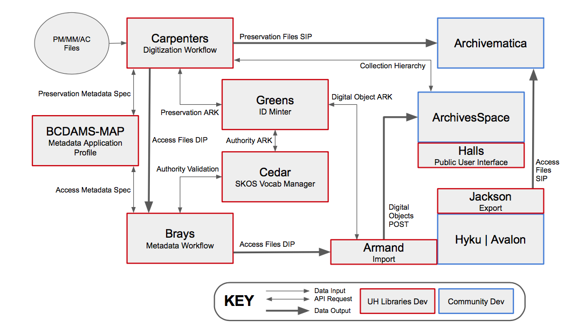
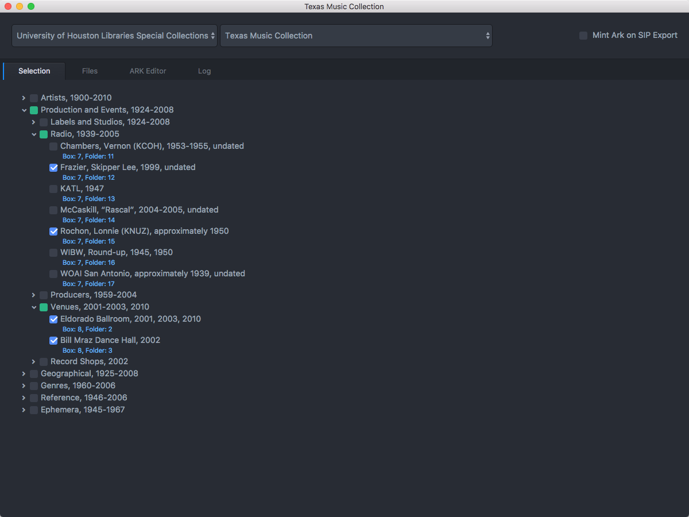
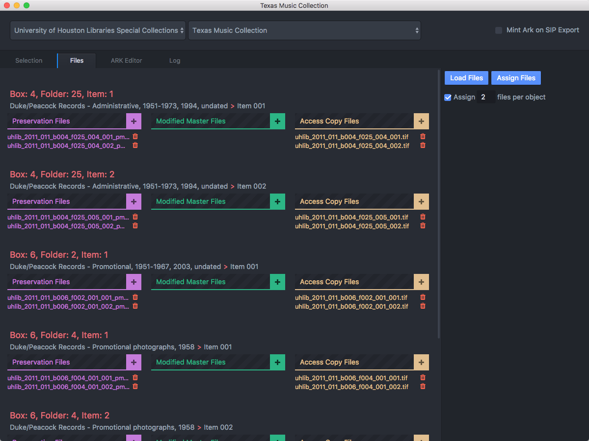
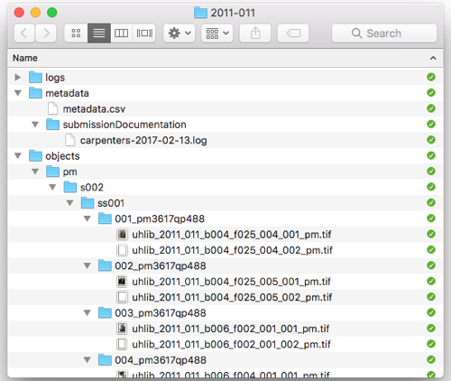
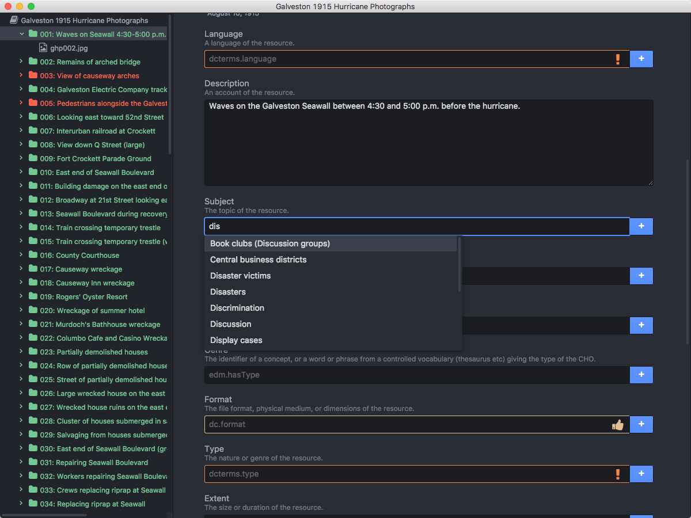
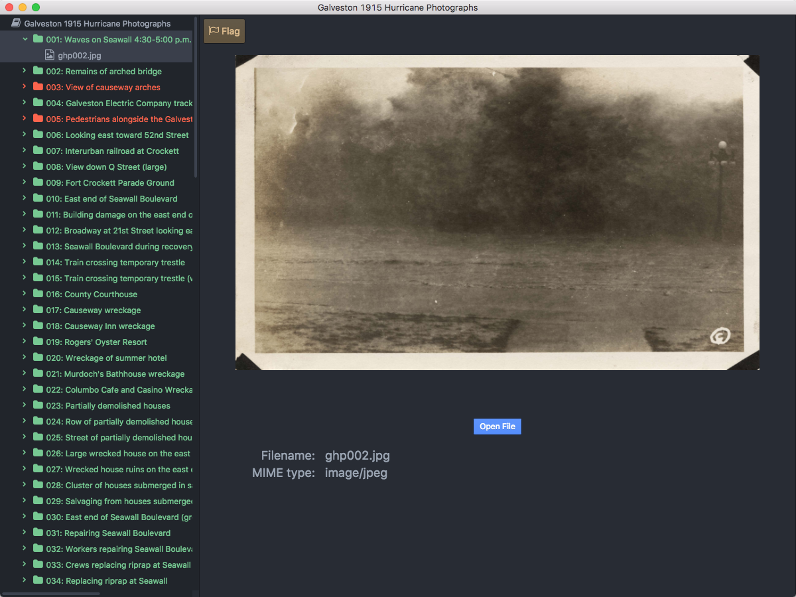
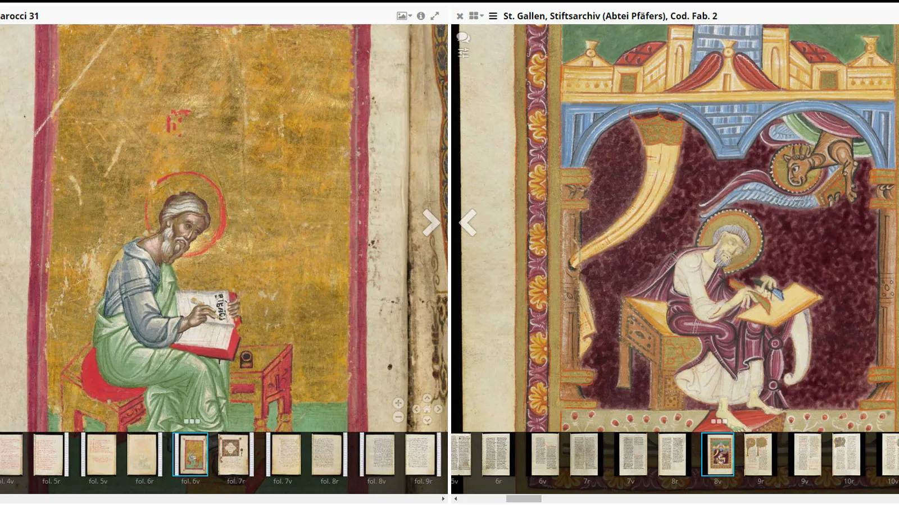
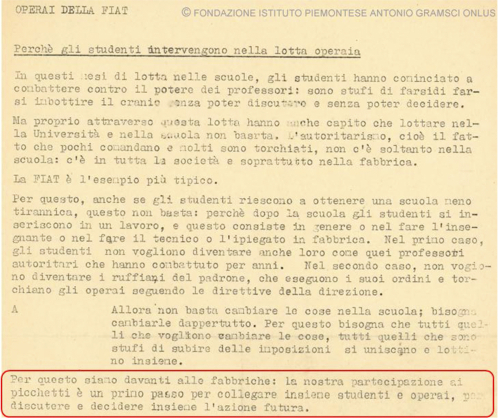

# Access and Discovery

---

# Today
- **Settle in/Reminders/Announcements** (15 min)
- **Lecture: Access and Discovery** (45 min)
- **Break** (10 min)
- **Start Weekly Activity** (70 min)
- **Wrap up** (10 min)

---

# Announcements

- Next week's class will be in-person/group activity
- Next week, your Project Abstract is due. I will send each of you feedback on your Abstract after I review. Feel free to schedule a time with me if you'd like to discuss your Final Project in more detail (or go over my feedback).

---

# Access and Discovery

<!--presenter notes

Today, we'll look at what happens after last week's Imaging and Conservation Activity. At this point, an imaging technician, archivist, or vendor has created a set of digital images. These files might be sitting on a hard drive, a production server, or somewhere else at the institution. They've been named, likely organized into folders, but they’re not accessible to users yet.

So, what happens next? How do we move from having digital files to preparing these for discovery and access?

-->

---



<!--presenter notes

We will be looking at a particular example, the Bayou City Digital Asset Management System (BCDAMS), used by the University of Houston (UH) Libraries. In late 2015, UH made an institutional commitment to migrate the data for its digitized cultural heritage collections to a group of interoperable open source systems.

Here, we have a workflow diagram created by the University of Houston, representing their digital preservation workflow that we are going to break down into something more digestible and understandable.

A code4lib article provides additional details: https://journal.code4lib.org/articles/12342#unit5

-->

---

# Bayou City Digital Asset Management System (BCDAMS)
<br>

<div class="row">
  <div class="pink-box">ArchivesSpace</div>
  <div class="pink-box">Archivematica</div>
  <div class="pink-box">Hydra-in-a-Box (HyKu)</div>
</div>

<div class="row">
  <div>
    <div class="green-box">Carpenters</div>
    <div class="description">Interface used by digitization staff to manage digitization workflow and preservation ingest.</div>
  </div>
  <div>
    <div class="green-box">Brays</div>
    <div class="description">Interface used by staff working with digital objects to view files and create metadata in preparation for HyKu ingest.</div>
  </div>
  <div>
    <div class="green-box">CEDAR</div>
    <div class="description">Linked data vocabulary manager</div>
  </div>
  <div>
    <div class="green-box">Greens</div>
    <div class="description">Mints persistent identifiers applied to preservation packages like SIPs</div>
  </div>
  <div>
    <div class="green-box">Halls</div>
    <div class="description">Public user interface</div>
  </div>
</div>

<!--presenter notes

The University of Houston uses a preservation systems “ecosystem” of both open-source and homegrown applications and tools, each working in concert with one another to fully or partially automate the entire digital preservation-to-access workflow.

UH uses three open-source tools:
- ArchivesSpace: Used by archivists to describe collections and produce finding aids.
- Archivematica: Used to automate workflows into and from the digital repository.
- Hydra-in-a-Box (aka Hyku): open-source digital repository software platform that allows institutions to manage, preserve, and provide access to digital collections.

UH also uses a number of homegrown tools:
- Carpenters: an internal staff interface used by digitization staff to manage digitization workflow and preservation ingest.
- Brays: a metadata management system used by staff working with digital objects to view files and create metadata in preparation for ingest into HyKu
- CEDAR: A linked data vocabulary manager
- Greens: A persistent identifier minter
- HALLS: HALLS (stands for Houston Area Library Automated Network Delivery System) is a front-end interface for searching and discovering content from various digital repositories and collections maintained by the libraries in the Houston area

-->

---

### **Phase 1: Selection and Capture**

1. **Archivist** creates finding aid in **ArchivesSpace**.
2. **Archivist** opens **Carpenters**, navigates to the “Selection” tab, and imports the finding aid.
3. **Archivist** checks boxes next to the folders/items to be digitized.
4. **Carpenters** populates the shot list in the “Files” tab.
5. **Digitization Unit Tech** opens **Carpenters** “Files” tab, and photographs images in the sequence specified in shot list.

---



<!--presenter notes

This is a screenshot of the Carpenters interface, with the “Selection” tab open, which is where the archivist works to import the finding aid components and hierarchy.

As you can see, Carpenters allows preservation administrators to organize digitized content into hierarchies that preserve the contextual linkages and provenance of the original archival collection.

-->

---

### **Phase 2: File Management and Association**
1. **Digitization Unit Tech** creates a **preservation file** along with **derivative files** such as **mezzanine and access copies** for each archival object, storing them on the local file system.
2. **Digitization Unit Tech** opens **Carpenters**, navigates to the “Files” tab, and associates each file created with its corresponding archival object's **ArchivesSpace URI**.

---

## Definition
# Preservation File

A **preservation file** is a high-quality, minimally processed digital file created to serve as the authoritative source for long-term preservation. It is typically produced during digitization and retains the maximum amount of detail, accuracy, and integrity from the original material.

---

## Definition
# Mezzanine File

A **mezzanine file** is an intermediate-quality digital file derived from a preservation file. It is used for specific workflows, such as editing, while still maintaining a high level of fidelity. Mezzanine files strike a balance between the size and usability of the file and the quality of the original preservation file.

---

## Definition
# Access File

An **access file** (sometimes also "service file") is a derivative digital file used for providing convenient, user-friendly access to the content. Access copies are optimized for distribution, sharing, and everyday use, often with reduced file size and quality compared to the original preservation file.

---

## Definition
# Uniform Resource Identifier (URI)

A **Uniform Resource Identifier (URI)** is a sequence of characters that represents a unique record.

Ex:
<a href="https://archives.yale.edu/repositories/11/resources/13623"
 target="_blank">https://archives.yale.edu/repositories/11/resources/13623</a>
 <b>repositories/11/resources/13623</b> is the URI

---



<!--presenter notes

In this screenshot, we are looking at the Carpenters interface “Files” tab, which is where Digitization Unit staff work. Each row has a box and folder listed, followed by the name of the collection and series title. Here, they can click on the plus sign next to the derivative file type, such as Preservation Master, and add the filename. In this way, they are connecting image captures to archival objects in the finding aid.

-->

---

### **Phase 3: Create SIP**

1. **Carpenters** automatically moves **preservation files** from the local file system to a set of nested directories, organized into an Archivematica-compatible **Submission Information Package (SIP)**.
3. The SIP structure replicates the **intellectual arrangement** of the original collection.

---



---

### **Phase 4: Mint Persistent Identifier; Export DIPs**

1. **Greens** mints an **Archival Resource Key (ARK)** persistent identifier for each SIP.
2. **Carpenters** outputs a **Dissemination Information Package (DIP)** containing access files and a metadata CSV file.

---

### Definition  
## Persistent Identifier (PID) - 1/2

**Persistent identifiers (PIDs)** are a type of Uniform Resource Identifier (URI) designed to provide a stable, long-term reference to a resource, ensuring it remains identifiable even if its location or system infrastructure changes.

PIDs use **resolution systems** that translate the PID to actionable locations or data.

---

## **Archival Resource Key (ARK) Syntax**

`ark:/[Name Assigning Authority Number]/[Qualifier]` 

Example: <a href="https://id.lib.uh.edu/ark:/84475/do2730bw52x" target="_blank">https://id.lib.uh.edu/ark:/84475/do2730bw52x</a><br><br>

#### **Resolution**  
University of Houston's **local resolver** (`id.lib.uh.edu`) redirects to a digital collection resource URL.  
<a href="https://digitalcollections.lib.uh.edu/concern/texts/0v838095w" target="_blank">https://digitalcollections.lib.uh.edu/concern/texts/0v838095w</a>

---

## **Handle Syntax**  

`hdl.handle.net/[Namespace]/[PID-Suffix]`  

Example: <a href="https://hdl.handle.net/10079/fa/beinecke.bookstore" target="_blank">https://hdl.handle.net/10079/fa/beinecke.bookstore</a><br><br>

#### **Resolution**
Handles are resolved through `hdl.handle.net`, directing users to the Yale finding aid resource.  

<a href="https://archives.yale.edu/repositories/11/resources/13623" target="_blank">https://archives.yale.edu/repositories/11/resources/13623</a>  

<!--presenter notes

Yale uses Handle, another kind of persistent identifier. It's pretty similar to ARK, but notice that the URL uses handle.net to resolve, rather than a Yale-hosted domain.

-->

---


### **Phase 5: Metadata Management**

**Metadata Unit Staff**:
- Loads the **Carpenters-generated Dissemination Information Package (DIP)** into the **Brays** descriptive metadata editor.
- Input descriptive metadata for all objects. **Brays**:
  - Suggests controlled vocabulary terms from **Cedar**.
  - Updates the **metadata CSV file** in the DIP.
  - Color-codes fields as **required** or **optional**.

---



<!--presenter notes

This is the Brays metadata creation staff interface. On the left-hand side, you see a list of all the digital preservation objects, in order. You can click into any one of them, and open up a descriptive metadata record. This record is connected to the CEDAR linked data vocab, which provides controlled lists, metadata validation and type-ahead suggestions.

The access portion of the workflow begins when Metadata Unit personnel loads the Carpenters DIP in the Brays descriptive metadata editor and creates descriptive metadata for all objects. 

Brays suggests controlled vocabulary terms from the Cedar linked data vocabulary manager and validates the record against their descriptive metadata specification.
Brays dynamically reads and writes to a metadata CSV file included in the DIP.

Color coding in the metadata creation interface indicates to staff  which fields are required, recommended, and optional.

Additionally, once the record contains all required fields, the object name in the object viewer turns from red to green.

-->

---



<!--presenter notes

You can also use BRAYS to view a copy of the preservation file in full screen mode, so you can toggle back and forth between the image and the description quickly and seamlessly.

-->

---

### **Phase 6: Access through HALLS End-User Interface**

**HALLS** displays search results that convey the **intellectual arrangement** of archival objects, including series, sub-series, and file-level titles and descriptions, and the physical instance information, such as box and folder details.

 **HALLS** presents digital objects in two ways:
   - Integrated within the structure of the finding aid.
   - As a standalone record for direct access.

---

# Try it out - UH Digital Collections

- Visit https://digitalcollections.lib.uh.edu/
- Search for "Galveston 1915 Hurricane Photographs"
- Click on any image that appears in results
- Find the ARK and rights statement
- Click "View item in finding aid"
- Locate your photograph in the context of the finding aid hierarchy.

---

## Tool
# International Image Interoperability Framework (IIIF) - 1/2

**IIIF** is a set of open standards for delivering high-quality, attributed digital objects online at scale. It’s also an international community developing and implementing the IIIF APIs. IIIF is backed by a consortium of leading cultural institutions.

---

## Tool
# International Image Interoperability Framework (IIIF) - 2/2

IIIF is best known for its ability for institutions hosting digitized content to be interoperable with each other.

---



<!--presenter notes

This image is a screencapture of two medieval manuscripts, each held by a different repository: one from the Bodleian Libraries, the other from St. Gallen. Along with side-by-side comparisons or two high-resolution images from their digital collections, IIIF viewers allow deep zoom to see exacting/tiniest details, which supports research, scholarship and interest.

Read more here: https://blog.digitizedmedievalmanuscripts.org/iiif-international-image-interoperability-framework/

-->

---

# Try out IIIF - 1/3

- Return to the results page for "Galveston 1915 Hurricane Photographs"; click on a different image.
- Notice the IIIF logo beneath the photo: that indicates that the viewer is IIIF-compliant.
- Click on the IIIF logo to generate a JSON manifest; click on the "Pretty-print" checkbox to make the data more readable.
- Copy the URL for the manifest to your clipboard.

---

# Try out IIIF - 2/3

- Visit [https://projectmirador.org/](https://projectmirador.org/); click `DEMO` at top of page.
- Click `Add Resource` button (blue circle with +).
- Click `+ ADD RESOURCE` (lower right-hand corner)
- In the Resource location field, paste the IIIF manifest URL; Click `ADD`. Your selected image should now appear listed.
- Click on the listed image to open within the Mirador viewer.

---

# Try out IIIF - 3/3
- Take the same steps again in the previous slide for a different photograph in the Galveston 1915 Hurricane Photographs.
- Click on the listed image to open within the Mirador viewer.
- Notice how for both images, the title, and other details have been auto-imported.

---

## **Activity + Question**

Take a few minutes to locate another Digital Object record in the UH catalog, and then click on its linked archival object record. Compare and contrast the two records. Is there anything you like or dislike about one of the other? What would you keep or change?

---

<div class="quote">
  ...The approaches used by archivists are useful primarily because of the scale of the materials they manage. Got a large but manageable amount of stuff? Use bibliographic description. Got a seemingly never-ending vast mountain of materials? Use archival description.
</div>

<div class="author">
  Gregory Wiedeman
</div>

<div class="work">
  <em>Designing Digital Discovery and Access Systems for Archival Description</em>, 2023
</div>

---

<div class="slide-title">Online Finding Aid Usability: 8 Takeaways</div>

These takeaways were derived from Joyce Celeste Chapman’s article “Observing Users: An Empirical Analysis of User Interaction with Online Finding Aids” in the Journal of Archival Organization (JAO), 8:4–30, 2010 (<a href="https://www.tandfonline.com/doi/abs/10.1080/15332748.2010.484361" target="_blank">DOI: 10.1080/15332748.2010.484361</a>)


---

## **Unique navigation**
Archival description requires sophisticated navigation options.
<br>
## **Easy to get lost**
Users new to finding aids report feeling lost within hierarchy.
<br>

## **Online availability difficult to determine**
Users assume all components listed are digitized.

---

## **Guidance needed**
Users would appreciate more training beyond a “Help” page.
<br>
## **Too much jargon**
Certain words are too domain-specific.
<br>
## **Need quick results**
Users seek an experience akin to a modern search engine.

---
## **Less texts, more lists**
Large blocks of text are distracting

<!--presenter notes

These takeaways were derived from Joyce Celeste Chapman’s article “Observing Users: An Empirical Analysis of User Interaction with Online Finding Aids” in the Journal of Archival Organization (JAO), 8:4–30, 2010 (DOI: 10.1080/15332748.2010.484361)

-->

---

<div class="shapes">
  <div class="triangle"></div>
  <span class="circle"></span>
  <span class="square"></span>
</div>

<div class="activity-title">Mini Activity - Finding Aid UX - 1/3</div>

<ul class="activity-list">
  <li>Go to <a href="archives.nypl.org." target="_blank">archives.nypl.org</a></li>
  <li>Search for the <strong>James Baldwin Papers finding aid</strong>.</li>
  <li>This collection has been partially digitized. Knowing that, find and open a digitized item. Make a note of its name to use in Part 2 of this activity.</li>
  </li>
  <li><strong>Report back:</strong> How was your experience navigating to the digitized portion of this collection?</li>
</ul>

---

<div class="shapes">
  <div class="triangle"></div>
  <span class="circle"></span>
  <span class="square"></span>
</div>

<div class="activity-title">Mini Activity - Finding Aid UX - 2/3</div>

<ul class="activity-list">
  <li>Go to <strong><a href="https://digitalcollections.nypl.org" target="_blank">digitalcollections.nypl.org</a></strong></li>
  <li>Try to find the digital item you noted earlier.</li>
  <li>Look at the record, not just in terms of the digitized item, but other metadata made available.</li>
</ul>

---

<div class="shapes">
  <div class="triangle"></div>
  <span class="circle"></span>
  <span class="square"></span>
</div>

<div class="activity-title">Mini Activity - Finding Aid UX - 3/3</div>

<strong>Discuss:</strong> How was your experience?

<ul class="activity-list">
  <li>How easy/hard were the sites to search, browse, filter?</li>
  <li>What metadata was displayed?</li>
  <li>How are media files (audio, video) files displayed?</li>
  <li>What sites do you think a scholar would find useful? Student? General public?</li>
</ul>

---

## Definition
# Accessibility

In the context of digital archives, **accessibility** commonly refers to the general discoverability and ease of use of online special collection, enabling equal or equivalent access to archival facilities and services for people with disabilities, and minimizing or eliminating barriers. Accessibility should be integral to institutional cultures, workflows, and services.

<!--presenter notes 

Accessibility is essential to building access platforms

Most institutions’ accessibility expectations will be informed by federal law, state law, and/or institutional best practices. Section 508 Standards for Accessible Electronic and Information Technology, the World Wide Web Consortium’s Web Content Accessibility Guidelines (WCAG), and PDF-UA (ISO 14289-1) are the most common tools used to build digital accessibility policies.

-->

---

<div class="shapes">
  <div class="triangle"></div>
  <span class="circle"></span>
  <span class="square"></span>
</div>

<div class="activity-title">Activity - Accessibility Review</div>

<ul class="activity-list">
  <li>Open the <a href="https://wave.webaim.org/" target="_blank">Web Accessibility Evaluation Tool (WAVE)</a>.</li>
  <li>Input the URL for these two sites:
    <ul>
      <li><a href="https://library.uta.edu/txdisabilityhistory/" target="_blank">https://library.uta.edu/txdisabilityhistory/</a></li>
      <li><a href="https://archives.albany.edu/espy/" target="_blank">https://archives.albany.edu/espy/</a></li>
    </ul>
      </li>
  <li>Use the TopTal Color Blind Filter (to start) to analyze the contrast and visibility of a site.</li>
  <li><strong>Report back</strong>: Identify issues observed to the class.</li>
    </ul>
</ul>

---

## Definition
# Semantic Web

The **semantic web** is a concept that sees data on the internet as dynamic, meaningful and machine-readable. Unlike the standard web, which primarily focuses on linking documents through hyperlinks, the semantic web uses structured data, standardized ontologies, and metadata to create connections between individual pieces of information.

---

# Standard Web

Hi! I am a website, and I contain **<a href="https://digital-archives.github.io/HISTGA1011/grading/" target="_blank">links to other parts of the website</a>**, or other **<a href="brightspace.nyu.edu/d2l/home/553114" target="_blank">websites</a>**.

---

# Standard Web - Under the Hood - 1/2

Hi! I am a website, and I contain `<a href="https://digital-archives.github.io/HISTGA1011/grading/" target="_blank">links to other parts of the website</a>`, or other `<a href="brightspace.nyu.edu/d2l/home/553114" target="_blank">websites</a>`.

<!--presenter notes

"a href" broken down is the <anchor> tag (represented by "a") and its attribute "href" which stands for "hypertext reference". See https://www.w3schools.com/html/html_links.asp as well as https://www.reddit.com/r/learnprogramming/comments/ftpqlo/a_anchor_tag_etymology/ (regarding the origin of the "a" in "a href")

You can read it like "anchor this URL to this particular text".

In the early days of the web, this was kind of it. Before the days of hyperlinked text documents, what might you have had to call up other associated resources? One example would be an index at the back of a book, or the chapter page at the front (the book referencing itself).

Another example would be a bibliography; but that would just give you a citation, that you would then need to physically find (and sometimes your library might not have it!)

When you think about it, the web really set the tracks for making information immediately accessible, and started to, through the use of hyperlinking, structure relationships between documents on the web in the form of a link.

-->

---

# Standard Web - Under the Hood - 2/2

Standard URLs just tell the computer: "this text is associated with this link."

---

## Resource
# WikiData

**Wikidata** is a free, collaborative, and structured knowledge base that acts as a central repository for data used by Wikimedia projects, including Wikipedia, as well as external applications and services. It was launched by the Wikimedia Foundation in 2012 with the goal of providing a machine-readable, linked open data platform that anyone can edit.

---

<div class="shapes">
  <div class="triangle"></div>
  <span class="circle"></span>
  <span class="square"></span>
</div>

<div class="activity-title">Peek at WikiData and SPARQL - 1/3</div>

<ul class="activity-list">
  <li>Open a Wikipedia article for a musician of your choice e.g. <strong><a href="https://en.wikipedia.org/wiki/Alice_Coltrane" target="_blank">Alice Coltrane</a></strong>.</li>
  <li>Find and unfurl the <strong>Tools</strong> drop-down menu; click <strong>Wikidata item</strong>.
  <li>Browse the information in the Wikidata entry.</li>
  <li>Next, open <strong><a href="https://query.wikidata.org/" target="_blank">https://query.wikidata.org/</a></strong></li>

---

## Tool
# SPARQL (SPARQL Protocol and RDF Query Language)

A structured query language that can be used to query linked data databases (like WikiData).

---

<div class="shapes">
  <div class="triangle"></div>
  <span class="circle"></span>
  <span class="square"></span>
</div>

<div class="activity-title">Peek at WikiData and SPARQL - 2/3</div>

## Copy and Paste Sample SPARQL Query

```
SELECT ?musician ?musicianLabel WHERE {
  ?musician wdt:P106 wd:Q15981151 ;
            wdt:P1303 wd:Q47369 .
  SERVICE wikibase:label { bd:serviceParam wikibase:language "en". }
}
```
_Hover over the WikiData parts (e.g. `wdt:P106`) and read the mouseover descriptions._

---

<div class="shapes">
  <div class="triangle"></div>
  <span class="circle"></span>
  <span class="square"></span>
</div>

<div class="activity-title">Peek at WikiData and SPARQL - 3/3</div>

With your musician's WikiData record open, use the available data to write the query down first in a human-readable sentence. Ex. "What other jazz musicians played the harp like Alice Coltrane?". Use that to determine the WikiData IDs to plug into your query. <strong>Press the blue Play button to run the query</strong>.

---

## Definition
# Ontology

An **ontology** is a structured framework that defines the relationships between concepts, terms, and data within a specific domain. It serves as a formal representation of knowledge by outlining categories, properties, and the connections between entities, enabling both humans and machines to understand and process complex information.

---

## Definition
# Linked Open Data

Sometimes referred to simply as "linked data", linked open data (LOD) is a framework that enables organizations and individuals to share information in a machine-readable format. By using standardized protocols, LOD allows for the seamless connection of related data across multiple websites, creating a vast, interconnected web of datasets.

<!--presenter notes

This definition is gleaned from Digital Preservation Framework Linked Open Data page: https://www.archives.gov/preservation/digital-preservation/linked-data

-->

---

# Linked Open Data Storytime :)

---

## Case Study
# PRiSMHA (Providing Rich Semantic Metadata for Historical Archives)

The **PRiSHHA** Project (2017-2020) was a digital curation/humanities project that explored how an ontology-driven platform could facilitate deeper research and access of digitized materials.

<!--presenter notes

Definition derived from https://dl.acm.org/doi/full/10.1145/3484398

-->

---

# Project focused on a small digitized set of the Gramsci Institute's records (~200 documents, mainly typewritten leaflets often with annotations and drawings, some pictures, some newsprint) covering students' and workers' protests occurring between 1968-1969 in Italy.

---



_A leaflet about a strike at FIAT._

<!--presenter notes

A leaflet about a strike at FIAT (copyright: Fondazione Istituto piemontese Antonio Gramsci Onlus).

Transcription/Translation:

FIAT WORKERS

Why do students participate in the workers' struggle?

In these months of struggle in the schools, students have begun to fight against the power of the professors: they are tired of having their heads filled without being able to discuss or decide.

But through this struggle, they also realized that fighting in the university and in school is not enough. Authoritarianism, meaning that a few command while many are oppressed, exists not only in school: it is present throughout society and especially in the factory.

FIAT is the most typical example.

For this reason, even if students manage to obtain a less tyrannical school, this is not enough: because after school, students enter the workforce, and this generally means becoming a teacher, a technician, or an office worker in a factory. In the first case, students do not want to become like those authoritarian professors they fought against for years. In the second case, they do not want to become the boss’s henchmen, who follow his orders and oppress the workers according to the management’s directives.

Therefore, it is not enough to change things in the school; we must change them everywhere. For this reason, everyone who wants to change things, everyone who is tired of enduring impositions, must unite and fight together.

Circled in red:
For this reason, we are in front of the factories: our participation in the picket lines is a first step toward connecting students and workers, to discuss and decide future actions together.

-->

---

# A schoolteacher wants to enrich his lessons with information directly taken from original documents. He is talking to his students about protest actions that took place in Torino in 1968.

---

# In particular, he is searching a digital online archive system, looking for leaflets referring to strikes that both students and workers participated in.

---

# Even with a (very) good OCR tool, if the system is based on a keyword search mechanism, the results of for “sciopero” (strike) - the obvious keyword - would yield 0 results. However,  the leaflets do mention “picchetti” (picketings).

---

# The teacher also looks for leaflets mentioning specific people (e.g., Guido Viale, a leader of the ‘68 Movement in Torino) involved in protest actions. The results for a query for “Guido Viale” in a keyword-based system would probably include the leaflet.

---

# However, that leaflet would not be retrieved if the query also contains (in AND) a keyword for the action (such as “sciopero” (strike), “manifestazione” (demonstration), and so on).

---

# A semantic layer, connected to archival documents, could lead the user to richer search results.

See WikiData entry for <a href="https://www.wikidata.org/wiki/Q273120" target="_blank">protest</a>

---

## Sample SPARQL query for "protests over the last year".

```
SELECT ?event ?eventLabel ?date ?locationLabel WHERE {
  ?event wdt:P31 wd:Q273120 .
  
  OPTIONAL { ?event wdt:P585 ?date. }
  OPTIONAL { ?event wdt:P580 ?date. }
  
  OPTIONAL { ?event wdt:P276 ?location. }
  
  FILTER(?date >= "2025-03-04T00:00:00Z"^^xsd:dateTime)
  
  SERVICE wikibase:label { bd:serviceParam wikibase:language "en". }
}
ORDER BY DESC(?date)
```

---

## Resource
# LUX (Yale)

<a href="https://lux.collections.yale.edu/" target="_blank">LUX</a> provides a unified gateway to the holdings of Yale’s museums, archives, and libraries. This transformative service enables users to identify, access, and engage with items of interest within Yale’s physical and digital collections. It also uncovers relationships among items, inviting users to explore additional materials across collections.

---

# NYPL Wikidata Projects
<a href="https://www.wikidata.org/wiki/Wikidata:WikiProject_New_York_Public_Library/Projects" target="_blank">https://www.wikidata.org/wiki/Wikidata:WikiProject_New_York_Public_Library/Projects</a>

---

## Weekly Activity
# The User's Experience

Start: <a href="https://digital-archives.github.io/HISTGA1011/activities/user_experience.html" target="_blank">https://digital-archives.github.io/HISTGA1011/activities/user_experience.html</a>

---


_Final questions or reflections?_

mary.kidd@nyu.edu