# Application Programming Interfaces (API)
Mary Kidd

---

# Today
- What is an API?
- What are they used for in libraries, archives and special collections?
- What are some API tools?

---

# In libraries, archives, special collections and preservation departments, disparate systems are utilized to manage various workflows.

---

## Example
# Preservica-ArchivesSpace Integration

**ArchivesSpace** and **Preservica** exchange information with one another and update each other. This sort of relationship between systems is called an **integration**.

---

## System
# ArchivesSpace

**ArchivesSpace** (aka "ASpace") is the system of record for descriptive metadata of archival content.

At Yale, it is known by its branded name <a href="https://archives.yale.edu/" target="_blank">Archives at Yale</a>.

---

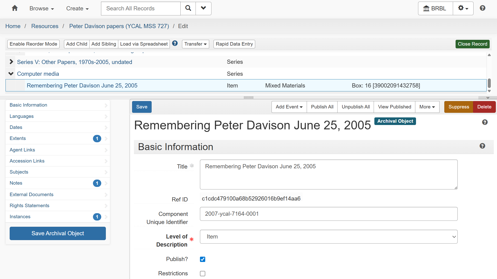

---

## System
# Preservica

**Preservica** is the system of record for the digital files and information about actions performed on them within the digital preservation system (such as ingest, file characterization and migration).

---

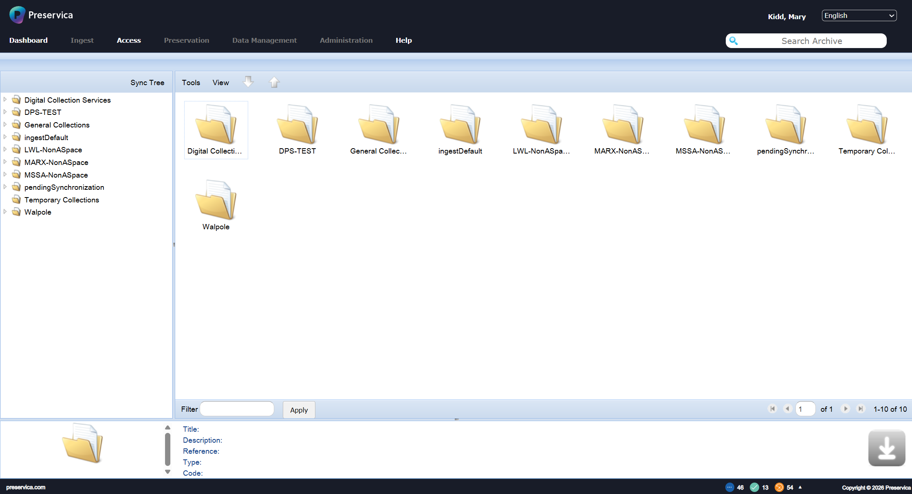

---

# Preservica <> ASpace Integration **Workflow**

---

# Each day, Yale staff **ingest** files into Preservica system.

Example of an ingested file
<a href="https://archives.yale.edu/repositories/12/archival_objects/1299468" target="_blank">Pitt-Rivers, George H. L. F., 1927, 1932 (from the Bronislaw Malinowski papers)</a>

> <a href="https://archivesspace.library.yale.edu/resources/4100#tree::archival_object_1299468" target="_blank">Staff-facing record</a>

---

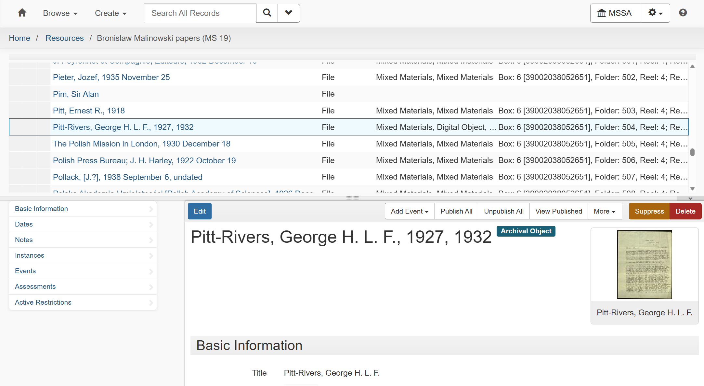

---

# In ArchivesSpace, Preservica creates a new and unpublished **digital object (DO)** record in ASpace linked to a parent archival object (AO) record and includes **a link back to files in Preservica**.

---


# This allows staff using ASpace to see at a glance whether a particular item has been ingested to Preservica.

<a href="archivesspace.library.yale.edu/resources/1672#tree::archival_object_6763726" target="_blank">Staff-side view of a record containing a Preservica File Version</a>

---

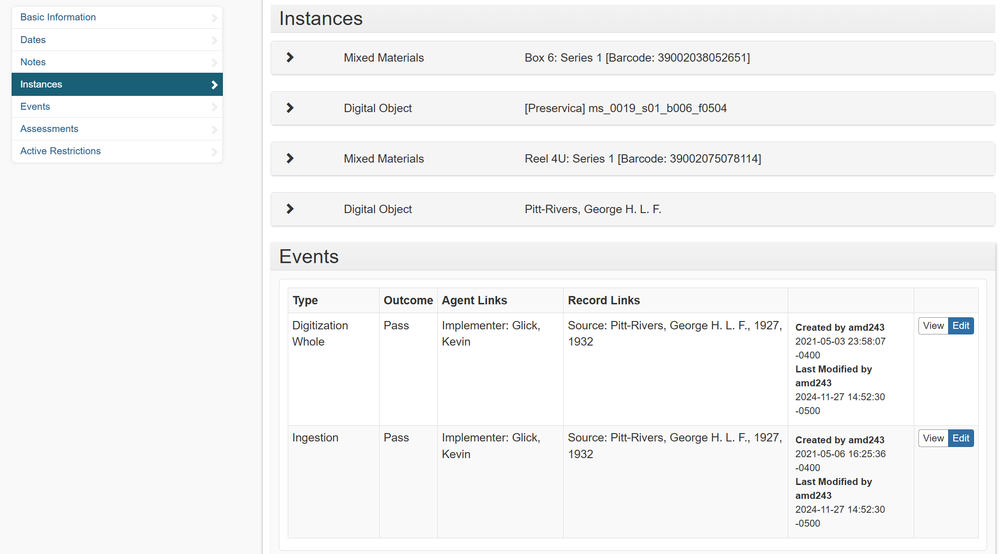

---

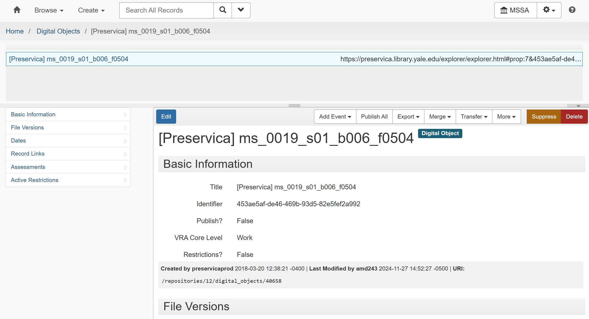

---

# When a file is ingested, Preservica links them to ASpace, and **pulls in a copy of its descriptive metadata** to be stored along with the rest of digital preservation Preservica metadata for those files.

---

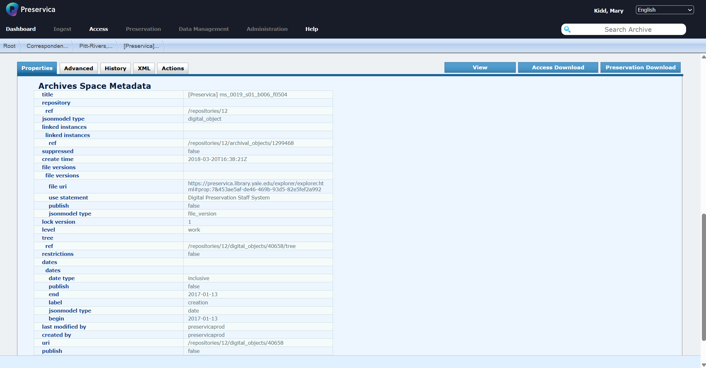

---

# This process is helpful for long-term preservation, such that if **something ever happened to ASpace**, we would still have a copy of the archival descriptive metadata for each file ingested.

---

# All of this work is done automatically using **Application Programming Interfaces (APIs)**.

---

# APIs allow **_systems_** and **_users of systems_** to "talk" to one another and exchange and update data.

---

# ASpace uses **Encoded Archival Description (EAD)** for archival description.

---

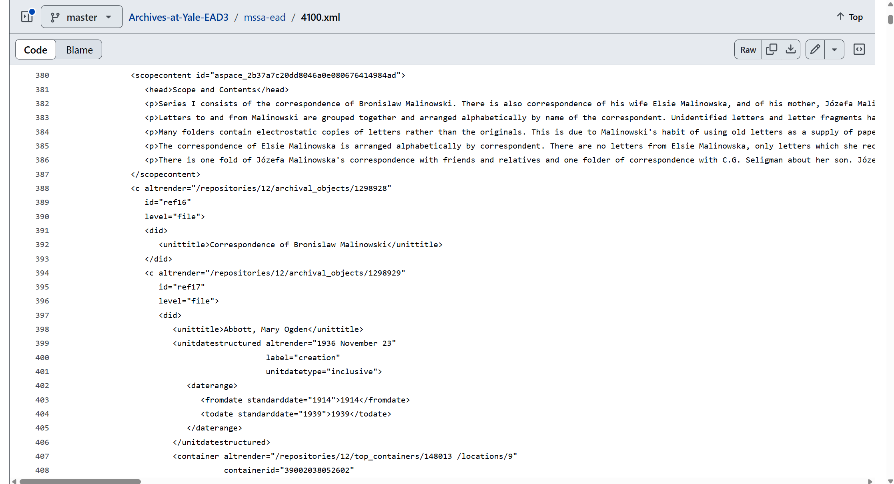

---

# Preservica uses the **XIP (XML Information Package)** metadata format for ingest.

---

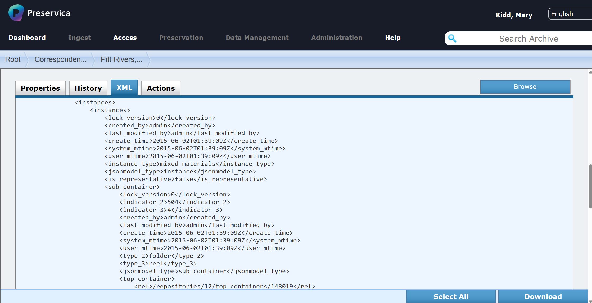

---

# The API enables XIP metadata to be transmitted to ASpace and visa versa.

---

# APIs provide a bridge between systems so that they, in turn, can **create, read, update and delete** data from each other.


---

## Definition
# CRUD

**CRUD** is an acronym that stands for **Create, Read, Update and Delete**, and describes 99% of what you can do within a database system.

<!-- See this Reddit post: https://www.reddit.com/r/learnprogramming/comments/xo6oe5/how_does_crud_relate_to_a_rest_api/ -->

---

## Definition - 1/3
# Application Programming Interface (API)

**Application Programming Interfaces**, or APIs, provide a way for disparate systems to request and exchange data from each other without needing to understand the internal workings of the other.

<!--presenter notes

Application Programming Interfaces, or APIs, provide a way for different software applications to communicate and request services or data from each other without needing to understand the internal workings of the other system. They enable applications to interact and collaborate, simplifying the development of interoperability.

-->

---

## Definition - 2/3
# Application Programming Interface (API)

**APIs** use web protocols to execute CRUD operations between computers connected through networks.

---

## Definition - 3/3
# Application Programming Interface (API)

There are two main actors in an API request: the **client** (the person making the API request) and the **host** (the server taking the API request).

---

# You have (unbeknowst to you) initiated a CRUD operation. How? **Through your web browser!**

---

## Mini Lesson
# Web Foundations

---

## Definition
# Hypertext Document

A **hypertext document** is a type of electronic document that contains hyperlinks to other documents or resources. A type of hypertext document we are all familiar with is a website.

---

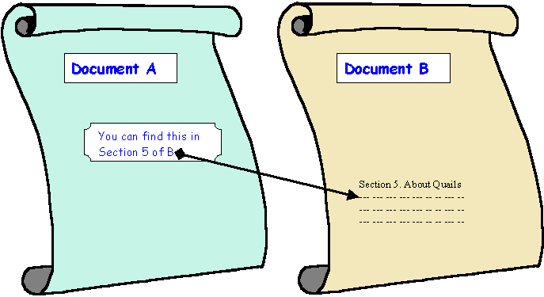

<!--presenter notes

Image Credit:
University of Cape Town, Department of Computer Science. "The Client-Server Model."
Source: MIT Web Programming Course Notes
Direct Image URL: 01_001.gifs

The world wide web aka “the web” is built on the idea of linking hypertext documents together to form a vast network of interconnected information. In this way, hypertext documents are a fundamental and essential concept that underpins the web’s structure and functionality.

A hypertext document is a type of electronic document that contains links to other documents or resources. Hypertext allows the reader to navigate between different sections of a document or to jump to related content on other websites or documents.

-->

---

## Definition
# Hypertext Markup Language (HTML)

**Hypertext Markup Language (HTML)** is used for creating websites and other types of documents that can be displayed in a web browser.

<!--presenter notes

Websites are constructed using Hypertext Markup Language or HTML. A markup language is a system of annotating a document in a way that is machine-readable and provides instructions on how to display the content.

In the example of the screen, I have demonstrated how a link is coded using HTML. In particular we would use the anchor or <a> tag (anchor refers to any point where users can navigate to a different location). The anchor tag is qualified using the “href” attribute (href stands for for “hypertext reference”). This is followed by an equals sign, and then the URL where we want the user to go embedded in opening and closing quotation marks. This is followed by some text (A place to go), which is what the front-end user sees.

-->

---

## Definition
# Hyperlink

A **hyperlink** or shortened to **link** is an _interactive component_ (i.e. text, graphic) of a website that, when clicked, brings the user to another part of the web.

---

What user sees:
Here is <a href=”aplace.go”>a link</a>.

What HTML looks like:
Here is ```<a href="aplace.go">``` a link```</a>```.

---

<div class="browser-window">
  <div class="browser-header">
    <div class="browser-controls">
      <div class="control red"></div>
      <div class="control yellow"></div>
      <div class="control green"></div>
    </div>
    <div class="address-bar">https://thecreativeindependent.com/</div>
  </div>
  <div class="browser-content">
  </div>
</div>

<!--presenter notes

I want to step us in a bit more depth what happens behind the scenes when HTTP requests and responses are mad browsers, using a familiar example you’ve used probably hundreds of times: entering in a URL into a browser address bar, and hitting enter, to look up a website. It’s helpful to know how HTTP works under the hood, because a lot of common tools used by web archivists use HTTP to work.

-->

---

<div class="browser-window">
  <div class="browser-header">
    <div class="browser-controls">
      <div class="control red"></div>
      <div class="control yellow"></div>
      <div class="control green"></div>
    </div>
    <div class="address-bar">https://thecreativeindependent.com/</div>
  </div>
  <div class="browser-content">
    <p>Sending request: "Who is thecreativeindependent.com?"</p>
    <button class="action-button">Send Request</button>
  </div>
</div>

---

<!-- DNS Server Table -->
<table class="dns-table">
  <tr>
    <th>Domain Name</th>
    <th>IP Address</th>
  </tr>
  <tr>
    <td>thecreativeindependent.com</td>
    <td>192.0.2.123</td>
  </tr>
  <tr>
    <td>nyu.edu</td>
    <td>216.165.47.10</td>
  </tr>
  <tr>
    <td>wikipedia.org</td>
    <td>91.198.174.192</td>
  </tr>
  <tr>
    <td>archive.org</td>
    <td>207.241.224.2</td>
  </tr>
  <tr>
    <td>etc...</td>
    <td>
  </tr>
</table>

---

<!-- DNS Server Table -->
<table class="dns-table">
  <tr>
    <th>Domain Name</th>
    <th>IP Address</th>
  </tr>
  <tr style="background: #27c93f; font-weight: bold; color: white;">
    <td>thecreativeindependent.com</td>
    <td>192.0.2.123</td>
  </tr>
  <tr>
    <td>nyu.edu</td>
    <td>216.165.47.10</td>
  </tr>
  <tr>
    <td>wikipedia.org</td>
    <td>91.198.174.192</td>
  </tr>
  <tr>
    <td>archive.org</td>
    <td>207.241.224.2</td>
  </tr>
  <tr>
    <td>etc...</td>
    <td>
  </tr>
</table>

---

<div class="browser-window">
  <div class="browser-header">
    <div class="browser-controls">
      <div class="control red"></div>
      <div class="control yellow"></div>
      <div class="control green"></div>
    </div>
    <div class="address-bar">https://thecreativeindependent.com/</div>
  </div>
  <div class="browser-content">
    <p>✅ Found the name! Now connecting to the IP...</p>
  </div>
</div>

---

## Definition
# Internet Protocol (IP) Address

An **internet protocol (IP) address** is a numerical label assigned to each device that participates in the web.

<!--presenter notes

An Internet Protocol Address or IP address is a unique string of characters that identifies each computer using the Internet Protocol to communicate over a network. Your computer, which is a device connected to the internet, has its own unique IP address. All websites are hosted off of their own computer, so all websites, too, are associated with a unique IP.

The reason why your browser looks up IPs is because computers like to communicate with each other in numbers. So basically it’s transforming the human-readable URL into a sequence of numbers that it uses to look up where a website lives.

-->

---

<!-- Browser Window -->
<div class="browser-window">
  <div class="browser-header">
    <div class="browser-controls">
      <div class="control red"></div>
      <div class="control yellow"></div>
      <div class="control green"></div>
    </div>
    <div class="address-bar">https://thecreativeindependent.com/</div>
  </div>
  <div class="browser-content">
    <p>🔗 Using TCP/IP connection to connect and receive HTML</p>
  </div>
</div>

---


## Definition
# Transmission Control Protocol (TCP)/Internet Protocol (IP) TCP/IP

TCP/IP stands for **Transmission Control Protocol (TCP)/Internet Protocol (IP)**, and is a family of communication protocols used to connect computer systems in a network.

<!--presenter notes

Webpage data is transmitted via Transmission Control Protocol/Internet Protocol or TCP/IP, is a suite of communication protocols that define how data is transmitted over the Internet and other computer networks. It is the most widely used network protocol suite in the world and provides the foundation for the Internet.

TCP/IP consists of two main protocols: TCP and IP.

TCP (Transmission Control Protocol) is a reliable, connection-oriented protocol that provides a way to establish a virtual circuit between two devices over the Internet. TCP ensures that data is transmitted in order, without loss or duplication, and with error detection and correction. TCP also provides flow control and congestion control to prevent network congestion.

IP (Internet Protocol) is a connectionless, best-effort protocol that provides the routing of data packets between devices on a network. IP is responsible for breaking data into packets and addressing them so that they can be routed to their destination.

-->

---

<!-- Browser Window -->
<div class="browser-window">
  <div class="browser-header">
    <div class="browser-controls">
      <div class="control red"></div>
      <div class="control yellow"></div>
      <div class="control green"></div>
    </div>
    <div class="address-bar">https://thecreativeindependent.com/</div>
  </div>
  <div class="browser-content">
    <h2 style="text-align: center; font-size: 2rem;">🌀 The Creative Independent 🌀</h2>
    <p style="text-align: center;">A guide to being a working artist</p>
  </div>
</div>

---

<div class="shapes">
  <div class="triangle"></div>
  <span class="circle"></span>
  <span class="square"></span>
</div>

<div class="activity-title">CRUD in Action - 1/2</div>

1. Open a web browser.
2. Open a website of your choice.
3. Look up instructions for how to open the **Inspect** feature on your browser.
4. Open Inspect.

<!-- The instructions following this will be specific to the Chrome browser using a Mac. -->
---

<div class="shapes">
  <div class="triangle"></div>
  <span class="circle"></span>
  <span class="square"></span>
</div>

<div class="activity-title">CRUD in action - 2/2</div>

4. Select the **Network** tab.
5. Refresh the page.
6. Click on any item listed under **Name** and notice the "Request Method" listed (it should be: `GET`).

---

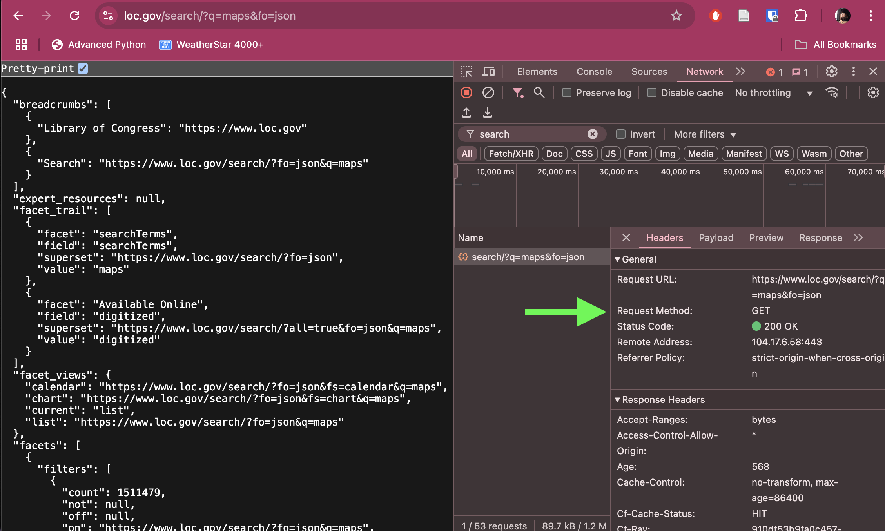

---

# Your browser uses the **HyperText Transfer Protocol** (HTTP) protocol to send requests from your computer (aka "the client") to other servers elsewhere.

---

## Question
# In the activity you just did, can you identify who the **client** and **host** were?

## Hint: One of them was your web browser.

---

## Definition
# HyperText Transfer Protocol (HTTP)

**Hypertext Transfer Protocol (HTTP)** is a communication protocol through which networked computers exchange data.

---

## Definition
# REpresentational State Transfer (REST) Architecture

Representational State Transfer **(REST)** is a set of _request types_ that can be transmitted using HTTP.

Request types include `GET`, `POST`, `PUT`, and `DELETE`. Look familiar?

---

# You can think of **REST** as the specific information you write or stick onto a mailed package, while **HTTP** is the system of trucks, planes and people that transmit packages to and from origin and destination.

---

# REST Request: `GET`

Computer A: "Hello, can I `GET` some information from you?"
Computer B: "Sure, here's the information you requested."

---

# REST Request: `POST` (1/2)

Computer A: "Hello, can I `POST` a brand new record with these details?"

Computer B: "Sure! Your brand new record has been added to the database."

---

# REST Request: `PUT`

Computer A: "Hello, can I `PUT` some data into an existing record?"

Computer B: "Sure, the existing record has been updated."

---

# REST Instrution (Scenario `A`): `DELETE`

Computer A: "Hello, here is my **key**: can I have a token?"

Computer B: "Your key is valid and your permissions are _read-only_. Here is your token."

Computer A: "Please `DELETE` this record."

Computer B: "Denied! Your account is not authorized to do that."

---

# REST Instrution (Scenario `B`): `DELETE`

Computer A: "Hello, here is my **key**: can I have a token?"

Computer B: "Your key is valid and your permissions are _read/write_. Here is your token."

Computer A: "Please `DELETE` this record."

Computer B: "Sure thing! Your requested record has been deleted."

---

# Some REST instructions require you provide credentials, known commonly as a **key** to perform certain operations, especially those that involve changing or modifying data. A key acts exactly like a password.

---

# **Q:** How do you obtain a **key**?
# **A:** Depends! Sometimes you can just sign up for one (for free, or for a fee; usually read-only); other times you have to ask a system administrator to set your access up for you.

---

## Definition
# Session Token

An API **Session Token** is a unique ID transmitted back to the client that is valid for a specific period of time.

---

# A **token** is similar to a hotel swipe card that deactivates after check-out time, or a time-based subway card that allows you to ride for a day or a week.

---

# **Session duration** is determined by the host providing your access. Sometimes it is time-based; other times it is request count-based. If your session runs out, your token will expire and you will need to generate a new token.

---

# Client sends **key** to server.

# Server returns a **token**.

# Client uses token to send **REST** calls via **HTTP** for their session period.

---

# **General API Request Structure**
`Request Type` /`endpoint`

---

## Definition
# Endpoint

An API **endpoint** is a _specific URL_ where an API receives requests and sends back responses, like `/api/resource/12345`.

---

Example:
`GET /api/resource/12345`

<!--presenter notes

Think of an endpoint as a doorway to an API.

Each API has multiple endpoints, each designed for a specific task.

ArchivesSpace provides a list of API endpoints. An API endpoint is a specific point of interaction between an API (Application Programming Interface) and the outside world, typically represented by a URL where the API can receive requests and send responses.

ArchivesSpace offers online documentation for all available endpoints. Using our cooking analogy, an endpoint is like browsing the menu of a restaurant.

In this case, I want to "order up" a list of repositories. To do this, I would search the ASpace REST API documentation for the keyword "repository" to see what it offers. Sure enough, there is an endpoint called "Get a List of Repositories," which seems to be exactly what I need.

You can check out the documentation here: [Get a List of Repositories](https://archivesspace.github.io/archivesspace/api/#get-a-list-of-repositories)

The documentation tells me that the specific endpoint is called `/repositories`. So, what does this mean for me?

-->

---

# The endpoint will look different depending on the platform you are requesting information from, and to know that you need to look up its **API documentation**.

---

## **Example API Documentation**
# https://archivesspace.github.io/archivesspace/api/

---

# Along with you sending a request data to a host, the host, in turn, will send information back to you. This info is usually structured as **JSON**-formatted data.

---

## Definition
# JavaScript Object Notation (JSON)

**JavaScript Object Notation (JSON)** (pronounced "jay-sohn") is a structured data format used for exchanging information between systems.

<!--presenter notes

- Designed to be easy to read/write for humans and machines.
- Many APIs return data in JSON format because it is widely supported.

When we make an API request, the response we get back, often referred to as the "Payload" needs to be structured in a way that both humans and computers can understand. One of the most common formats for this is JSON, or JavaScript Object Notation.

JSON is a lightweight, easy-to-read format used for exchanging data between systems. It’s widely used in APIs because it’s simple for machines to process while still being human-readable.

When we requested data from the Library of Congress API, the response came back in JSON format—structured as key-value pairs that represent information. On the next slide, we’ll take a look at how JSON is structured and why it’s useful for APIs.
-->

---

<div class="shapes">
  <div class="triangle"></div>
  <span class="circle"></span>
  <span class="square"></span>
</div>

<div class="activity-title">Mini Activity - LOC API</div>

_See the Library of Congress API in action._

<ul class="activity-list">
<li>Open any web browser.</li>
<li>Copy and paste this URL in your search bar: <a href="https://www.loc.gov/search/?q=maps&fo=json" target="_blank">https://www.loc.gov/search/?q=maps&fo=json</a></li>
<li>Check "pretty-print" checkbox to format the text data so it's more human-readable.
</ul>

<!--presenter notes

If you do not have the pretty-print option in your browser, you can copy and paste the data into this online tool: <a href="https://jsonformatter.org/json-pretty-print" target="_blank">https://jsonformatter.org/json-pretty-print</a>

-->

---

<div class="shapes">
  <div class="triangle"></div>
  <span class="circle"></span>
  <span class="square"></span>
</div>

Using just your browser, you just:
- Sent an API request to the Library of Congress API.
- Used the `/search/` **endpoint** to pass keyword search terms and get matching results back.
- Filtered results matching "maps" (`q=maps`) and return it in JSON (`fo=json`).</i>
- Used the `GET` REST command to retrieve records of maps.

<!--presenter notes

Q = "query"
FO = "Format"

-->

---

<div class="shapes">
  <div class="triangle"></div>
  <span class="circle"></span>
  <span class="square"></span>
</div>

# Guess what this API call is asking for

<a href="https://www.loc.gov/search/?q=photographs&fo=json&fa=partof:prints%20and%20photographs&dates=1900-1999
" target="_blank">https://www.loc.gov/search/?q=photographs&fo=json&fa=partof:prints%20and%20photographs&dates=1900-1999
</a>

---

# **Recap - 1/2**

**API**: A set of rules that networked computers can use to talk to and work with each other.

**HTTP**: A web protocol that APIs use to operate through networks.

**REST**: A set of API methods (`GET`, `PUT`, `POST`, `DELETE`)

---

# **Recap - 2/2**

**Endpoint**: A specific URL representing different records an API can see and update.

**JSON**: A data structure that APIs commonly use to represent data.

---

# **Tools** to make API requests

---

# Command Line / Terminal - 1/2

This program is inherent to all Windows and Mac operating systems and allows you to send text commands to your computer without having to install anything.

---

# Command Line / Terminal - 2/2

**Windows**: Press Windows key and type "cmd" (stands for "command"); Hit `Enter`

**Mac**: Press Command (⌘) + Space (opens Spotlight search) and type "terminal"; Hit `Enter`

---

<!-- _class: code-slide -->

## Example command 1

_This command generates my session token_

```bash
TOKEN=$(curl -s -X POST "$ASPACE_API_URL_TEST/users/$ASPACE_USERNAME/login" \
  -d password="$ASPACE_PASSWORD" \
  | jq -r '.session')
```

---

<!-- _class: code-slide -->

## Example command 2

_This command connects to the API and returns JSON metadata about the archival objects associated with a box, by its barcode_

```bash
curl -s -G \
  -H "X-ArchivesSpace-Session: $TOKEN" \
  --data-urlencode 'q=top_container_uri_u_sstr:"/repositories/12/top_containers/417598"' \
  -d 'type[]=archival_object' \
  -d 'page=1' \
  "$ASPACE_API_URL_TEST/search" | jq
```

---

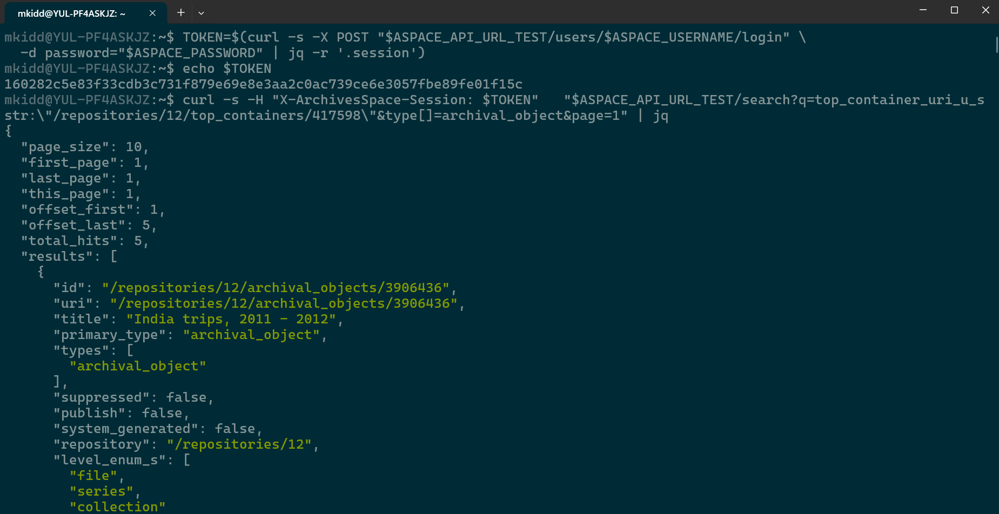

---

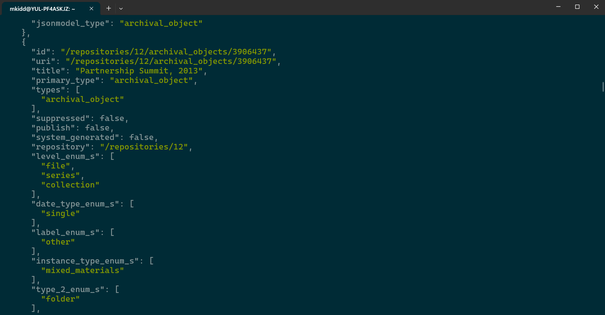

---

# Postman

<a href="https://www.postman.com/product/" target="_blank">Postman</a> is a software program that you download and install on your computer, that provides a **graphical user interface** (GUI) to make composing API requests easy and repeatable.

---

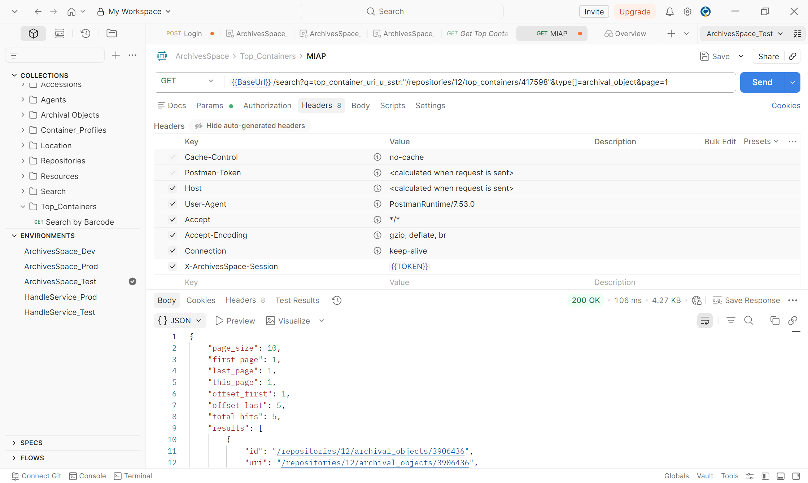


---

# Scripts (Python)

Scripts can be used to establish a connection and perform CRUD operations.

Example: <a href="https://github.com/digital-archives/HISTGA1011/blob/main/slides/shakey_weather/shakey_weather.py" target="_blank">shakey_weather</a>

---


_Final questions or reflections?_

mary.kidd@nyu.edu