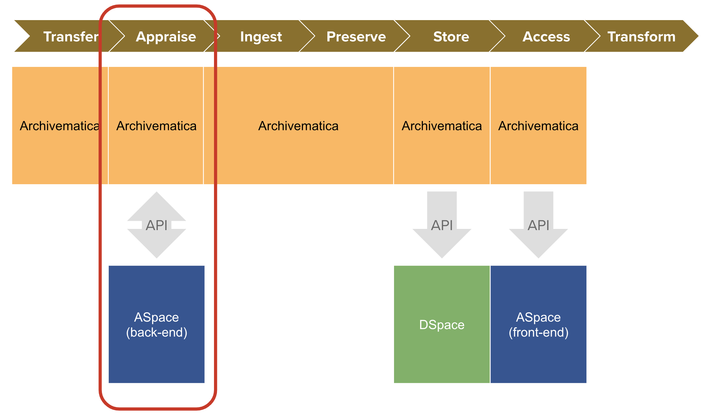
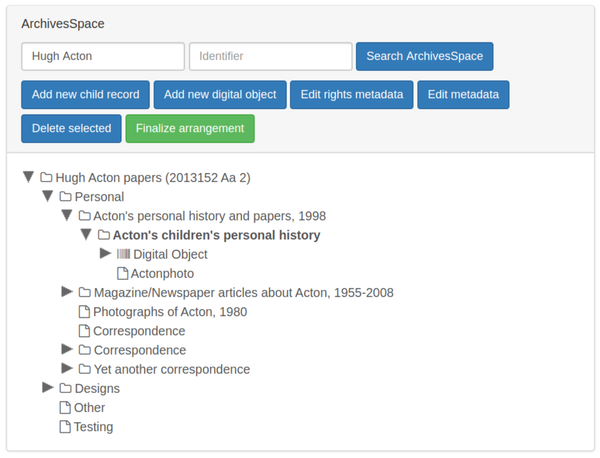

# Application Programming Interfaces (API)

---

# Today
- What is an API?
- What are they used for in libraries, archives and special collections?

---

# In libraries, archives, special collections and preservation departments, disparate systems are utilized to manage various workflows.

---

## Example
# Preservica-ArchivesSpace Integration

ArchivesSpace and Preservica exchange information with one another and update each other.

---

## System
# ArchivesSpace

**ArchivesSpace** is the system of record for descriptive metadata of archival content. At Yale, it is known by its branded name <a href="https://archives.yale.edu/" target="_blank">Archives at Yale</a>.

---

## System
# Preservica

**Preservica** is the system of record for the digital files and information about actions performed on them within the digital preservation system (such as ingest, file characterization and migration).

---

# Each day, Yale staff **ingest** files into Preservica system. This might look like a digital video file, created as a result of analog to digital reformatting, as part of a greater archival collection.

<a href="https://archives.yale.edu/repositories/11/archival_objects/673725" target="_blank">"James Merrill Estate" (1 of 4), 1995 March 13</a>

---

# **Preservica** Side of the Integration

---

# When Yale ingests file to Preservica, it links them to ASpace, and **pulls in a copy of descriptive metadata** from ASpace to be stored along with the rest of the Preservica metadata for those files.

---

# This is helpful for long-term preservation, such that if **something ever happened to ASpace**, we would still have a copy of the archival descriptive metadata for each file ingested.

---

# Within Preservica, the integration also **moves the files into a folder hierarchy that matches the record's descriptive hierarchy in ASpace**, which can be helpful for discovery when browsing for items within Preservica.

---

# **ArchivesSpace** Side of the Integration

---

# In ArchivesSpace, Preservica creates a **new unpublished digital object** (DO) record in ASpace that is linked to the archival object (AO) record and includes a link back to files in Preservica.

---

# **Unpublished notes** are also added to AO at every level of the item's parent hierarchy in ASpace (up to the Resource record item) that link back to the corresponding folder in Preservica.

---

# This allows those using the staff side of ASpace to see at a glance whether a particular item has been ingested to Preservica (and its URL).

<a href="archivesspace.library.yale.edu/resources/1672#tree::archival_object_6763726" target="_blank">Staff-side view of a record containing a Preservica File Version</a>

---

# All of this work is done using **APIs**.

---

# **APIs (Application Programming Interfaces)** allow systems and users of systems "talk" to one another and exchange/update data.

---

# ASpace uses **Encoded Archival Description (EAD)** for archival description and Preservica uses **Open Preservation Exchange (OPEX)** for ingest.

---

# APIs can be used to knit disparate systems together in a way that they can Create, Read, Update and even Delete data from each other.

---

## Definition
# CRUD

**CRUD** is an acronym that stands for Create, Read, Update and Delete, and describe 99% of what you can do within a database.

<!-- See this Reddit post: https://www.reddit.com/r/learnprogramming/comments/xo6oe5/how_does_crud_relate_to_a_rest_api/ -->

---

## Definition - 1/2
# Application Programming Interface (API)

**Application Programming Interfaces**, or APIs, provide a way for disparate systems to request and exchange data from each other without needing to understand the internal workings of the other.

<!--presenter notes

Application Programming Interfaces, or APIs, provide a way for different software applications to communicate and request services or data from each other without needing to understand the internal workings of the other system. They enable applications to interact and collaborate, simplifying the development of interoperability.

-->

---

## Definition - 1/2
# Application Programming Interface (API)

APIs often use web protocols (sets of instructions specific to computers or servers within a network) to execute CRUD operations.

---

# Q: Simply put, how does an API work?
# **A: By sending requests via HTTP (similar to how your web browser works)**

---

# It is very common to access and use software using a web browser. For example, most people use **Gmail using a web browser**. You do not need to download or install it locally.

---

## Definition
# Software as a Service (SaaS)

_Pronounced like "sassy" without the -y._

**Software as a Service** (SaaS) is a cloud computing service model in which a provider delivers software to clients while managing the required physical and software resources.

---

  

  
  

SaaS in Action - 1/2

1. Open a web browser.
2. Open a website of your choice.
3. Look up instructions for how to open the **Inspect** feature on your browser.
4. Open Inspect.

<!-- The instructions following this will be specific to the Chrome browser using a Mac. -->
---

  

  
  

Seeing SaaS - 2/2

4. Select the **Network** tab.
5. Refresh the page.
6. Click on any item listed under **Name** and notice the "Request Method" is `GET`.

---

# Your browser uses the **HyperText Transfer Protocol** (HTTP) protocol to send requests from your computer to other networked computers elsewhere.

---

## Definition - 1/2
# HyperText Transfer Protocol (HTTP)

**Hypertext Transfer Protocol (HTTP)** is a mechanism through which networked computers exchange data.

---

## Definition - 2/2
# HyperText Transfer Protocol (HTTP)

HTTP sends requests to other computers structured into REpresentational State Transfer (REST) methods.

---

## Definition
# REpresentational State Transfer (REST) Architecture

Representational State Transfer **(REST)** is a set of instructions that are transmitted between computers using HTTP.

Common methods include `GET`, `POST`, `PUT`, and `DELETE`.

---

# REST Method: GET

Computer A: "Hello, can I `GET` some information from you?"
Computer B: "Sure, here you go."

---

# Some REST instructions require you provide credentials, known commonly as a **key** to perform certain operations, especially those that involve changing or modifying data.

---

# REST Method: `POST` (1/2)

Computer A: "Hello, can I `POST` a new record? My key is `123456abcdef"`
Computer B: "Sure! The record has been added."

---

# REST Method: `POST` (2/2)

Computer C: "Hello, can I `POST` a new record? I don't have a key."
Computer B: Denied!

---

# REST Method: `PUT`

Computer A: "Hello, can I `PUT` some data into an existing record?"
Computer B: "Sure, the existing record has been updated."
Computer B (alt): "Nope, you don't have permission to do that."

---

# REST Method: `DELETE`

Computer A: "Hello, can I `DELETE` this record?"

Computer B: "Sure, the record has been removed."
Computer B (alt): "Nope, you don't have permission to do that."

---

# **Q:** How do you get a key?
# **A:** Sometimes, keys are given out freely; other times, you have to ask a system administrator for special permission (and sometimes you might even have to pay for access.)

---

# **API Request Structure**
# API requests have a very **specific shape** you must follow in order to send a request that the recipient computer can understand.

---

  

  
  

Mini Activity - API Shape

_See the Library of Congress API in action._

<ul class="activity-list">
<li>Open any web browser.</li>
<li>Copy and paste this URL in your search bar: <a href="https://www.loc.gov/search/?q=maps&fo=json" target="_blank">https://www.loc.gov/search/?q=maps&fo=json</a></li>
<li>Check "pretty-print" checkbox to format the text data so it's more human-readable.
</ul>

<!--presenter notes

If you do not have the pretty-print option in your browser, you can copy and paste the data into this online tool: <a href="https://jsonformatter.org/json-pretty-print" target="_blank">https://jsonformatter.org/json-pretty-print</a>

-->

---

  

  
  

Using just your browser, you just:
- Sent an API request to the Library of Congress API.
- Used the `/search/` **endpoint** to pass keyword search terms and get matching results back.
- Filtered results matching "maps" (`q=maps`) and return it in JSON (`fo=json`).</i>
- Used the `GET` REST command to retrieve records of maps.

<!--presenter notes

Q = "query"
FO = "Format"

-->
---

## Definition
# JavaScript Object Notation (JSON)

**JavaScript Object Notation (JSON)** (pronounced "jay-sohn") is a lightweight, structured data format used for exchanging information between systems.

<!--presenter notes

- Designed to be easy to read/write for humans and machines.
- Many APIs return data in JSON format because it is widely supported.

When we make an API request, the response we get back needs to be structured in a way that both humans and computers can understand. One of the most common formats for this is JSON, or JavaScript Object Notation.

JSON is a lightweight, easy-to-read format used for exchanging data between systems. It’s widely used in APIs because it’s simple for machines to process while still being human-readable.

When we requested data from the Library of Congress API, the response came back in JSON format—structured as key-value pairs that represent information. On the next slide, we’ll take a look at how JSON is structured and why it’s useful for APIs.
-->

---

## Definition
# Endpoint

An API **endpoint** is a _specific URL_ where an API receives requests and sends back responses.

<!--presenter notes

Think of an endpoint as a doorway to an API.

Each API has multiple endpoints, each designed for a specific task, like searching for weather data or retrieving digitized images.

ArchivesSpace provides a list of API endpoints. An API endpoint is a specific point of interaction between an API (Application Programming Interface) and the outside world, typically represented by a URL where the API can receive requests and send responses.

ArchivesSpace offers online documentation for all available endpoints. Using our cooking analogy, an endpoint is like browsing the menu of a restaurant.

In this case, I want to "order up" a list of repositories. To do this, I would search the ASpace REST API documentation for the keyword "repository" to see what it offers. Sure enough, there is an endpoint called "Get a List of Repositories," which seems to be exactly what I need.

You can check out the documentation here: [Get a List of Repositories](https://archivesspace.github.io/archivesspace/api/#get-a-list-of-repositories)

The documentation tells me that the specific endpoint is called `/repositories`. So, what does this mean for me?

-->

---

---

  

  
  

Example of a more complicated API URL: <a href="https://www.loc.gov/search/?q=photographs&fo=json&fa=partof:prints%20and%20photographs&dates=1900-1999
" target="_blank">https://www.loc.gov/search/?q=photographs&fo=json&fa=partof:prints%20and%20photographs&dates=1900-1999
</a>

Question: Looking at the URL, what are we asking the LOC API for?

---

**API**: A set of rules that networked computers can use to talk to and work with each other.

**HTTP**: A web protocol that APIs use to operate through networks.

**REST**: A set of API methods (`GET`, `PUT`, `POST`, `DELETE`)

**Endpoint**: A specific URL representing different records an API can see and update.

**JSON**: A data structure that APIs commonly use to represent data.

---

<!--presenter notes

Back to the Bentley!

In the Bentley integration system, we learned that Archivematica, a web-based system, can talk to ASpace, another web-based system, using an API. They do this using a combination of both the HTTP protocol, as well as another protocol known as REST.

-->

---

# APIs enable...  
**From within Archivematica (Appraisal tab):**
- `GET` ASpace resource records/hierarchies
- `PUT` updates/links back to ArchivesSpace

**From within ASpace:**
- `POST` Digital Object records linked to Archivematica outputs
- `PUT` descriptive/rights metadata updates to existing records

---

<!--presenter notes

Here we are seeing Archivematica calling up the archival object tree for a single ArchivesSpace resource using the ASpace API, and presenting it to the user as a list of nested folders.

-->

---

## Weekly Activity
# Short Stack 🥞

Start: <a href="https://digital-archives.github.io/HISTGA1011/activities/tech_stack.html" target="_blank">https://digital-archives.github.io/HISTGA1011/activities/tech_stack.html</a>

---

_Final questions or reflections?_

mary.kidd@nyu.edu