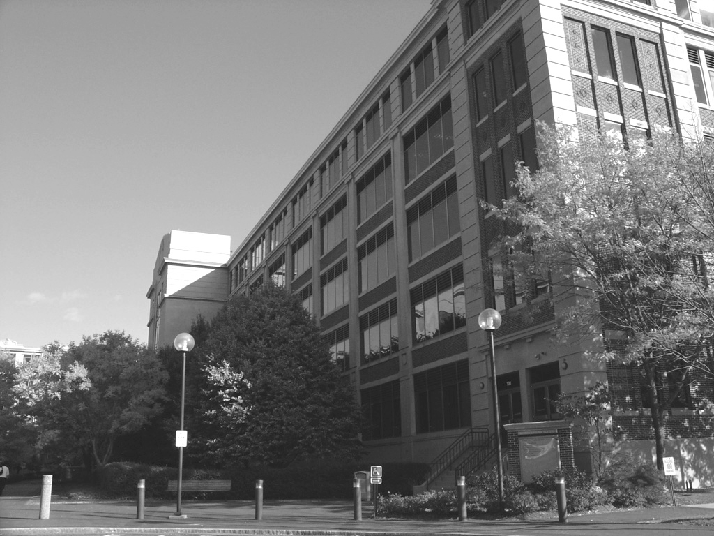
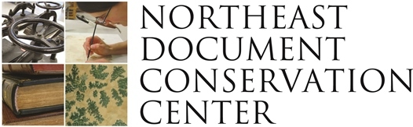
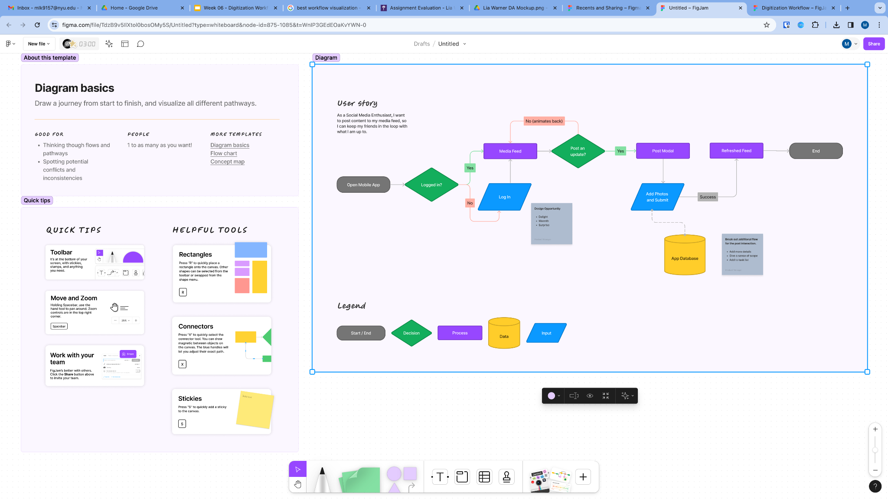
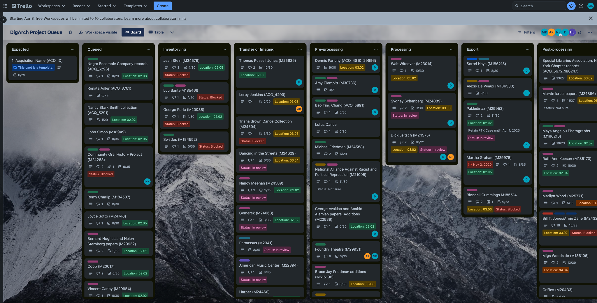

## Question
# Why can’t institutions, organizations, or individuals just _digitize it all_ now? 

<!--presenter notes

In the Prescott, Andrew and Hughs reading from this week, they addressed concepts of both “slow” and “mass” digitization. They wrote: “[S]trategic approach[es] to the selection of material for digitization has not been widely adopted”.

Issues surrounding patchwork funding models for digitization has resulted in “a lack of consensus as to what criteria should be adopted in selecting material for digitization” and that “[L]ibraries frequently undertake digitization programs in response to ad hoc managerial requirements rather than any strategic need.” They also point to more scathing critiques of digitization efforts, highlighting “preoccupation[s] with cultural treasures and canonical works” which are made more for “entertainment” rather than scholarship, and how digitization for the purpose of access subjects cultural materials to a “a digital sausage machine”.

Given this quote, and other readings that you were assigned this week, try and answer: Why can’t institutions, organizations, or individuals just “digitize it all” now?

-->

---

## Definition
# Digitization
\-
__Digitization__ is the process of converting analog or physical information into a digital format.

---

---

<!--presenter notes

Over the next few slides, we will be reviewing digitization considerations put forth by the Northeast Document Conservation Center (NEDCC). NEDCC was founded in 1973, and was the first independent conservation laboratory in the United States to specialize exclusively in the conservation and preservation of paper-based collections. They have since expanded their work to include other materials, like audio-visual works. They produce guides, blog posts, and other literature online with helpful information for individuals and institutions on how to approach conservation and digitization management. This includes their Preservation and Selection for Digitization guidelines, which we will be stepping through over these next few slides.

-->

---

# Selection Criteria: 3 Questions 
1. __Should__ they be digitized?
2. __May__ they be digitized?
3. __Can__ they be digitized? 

<!--presenter notes

Per Northeast Document Conservation Center (NEDCC)’s guidance to selection (https://www.nedcc.org/free-resources/preservation-leaflets/6.-reformatting/6.6-preservation-and-selection-for-digitization), there is “No absolute criteria guide selection for digitization, only questions to be addressed within the context of the individual institution. Each institution has its own reasons and priorities for digitization, from a national library responsible for preserving and presenting the published heritage of its citizens, to a small museum seeking publicity for its collections. The selector’s job is to apply local interpretation to a general set of selection criteria and principles, matching local goals and priorities to the materials and media in the collection.”
These questions are: 1) Should they be digitized; 2) May they be digitized; 3) Can they be digitized?

-->

---

# Should the materials be digitized?

What are its intellectual, historic, and physical characteristics? Do they align with our collection development policy? 

<!--presenter notes

Before embarking on any sort of digitization effort, whether ad hoc or programmatic, it’s important for initiators to ask themselves, Should we digitize? Digitization decisions should consider content value, demand, potential enhancements, and technical feasibility to ensure the preservation and accessibility of valuable materials.

-->

---

# May the materials be digitized?

Centers on copyright, permissions from rights holders, and privacy restrictions (these are usually outlined in a deed of gift or other donor/institution agreement)

- Is the purpose purely for preservation?
- Are the works are in public domain?
- Permissions obtained from rights holders? 
- Legal right to make digital copies accessible?

<!--presenter notes

A huge deciding factor in selecting for digital preservation is whether or not your institution holds the appropriate rights to make digitized items available through a digital library or other public-facing catalog. 

You should know, first and foremost, that institutions have the legal right to digitize materials that are under copyright if the purpose is preservation only. Access, in these cases, will likely be restricted to on-premises, which obviously bars users for a variety of reasons. But, if your purpose for preservation is for preservation only, then you can go ahead and digitize.

However, it is so rarely the case that institutions preserve for preservation’s sake. Unless you hold the legal right to make these digital copies accessible, or know that these works are in the public domain, then your last step would be to obtain permissions from rights holders. This step alone can be very time consuming, especially for those works where there are multiple rights holders.

Additionally, you may have collections that contain a variety of public domain and copyrighted materials. An example of this type of collection was given by the Yolkowski and Jamieson article. Here, they placed orphaned collection items into 1 of 2 risk factor buckets. By categorizing the works in this way, they could make quick decisions about prioritizing processing works at a lower risk, first. This is an interesting approach to a rights framework.

-->

---

# Can they be digitized?

- Considers physical characteristics of the materials vis-a-vis technical requirements for successful digitization: does the institution have the technical infrastructure and/or staff expertise to do the work?
- Evaluates digital capture quality, metadata, and preservation strategies

---

# RPG: Should/May/Can - Scenario

__Scenario__: Let's pretend that we are all a part of the Digitization Decision Committee (DDC) at NYU. This Committee consists of staff from across NYU Libraries, and makes digitization prioritization decisions, in order to determine the order which projects get digitized.

---

# RPG: Should/May/Can - Roles

Using some virtual 6-sided dice (Google "virtual dice"), roll to determine your role.

Roll 1: Manager, Archival Processing
Roll 2: Digital Archivist
Roll 3: Digitization Technician
Roll 4: Conservation Technician
Roll 5: Curator, Manuscripts
Roll 6: Curator, Photography

---

# RPG: Should/May/Can - Questions

The Committee has been tasked to come up with a __list of questions__ that can help prioritize the order of digitization projects.

As a group, please discuss and come up with a list of __3 prioritization questions__. Along with the question, please categorize as a Should, May or Can question. You will have 10 minutes to discuss.

Using the [Airtable form](https://airtable.com/appEgfFHvSG5Ow129/shrZTU0CdpCK3scQr), please have one kind volunteer enter the group's 3 questions into the form.

---

With our 3 questions in mind: Let's pretend 2 curators have approached us.

* Curator A has a a collection of [protest posters made by various activists involved in the Occupy Wall Street movement](https://findingaids.library.nyu.edu/tamwag/tam_630/images/), and wishes the posters to be digitized for an online-only exhibition.
* Curator B has a [collection of photographs created by author Ralph Ellison](https://www.nyu.edu/life/campus-resources/kimmel-center/kimmel-galleries/exhibitions.html), perhaps best known for writing Invisible Man in 1952.

---

Looking at the [Airtable Gallery Grid](https://airtable.com/appEgfFHvSG5Ow129/shrAwFvsKynv7KbSW/tbl6tPQw3LiTPDVYZ) as a group, we will rate this collection based on the questions contributed. 

---

# Paper Digitization 

<!--presenter notes

Today we are going to spend time looking at a particular genre of digitization: paper-based digitization. This primarily includes “flat” or 2-dimensional materials such as manuscripts, photographs, maps, and the like, but also includes things like bound volumes.

We’ll spend some time looking at examples of equipment setups, and then move onto specific to do with standards for the files that are created through the course of this sort of digitization.

-->

---

---

Now that we have gone over what a typical digital imaging lab setup looks like, let’s talk about digital image technology. How are digital image files encoded? What are their technical aspects? Knowing this can then help us understand preservation standards for digital images.

# Definition: Workflow

 The sequence of industrial, administrative, or other processes through which a piece of work passes from initiation to completion. 

 For workflows to be effectively communicated and understood, they should be a.) documented in some way b.) published and/or communicated out to stakeholders or staff working on projects. 

---

In the simplest terms, a workflow is defined as the sequence of industrial, administrative, or other processes through which a piece of work passes from initiation to completion. This is a term you will hear a lot in the context of digital preservation planning and decision-making. So, why are workflows so important to people who work on or manage digitization?

 Why are workflows (and documenting them) important? 

Streamlines processes

Reduces collection management errors

Allows you to understand where to improve

Stops you from “reinventing the wheel”

Opens up avenues for collaboration and resource -sharing; prevents gatekeeping

---

Workflows are extraordinarily important, both in determining what they are, and documenting them so that they may be shared or improved upon over time.

 “A documented workflow streamlines the many processes and tasks involved in a digitization project, facilitating consistency and reliable results, especially when dealing with a large volume of objects to be digitized. Documenting the workflow is also important for tracking material through each stage of the process and identifying errors or problems.” 

 From Wisconsin Historical Society’s Digitization Workflow 

 “...\[D\]ocument as much as possible. It is important to record what was done and, even more so, when. As the project unfolded it became clear that time spent on certain tasks could end up taking either more or less time than originally thought. Technical and intellectual challenges affected the workflow and so it became essential to try to track what steps had been done both with respect to access and preservation.” 

 Yolkowski, John and Jamieson, Krista. “Access and Preservation in Archival Mass Digitization Projects.” Practical Technology for Archives: 2017, Vol. 1, No. 7. 

---

Another perspective on why documenting workflows and even specific occurrences throughout a project comes from one of our assigned readings this week. Here, the authors reflect on how documentation allowed them to apply course corrections throughout the process. For example, they were able to use workflows to identify areas of work that were done in the same way over and over again, such as changing TIFFs to compressed JPEGs and collating those into multi-page PDFs. Here, they developed a script that automated this work, so staff did not have to spend time multi-tasking and performing rote work, and also uphold a certain level of quality, too.

 “Sharing documentation is also important for the archival field. Being able to find out how other projects dealt with challenges can save time and effort by not repeating work others have completed.” 

 Yolkowski, John and Jamieson, Krista. “Access and Preservation in Archival Mass Digitization Projects.” Practical Technology for Archives: 2017, Vol. 1, No. 7. 

---

Another perspective on why documenting workflows and even specific occurrences throughout a project comes from one of our assigned readings this week. Here, the authors reflect on how documentation allowed them to apply course corrections throughout the process. For example, they were able to use workflows to identify areas of work that were done in the same way over and over again, such as changing TIFFs to compressed JPEGs and collating those into multi-page PDFs. Here, they developed a script that automated this work, so staff did not have to spend time multi-tasking and performing rote work, and also uphold a certain level of quality, too.

 The Curator fills out the Airtable Digitization Form, where they select which items from the catalog they would like to have digitized. Their submission is reviewed by the Digitization Committee, who reviews the request based on the institution’s Selection Criteria policy. If the request is approved, it will be placed the project in the Airtable Digitization Queue. This will alert the Registrar, who will schedule a time for the items to be retrieved and shipped to temporary storage stacks. Upon arrival, a conservator assesses the items, and pulls aside those requiring stabilization. After treatment, they mark the items in the Airtable queue, which alerts the photography technician and updates their locations in The Museum System (TMS). Once digitized, the photography technician submits the files to the Digital Archivist, who prepares a bag and submits it to Archivematica, which turns it into an AIP. The AIP is     incorporated     into the finding aid prepared by the Processing Archivist. The Processing Archivist will submit the finding aid for review, and once approved, publishes the finding aid, with links to respective digital objects, onto the digital library. 

---

Workflows are typically narrated, telling the story of how something flows through from point A to point B. You can use documentation such as manuals, guides, etc., to get the gist of a workflow.

Sometimes, they can be long and verbose. Sometimes it’s hard just looking at a wall of text, what is going on.

| Stage | Staff | Action | Result | Systems | Documents |
| :-: | :-: | :-: | :-: | :-: | :-: |
| Request | Curator | Fills out form | Inventory | Catalog, Airtable | Digitization Policy |
| Queue | Committee | Review | Queued | Airtable | Selection Policy |
| Get | Registrar | Transport | Delivery | Airtable | Transport Policy |
| Assess | Conservator | Assessment | Treatment | TMS | Digitization Policy |
| Digitize | Photo Tech | Images made | Bitstream | DAMS | Digitization Guide |
| Post | Photo Tech | Transfer files | Files QC’ed | QC script | Digitization Guide |
| Transfer | Digital Archivist | Prepare bag | Ingest | Archivematica | Digipres Guide |
| Describe | Processing Archivist | AIP created | Finding aid | ContentDM, ASpace | Processing Guide |
| Publish | Archivist | Rights cleared | Access | ASpace, Digital Library | Access Guide |

---

However, you can take workflow narratives and structure them in ways that are more visually appealing, but also, call out the who, what, when, where, and why of a process. This table takes key words from the narrative in the previous slide, and categorizes them into different buckets like “Stage” (of the workflow), Staff type, etc.

 Shipment is today    ? 

 Requires treatment? 

 Location Management System 

 Digitization Queue 

   Request Digitization   

   Finding aid approved?   

   Archival processing   

---

Another way to articulate a workflow is to use a model. Some might refer to this as a Business Management Process or “BPM” model. Here, you can see there is some color and shape coding (purple rectangles = a specific process, green diamons = a decision point, yellow cylinders = databases or systems involved, gray ovals = start/end points of the workflow). You can even code the lines connecting one element to another: for example, a data flow is represented here by a dotted line, while other lines are represented by a one or bi-directional arrow.

  _Project Tracking

 Typically will utilize a shared working space 

 Only track necessary information for project planning and workflow 

 Can use APIs to relay data to/from project tracking systems 

 Include fields for useful metrics for reporting, budget and planning 

---

---

This is the Digital Archives processing queue, that uses Trello. Trello uses a “Kanban” arrangement of tasks (i.e. columns that represent major phases of work, and then within each, “cards” that can be dragged and dropped from one column to another as they are worked on and reach project milestones).