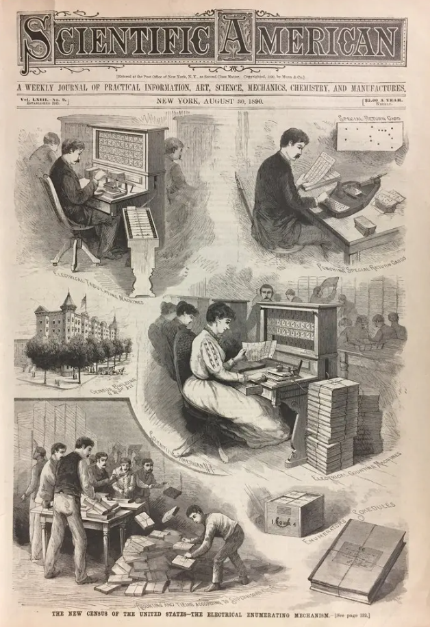

# Week 1 
## Introduction to Digital Archives

---

# Today
- **Welcome and introductions**
- **Review the syllabus**
- **Break**
- **Lecture: Digital information basics**
- **Start weekly activity: Data Object**

---

# Announcements

_Feel free to email me with any announcements you would like me to boost (upcoming conferences, webinars, trainings, or other events/topics of interest)._

---

# Ground Rules

This class is intended to be a welcoming and productive space.

All questions, including repeat questions, or questions with “obvious” answers, are welcome and encouraged. Anti-oppressive or harmful language will not be tolerated.

---

# About Me

My name is Mary Kidd. My pronouns are she/her. You can call me Mary in class, over email, or anywhere else.

I work at the New York Public Library as the Systems and Operations Manager in the Preservation and Collections Processing Department. I also consult on and have led various digital preservation projects.

My email: [mary.kidd@nyu.edu](mailto:mary.kidd@nyu.edu)

---

# Introduce yourself

* What program are you in and how far along are you?
* What do you hope to learn in this course?

---

# Syllabus Review

[https://digital-archives.github.io/HISTGA1011/](https://digital-archives.github.io/HISTGA1011/)

<!-- presenter notes

This semester’s syllabus is hosted on Github. Has anyone here used or are you familiar with Github?

Briefly: Github is an online platform that is used to store and version information. It is also a platform used widely in the digital archives and preservation fields. We will cover what Github is, more, later on in the semester, and see some "real life" examples of digital archiving and preservation repositories. But for now, you will be using it primarily to access the class syllabus, as well assignments and other documents we will be using for in-class activities.

Syllabus link: https://github.com/kiddmary/HIST-GA-1011

-->

---

# Data Object Basics

<!-- presenter notes

I want to step you through basic concepts to do with what digital information is, and in particular, how it is encoded.

-->

---

# Why should we know about digital preservation and archiving?

“As archivists, if we are going to be able to take care of digital collections into the future, we must understand that the__basic building blocks of… digital files are… bits and bytes__. To know files, we must know how they are constructed… And from this knowledge, we will be better equipped to design preservation strategies for our digital collections.”

Bertram Lyons, _The Digital Archives Handbook_ (2019)

<!-- presenter notes

Lyons, Bertram. "Digital Preservation." In The Digital Archives Handbook: A Guide to Creation, Management, and Preservation, edited by Aaron D. Purcell, 3-18. Rowman & Littlefield Publishers, 2019. Accessed September 11, 2023. http://ebookcentral.proquest.com/lib/nyulibrary-ebook/detail.action?docID=5646172, 3.

-->

---

## Definition
# Data Object

A__data object__ is any entity represented as a sequence of binary digits (bits or bitstreams), whose meaningful interpretation depends on a combination of decoding processes and contextual factors.

<!-- presenter notes

Let's unpack this definition by thinking a bit about Data Objects we encounter through our life and work. We will return to defining Bitstreams later on.

-->
---

# Data Object Relationships & Layers

**Data Object** (e.g., bitstream)
↓ Requires
**Interpretive Technologies** (software, hardware)
↓ Requires
**Specialized Knowledge** (documentation, training, user communities)
↓ Maintains
**Accessibility, Preservation**

If these relationships are not maintained, the result is obsolescence, inaccessibility, data loss.

<!-- 

Data Objects encapsulate various forms of digital content, such as documents, media, or software.

All Data Objects, whether it's a single file, or an entire application, will require specialized software, hardware, emulation, specialized knowledge, or one or all of these things, to faithfully render and understand, ensuring their long-term accessibility and preservation.

-->
---

## Definition
# Software

__Software__ is a set of instructions and data that tells a computer what to do. It works when the computer decodes these instructions and follows them to perform tasks. The way software runs depends on the computer's setup (like its hardware and operating system).

<!-- presenter notes

Software is a set of instructions and data that tells a computer what to do. It works when the computer decodes these instructions and follows them to perform tasks. The way software runs depends on the computer's setup (like its hardware and operating system).

The way I like to think about these things is to think of these things in terms of a restaurant. You can think of  software as recipes, which your computer, which you can think of as the chef, follows instructions for to put together Data Objects.

-->

---

## Definition
# Hardware

__Hardware__ refers to the _physical_ components of a computer system that carry out tasks by following instructions provided by software.

<!-- presenter notes

Hardware refers to the physical components of a computer system that carry out tasks by following instructions provided by software.

It includes all the tangible parts of a computer, such as the processor, memory, storage devices, input devices (like keyboards and mice), and output devices (like monitors and printers). Hardware provides the foundation for running software and processing data.

-->

---

# Question

Can you think of an example from your life or work where you use a sequence of numbers to encode something?

Example: A US zip code encodes geographic areas using 5 numbers.

<!-- presenter notes

Question for the class: Can you think of an example from your life or work where meaning is encoded by numbers in a specific order?

Other examples:
- Area code of a telephone number
- DD/MM/YYYY format date

These encodings are akin to how computers encode information into binary. Basically, binary is made up of numbers, in a specific sequence, that represent things in the world.

-->

---

## Definition
# Binary

__Binary__ encodes information using:
- A "base-2" system and place values
- The digits 0 and 1, referred to as__bits__ (stands for "binary digit")

Binary works in a similar way to the familiar__base-10__ decimal system, which also uses digits and place values to represent numbers.

<!-- presenter notes

Binary describes an encoding scheme in which there are only two possible values or states for each value, such as 1 or 0. Because there are only two possible values, binary is considered a base-2 system.

Each individual value is referred to as a “bit”. In the case of a binary computing that uses 1s and 0s, the “1” and the “0” are two individual bits.

Along with bit values, binary also uses place values to represent real-world values.

Computers, true to their name, are machines primarily designed to carry out computations. They excel in understanding the language of numbers.

-->

---

# Base-10
## 0 1 2 3 4 5 6 7 8 9

<!-- presenter notes

If you did not know this already, the numbers that you and I are most familiar with are written in a "base-10" decimal system. The first thing to know about a base-10 system is that it uses 10 digits (0-9) to represent the "base" values.

The second thing to know about a base-10 decimal system is that it uses number placement to represents values that exceed 9.

-->

---

# 10

<!-- presenter notes

Therefore, when we write out a ten, we don't have a "base value" that represents ten, like we do with a 9 or a 4.

To represent 10, we move the 1 over left from the "ones" place to the "tenths" place, and restart the 1s place to 0.

Combined, we know that 1 proceeded by a 0 represents 10.

-->

---

# 100

<!-- presenter notes
When we go up one hundred values, we again, bump our 1 over one more place to the left, to the one-hundredths place.

Each new "place" represents an increment of 10 "to the power of" the placement designation.
-->

---

# 1,200

<!-- presenter notes 

We know that this represents “1 thousand, two hundred” because the 1 is in the “thousandths” place, which we know to be four positions left from the very right. And to sometimes make base-10 numbers more readable, we'll place a  comma to group placement groups in threes.

Binary works similarly in that we use both a decimal value (either a 1 or a 0), and place, to determine their overall value. It's pretty much the same system as base-10, except we are working with 0s and 1s, instead of 0-9.

-->

---

## Definition
# Byte (1/2)

A__byte__ is a discrete-length grouping of bits.

__Example: 00000111__

This byte has a length of 8.

<!-- presenter notes

A byte is a discrete-length grouping of bits. In the slide, we have an example of a byte that consists of 8 bits.

There are other systems that have 16-bit or 24-bit length bytes. But for this example, and for the rest of the lesson, let’s work within a system that uses 8-bit bytes, for simplicity’s sake.

Source: https://www.youtube.com/watch?v=N5SU4RW9opc&ab_channel=CodeHS
https://www.techtarget.com/whatis/definition/binary#:~:text=In%20mathematics%20and%20in%20computing,unit%20(CPU)%20and%20RAM.

-->

---

## Definition
# Byte (2/2)

__Byte length__ determines total number of values it can represent.

An 8-bit length byte like 00000111 represents up to 256 values. To determine this, raise 2 possible bit values, (1 or 0) to the power of the byte length (8), notated as 2^8.

```
2 * 2 * 2 * 2 * 2 * 2 * 2 * 2 
= 
256 possible values
```

<!--presenter notes
I mentioned before than in a base-10 counting system, the length and position encodes value. Binary, similarly, can be interpreted by both length and position.

The position of each digit determines its decimal value. Thus, by understanding the position of each bit, a binary number can be converted into a decimal number.

An 8-bit byte system means each byte contains 8 bits.

Each bit represents 1 of 2 values: a 1 or 0.

To calculate how many different combinations of 8 1s and 0s, we raise the number 2 (standing for 2 possible values) to the power of 8 (8 total bits). From this, we get 256 possible values.
-->

---

## Question
# How many possible byte values are there in a__16-bit__ system?

To determine this:
* Determine number of possible bit values: 2
* Determine length of byte: 16
* Raise 2 to the power of the byte length (2^16)

---

# Answer: 65,536 byte values

A 16-bit system can be calculated by raising the number of possible values (2) to the power of the length of the byte (16), or "two to the power of 16" (2^16). That is:  

```
2 * 2 * 2 * 2 *  
2 * 2 * 2 * 2 *  
2 * 2 * 2 * 2 *  
2 * 2 * 2 * 2

=

65,536
```
---

<style scoped>
img {
  max-height: 105vh; /* 80% of the viewport height */
  object-fit: contain;
  display: block;
  margin-left: auto;
  margin-right: auto;
  padding-top: 5px;
  margin-top: 0;
}
</style>


---


<!-- presenter notes

Comparing an 8-bit Nintendo Entertainment System to a 16-bit one side-by-side, you can see some differences. There are more colors, shades, textures, and tones in the right-hand screen. The more information you can encode, the more stuff you can represent on-screen.

it's important to understand that when we are referring to an 8-bit versus a 16-bit system, and how many byte values each can handle, does not mean that an 8-bit system can only handle 256 values max across all aspects of the game, such as sound, colors, etc, or 65,000 max values for a 16-bit system. This actually refers more to how large of a byte the Central Processing Unit, or CPU, can handle. The CPU is considered the “brain” of the computer or gaming console: it executes instructions from the game software, which include operations like processing inputs, updating game logic, rendering graphics, and managing sound. This allows a 16-bit system to handle more complex instructions at any given moment in gameplay.

-->
---

# Binary -> Decimal

| Binary value | Decimal value |   | Binary value | Decimal value |
| :-: | :-: | :-: | :-: | :-: |
| 0000 0000 | 0 |   | 0000 0110 | 6 |
| 0000 0001 | 1 |   | 0000 0111 | 7 |
| 0000 0010 | 2 |   | 0000 1000 | 8 |
| 0000 0011 | 3 |   | 0000 1001 | 9 |
| 0000 0100 | 4 |   |  |
| 0000 0101 | 5 |   |  |


<!--presenter notes

Here is a sample list of binary values, corresponding to decimal values, in an 8-bit system. In the right-most column, we have 10 decimals, 0 through 9, and their corresponding binary values. In an 8-bit system, the complete list would show 256 possible values.

You may have noticed that, there seems to be a pattern in the placement of 1s and 0s for each decimal going up in succession. Bytes are not arbitrarily assigned to decimals: there is a mathematical system behind that make it so, if you take a binary value, you can reverse-engineer it to determine, in a few steps, the decimal value it represents.

-->

---

| Bit | 0 | 0 | 0 | 0 | 0 | 1 | 1 | 1 |
| :-: | :-: | :-: | :-: | :-: | :-: | :-: | :-: | :-: |


__This byte represents the decimal number 7__
How do we get from 0000 0111 to 7?

---

| Bit | 0 | 0 | 0 | 0 | 0 | 1 | 1 | 1 |
| :-: | :-: | :-: | :-: | :-: | :-: | :-: | :-: | :-: |

__First question to ask__: How many ones (1s) are there?

<!--presenter notes 

Each bit has its own place or position, which is mapped out on the slide. In an 8-bit system, we have 8 possible place values, starting from place 0, up to place 7. Places are read from right to left.

-->

---

| Bit | 0 | 0 | 0 | 0 | 0 | 1 | 1 | 1 |
| :-: | :-: | :-: | :-: | :-: | :-: | :-: | :-: | :-: |

__Answer__: 3

---

| Bit | 0 | 0 | 0 | 0 | 0 | 1 | 1 | 1 |
| :-: | :-: | :-: | :-: | :-: | :-: | :-: | :-: | :-: |
| Place | 7 | 6 | 5 | 4 | 3 | 2 | 1 | 0 |

__Second question to ask__: For each 1 we've found, what are their place values?

---

| Bit | 0 | 0 | 0 | 0 | 0 | 1 | 1 | 1 |
| :-: | :-: | :-: | :-: | :-: | :-: | :-: | :-: | :-: |
| Place | 7 | 6 | 5 | 4 | 3 | 2 | 1 | 0 |

__Answer:__ 0, 1 and 2

---

| Bit | 0 | 0 | 0 | 0 | 0 | 1 | 1 | 1 |
| :-: | :-: | :-: | :-: | :-: | :-: | :-: | :-: | :-: |
| Place | 7 | 6 | 5 | 4 | 3 | 2 | 1 | 0 |
| Weight | 2^7 | 2^6 | 2^5 | 2^4 | 2^3 | 2^2 | 2^1 | 2^0 |

__Third question to ask__: For each 1 we've found, what is their__weight__?

---

| Bit | 0 | 0 | 0 | 0 | 0 | 1 | 1 | 1 |
| :-: | :-: | :-: | :-: | :-: | :-: | :-: | :-: | :-: |
| Place | 7 | 6 | 5 | 4 | 3 | 2 | 1 | 0 |
| Weight | 2^7 | 2^6 | 2^5 | 2^4 | 2^3 | 2^2 | 2^1 | 2^0 |

__Answer__: 4, 2 and 1, which add up to 7

<!-- presenter notes

What do we mean by weight?

A good example comes from the base-10 decimal system we are most familiar with.

-->

---

Decimal value: 787

| Digit | 7 | 8 | 7 |
| :-: | :-: | :-: | :-: |
| Place | 2 | 1 | 0 |
| Weight | 10^2 | 10^1 | 10^0 |
| Value | 100 | 10 | 1 |

7 + 80 + 800 = 787

<!-- presenter notes

Translating binary to decimals may seem unfamiliar, which is fine, because we rarely ever have to do this (that’s the job of computers, afterall).

However, the steps we take to interpret a binary number are similar to how we interpret a decimal number. Let’s take the number 787.

For decimals we also read placements from right to left, as we did with the binary example. In this case, the rightmost digit, which is in place 0, represents the “ones” place. It carries a weight of 10^0, which equals 1. So, the digit 7 in the ones place contributes 7 * 1 = 7 to the overall value of the number.

Moving to the left, the next digit in Place 1 represents the tens place. It carries a weight of 10^1, which equals 10. Therefore, the digit 8 in the tens place contributes 8 * 10 = 80 to the overall value of the number.

Finally, the last digit in place 2 represents the hundreds place. It carries a weight of 10^2, which equals 100. Therefore, the digit 7 in the hundreds place contributes 7 * 100 = 700 to the overall value of the number.

By multiplying each digit by their weight value, we get three numbers: 700, 80 and 7. If we add these three numbers together, we get 787.

Place value allows us to understand the significance and contribution of each digit within a number based on its position, with each position representing a different power of the base of the number system.

Now that we better understand the concept of weight, let's return to our binary example.

-->

---

Decimal value: 7

| Bit | 0 | 0 | 0 | 0 | 0 | 1 | 1 | 1 |
| :-: | :-: | :-: | :-: | :-: | :-: | :-: | :-: | :-: |
| Place | 7 | 6 | 5 | 4 | 3 | 2 | 1 | 0 |
| Weight | 2^7 | 2^6 | 2^5 | 2^4 | 2^3 | 2^2 | 2^1 | 2^0 |
| Value | 0 | 0 | 0 | 0 | 0 | 4 | 2 | 1 |

<!--presenter notes

- The 1 in Place 0 carries a weight of 2^0 or 1. We multiply by 1 to get a Value of 1
- The 1 in Place 1 carries a weight of 2^1 or 2. We multiply by 1 to get a Value of 2.
- The 1 in Place 2 carries a weight of 2^2 or 4. We multiply 4 by 1 to get a Value of 4.
- Add together all values: 4 + 2 + 1 = 7

-->

---

| Word | OK | |
| :-: | :-: | :-: |

<!--presenter notes

Let’s shift from the raw binary representation to something more familiar—an actual word. In this case, let's use the word "OK" as an example.

When you see the word "OK" on a computer screen, you’re looking at an abstraction built on several layers of encoded data. The process that brings that simple word to your screen involves multiple transformations, from human-readable characters to machine-interpretable code.

In the table on the slide, the left-hand column names each of these layers, while the right-hand column shows how the computer encodes and interprets the information. We are going to "drill down" through these layers, one-by-one.

-->

---

| Word | OK | |
| :-: | :-: | :-: |
| ASCII Characters | O | K |

<!--presenter notes

The first layer is what you see—the letters "O" and "K." Notice how I call these, in the chart "ASCII" (pronounced ask-key).

-->

---

## Definition
# The American Standard Code for Information Interchange (ASCII)

The American Standard Code for Information Interchange (ASCII) is a character encoding standard for electronic communication. It encodes 128 specified characters into seven-bit integers.

---

# Sample ASCII Chart

<style scoped>
img {
  max-height: 100vh; /* 80% of the viewport height */
  object-fit: contain;
  display: block;
  margin-left: auto;
  margin-right: auto;
  padding-top: 5px;
  margin-top: 0;
}
</style>


<!--presenter notes 

Image source: https://commons.wikimedia.org/wiki/File:USASCII_code_chart.svg

-->

---

| Word | OK | |
| :-: | :-: | :-: |
| ASCII Characters | O | K |
| Decimals | 79 | 75 |


<!--presenter notes

Each letter is assigned a decimal number through a computer’s internal dictionary, also known as the ASCII table.

The letter "O" corresponds to the decimal number 79, and "K" corresponds to 75.

-->

---

| Word | OK | |
| :-: | :-: | :-: |
| ASCII Characters | O | K |
| Decimals | 79 | 75 |
| Hexadecimals | 4F | 4B |

<!--presenter notes

Then, these decimal values are often converted into a hexadecimal system for efficiency, where "O" becomes 4F and "K" becomes 4B. You can think of hexadecimals, referred sometimes in short as "hex", as a kind of shorthand for bytes.

-->

---

| Word | OK | |
| :-: | :-: | :-: |
| ASCII Characters | O | K |
| Decimals | 79 | 75 |
| Hexadecimals | 4F | 4B |
| Byte (Binary) | 01001111 | 01001011 |

<!--presenter notes

These values are converted into their binary representations: 01001111 for "O" and 01001011 for "K."

At its core, computers understand and process everything in bits and bytes. In this case, each character in "OK" is made up of 8 bits, with a specific combination of 1s and 0s. These bits are then stored physically in hardware.

-->

---

| Word | OK | |
| :-: | :-: | :-: |
| Characters | O | K |
| Decimals | 79 | 75 |
| Hexadecimals | 4F | 4B |
| Byte (Binary) | 01001111 | 01001011 |
| Hardware (On/Off Signals) | ■ □ □ □ ■ ■ ■ ■ | ■ □ □ □ ■ □ ■ ■ |

<!--presenter notes

If we could microscopically zoom into the physical storage—like a hard drive or memory chip—we would see that these bits are stored using electrical signals or magnetic charges. Think of each 1 and 0 as a tiny "on" or "off" switch, or a north/south magnetic direction.

For example, a 1 might be represented by a magnetic field pointing in one direction, while a 0 is stored as the magnetic field pointing in the opposite direction. On a hard drive or chip, this encoding process happens for every single bit, ensuring that what you see on the screen is faithfully represented by physical signals underneath.

So, whether you're reading a word, watching a video, or listening to music, it's all fundamentally encoded in binary and stored physically as on/off signals or magnetic impressions. This entire process—from the word "OK" you see on the screen down to the magnetic signals on a storage device—is how modern computing translates information into a format both humans and machines can understand.

-->

---

# Break


---

# Binary Encoding Examples

<!--presenter notes
Much of this timeline is influenced by Digital Preservation Management’s Timeline of Digital Technology and Preservation (https://www.dpworkshop.org/dpm-eng/timeline/timeline.html).
--> 

---


1880s: Physical holes punched into a piece of paper correspond to warp/weft patterns.

<!--presenter notes

https://www.dpworkshop.org/dpm-eng/timeline/timeline.html

Here, we are looking at a piece of card stock with an array of decimal numbers printed on it. The paper is punched through with holes that correspond to what are essentially bits and bytes of information. These demarcations were then inserted into and "read" by various machines.

Punch cards like this were used throughout numerous industries with the most famous examples being the Jacquard Loom. Looms would be loaded with punch cards, "that determine[d] which cords of the fabric warp should be raised for each pass of the shuttle."

Similar to what we just learned about binary code, we again, have two possible states represented: warp up, or warp down, and further, the placement of the punch on the card which likely corresponded to a specific warp on the loom.

See: https://www.computerhistory.org/storageengine/punched-cards-control-jacquard-loom/#:~:text=The%20Jacquard%20Loom%20is%20controlled,wide%20application%20in%20textile%20manufacturing.

-->
---



<!-- presenter notes

Here is an image from an 1890 issue of Scientific American, depicting workers processing data for the U.S. Census. The 1890 census was the first census that involved computers to tabulate data.

A few captions mention "enumerators"—these were the workers responsible for gathering census data. Enumerating referred to the act of going door-to-door to collect information, such as names, ages, birthplaces, occupations, and other personal details from each household.

We also see captions referencing "tabulating machines", which highlight a major innovation of the time—Hollerith’s Tabulating Machine. These machines worked with punch cards. Each card had a set of holes punched in it, and these holes represented different categories of information—for example, age or marital status.

To process the cards, workers would place them on the machine, and it functioned like a sort of panini press. One side of the press had an array of wires, one wire for each possible punch hole on the card. The other side had pools of mercury. When the machine pressed down, if a wire passed through a hole, it dipped into the mercury pool, completing an electrical circuit.

That electric signal triggered a corresponding dial on the machine. Each dial counted a specific category, like the number of people aged 30-40. As the wire passed through the card and touched the mercury, the dial would advance by one count.

What’s fun about learning about these older computing machines is that they make the connection between the physical and digital worlds much more tangible. In many ways, they worked exactly like what we learned about binary. The punch cards were essentially a physical representation of binary data—either a hole (1) or no hole (0). The position of the hole on the card represented a different category or variable, much like the placement of digits in binary tells us the value of the number.
-->

---

<style scoped>
img {
  width: 80%;
  object-fit: contain;
  display: block;
  margin-left: auto;
  margin-right: auto;
}
</style>


<!--presenter notes

Finding aid: https://www.archives.gov/research/census/1890

archives.gov article: https://www.archives.gov/publications/prologue/1996/spring/1890-census

Tragically, in 1896, right before the results of the 1890 census were published, a fire and subsequent water damage destroyed a vast amount of the census data gathered in 1890. There is a great article on archives.gov addressing how this happened, and what came about (basically, establishing an official US Census Bureau Office, and ramping up storage conditions, including fireproofing where records like this were kept.)

-->

---


<!--presenter notes 

Source: https://meridian.allenpress.com/american-archivist/article/58/2/182/23633/Punch-Card-Records-Precursors-of-Electronic

Punch cards would be used well into the mid-20th century, and incorporated into how some of the earliest computers read and interpreted information.

Punch cards were recognized as carriers of information, and in the 1939 Records Disposition Act, punch cards were listed as a type of record eligible for preservation. The slide shows an excerpt from this Act, that lists punch cards alongside other record types such as sound recordings, papers, correspondence and others.

-->

---


<!--presenter notes 

In 1940, we start to see the development of programmable computers. In the slide above we are looking at the Electronic Numerical Integrator and Computer, aka ENIAC, developed by the United States Army, and housed in Philadelphia, Pennsylvania. In the foreground of the photo is Betty Holberton, an American computer scientist who was one of the six original programmers of the ENIAC.

Take note of the plug boards you see in the photo on the left. These plug boards are how computations were programmed into the computer. They work in an essentially similar manner to punch cards; instead of holes in paper, you had cables going into boards that corresponded to numbers that the ENIAC could interpret into computations.

-->

---

<style scoped>
img {
  width: 60%;
  object-fit: contain;
  display: block;
  margin-left: auto;
  margin-right: auto;
}
</style>


<!--presenter notes

Image source: Konstantin Lanzet - received per EMail Camera: Canon EOS 400D
Core Memory Module – A 32 x 32 core memory plane storing 1024 bits (or 128 bytes) of data. The small black rings at the intersections of the grid wires, organized in four squares, are the ferrite cores.

CC BY-SA 3.0
File: KL CoreMemory.jpg
Created: 14 June 2009

In 1949, Dr. An Wang from the Harvard University Laboratory in the United States invented magnetic core memory.

Magnetic core memory works by subjecting a magnetic field to a magnetic-sensitive “core”. The core, in turn, could be magnetized in a certain direction. One direction would correspond to a 1, and in another direction correspond to a 0. So, instead of holes in paper cards or cables into punch boards, we are seeing magnetic field sensitive cores used to encode bits.

The image you see in the slide shows a 32 x 32 core memory plane storing 1024 bits (or 128 bytes) of data. The small black rings at the intersections of the grid wires, organised in four squares, are the ferrite cores. This so-called “core memory” is one of the first instances of using magnetism to store data. We will see magnetism crop up again with the advent of hard disk drive and recording media later on.

-->

---

## Weekly Activity
# Data Object

Start: <a href="https://digital-archives.github.io/HISTGA1011/activities/data_object.html" target="_blank">https://digital-archives.github.io/HISTGA1011/activities/data_object.html</a>

---


_Final questions or reflections?_

mary.kidd@nyu.edu