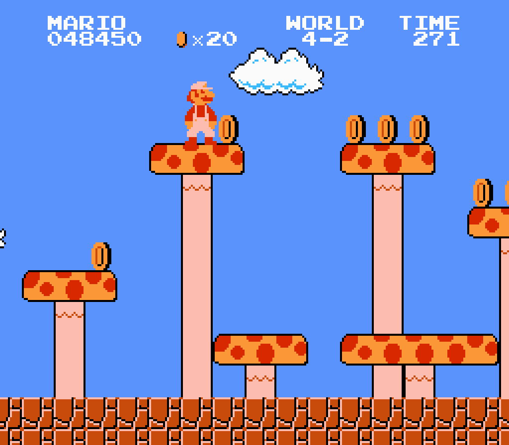

## Week 1 
# Introduction to Digital Archives

---

# Today’s Agenda

- **Settle in/reminders/announcements** (15 minutes)
- **Introductions** (10 minutes)
- **Syllabus review** (20 minutes)
- **Lecture: Introduction to Digital Archives** (60 minutes)
- **Break** (10 minutes)
- **Start weekly activity** (35 minutes)
- **Wrap up** (10 minutes)

---

# Announcements

_Feel free to email me with any announcements you would like me to boost (upcoming conferences, webinars, trainings, or other events/topics of interest)._

---

# Ground Rules

This class is intended to be a welcoming and productive space.

All questions, including repeat questions, or questions with “obvious” answers, are welcome and encouraged.

---

# About Me

My name is Mary Kidd. My pronouns are she/her. You can call me Mary in class, over email, or anywhere else.

I work at Yale University in their Information Technology (IT) Department, as their Technical Lead for Archival Systems. I just started 2 months ago!

I also consult on and have led various digital preservation projects.

My email: [mary.kidd@nyu.edu](mailto:mary.kidd@nyu.edu)

---

# Introduce yourself

* What program are you in and how far along are you?
* What do you hope to learn in this course?

---

# Syllabus Review

[https://digital-archives.github.io/HISTGA1011/](https://digital-archives.github.io/HISTGA1011/)

<!-- presenter notes

This semester’s syllabus is hosted on Github. Github is an online platform that is used to store and version information. It is also a platform used widely in the digital archives and preservation fields. We will cover what Github is, more, later on in the semester, and see some "real life" examples of digital archiving and preservation repositories. But for now, you will be using it primarily to access the class syllabus, as well assignments and other documents we will be using for in-class activities.

Syllabus link: https://github.com/kiddmary/HIST-GA-1011

-->

---

# Introduction to Digital Archives

<!-- presenter notes

I want to step you through basic concepts to do with what digital information is, and in particular, how it is encoded.

-->

---

# Question

What does the concept of "digital archives" mean to you?

* What does it bring to mind?
* Where have you encountered a "digital archive"?

---

# Digital archives/archiving has many meanings, influenced by the context in which they are discussed.

---

## Definition
# Digital Archiving

**Digital archiving** can refer to the specific archival processing practice of accessioning, appraising, arranging, and describing exclusively **born-digital** archival materials. The workers who do this work are sometimes referred to as **digital archivists**.

---

## Definition
# Digital Archive

A **digital archive** can refer to an archive, usually with an online access platform, consisting of some or all born-digital _or_ digital surrogates (digital representations of physical materials). This is also sometimes referred to as a **digital library** or **digital collections**.

---

## Definition
# Digital Preservation

**Digital preservation**, sometimes also called **digital curation**, refers to the activities involved in selecting, establishing, maintaining, and making accessible the contents of a **digital repository or archive**.

---

# The common thread through all of these terms and definitions is **digital**.

---

“As archivists, if we are going to be able to take care of digital collections into the future, we must understand that the basic building blocks of… digital files are… bits and bytes . To know files, we must know how they are constructed… And from this knowledge, we will be better equipped to design preservation strategies for our digital collections.”

Bertram Lyons, _The Digital Archives Handbook_ (2019)

<!-- presenter notes

Lyons, Bertram. "Digital Preservation." In The Digital Archives Handbook: A Guide to Creation, Management, and Preservation, edited by Aaron D. Purcell, 3-18. Rowman & Littlefield Publishers, 2019. Accessed September 11, 2023. http://ebookcentral.proquest.com/lib/nyulibrary-ebook/detail.action?docID=5646172, 3.

-->

---

## Definition
# Data Object

A **data object** is anything encoded by a sequence of binary digits (bits or bitstreams), whose meaningful interpretation depends on a combination of decoding processes and contextual factors.

Examples: a computer file, a software application, a hard disk, a floppy disk, a thumb drive, a flip phone

<!-- presenter notes

Let's unpack this definition by thinking a bit about Data Objects we encounter through our life and work. We will return to defining Bitstreams later on.

-->
---

# Data Object: Relationships & Layers

**Data Object** (e.g., bitstream)
↓ Requires
**Interpretive Technologies** (software, hardware)
↓ Requires
**Specialized Knowledge** (documentation, training, user communities)
↓ Maintains
**Accessibility, Preservation**

If these relationships are not maintained, the result is obsolescence, inaccessibility, data loss.

<!-- 

Data Objects encapsulate various forms of digital content, such as documents, media, or software.

All Data Objects, whether it's a single file, or an entire application, will require specialized software, hardware, emulation, specialized knowledge, or one or all of these things, to faithfully render and understand, ensuring their long-term accessibility and preservation.

-->
---

## Definition
# Software

 Software  is a set of instructions and data that tells a computer what to do. It works when the computer decodes these instructions and follows them to perform tasks. The way software runs depends on the computer's setup (like its hardware and operating system).

<!-- presenter notes

Software is a set of instructions and data that tells a computer what to do. It works when the computer decodes these instructions and follows them to perform tasks. The way software runs depends on the computer's setup (like its hardware and operating system).

The way I like to think about these things is to think of these things in terms of a restaurant. You can think of  software as recipes, which your computer, which you can think of as the chef, follows instructions for to put together Data Objects.

-->

---

## Definition
# Hardware

 Hardware  refers to the _physical_ components of a computer system that carry out tasks by following instructions provided by software.

<!-- presenter notes

Hardware refers to the physical components of a computer system that carry out tasks by following instructions provided by software.

It includes all the tangible parts of a computer, such as the processor, memory, storage devices, input devices (like keyboards and mice), and output devices (like monitors and printers). Hardware provides the foundation for running software and processing data.

-->

---

# Question

Can you think of an example from your life or work where you use a sequence of numbers to encode something?

Example: A US zip code encodes geographic areas using 5 numbers.

<!-- presenter notes

Other examples:
- Area code of a telephone number
- DD/MM/YYYY format date

These encodings are akin to how computers encode information into binary. Basically, binary is made up of numbers, in a specific sequence, that represent things in the world.

-->

---

## Definition
# Binary

 Binary encodes information using:
- A "base-2" system consisting of **binary digits** or **bits** (0 and 1)
- Place value

<!-- presenter notes

Binary is an encoding scheme that represents things with binary digits, aka "bits", represented by 1 or 0. Because there are only two possible values, binary is considered a base-2 system.

Along with bit values, binary also uses place values to represent information. Place values are a term we were all probably introduced to in elementary or middle school. So, let's switch gears and look at the encoding scheme we are most used to: The base-10 decimal system.

-->

---

# Base-10
## 0 1 2 3 4 5 6 7 8 9

9 possible decimal representations

<!-- presenter notes

If you did not know this already, the numbers that you and I are most familiar with are written in a "base-10" decimal system. The 10 in base-10 refers to the fact that it uses 10 decimal values (0-9) to represent numeric values.

-->

---

# 10

<!-- presenter notes

Therefore, when we write out a ten, we don't have a specific decimal number that represents 10 (otherwise it would be called a base-11 system). Instead, we insert a 0, and move the 1 over left from the "ones" place to the "tenths" place, and "restart" the 1s place to 0.

By combining decimals and using place values, we can represent any number.

-->

---

| Digit | 1 | 0 |
| :-:   | :-: | :-: |
| Place | 10^1 (Tens) | 10^0 (Ones) |

- The digit `1` is in the **tens place** ( 10^1 ) and represents \( 1 × 10 = 10 \).
- The digit `0` is in the **ones place** ( 10^0 ) and represents ( 0 × 1 = 0 ).

**Decimal Value**: (1 × 10^1 ) + (0 × 10^0) = 10

---

| Digit | 6 | 4 | 7 | 8 | 3 | 4 | 1 |
| :-:   | :-: | :-: | :-: | :-: | :-: | :-: | :-: |
| Place | 10^6 | 10^5 | 10^4 | 10^3 | 10^2 | 10^1 | 10^0 |

- `6` in the **millions place** (6 × 1,000,000 = 6,000,000)
- `4` in the **hundred thousands place** (4 × 100,000 = 400,000)
- `7` in the **ten thousands place** (7 × 10,000 = 70,000)
- `8` in the **thousands place** (8 × 1,000 = 8,000)
- `3` in the **hundreds place** (3 × 100 = 300)
- `4` in the **tens place** (4 × 10 = 40)
- `1` in the **ones place** (1 × 1 = 1)

---

1010100110110001110100010111010110100001111010101101000010111101011001110101011001011011101010111001101010010101100101010110101001011010101011100101110110110100101110101010100110110001110100010111010110100001111010101101000010111101011001110101011001011011101010111001101010010101100101010110101001011010101011100101110110110100101110101010100110110001110100010111010110100001111010101101000010111101011001110101011001011011101010111001101010010101100101010110101001011010101011100101110110110100101110101010100110110001110100010111010110100001111010101101000010111101011001110101011001011011101010111001101010010101100101010110101001011010101011100101110110110100101110101010

<!--presenter notes

Back to binary: If you were to encounter some binary code, this is what it would look like: a giant stream of bits, with little rhyme or reason at least from the perspective of a human.

-->

---

10101001 10110001 11010001 01110101  
10100001 11101010 11010000 10111101  
01100111 01010110 01011011 10101011  
10011010 10010101 10010101 10101010  
10101001 10110001 11010001 01110101  
10100001 11101010 11010000 10111101  
01100111 01010110 01011011 10101011  
10011010 10010101 10010101 10101010  
10101001 10110001 11010001 01110101  
10100001 11101010 11010000 10111101  


---

## Definition
# Byte (1/3)

A byte is a distinct-length group of bits.

 Example: 00000111 

This byte has a distinct length of 8 bits.

<!-- presenter notes

A byte is a discrete-length grouping of bits. In the slide, we have an example of a byte whose length is 8 bits.

There are other systems that have 16-bit or 24-bit length bytes. But for this example, and for the rest of the lesson, let’s work within a system that uses 8-bit bytes, for simplicity’s sake.

Source: https://www.youtube.com/watch?v=N5SU4RW9opc&ab_channel=CodeHS
https://www.techtarget.com/whatis/definition/binary#:~:text=In%20mathematics%20and%20in%20computing,unit%20(CPU)%20and%20RAM.

-->

---

## Definition
# Byte (2/3)

Byte length determines total number of values it can represent.

An 8-bit byte can represent up to 256 values.

---

## Definition
# Byte (3/3)

To determine how many values a byte can represent, you can "raise" the 2 possible bit values (1 or 0) to the "power" of the byte length (8), notated as 2^8.

```
2 * 2 * 2 * 2 * 2 * 2 * 2 * 2 
= 
256 possible values
```

<!--presenter notes

An 8-bit byte system means each byte contains 8 bits.

Each bit represents 1 of 2 values: a 1 or 0.

To calculate how many different combinations of 8 1s and 0s, we raise the number 2 (standing for 2 possible values) to the power of 8 (8 total bits). From this, we get 256 possible values.
-->

---

## Question
# How many possible values are there in a 16-bit system?

To determine this:
* Determine number of possible bit values: 2
* Determine length of byte: 16
* Raise 2 to the power of the byte length (2^16)

---

# Answer: 65,536 byte values

A 16-bit system can be calculated by raising the number of possible values (2) to the power of the length of the byte (16), or "two to the power of 16" (2^16). That is:  

```
2 * 2 * 2 * 2 *  
2 * 2 * 2 * 2 *  
2 * 2 * 2 * 2 *  
2 * 2 * 2 * 2

=

65,536
```
---



---


<!-- presenter notes

Comparing an 8-bit Nintendo Entertainment System to a 16-bit one side-by-side. There are more colors, shades, textures, and tones in the right-hand screen. The more values you can encode, the more colors and other visual details you can represent on-screen.

-->
---

<div style="transform: scale(0.9); transform-origin: top;">
    <table>
      <tr>
        <td style="width: 300px; text-align: center;">
          
        </td>
        <td style="text-align: center;">
          Digital image (pikachu.jpg)
        </td>
      </tr>
      <tr>
        <td style="text-align: center;">
          <div style="width: 20px; height: 20px; background-color: red; display: inline-block;"></div>
        </td>
        <td style="text-align: center;">
          1 red pixel from Pikachu's wand
        </td>
      </tr>
      <tr>
        <td style="text-align: center;">
          255 [red]<br>255 [green]<br>0 [blue]
        </td>
        <td style="text-align: center;">
          Pixel decimal value (3 color intensities represented by number between 0-255)
        </td>
      </tr>
      <tr>
        <td style="text-align: center;">
          FF [red]<br>FF [green]<br>00 [blue]
        </td>
        <td style="text-align: center;">
          Hex value
        </td>
      </tr>
      <tr>
        <td style="text-align: center;">
          11111111 [red]<br>11111111 [green]<br>00000000 [blue]
        </td>
        <td style="text-align: center;">
          Binary value
        </td>
      </tr>
    </table>
  </div>
</section>

<!--presenter notes

So how do we get from bits to Mario - or in my example in the slide, an image of Pikachu?

The constituent parts of an image are known as pixels, which are tiny squares of one particular color.

The color of a single pixel can be encoded in what is known as the Red, Green and Blue color model, aka RGB. The RGB color model creates colors by combining various levels of the colors red, green, and blue.

Let’s pretend that the particular system we are using to render Pikachu is an 8-bit system, which means that each of the red, green and blue values can be represented by a combination of up to eight 1s and 0s, which corresponds to the intensity or amount added for each color to create the color we see on the screen. We can express these 8-bit bitstreams by a pixel decimal number ranging from 0 to 255. 

Each of these three values from 0 to 255 can be translated further into what are known as hexadecimal values. Hexadecimal values come in two alphanumeric character pairs, each which represent 4 bits. Since we are using an 8-bit system, each of the red, green and blue values corresponds to a 2-character hex value.

Hex values can then be broken down into bits. In this case, F stands for 1111, so two Fs equals 11111111.

-->

---

# Binary -> Decimal

| Binary value | Decimal value | | Binary value | Decimal value |
| :-: | :-: | :-: | :-: | :-: |
| 0000 0000 | 0 | | 0000 0110 | 6 |
| 0000 0001 | 1 | | 0000 0111 | 7 |
| 0000 0010 | 2 | | 0000 1000 | 8 |
| 0000 0011 | 3 | | 0000 1001 | 9 |
| 0000 0100 | 4 | |  |
| 0000 0101 | 5 | |  |


<!--presenter notes

Here is a sample list of binary values, corresponding to decimal values, in an 8-bit system. In the right-most column, we have 10 decimals, 0 through 9, and their corresponding binary values. In an 8-bit system, the complete list would show 256 possible values.

You may have noticed that, there seems to be a pattern in the placement of 1s and 0s for each decimal going up in succession. Bytes are not arbitrarily assigned to decimals: there is a mathematical system behind that make it so, if you take a binary value, you can reverse-engineer it to determine, in a few steps, the decimal value it represents.

-->

---

| Bit | 0 | 0 | 0 | 0 | 0 | 1 | 1 | 1 |
| :-: | :-: | :-: | :-: | :-: | :-: | :-: | :-: | :-: |


 This byte represents the decimal number 7 
How do we get from 0000 0111 to 7?

---

| Bit | 0 | 0 | 0 | 0 | 0 | 1 | 1 | 1 |
| :-: | :-: | :-: | :-: | :-: | :-: | :-: | :-: | :-: |

 First question to ask : How many ones (1s) are there?

<!--presenter notes 

Each bit has its own place or position, which is mapped out on the slide. In an 8-bit system, we have 8 possible place values, starting from place 0, up to place 7. Places are read from right to left.

-->

---

| Bit | 0 | 0 | 0 | 0 | 0 | 1 | 1 | 1 |
| :-: | :-: | :-: | :-: | :-: | :-: | :-: | :-: | :-: |

 Answer : 3

---

| Bit | 0 | 0 | 0 | 0 | 0 | 1 | 1 | 1 |
| :-: | :-: | :-: | :-: | :-: | :-: | :-: | :-: | :-: |
| Place | 7 | 6 | 5 | 4 | 3 | 2 | 1 | 0 |

 Second question to ask : For each 1 we've found, what are their place values?

---

| Bit | 0 | 0 | 0 | 0 | 0 | 1 | 1 | 1 |
| :-: | :-: | :-: | :-: | :-: | :-: | :-: | :-: | :-: |
| Place | 7 | 6 | 5 | 4 | 3 | 2 | 1 | 0 |

 Answer:  0, 1 and 2

---

| Bit | 0 | 0 | 0 | 0 | 0 | 1 | 1 | 1 |
| :-: | :-: | :-: | :-: | :-: | :-: | :-: | :-: | :-: |
| Place | 7 | 6 | 5 | 4 | 3 | 2 | 1 | 0 |
| Weight | 2^7 | 2^6 | 2^5 | 2^4 | 2^3 | 2^2 | 2^1 | 2^0 |

 Third question to ask : For each 1 we've found, what is their weight ?

---

| Bit | 0 | 0 | 0 | 0 | 0 | 1 | 1 | 1 |
| :-: | :-: | :-: | :-: | :-: | :-: | :-: | :-: | :-: |
| Place | 7 | 6 | 5 | 4 | 3 | 2 | 1 | 0 |
| Weight | 2^7 | 2^6 | 2^5 | 2^4 | 2^3 | 2^2 | 2^1 | 2^0 |

 Answer : 4, 2 and 1, which add up to 7

<!-- presenter notes

What do we mean by weight?

A good example comes from the base-10 decimal system we are most familiar with.

-->

---

Decimal value: 787

| Digit | 7 | 8 | 7 |
| :-: | :-: | :-: | :-: |
| Place | 2 | 1 | 0 |
| Weight | 10^2 | 10^1 | 10^0 |
| Value | 100 | 10 | 1 |

7 + 80 + 800 = 787

<!-- presenter notes

Translating binary to decimals may seem unfamiliar, which is fine, because we rarely ever have to do this (that’s the job of computers, afterall).

However, the steps we take to interpret a binary number are similar to how we interpret a decimal number. Let’s take the number 787.

For decimals we also read placements from right to left, as we did with the binary example. In this case, the rightmost digit, which is in place 0, represents the “ones” place. It carries a weight of 10^0, which equals 1. So, the digit 7 in the ones place contributes 7 * 1 = 7 to the overall value of the number.

Moving to the left, the next digit in Place 1 represents the tens place. It carries a weight of 10^1, which equals 10. Therefore, the digit 8 in the tens place contributes 8 * 10 = 80 to the overall value of the number.

Finally, the last digit in place 2 represents the hundreds place. It carries a weight of 10^2, which equals 100. Therefore, the digit 7 in the hundreds place contributes 7 * 100 = 700 to the overall value of the number.

By multiplying each digit by their weight value, we get three numbers: 700, 80 and 7. If we add these three numbers together, we get 787.

Place value allows us to understand the significance and contribution of each digit within a number based on its position, with each position representing a different power of the base of the number system.

Now that we better understand the concept of weight, let's return to our binary example.

-->

---

Decimal value: 7

| Bit | 0 | 0 | 0 | 0 | 0 | 1 | 1 | 1 |
| :-: | :-: | :-: | :-: | :-: | :-: | :-: | :-: | :-: |
| Place | 7 | 6 | 5 | 4 | 3 | 2 | 1 | 0 |
| Weight | 2^7 | 2^6 | 2^5 | 2^4 | 2^3 | 2^2 | 2^1 | 2^0 |
| Value | 0 | 0 | 0 | 0 | 0 | 4 | 2 | 1 |

<!--presenter notes

- The 1 in Place 0 carries a weight of 2^0 or 1. We multiply by 1 to get a Value of 1
- The 1 in Place 1 carries a weight of 2^1 or 2. We multiply by 1 to get a Value of 2.
- The 1 in Place 2 carries a weight of 2^2 or 4. We multiply 4 by 1 to get a Value of 4.
- Add together all values: 4 + 2 + 1 = 7

-->

---

| Word | OK | |
| :-: | :-: | :-: |

<!--presenter notes

Let’s shift from the raw binary representation to something more familiar—an actual word. In this case, let's use the word "OK" as an example.

When you see the word "OK" on a computer screen, you’re looking at an abstraction built on several layers of encoded data. The process that brings that simple word to your screen involves multiple transformations, from human-readable characters to machine-interpretable code.

In the table on the slide, the left-hand column names each of these layers, while the right-hand column shows how the computer encodes and interprets the information. We are going to "drill down" through these layers, one-by-one.

-->

---

| Word | OK | |
| :-: | :-: | :-: |
| ASCII Characters | O | K |

<!--presenter notes

The first layer is what you see—the letters "O" and "K." Notice how I call these, in the chart "ASCII" (pronounced ask-key).

-->

---

## Definition
# The American Standard Code for Information Interchange (ASCII)

The American Standard Code for Information Interchange (ASCII) is a character encoding standard for electronic communication. It encodes 128 specified characters into seven-bit integers.

---


<!--presenter notes 

Image source: https://upload.wikimedia.org/wikipedia/commons/1/1b/ASCII-Table-wide.svg

-->

---

| Word | OK | |
| :-: | :-: | :-: |
| ASCII Characters | O | K |
| Decimals | 79 | 75 |


<!--presenter notes

Each letter is assigned a decimal number through a computer’s internal dictionary, also known as the ASCII table.

The letter "O" corresponds to the decimal number 79, and "K" corresponds to 75.

-->

---

| Word | OK | |
| :-: | :-: | :-: |
| ASCII Characters | O | K |
| Decimals | 79 | 75 |
| Hexadecimals | 4F | 4B |

<!--presenter notes

Then, these decimal values are often converted into a hexadecimal system for efficiency, where "O" becomes 4F and "K" becomes 4B. You can think of hexadecimals, referred sometimes in short as "hex", as a kind of shorthand for bytes.

-->

---

| Word | OK | |
| :-: | :-: | :-: |
| ASCII Characters | O | K |
| Decimals | 79 | 75 |
| Hexadecimals | 4F | 4B |
| Byte (Binary) | 01001111 | 01001011 |

<!--presenter notes

These values are converted into their binary representations: 01001111 for "O" and 01001011 for "K."

At its core, computers understand and process everything in bits and bytes. In this case, each character in "OK" is made up of 8 bits, with a specific combination of 1s and 0s. These bits are then stored physically in hardware.

-->

---

| Word | OK | |
| :-: | :-: | :-: |
| Characters | O | K |
| Decimals | 79 | 75 |
| Hexadecimals | 4F | 4B |
| Byte (Binary) | 01001111 | 01001011 |
| Hardware (On/Off Signals) | ■ □ □ □ ■ ■ ■ ■ | ■ □ □ □ ■ □ ■ ■ |

<!--presenter notes

If we could microscopically zoom into the physical storage—like a hard drive or memory chip—we would see that these bits are stored using electrical signals or magnetic charges. Think of each 1 and 0 as a tiny "on" or "off" switch, or a north/south magnetic direction.

For example, a 1 might be represented by a magnetic field pointing in one direction, while a 0 is stored as the magnetic field pointing in the opposite direction. On a hard drive or chip, this encoding process happens for every single bit, ensuring that what you see on the screen is faithfully represented by physical signals underneath.

So, whether you're reading a word, watching a video, or listening to music, it's all fundamentally encoded in binary and stored physically as on/off signals or magnetic impressions. This entire process—from the word "OK" you see on the screen down to the magnetic signals on a storage device—is how modern computing translates information into a format both humans and machines can understand.

-->

---

# Break


---

## Weekly Activity
# Data Object

Start: <a href="https://digital-archives.github.io/HISTGA1011/activities/data_object.html" target="_blank">https://digital-archives.github.io/HISTGA1011/activities/data_object.html</a>

---


_Final questions or reflections?_

mary.kidd@nyu.edu