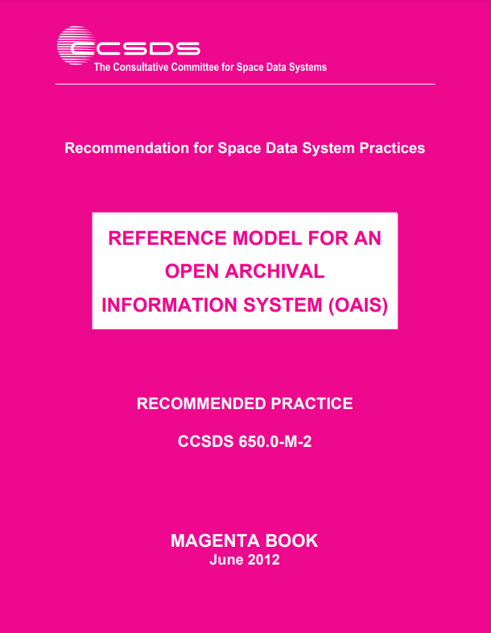
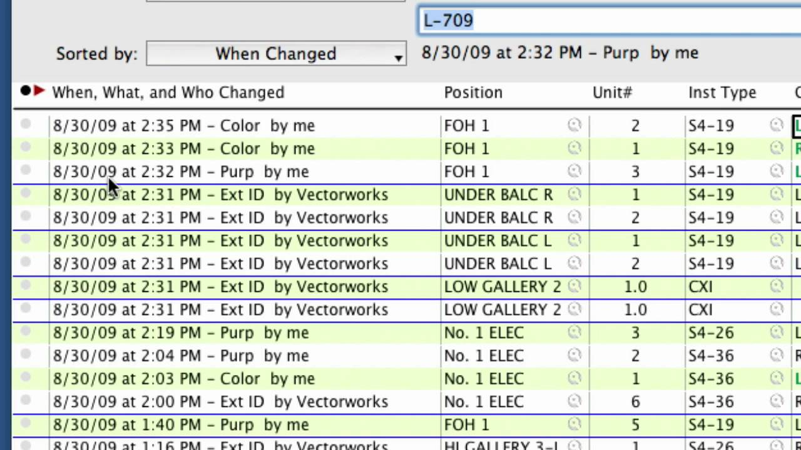
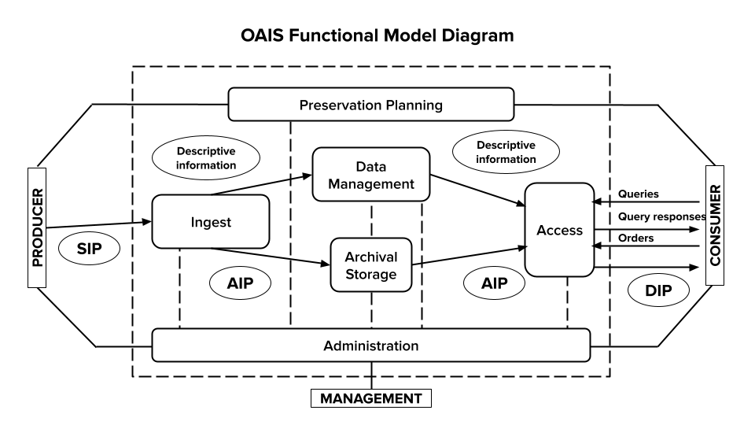
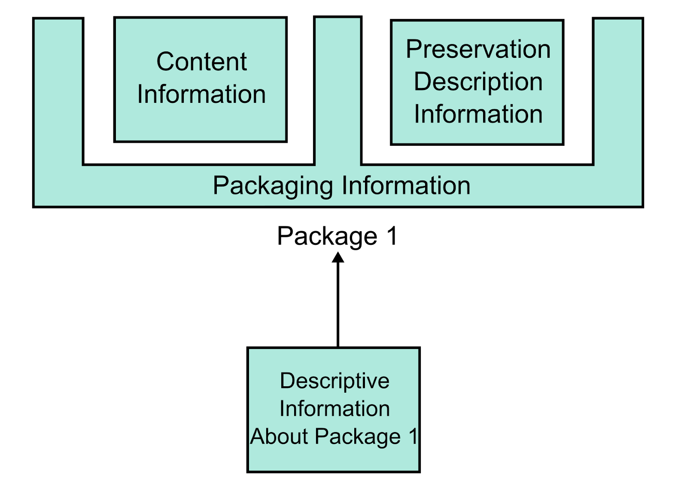

# Week 2
## Open Archival Information System (OAIS)

---

# Today
- Reminders/announcements
- Lecture: Open Archival Information System (OAIS)- Break
- Next class

---

# Open Archival Information System (OAIS)

---

# __Question__: What does Owens mean by “craft” of digital preservation? What does that term imply in regards to digital preservation?

---

“If the permanent maintenance of any given state, or set of states, was the definition of digital sustainability, then we could merely select a suitable technical strategy to permanently inscribe those states and entrust the objects to an appropriate storage and preservation strategy. However, the layers of dependencies and interdependencies, standards, agreements, understandings, technologies, strategies, workflows, and business models render that simple preservation model indefensible.”

Kevin Bradley, from “Defining Digital Sustainability” (2007)

<!--presenter notes

Source for quote: Lee, Christopher A., and Tibbo, Helen. “Where’s the Archivist in Digital Curation? Exploring the Possibilities through a Matrix of Knowledge and Skills.” Archivaria: 72 (Fall 2011) pp. 123-168. http://www.ils.unc.edu/callee/p123-lee.pdf

-->

---

<!--presenter notes

Diagram from: https://muse.jhu.edu/article/223247

This diagram provides a timeline for some of the earliest developed digital preservation standards. You’ll see the OAIS Reference Model over near the top-right. You can see how it has been referenced by subsequent frameworks since it became an official ISO standard in 2003. We will not be going through all the frameworks OAIS influenced, but will look at one in particular: ISO 16363, aka the “Audit and certification of trustworthy digital repositories” standard, sometimes known just as “TRAC”, which stands for “Trustworthy Repositories Audit & Certification”.

-->

---

## Definition
# Open Archival Information System (OAIS)

__An Open Archival Information System__ (OAIS) is an Archive consisting of an organization, which may be part of a larger organization, of people and systems that has accepted the responsibility to preserve information and make it available for a Designated Community.

<!--presenter notes

An Open Archival Information System, or OAIS, is defined as an Archive, consisting of an organization, which may be part of a larger organization, of people that has accepted the responsibility to preserve information and make it available for a Designated Community. When we are referring to an OAIS, we are referring, basically, to an archive who has accepted this responsibility.

Now that we have a definition for OAIS under our belts, we will first define what the Reference Model for an OAIS is, and then unpack some of the terms used in the definition on the slide: information, and later, designated community.

-->

---

# Why is the OAIS important?

- __Widely accepted:__  key digital preservation standard
- __Comprehensive:__ covers ingest to end-user access
- __Flexible:__ can be applied to a variety of environments and systems
- __Clear:__ Well-defined attributes for a robust digital archives system

<!--presenter notes

Source: These bullets are derived from a SERI Educational Webinar, viewable on YouTube: https://www.youtube.com/watch?v=MWITvx5yAEs (the slide I’ve transferred can be found at 9:33)

“Over the past several years, the OAIS has become a widely accepted foundation for research and development on digital archives. The OAIS has become ‘the reference model of choice of those involved in the digital preservation world serving as a ‘galvanizing force’ and a ‘major factor in the advancement of digital archiving efforts.’ It has contributed ‘a common language and concepts for different professional groups involved in digital preservation and developing archiving systems’ and represents ‘common ground upon which to consolidate understanding of the needs and requirements of digital preservation.’ Many types of institutions – including archives – were involved in its development and have used it as a basis for their work.”

-->

---

# OAIS Reference Model Limitations
- __Non-specific__: Written at a high level of abstraction
- __Narrow scope__: Does not address core archival functions such as advocacy and outreach, deaccessioning, reference and user support services, or selection, appraisal, and disposition
- __Non-prescriptive__: Does not detail how to collaborate, coordinate or implement the model

<!--presenter notes

Source: Lee, Christopher A., and Tibbo, Helen. “Where’s the Archivist in Digital Curation? Exploring the Possibilities through a Matrix of Knowledge and Skills.” Archivaria: 72 (Fall 2011) pp. 123-168. http://www.ils.unc.edu/callee/p123-lee.pdf

The OAIS Reference Model employs a very general nomenclature made up of "terms that are not already overloaded with meaning so as to reduce conveying unintended meanings" (Consultative Committee for Space Data Systems 2002, pp. 1–7). This is useful because many of us rely on jargon unique to our own archival settings, which can make communication across archives difficult. You might have also noticed that the OAIS does not prescribe any specific system or technical setup and is written at a high level of abstraction.

The result of these generalistic terms, is that the various archival communities need to translate OAIS terminology to the relevant concepts that apply in their specific contexts. For some institutions this may be to their advantage. On the other hand, this may seem very out of reach to an archive just starting out, or lacks the resources required to establish such a multi-faceted system.

Additionally, the OAIS does not address core archival functions such as advocacy and outreach, deaccessioning, reference and user support services, or selection, appraisal and disposition. Implementation of an OAIS or OAIS-like system without integrating these other, and equally important archival functions risks the OAIS failing to garner buy-in and support from stakeholders.

The OAIS also does not address how to collaborate, coordinate or implement the model. Most archives do not exist in a vacuum. To establish this sort of system, they would likely need to coordinate with folks in IT, for example.

-->

---

---

# Text: Reference Model for an Open Archival Information System (OAIS)

__The Reference Model for an Open Archival Information System__ was developed for use in facilitating a broad, discipline-independent consensus on the requirements for an archive or repository to provide long-term preservation of digital information.

<!--presenter notes

This week, you were assigned to skim parts of the Reference Model for an OAIS document. The Reference Model for an Open Archival Information System (OAIS) document was developed for use in facilitating a broad, discipline-independent consensus on the requirements for an archive or repository to provide long-term preservation of digital information. It is sometimes referred to as the “Magenta Book” because of the color of its cover page.The OAIS Reference Model was approved in January 2002 as ISO International Standard 14721; a revised and updated version was published in 2012 as ISO (International Standards Organization) Standard 14721:2012.

The Consultative Committee for Space Data Systems (CCSDS) initiated the creation of this standard, and aimed at developing formal standards for the long-term storage of digital data generated from space missions.

This document was was developed for use in facilitating a broad, discipline-independent consensus on the requirements for an archive or repository to provide long-term preservation of digital information. It was also intended to support the development of additional digital preservation standards.

So now, let’s turn back again to our OAIS definition, and unpack what it means by “preserve information”.

-->

---

# Question for class

## As we learned last week, all data objects are, at their most fundamental, composed of 0s and 1s, or binary data. __Is it enough to preserve just the "bits" of a data object? Why or why not?__

<!--presenter notes 

Last week, we covered the basics of binaries and bitstreams. A bitstream is defined as sequence of 1s and 0s. We also learned how to interpret one byte of data to a decimal number.

Typically I do not like or endorse trick questions, but I’d like to ask this to prove a point. The trick question is: Can anyone guess what this string of 1s and 0s on the slide means?

The answer is that you can’t really know what any string of 1s and 0s means without some sort of other information that tells you how to interpret it, or can automatically render it. This is especially true when concerning things like a piece of digital art, video, document, that requires some sort of intermediary software or hardware system to interpret. Even if we were to decode this bitstream into decimals, without any sort of context, it still would just be numbers without any meaning.

<!-- presenter notes

But what makes this even more complicated is the nature of digital information itself. At its core, all data objects—whether they’re a document, an image, a video, or a piece of software—are nothing more than binary code. If you looked at their core code, you would see an endless stream of numeric ones and zeros.

To understand or interact with a data object, we need some kind of intermediary, like software to process it, or hardware to run it. In contrast, think about a physical book or a printed photograph. You can hold them in your hands, see the information, and directly interpret it. The content is immediately accessible without requiring any additional technology.

With data objects, however, every step—from the file type to the program that opens it—requires something to act as a bridge, translating that binary data into something recognizable, something we can make sense of.

And this dependency on intermediaries presents a risk. What happens when the software that interprets that file becomes obsolete? Or when the hardware is no longer available, because the manufacturing plant that produced it is no longer? Without maintaining these layers, data objects could easily become lost or unreadable, leaving us with nothing more than a stream of binary code that’s effectively inaccessible.

-->

---

# Definition: Content Information (1/2)

__Content Information__ is composed of two main elements:
  1. The __Data Object__ (the 0s and 1s or the literal binary data, aka "bitstream", e.g. 01001000)

<!--presenter notes

Source: https://wiki.dpconline.org/index.php?title=4.2.1.3.1_Representation_Information_Types

At first glance, you might think that an OAIS would only be concerned with preserving bitstreams, the 1s and 0s that underlie things like word processing documents, videos, audio, and even software. But that is far from the case.

Bitstreams are not inherently understandable. Because of this, the OAIS considers both the bitstream and the information needed to decode and make sense of the bitstream equally as important as far as the things it is concerned with preserving go.

The OAIS calls the bitstream the data object. The tools necessary to interpret, decode or render the data object are known in OAIS as representation information, additional information needed to decode the bitstream. The data object and representation information together comprise content information.

Content information is the primary thing that an OAIS is concerned with managing and preserving, and is sometimes also referred to as the preservation target.

Let’s talk more about representation information.
-->

---

# Definition: Content Information (2/2)

__Content Information__ is composed of two main elements:
1. The __Data Object__ (the 0s and 1s or the literal binary data, aka "bitstream", e.g. 01001000)
2. The __Representation Information__, or the information that makes sense of the bitstream (e.g. 01001000 = Decimal 72 = Letter H)

<!--presenter notes

Representation Information is the information that makes sense of the bitstream. This might include things like:
- The hardware or software required to display or use the Data Object
- Information, generally, for how to interpret the Content Data Object, such as knowing that any textual information might be encoded in ASCII, for example.
- Further, it may also be information to make sense of the information itself. For example, it may still not be enough to know that something may be decoded using ASCII, if it's just a bunch of decimal numbers. However, this might make more sense if you knew that this jumble of numbers actually "indicate[s] that the numbers correspond to average daily air temperature readings for London, measured in degrees Celsius, for the period 1972–2000.” - The Open Archival Information System (OAIS) Reference Model: Introductory Guide (2nd Edition)

-->

---

# There are two types of Representation Information:
## 1. Structure Information
## 2. Semantic Information

<!--presenter notes

There are two types of representation information: structure information and semantic information.

https://wiki.dpconline.org/index.php?title=4.2.1.3.1_Representation_Information_Types

-->

---

# Definition: Structure Information

__Structure Information__ is a type of __representation information__ that maps the data object, or bitstream, to understandable data types.

For example, a file extension (i.e. music.__FLAC__, document1.__PDF__, 12340000.__DOCX__, img_00123.__JPEG__)

<!--presenter notes

Structure information deals with how to map the bitstream into higher-level data types and meaningful concepts. One example you have likely encountered working on a computer is file format extensions.

When you open up a folder of files, the files themselves have some sort of name, followed by a period, followed by a dot and then the name of a file type like my_image.JPEG or my_song.MP3 or my_writing.DOC. The dot, followed by a typically 3- or 4-character format code is a type of structure information that tells you or the computer how to decode the file. 

If you removed the file extension, your computer will throw some sort of error because it’s missing the structure information it expects to interpret and make sense of the file. Without it, the computer does not know how to interpret the Data Object

-->

---

# Definition: Semantic Information

__Semantic Information__ is a type of representation information that clarifies the meaning or appropriate interpretation of the Content Data Object.

<!--presenter notes

Semantic information is any other additional information that clarifies, guides or interprets the data object. For example, a glossary, a data dictionary, or a software application’s user documentation. The ASCII dictionary we’ve been looking at is a good example of semantic information.

https://wiki.dpconline.org/index.php?title=4.2.1.3.1_Representation_Information_Types

-->

---

# __Case Study__: Dennis Parichy Lighting Designs

<!--presenter notes

Photo credit:

Billy Rose Theatre Division, The New York Public Library. "Publicity photo of lighting designer Dennis Parichy (New York)" New York Public Library Digital Collections.
[https://digitalcollections.nypl.org/items/858d2d20-1fb7-0136-cbed-478a43ad47de](https://digitalcollections.nypl.org/items/858d2d20-1fb7-0136-cbed-478a43ad47de)

-->

---

# In 2013, the New York Public Library (NYPL) acquired the works of Dennis Parichy, a New York City-based lighting designer. Parichy designed lighting for 25 Broadway productions since 1976. He has been nominated three times for a Tony Award for his lighting design work.

---

<!--presenter notes

The Parichy acquisition contained both physical files as well as born-digital materials on floppy disks, because later on in his career, he used two software programs, Lightwright and VectorWorks (which are interoperable with one another), to program stage lighting cues. The slide shows a screenshot of the Lightwright interface. Here, you can see that the user could program a queue of stage lighting directions, and specify things like stage position, sequence, and give each lighting direction a name. We can, if we wanted to, watch a YouTube video of how to use this program. https://www.youtube.com/watch?v=LoBcIxjydKg

-->

---

<!--presenter notes

Photo credit:
Pollard, Collette. "Set Design for DON’T TELL ME I CAN’T FLY." 2011. Digital Image. Accessed January 26, 2024. https://collettepollard.com/production/dont-tell-me-i-cant-fly/

-->

---

# Question: Using the Parichy LightWorks example, what might constitute this collection’s __Content Information__?

---

# Definition: Consumers

__Consumers__ are the the users of the OAIS.

# Definition: Designated Community

__A Designated Community__ is a special type of __consumer__ that describes the primary users or people accessing the information preserved within the OAIS.

<!--presenter notes

Now that we have a grasp on what the OAIS’ definition of content information is and what that consists of, let’s look at what the OAIS means by a designated community.

Let’s revisit the definition of an OAIS, which is “an Archive consisting of an organization, which may be part of a larger organization, of people and systems that has accepted the responsibility to preserve information and make it available for a Designated Community.”

A Designated Community is a specified class of users expected to consume and understand the archived information in an OAIS. For example:
NARA’s Electronic and Special Media Records Services Division’s Archives’ designated community is the general public.
NASA’s Planetary Data Systems Archive’s designated community is the planetary science community.

Designated communities are determined in large part by the type of knowledge base required to understand the archive’s holdings. Let’s define what we mean by knowledge base next.

Source: https://www.oclc.org/research/publications/2000/lavoie-oais.html

-->

---

# Definition: Knowledge base

__A Knowledge Base__ is a set of information, incorporated by a person or system, that allows that person or system to understand the information preserved in the OAIS.

The OAIS must understand the knowledge base of its designated community to understand the minimum representation information that must be maintained.

<!--presenter notes

Designated communities have what’s known as a specific knowledge base. A knowledge base is a set of information, incorporated by a person or system, that allows them to understand the received information. An OAIS should incorporate what it knows about a designated community’s knowledge base in order to understand the minimum representation information that must be maintained for whatever it is preserving to make sense both in the immediate and long-term.

-->
---

# Activity: Forme of Cury

<table>
  <tr>
    <td>
      
      <a href="https://luna.manchester.ac.uk/luna/servlet/detail/Man4MedievalVC~4~4~994591~289805:Drepe?sort=reference_number%2Cimage_sequence_number%2Cparent_work_title%2Cdate_created&qvq=q:forme%20of%20cury;sort:reference_number%2Cimage_sequence_number%2Cparent_work_title%2Cdate_created;lc:Man4MedievalVC~4~4&mi=37&trs=191" target="_blank">Digital Collections Link</a>
    </td>
    <td valign="top">
      <strong>Details:</strong>
      <ul>
        <li>Filename: Forme of Cury-MS 7-18v.jpg</li>
        <li>Digitized from a Late Middle Ages cookbook. Part of the Rylands Medieval Collection. Written in Middle English.</li>
      </ul>
      </td>
      <td valign="top">
      
For the entire digitized manuscript, what is the:

      <ul>
        <li>Data object</li>
        <li>Representation information</li>
        <li>Structure information</li>
        <li>Users/Designated community</li>
      </ul>
    </td>
  </tr>
</table>

<!--presenter notes

Source: https://en.wikipedia.org/wiki/JPEG_File_Interchange_Format

Let’s put all of what we just learned together about content information, content data objects, representation information, knowledge bases and designated communities.

On the slide we have a screen capture of a scanned page of the Forme of Cury, a cookbook from the Late Middle Ages, dating to the late 14th century, written in Middle English.

Based on the definitions we just reviewed in the previous slides for Data Object and Representation Information, take a guess what might constitute, in an OAIS, its content information, the data object, the designated community and its knowledge base, and the representation information? Take a minute to think about it and write down your thoughts somewhere if you need to.

Suggested answers:
* Data Object: the bitstream of the scanned page.
* Structural information includes the image format type (JPEG).
* Other representation information may include some sort of text transcription derived from optical character recognition (OCR) technology that translates the cookbook into modern English.

-->

---

# OAIS Functional Model

---

<!--presenter notes

Diagram credit: By Mathieualexhache (original work); Mess (SVG conversion; English translation) - File:Schema fonctionnel modele oais.jpg, CC BY-SA 4.0, https://commons.wikimedia.org/w/index.php?curid=98896005

Here we have a diagram showing a visualization of the OAIS functional model, which describes how information enters into, is stored in, and flows out of an OAIS and the various functional entities that interact with the OAIS.

Take a moment to look at the “flow” of information in/outof an OAIS. The various OAIS functions - preservation planning, ingest, data management, archival storage, administration and access - are labeled in brown. Entities that interact with the OAIS - producers, consumers and management - are labeled in plain black text. Various information packages handled by the OAIS - SIPs, AIPs, and DIPs - are labeled in the white circles. The OAIS itself is delineated by the dotted rectangle.

Source: Figure 1 diagram from https://www.oclc.org/research/publications/2000/lavoie-oais.html

-->

---

<!--presenter notes

We are going to focus first on what are known as information packages. They are highlighted in yellow in the OAIS Functional Model Diagram and are known in short as SIPs, AIPs and DIPs. 

-->

---

# Definition: Information Package (1/3)
—

The OAIS information model is built around the concept of an __information package__, composed of the object that is the focus of preservation, along with metadata necessary to support its long-term preservation, access, and understandability, bound into a single logical package, such as a file folder.

<!--presenter notes

The OAIS information model is built around the concept of an information package, which consists of the object that is the focus of preservation, along with metadata necessary to support its long-term preservation, access, and understandability, bound into a single logical package (usually, a computer folder)

An information package is the data submitted, managed and distributed by an OAIS. There are three different types of information packages: Submission Information packages, or “SIPs”, Archival Information Packages, or “AIPs”, and Dissemination Information Packages, or “DIPs”. So SIPs, AIPs and DIPs. These are all highlighted in the slide in yellow.

In defining what each information package is, we will also learn more about the entities who interact with or receive data from an OAIS: Producers, Consumers, and Management. I’ve underlined these entities in yellow.

-->

---
<svg width="1000" height="1000" viewBox="-150 0 1600 1200">

  <!-- Cube 1: Content Information -->
  <!-- Front face -->
  <polygon points="100,200 500,200 500,600 100,600" fill="lightblue" stroke="black" />
  <!-- Top face -->
  <polygon points="100,200 300,120 700,120 500,200" fill="lightblue" stroke="black" />
  <!-- Side face -->
  <polygon points="500,200 700,120 700,520 500,600" fill="blue" stroke="black" />
  <!-- Text on the front face -->
  <text x="300" y="400" font-family="Arial" font-size="40" fill="black" text-anchor="middle">
    Content
  </text>
  <text x="300" y="460" font-family="Arial" font-size="40" fill="black" text-anchor="middle">
    Information
  </text>

  <!-- Cube 2: Preservation Description Information -->
  <!-- Front face -->
  <polygon points="700,200 1100,200 1100,600 700,600" fill="lightgreen" stroke="black" />
  <!-- Top face -->
  <polygon points="700,200 900,120 1300,120 1100,200" fill="lightgreen" stroke="black" />
  <!-- Side face -->
  <polygon points="1100,200 1300,120 1300,520 1100,600" fill="green" stroke="black" />
  <!-- Text on the front face -->
  <text x="900" y="400" font-family="Arial" font-size="40" fill="black" text-anchor="middle">
    Preservation
  </text>
  <text x="900" y="460" font-family="Arial" font-size="40" fill="black" text-anchor="middle">
    Description
  </text>
  <text x="900" y="520" font-family="Arial" font-size="40" fill="black" text-anchor="middle">
    Information
  </text>

  <!-- Cube 3: Packaging Information -->
  <!-- Front face -->
  <polygon points="100,700 500,700 500,1100 100,1100" fill="lightcoral" stroke="black" />
  <!-- Top face -->
  <polygon points="100,700 300,620 700,620 500,700" fill="lightcoral" stroke="black" />
  <!-- Side face -->
  <polygon points="500,700 700,620 700,1020 500,1100" fill="darkred" stroke="black" />
  <!-- Text on the front face -->
  <text x="300" y="900" font-family="Arial" font-size="40" fill="black" text-anchor="middle">
    Packaging
  </text>
  <text x="300" y="960" font-family="Arial" font-size="40" fill="black" text-anchor="middle">
    Information
  </text>

  <!-- Cube 4: Description Information -->
  <!-- Front face -->
  <polygon points="700,700 1100,700 1100,1100 700,1100" fill="lightyellow" stroke="black" />
  <!-- Top face -->
  <polygon points="700,700 900,620 1300,620 1100,700" fill="lightyellow" stroke="black" />
  <!-- Side face -->
  <polygon points="1100,700 1300,620 1300,1020 1100,1100" fill="goldenrod" stroke="black" />
  <!-- Text on the front face -->
  <text x="900" y="900" font-family="Arial" font-size="40" fill="black" text-anchor="middle">
    Description
  </text>
  <text x="900" y="960" font-family="Arial" font-size="40" fill="black" text-anchor="middle">
    Information
  </text>
</svg>

---

# Definition: Content Information

<svg width="800" height="400" viewBox="0 0 800 400">

  <!-- Main Content Information box -->
  <rect x="300" y="50" width="200" height="100" fill="lightblue" stroke="black" />
  <text x="400" y="100" font-family="Arial" font-size="20" fill="black" text-anchor="middle">
    Content Information
  </text>
  
  <!-- Arrow indicating composition relationship -->
  <line x1="350" y1="150" x2="250" y2="250" stroke="black" marker-end="url(#arrowhead)" />
  <line x1="450" y1="150" x2="550" y2="250" stroke="black" marker-end="url(#arrowhead)" />
  
  <!-- Arrowhead definition -->
  <defs>
    <marker id="arrowhead" markerWidth="10" markerHeight="7" refX="10" refY="3.5" orient="auto">
      <polygon points="0 0, 10 3.5, 0 7" fill="black" />
    </marker>
  </defs>

  <!-- Data Object box -->
  <rect x="150" y="250" width="150" height="80" fill="lightgreen" stroke="black" />
  <text x="225" y="290" font-family="Arial" font-size="18" fill="black" text-anchor="middle">
    Data Object
  </text>
  
  <!-- Representation Information box -->
  <rect x="500" y="250" width="200" height="100" fill="lightcoral" stroke="black" />
  <text x="600" y="290" font-family="Arial" font-size="18" fill="black" text-anchor="middle">
    Representation
  </text>
  <text x="600" y="320" font-family="Arial" font-size="18" fill="black" text-anchor="middle">
    Information
  </text>

</svg>

__Content information__ is composed of the __data object__ (bitstream) and __representation information__ (information that makes sense of the bitstream).

<!-- presenter notes

The first type is something we already learned about: Content Information.
Content Information is the primary thing being preserved. This includes the data object and its representation information (what we just learned about). 

In our post office analogy, this would be the gift inside of the box being sent: the actual thing being sent.

-->

---

# Definition: Preservation Description Information (1/2)

__Preservation Description Information__ is any information that  can be used to appraise the content information.

---

# Definition: Preservation Description Information (2/2)

<svg width="1000" height="600" viewBox="0 0 1000 600">

  <!-- Main Preservation Description Information box -->
  <rect x="350" y="50" width="300" height="120" fill="lightyellow" stroke="black" />
  <text x="500" y="100" font-family="Arial" font-size="24" fill="black" text-anchor="middle">
    Preservation Description
  </text>
  <text x="500" y="130" font-family="Arial" font-size="24" fill="black" text-anchor="middle">
    Information
  </text>
  
  <!-- Arrows indicating relationship with components -->
  <line x1="500" y1="170" x2="300" y2="320" stroke="black" marker-end="url(#arrowhead)" />
  <line x1="500" y1="170" x2="500" y2="320" stroke="black" marker-end="url(#arrowhead)" />
  <line x1="500" y1="170" x2="700" y2="320" stroke="black" marker-end="url(#arrowhead)" />
  
  <!-- Arrowhead definition -->
  <defs>
    <marker id="arrowhead" markerWidth="10" markerHeight="7" refX="10" refY="3.5" orient="auto">
      <polygon points="0 0, 10 3.5, 0 7" fill="black" />
    </marker>
  </defs>

  <!-- Provenance box -->
  <rect x="200" y="320" width="200" height="100" fill="lightgreen" stroke="black" />
  <text x="300" y="360" font-family="Arial" font-size="20" fill="black" text-anchor="middle">
    Provenance
  </text>
  <text x="300" y="390" font-family="Arial" font-size="16" fill="black" text-anchor="middle">
    (events)
  </text>
  
  <!-- Reference box -->
  <rect x="400" y="320" width="200" height="100" fill="lightblue" stroke="black" />
  <text x="500" y="360" font-family="Arial" font-size="20" fill="black" text-anchor="middle">
    Reference
  </text>
  <text x="500" y="390" font-family="Arial" font-size="16" fill="black" text-anchor="middle">
    (identifiers)
  </text>
  
  <!-- Fixity box -->
  <rect x="600" y="320" width="200" height="100" fill="lightcoral" stroke="black" />
  <text x="700" y="360" font-family="Arial" font-size="20" fill="black" text-anchor="middle">
    Fixity
  </text>
  <text x="700" y="390" font-family="Arial" font-size="16" fill="black" text-anchor="middle">
    (checksum)
  </text>

</svg>

<!--presenter notes

Provenance: describes the source of the preserved item as well as events that may have happened to it along the way.
Reference: refers to unique identifiers, like an ID assigned by an external database system.
Fixity: Refers to information that can be used to check the integrity of a preserved object’s bitstream over time. Fixity is an important digital preservation concept to know, so let’s dig a little deeper there.

-->
---

# Definition: Fixity
—

__Fixity__ describes the action of checking a file bitstream’s integrity at regular intervals over the time it lives within a digital repository.

<!--presenter notes

Fixity is the process of verifying that a data object’s bitstream has not been altered. Bitstreams are prone to error degradation or corruption. When bitstreams degrade, this is referred to sometimes as bitrot. Bitrot can happen for a variety of reasons. Remember, all bitstreams are ultimately written onto some sort of physical medium. For example, a hard drive writes bitstreams onto spinning metallic plates using magnetism. If anything were to happen to the plate, or the head that reads and writes data, such as physical damage like dropping the hard drive onto the floor, shifts in humidity or moisture, power surges, accidental exposure to high-powered magnetis or high temperatures, any of these events could result in bitstream corruption. It is important that digital preservation systems are set up to check fixity to ensure bitstream integrity over time.

This can be done by running a checksum algorithm against a bitstream. This process generates a unique string of characters that should match if and when additional checksums are run in the future. If a checksum is run at one point does not match a checksum run against the same preservation object at another point, that indicates that the bitstream has been altered.

-->

---

# Definition: Checksum
—

A __checksum__ is a unique alphanumeric group of characters generated by processing the bitstream of a data object through a specialized algorithm. So long as the bitstream remains the same, the checksum should match each time it is generated.

<!--presenter notes

This can be done by running a checksum algorithm calculation over the bitstream, and generating what is known as a checksum. This process generates a unique string of characters that should match if this same algorithm is run over the same bitstream at another time.

If a checksum is run at one point does not match a checksum run against the same preservation object at another point, that indicates that the bitstream has been altered.

-->

---

<!-- _backgroundColor: '#4b0082' -->

  &#9786; <!-- Yellow Smiley Face -->
  &#10047; <!-- Green Flower -->
  &#9825; <!-- Pink Heart (Hollow) -->

<h1 style="color: #E6E6FA; font-size: 48px;">Mini Activity</h1>

<h2 style="color: #E6E6FA; font-size: 30px;">

- Go to [https://emn178.github.io/online-tools/md5 checksum.html](https://emn178.github.io/online-tools/md5_checksum.html)
- Create a text file on your desktop and type some text into it.
- In the MD5 Checksum Tool, drag and drop the text file into the Drop File Here box. Make sure “Auto Update” is selected.
- Make a change to your text file and drag and drop again; click on the various hashes to see what happens.
</h2>

---

# Definition: Packaging Information
—

__Packaging information__ binds the content and preservation description information into one logical package.

<!--presenter notes

Packaging Information: Binds together all the components of the information package together. Post office analogy: The box, which contains the gift, but also provides a surface on the outside to tie together all the information needed for postal workers to send the gift.

-->

---

# Definition: Descriptive Information
—

__Descriptive information__ is a subset of data used for discovery and access.

<!--presenter notes

Descriptive Information: Metadata that allows the object to be located at a later time using search or retrieval functions.

-->

---

  

<!--presenter notes

So let’s bring it all together. We now know about the four different types of information inside of an OAIS information package: to summarize, that’s Content Information, Preservation Description Information (PDI), Descriptive Information and Packaging Information. This diagram summarizes how each of these information content types are structured in relation to one another.

Here, we see the Content Information – the bitstream, and representation information – and PDI – information about fixity, which we just covered, provenance, and any unique identifiers – bound together into a Packaging Information “basket”. This is analogous to the post office box that holds our gift and information about that gift together into one unit that moves through the post system. Packaging information “wraps around” content and preservation information, creating a sort of preservation intellectual unit.

Descriptive information rests outside of and points to the package: descriptive information is a subset of data used by end-users to discover and access an information packages. This is likely the information that you would see represented in an online catalog or finding aid.

-->

---

# Library of Congress BagIt Specification

- BagIt Folder
  - `bagit.txt`
  - `bag-info.txt`
  - `manifest-md5.txt`
  - `tagmanifest-md5.txt`
  - `data`
    - `file1.txt`
    - `file2.jpg`

<!--presenter notes

The OAIS describes information packages in a conceptual manner, but does not go into specifics about what a bag might look like in front of you. This is where the Library of Congress BagIt specification comes in. This specification was developed to provide a framework for how these packages, which are, generally speaking, folders on your computer, which contain other folders and files that both hold the actual contents of what you are preserving - an image, a document, a series of documents, a video, an audio file, etc. - as well as meta information that describes the contents of the folder itself.

-->

---

# Definition: Submission Information Package (SIP)
—

A __Submission Information Package (SIP)__ is formed outside of the context of an OAIS, and delivered by a producer to the OAIS for __ingest__.

<!--presenter notes

A Submission Information Package, or SIP, is the initial information package submitted by a producer to an OAIS.

A producer is a person or system that interacts with the OAIS by submitting the thing to be preserved. An example of a producer might be an archivist whose job is to prepare preservation materials for upload into an OAIS.

SIPs are implicated in two processes commonly called “ingest” and “pre-ingest”.

Source for producer definition: Lee, Christopher A., and Tibbo, Helen. “Where’s the Archivist in Digital Curation? Exploring the Possibilities through a Matrix of Knowledge and Skills.” Archivaria: 72 (Fall 2011) pp. 123-168. http://www.ils.unc.edu/callee/p123-lee.pdf

-->

---

# Ingest Workflow
—

    graph LR
    A[Producer] --> B[Submit SIP]
    B --> C[Quality Assurance]
    C -->|Fails QA| A
    C -->|Passes QA| D[Create AIP]
    D --> E[Long-Term Archival Storage]
    D --> F[Generate Descriptive Information]
    F --> G[Database]
    G --> H[Query Response]

<!--presenter notes

Source: https://www.dpconline.org/docs/technology-watch-reports/1359-dpctw14-02/file (text)https://wiki.dpconline.org/index.php?title=4.1.1.2_Ingest (diagram)

Ingest is the set of processes responsible for accepting information submitted by Producers and preparing it for inclusion in the archival store. Specific functions performed by Ingest includes receipt of information transferred to the OAIS by a Producer; validation that the information received is uncorrupted and complete; transformation of the submitted information into a form suitable for storage and management within the archival system; extraction and/or creation of descriptive metadata to support the OAIS’s search and retrieval tools and finding aids; and transfer of the submitted information and its associated metadata to the archival store.

In short, the Ingest function serves as the OAIS’s external interface with Producers, managing the entire process of accepting custody of submitted information and preparing it for archival retention. 

-->

---

# Definition: Archival Information Package (AIP)
—

An __Archival Information Package (AIP)__ is an information package consisting of the __Data Object__ and associated __Preservation Description Information (PDI)__ which is managed and preserved within an OAIS.

<!--presenter notes
Source: https://www2.archivists.org/groups/standards-committee/open-archival-information-system-oais#:~:text=An%20Archival%20Information%20Package%20(AIP,repository%20to%20perform%20preservation%20services)

So now, we are at the point where the OAIS has created an Archival Information Package or AIP through the submission and ingest processes. An AIP is the set of content and metadata managed by the OAIS, and organized in a way that allows the OAIS to perform preservation activities, like fixity.

Note that a SIP and an AIP do not always have a one-to-one relationship, meaning, you can submit a SIP to an OAIS, which may result in one or multiple AIPs created. For example, let’s say someone submitted a SIP containing video files of performances that occurred through the course of a season or a year, the OAIS may then turn each one of those performances into their own AIP. This behaviour will vary depending on the rules set up by the organization who manages the OAIS.

Management is the entity that sets the policy objectives of the OAIS. This may include determining the rules of how the OAIS operates, such as, this OAIS takes this sort of information but not this other sort of information, this OAIS turns SIPs into multiple AIPs or not, and identifying funding sources to maintain the OAIS as a whole. Note, management does not refer to the traditional organizational sense of management (https://www.oclc.org/research/publications/2000/lavoie-oais.html).

-->

---

graph LR
    A[Package Description] -- described by --> B[Archival Information Package]
    B -- delimited by --> C[Packaging Information]
    B -- derived from --> D[Content Information]
    B -- identifies --> C
    D -- further described by --> E[Preservation Description Information]

    D --> F[Data Object]
    D --> G[Representation Information]
    F --> H[Physical Object]
    F --> I[Digital Object]
    I --> J[Bit]
    G --> K[Structure Information]
    G --> L[Semantic Information]
    G --> M[Other Representation Information]
    G --> J[Bit]
    G --> N[Interpreted using]

    E --> O[Reference Information]
    E --> P[Provenance Information]
    E --> Q[Context Information]
    E --> R[Fixity Information]
    E --> S[Access Rights Information]

    subgraph PreservationDescriptionInfo
        O
        P
        Q
        R
        S
    end

    style PreservationDescriptionInfo fill:#f9f,stroke:#333,stroke-width:2px

<!--presenter notes

Source: https://public.ccsds.org/pubs/650x0m2.pdf

An AIP consists of several components, most which we have covered up through now. This diagram shows how all of these various components fit together.

Notice how there are two main branches that stem off the AIP (top middle).

On the left hand side, we have the Content Information branch, which consists of the Data Object (the bitstream) and Representation Information (things required to interpret the bitstream). This is the thing being preserved.

On the right hand side, we have the Preservation Description Information or PDI branch, which consists of fixity details, unique identifiers, provenance and rights information: any details that describe preservation information and actions taken which further describe the Content Information.

Also notice on either side of the AIP, we have Package Description on the left hand side of the AIP, and Packaging Information on the right. Packaging information can be thought of as a sort of wrapper around the entire AIP, with information about how each of all of the components listed below are packaged together.

On the left-hand side of the AIP in the diagram we have Package Description, which is further described by another diagram.

-->

---

graph LR
    A[Archival Information Package] -->|derived from| B[Package Description]
    A -->|described by| C[Associated Description]
    B -->|1| C
    C -->|Provide data for| D[Access Aid]
    
    subgraph Access Aids
        D --> E[Finding Aid]
        D --> F[Ordering Aid]
        D --> G[Retrieval Aid]
    end

<!--presenter notes

The Package Description “enables the Consumer to locate information of potential interest, analyze that information, and order desired information. The information needed for one Access Aid is called an Associated Description. A single Package Description may contain several Associated Descriptions depending on the number of different Access Aids that can locate, visualize, retrieve or order the associated Content Information and PDI.” Basically, this is the information that is relayed to discovery platforms such as an online finding aid.

This is a good segue into the final of the third information package managed by the OAIS, the DIP.

-->

---

# Definition: Dissemination Information Package (DIP)
—

The __Dissemination Information Package (DIP)__ is derived from one or more AIPs, and is received by the Consumer (i.e. end-user) in response to a request (e.g. searching an online catalog).

<!--presenter notes

Source for DIP definition: Lee, Christopher A., and Tibbo, Helen. “Where’s the Archivist in Digital Curation? Exploring the Possibilities through a Matrix of Knowledge and Skills.” Archivaria: 72 (Fall 2011) pp. 123-168. http://www.ils.unc.edu/callee/p123-lee.pdf

A Dissemination Information Package or DIP is the information package that is delivered from within an OAIS to the consumer making the request.

A Consumer is an entity, taking on the form of a person or client system (or both) that interacts with OAIS service to find preserved information of interest and to access that information in detail.

An example of a Consumer is a researcher using an online finding aid that has been set up to point to one or multiple AIP package descriptions. When they click on a finding aid component to request to read, watch, listen to, or otherwise experience or interact with a preservation object, the finding aid will be set up to query the OAIS. The OAIS, in turn, will retrieve and deliver a DIP. The DIP will contain a derivative of the AIP. By keeping the AIP and the DIP separate, we do not risk disturbing the Content Information in archival storage.

-->

---

# Definition: Audit and Certification of Trustworthy Digital Repositories: Criteria and Checklist - ISO 16363
—

__The Audit and Certification of Trustworthy Repositories: Criteria and Checklist (TRAC)__ is a document describing the characteristics and metrics of an OAIS-compliant digital repository.

<!--presenter notes

Source: https://en.wikipedia.org/wiki/Trustworthy_Repositories_Audit_%26_Certification

Trustworthy Repositories Audit & Certification (TRAC) is a document describing the metrics of an OAIS-compliant digital repository that developed from work done by the OCLC and National Archives and Records Administration (NARA) task force initiative.
TRAC is basically a framework for auditing a repository. The document itself is basically a checklist that can be used to assess the reliability, commitment and readiness of institutions to assume long-term preservation responsibilities. Though heavily influenced by the OAIS Model, which focuses heavily on the functions and processes required to build and manage a digital repository, TRAC provides more of an “administrative context for building and managing a digital repository” … “[which] creates a more comprehensive model for digital preservation planning and development that sets each digital archive within its full organizational context, and also allows the organization to consider organizational, legal, economic, technical, and implementation issues individually or in relevant combinations.” (https://quod.lib.umich.edu/s/spobooks/bbv9812.0001.001/1:11?rgn=div1;view=fulltext)

# Text: Requirements for Bodies Providing Audit Certification of Candidate Trustworthy Digital Repositories
—

__The Requirements for Bodies Providing Audit Certification of Candidate Trustworthy Digital Repositories document defines “the operations of the organization(s) which assess the trustworthiness of digital repositories using ISO 16363… and provide the appropriate certification.”__

-->

---

# Break

---

## &#9786; &#10047; &#9825;

# Weekly Activity: Breaking Bag

