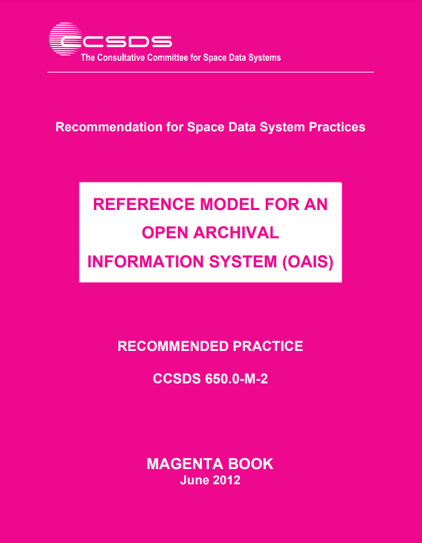
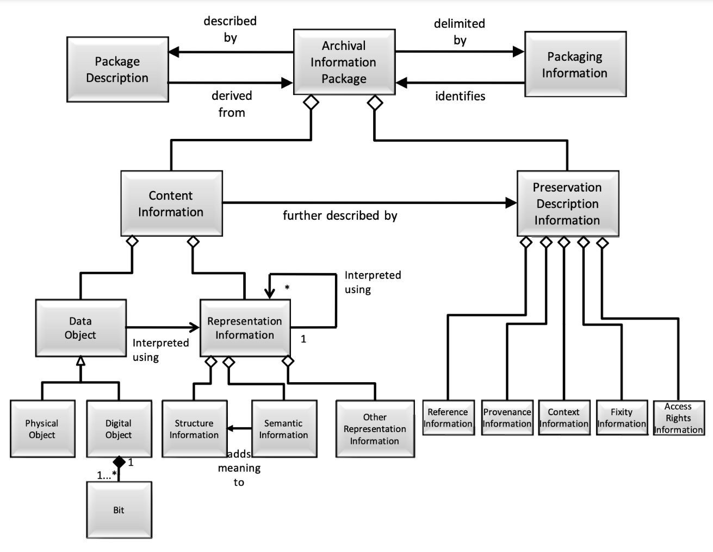

# Week 2
## Open Archival Information System (OAIS)

---

# Today
- **Settle in/Reminders/Announcements** (15 min)
- **Lightning Talks: Data Object** (20 min)
- **Lecture: Open Archival Information System (OAIS)** (1 hr)
- **Break** (10 min)
- **Start Weekly Activity**: Breaking BagIt (50 min)

---

# Announcements

* **Syllabus update:** Week 2's activity has been changed from Format Encounters RPG to Breaking BagIt. 

---

# Lightning Talks: Data Object

Spend ~2 minutes talking your your data object (<a href="https://airtable.com/appX8QYrNyTDJDGmg/shrcCl043DAEFMjQe/tblFNKDulPFQ629VV" target="_blank">Data Object Gallery</a>)

_In 40 years, do you think this object will still be more or less accessible and understandable in the same way it is today or when it was originally created and used? Why or why not?_

_What additional context or resources (e.g., documentation, software, emulators) would a future archivist, scholar, or casual user, need or require to make sense of your data object?_

---

# Lecture
## Open Archival Information System (OAIS)

---

---

## Text
# Reference Model for an Open Archival Information System (OAIS)

The **Reference Model for an Open Archival Information System** was developed for use in facilitating a broad, discipline-independent consensus on the requirements for an OAIS archive or repository to provide long-term preservation of digital information.

<!--presenter notes

The Reference Model for an Open Archival Information System (OAIS) document was developed for use in facilitating a broad, discipline-independent consensus on the requirements for an archive or repository to provide long-term preservation of digital information. It is sometimes referred to as the “Magenta Book” because of the color of its cover page.

-->

---

# OAIS Model Background
- ISO Standard: The OAIS Reference Model became an international standard in 2003 as **ISO 14721:2003**. It has since been updated, with the most recent version being **ISO 14721:2012**.
- The Consultative Committee for Space Data Systems (CCSDS), a multinational group of space agencies (including NASA and others), initiated the development of the OAIS model.
- Timeline: The development began in the late 1990s, with the first version of the OAIS Reference Model published in 1999.

---

<!--presenter notes

Diagram from: https://muse.jhu.edu/article/223247

This diagram provides a timeline for some of the earliest developed digital preservation standards. 

Notice that there are two "tracks": One for the OAIS, and another for TRAC for “Trustworthy Repositories Audit & Certification”. Though we will not be focusing specifically on TRAC today (I'll share why in a bit), you can see that TRAC and OAIS influenced one another over the course of time.

-->

---

# Why know about OAIS?

- **Widely accepted:** lots of policies, systems, practice, informed by it
- **Comprehensive:** covers ingest to end-user access
- **Flexible:** can be applied to a variety of environments and systems

<!--presenter notes

Source: These bullets are derived from a SERI Educational Webinar, which you can watch on YouTube: https://www.youtube.com/watch?v=MWITvx5yAEs.

“Over the past several years, the OAIS has become a widely accepted foundation for research and development on digital archives. The OAIS has become ‘the reference model of choice of those involved in the digital preservation world serving as a ‘galvanizing force’ and a ‘major factor in the advancement of digital archiving efforts.’ It has contributed ‘a common language and concepts for different professional groups involved in digital preservation and developing archiving systems’ and represents ‘common ground upon which to consolidate understanding of the needs and requirements of digital preservation.’ Many types of institutions – including archives – were involved in its development and have used it as a basis for their work.”

-->

---

# OAIS Reference Model Limitations
- **Non-specific**: Written at a high level of abstraction
- **Narrow scope**: Does not address core archival functions such as advocacy and outreach, deaccessioning, reference and user support services, or selection, appraisal, and disposition
- **Non-prescriptive**: Does not detail how to collaborate, coordinate or implement the model

<!--presenter notes

Source: Lee, Christopher A., and Tibbo, Helen. “Where’s the Archivist in Digital Curation? Exploring the Possibilities through a Matrix of Knowledge and Skills.” Archivaria: 72 (Fall 2011) pp. 123-168. http://www.ils.unc.edu/callee/p123-lee.pdf

The OAIS Reference Model employs a very general nomenclature made up of "terms that are not already overloaded with meaning so as to reduce conveying unintended meanings" (Consultative Committee for Space Data Systems 2002, pp. 1–7). This is useful because many of us rely on jargon unique to our own archival settings, which can make communication across archives difficult. You might have also noticed that the OAIS does not prescribe any specific system or technical setup and is written at a high level of abstraction.

The result of these generalistic terms, is that the various archival communities need to translate OAIS terminology to the relevant concepts that apply in their specific contexts. For some institutions this may be to their advantage. On the other hand, this may seem very out of reach to an archive just starting out, or lacks the resources required to establish such a multi-faceted system.

Additionally, the OAIS does not address core archival functions such as advocacy and outreach, deaccessioning, reference and user support services, or selection, appraisal and disposition. Implementation of an OAIS or OAIS-like system without integrating these other, and equally important archival functions risks the OAIS failing to garner buy-in and support from stakeholders.

The OAIS also does not address how to collaborate, coordinate or implement the model. Most archives do not exist in a vacuum. To establish this sort of system, they would likely need to coordinate with folks in IT, for example.

-->

---

## Definition
# Open Archival Information System (OAIS)

An **Open Archival Information System (OAIS)** is an Archive consisting of an organization, which may be part of a larger organization, of people and systems that has accepted the responsibility to preserve information and make it available for a **Designated Community**.

<!--presenter notes

An Open Archival Information System, or OAIS, is defined as an Archive, consisting of an organization, which may be part of a larger organization, of people that has accepted the responsibility to preserve information and make it available for a Designated Community. When we are referring to an OAIS, we are referring, basically, to an archive who has accepted this responsibility.

Now that we have a definition for OAIS, we will first define what the Reference Model for an OAIS is, and then unpack some of the terms used in the definition on the slide: information, and later, designated community.

-->

---

# OAIS Functional Model

---

## Definition
# Functional Model

A **functional model** is a diagram showing a systems functions, and describes the actions a system can do, and how those actions "flow" through the system.

---

<!--presenter notes

Diagram credit: By Mathieualexhache (original work); Mess (SVG conversion; English translation) - File:Schema fonctionnel modele oais.jpg, CC BY-SA 4.0, https://commons.wikimedia.org/w/index.php?curid=98896005

Here we have a diagram showing a visualization of the OAIS functional model, which describes how information enters into, is stored in, and flows out of an OAIS and the various functional entities that interact with the OAIS.

Take a moment to look at the “flow” of information in/outof an OAIS. The various OAIS functions - preservation planning, ingest, data management, archival storage, administration and access - are labeled in brown. Entities that interact with the OAIS - producers, consumers and management - are labeled in plain black text. Various information packages handled by the OAIS - SIPs, AIPs, and DIPs - are labeled in the white circles. The OAIS itself is delineated by the dotted rectangle.

Source: Figure 1 diagram from https://www.oclc.org/research/publications/2000/lavoie-oais.html

-->

---

<!--presenter notes

We are going to focus first on what are known as information packages. They are highlighted in yellow in the OAIS Functional Model Diagram and are known in short as SIPs, AIPs and DIPs. 

-->

---

## Definition
# Information Package (1/3)

The OAIS information model is built around the concept of an **information package**, which consists of 4 sub-information packages: Content Information, Preservation Description Information, Packaging Information, and Description Information.

<!--presenter notes

The OAIS information model is built around the concept of an information package, which consists of the object that is the focus of preservation, along with metadata necessary to support its long-term preservation, access, and understandability, bound into a single logical package (usually, a computer folder)

An information package is the data submitted, managed and distributed by an OAIS. There are three different types of information packages: Submission Information packages, or “SIPs”, Archival Information Packages, or “AIPs”, and Dissemination Information Packages, or “DIPs”. So SIPs, AIPs and DIPs. These are all highlighted in the slide in yellow.

In defining what each information package is, we will also learn more about the entities who interact with or receive data from an OAIS: Producers, Consumers, and Management. I’ve underlined these entities in yellow.

-->

---

  

    

      💾 Content Information
    

    

      🛡️ Preservation Description Information
    

    

      📦 Packaging Information
    

    

      🔍 Description Information
    

  

---

  

    

      💾 Content Information
    

    

      🛡️ Preservation Description Information
    

    

      📦 Packaging Information
    

    

      🔍 Description Information
    

  

---

## Definition
# Content Information

**Content information** refers to the primary data that an OAIS is preserving over the long-term. Content information consists of two main elements: the Content Data Object, and Representation Information.

---

## Definition
# Content Data Object

The **Content Data Object** refers to the bitstream: the 0s and 1s of the preservation target.

<!--presenter notes

Source: https://wiki.dpconline.org/index.php?title=4.2.1.3.1_Representation_Information_Types

At first glance, you might think that an OAIS would only be concerned with preserving bitstreams, the 1s and 0s that underlie things like word processing documents, videos, audio, and even software. But that is far from the case.

Bitstreams are not inherently understandable. Because of this, the OAIS considers both the bitstream and the information needed to decode and make sense of the bitstream equally as important as far as the things it is concerned with preserving go.

The OAIS calls the bitstream the "content data object".

The tools necessary to interpret, decode or render the content data object are known as its "representation information": additional information needed to decode the bitstream. The data object and representation information together comprise content information.

Content information is the primary thing that an OAIS is concerned with managing and preserving, and is sometimes also referred to as the preservation target.

Let’s talk more about representation information.
-->

---

## Definition
# Representation Information

The **Representation Information** is information necessary to render and understand the bit sequences constituting the Content Data Object.

Example: Description of the hardware and software needed

<!--presenter notes

Representation Information is the information that makes sense of the bitstream. This might include things like:
- The hardware or software required to display or use the Data Object
- Information, generally, for how to interpret the Content Data Object, such as knowing that any textual information might be encoded in ASCII, for example.
- Further, it may also be information to make sense of the information itself. For example, it may still not be enough to know that something may be decoded using ASCII, if it's just a bunch of decimal numbers. However, this might make more sense if you knew that this jumble of numbers actually "indicate[s] that the numbers correspond to average daily air temperature readings for London, measured in degrees Celsius, for the period 1972–2000.” - The Open Archival Information System (OAIS) Reference Model: Introductory Guide (2nd Edition)

-->

---

# There are two types of Representation Information:
## 1. Structure Information
## 2. Semantic Information

<!--presenter notes

There are two types of representation information: structure information and semantic information.

https://wiki.dpconline.org/index.php?title=4.2.1.3.1_Representation_Information_Types

-->

---

## Definition
# Structure Information

**Structure Information** is a type of representation information that a computer can use to understand the **format** of the content data object.

Example: A file extension (i.e. oral_history_file.**flac**, document1.**pdf**, 12340000.**docx**, img_00123.**jpeg**)

<!--presenter notes

Structure information deals with how to map the bitstream into higher-level data types and meaningful concepts. One example you have likely encountered working on a computer is file format extensions.

When you open up a folder of files, the files themselves have some sort of name, followed by a period, followed by a dot and then the name of a file type like my_image.JPEG or my_song.MP3 or my_writing.DOC. The dot, followed by a typically 3- or 4-character format code is a type of structure information that tells you or the computer how to decode the file. 

If you removed the file extension, your computer will throw some sort of error because it’s missing the structure information it expects to interpret and make sense of the file. Without it, the computer does not know how to interpret the Data Object

-->

---

## Definition
# File format

A **file format** refers to the way that information is encoded for storage in a computer file. You can think of a file format as a map key or primer that tells your computer how to read a bitstream.

_Note: We will dive deeper into file formats in later classes!_

---

## Definition
# Semantic Information

**Semantic Information** is a type of representation information that clarifies the intellectual meaning of the Content Data Object.

---

# Weather Data Set

* Look at: <a href="https://www.ncei.noaa.gov/pub/data/cdo/samples/PRECIP_HLY_sample_ascii.dat" target="_blank">Sample weather data set</a>
* Content Data Object: Always a bitstream (0s and 1s)
* Representation Information:
  * Structure Information: PRECIP_HLY_sample_ascii.**dat**
  * Semantic Information: Column headers (Latitude, Longitude, Station Name, etc.)

<!--presenter notes

Semantic information is any other additional information that clarifies, guides or interprets the data object. For example, a glossary, a data dictionary, or a software application’s user documentation. The ASCII dictionary we’ve been looking at is a good example of semantic information.

https://wiki.dpconline.org/index.php?title=4.2.1.3.1_Representation_Information_Types

-->

---

<table>
<tr>
<td valign=top>
<h1>Case Study</h1>
<h2>Dennis Parichy Lighting Designs</h2>

Right: Image of the lighting designer, Dennis Parichy, on set.

</td>
<td valign=top>

</td>
</tr>
</table>

<!--presenter notes

Photo credit:

Billy Rose Theatre Division, The New York Public Library. "Publicity photo of lighting designer Dennis Parichy (New York)" New York Public Library Digital Collections.
[https://digitalcollections.nypl.org/items/858d2d20-1fb7-0136-cbed-478a43ad47de](https://digitalcollections.nypl.org/items/858d2d20-1fb7-0136-cbed-478a43ad47de)

-->

---

Performance still of Don't Tell Me I Can't Fly.

<!--presenter notes

Photo credit:
Pollard, Collette. "Set Design for DON’T TELL ME I CAN’T FLY." 2011. Digital Image. Accessed January 26, 2024. https://collettepollard.com/production/dont-tell-me-i-cant-fly/

-->

---

## In 2013, the New York Public Library (NYPL) acquired the works of **Dennis Parichy**, a New York City-based lighting designer. Parichy designed stage lighting for 25 Broadway productions since 1976. He has been nominated three times for a Tony Award for his work.

---

<!--presenter notes

The Parichy acquisition contained both physical files as well as born-digital materials on floppy disks, because later on in his career, he used two software programs, Lightwright and VectorWorks (which are interoperable with one another), to program stage lighting cues. The slide shows a screenshot of the Lightwright interface. Here, you can see that the user could program a queue of stage lighting directions, and specify things like stage position, sequence, and give each lighting direction a name. We could, if we wanted to, watch a YouTube video of how to use this program. https://www.youtube.com/watch?v=LoBcIxjydKg

-->

---

  

  
  

Mini Activity - LightWright

Pretend you are bringing Parichy's LightWorks data into an OAIS. Can you guess what might be the:
- Content Data Information?
- Representation Information (Structure Information, Semantic Information)?
- **Bonus question:** How much representation information should we include?

---

## Definition
# Consumers

**Consumers** are the the users of an OAIS.

---

## Definition
# Designated Community

A **Designated Community** is a special type of consumer describing the primary users using/accessing the information preserved within an OAIS.

<!--presenter notes

Now that we have a grasp on what the OAIS’ definition of content information is and what that consists of, let’s look at what the OAIS means by a designated community.

Let’s revisit the definition of an OAIS, which is “an Archive consisting of an organization, which may be part of a larger organization, of people and systems that has accepted the responsibility to preserve information and make it available for a Designated Community.”

A Designated Community is a specified class of users expected to consume and understand the archived information in an OAIS.

-->

---

## The Theatre Division of the New York Public Library (which acquired the Dennis Parishy collection) may be __theater/performing arts researchers__.

## NASA’s Planetary Data Systems Archive’s designated community may be the __planetary science community__.

---

# Definition: Knowledge base

A **Knowledge Base** is a set of information, incorporated by a person or system, that allows that person or system to understand the information preserved in the OAIS.

The OAIS must understand the knowledge base of its designated community to understand the minimum representation information that must be maintained.

<!--presenter notes

Designated communities have what’s known as a specific knowledge base. A knowledge base is a set of information, incorporated by a person or system, that allows them to understand the received information. An OAIS should incorporate what it knows about a designated community’s knowledge base in order to understand the minimum representation information that must be maintained for whatever it is preserving to make sense both in the immediate and long-term.

-->
---

<table>
<tr>
<td valign=top>

  

  
  

Mini Activity 
Forme of Cury

<a href="https://luna.manchester.ac.uk/luna/servlet/detail/Man4MedievalVC~4~4~994591~289805:Drepe?sort=reference_number%2Cimage_sequence_number%2Cparent_work_title%2Cdate_created&qvq=q:forme%20of%20cury;sort:reference_number%2Cimage_sequence_number%2Cparent_work_title%2Cdate_created;lc:Man4MedievalVC~4~4&mi=37&trs=191" target="_blank">Digital Collections Link</a>

</td>
<td>

</td>
</tr>
</table>

---

<table>
  <tr>
    <td valign="top">
      
      <a href="https://luna.manchester.ac.uk/luna/servlet/detail/Man4MedievalVC~4~4~994591~289805:Drepe?sort=reference_number%2Cimage_sequence_number%2Cparent_work_title%2Cdate_created&qvq=q:forme%20of%20cury;sort:reference_number%2Cimage_sequence_number%2Cparent_work_title%2Cdate_created;lc:Man4MedievalVC~4~4&mi=37&trs=191" target="_blank">Digital Collections Link</a>
    </td>
    <td valign="top">
      <strong>Details</strong>  
      Filename: Forme of Cury-MS 7-18v.jpg  
      Late Middle Ages cookbook.  
      Hand-written in Middle English.
      </td>
      <td valign="top">
      <strong>Question</strong>  
      For the entire digitized manuscript, what might be the: 
      <ul>
        <li>Content Data Object?</li>
        <li>Representation information (Structure, Semantic?)</li>
        <li>Designated communities/Knowledge bases?</li>
      </ul>
    </td>
  </tr>
</table>

<!--presenter notes

Source: https://en.wikipedia.org/wiki/JPEG_File_Interchange_Format

Let’s put all of what we just learned together about content information, content data objects, representation information, knowledge bases and designated communities.

On the slide we have a screen capture of a scanned page of the Forme of Cury, a cookbook from the Late Middle Ages, dating to the late 14th century, written in Middle English.

Based on the definitions we just reviewed in the previous slides for Data Object and Representation Information, take a guess what might constitute, in an OAIS, its content information, the data object, the designated community and its knowledge base, and the representation information? Take a minute to think about it and write down your thoughts somewhere if you need to.

Suggested answers:
* Data Object: the bitstream of the scanned page.
* Structural information includes the image format type (JPEG).
* Other representation information may include some sort of text transcription derived from optical character recognition (OCR) technology that translates the cookbook into modern English.

-->

---

  

    

      💾 Content Information
    

    

      🛡️ Preservation Description Information
    

    

      📦 Packaging Information
    

    

      🔍 Description Information
    

  

---

# Definition: Preservation Description Information

**Preservation Description Information** is any information that can be used to appraise the package, especially in terms of:
1. Fixity Information
2. Provenance Information
3. Reference Information

<!--presenter notes

Provenance: describes the source of the preserved item as well as events that may have happened to it along the way.
Reference: refers to unique identifiers, like an ID assigned by an external database system.
Fixity: Refers to information that can be used to check the integrity of a preserved object’s bitstream over time. Fixity is an important digital preservation concept to know, so let’s dig a little deeper there.

-->

---

## Definition
# Fixity Information

**Fixity Information** describes the action of checking the integrity of Data Object Content (bitstream) at regular intervals.

<!--presenter notes

Fixity is the process of verifying that a data object’s bitstream has not been altered. Bitstreams are prone to error degradation or corruption. When bitstreams degrade, this is referred to sometimes as bitrot. Bitrot can happen for a variety of reasons. Remember, all bitstreams are ultimately written onto some sort of physical medium. For example, a hard drive writes bitstreams onto spinning metallic plates using magnetism. If anything were to happen to the plate, or the head that reads and writes data, such as physical damage like dropping the hard drive onto the floor, shifts in humidity or moisture, power surges, accidental exposure to high-powered magnetis or high temperatures, any of these events could result in bitstream corruption. It is important that digital preservation systems are set up to check fixity to ensure bitstream integrity over time.

-->

---

## Definition
# Checksum

A **checksum** is a unique alphanumeric group of characters generated by processing a bitstream through a specialized algorithm.

So long as the bitstream remains the same, the checksum should match each time it is generated.

<!--presenter notes

This can be done by running a checksum algorithm calculation over the bitstream, and generating what is known as a checksum. This process generates a unique string of characters that should match if this same algorithm is run over the same bitstream at another time.

If a checksum is run at one point does not match a checksum run against the same preservation object at another point, that indicates that the bitstream has been altered.

-->

---

  

  
  

Mini Activity - #hash

- Go to [https://emn178.github.io/online-tools/md5 checksum.html](https://emn178.github.io/online-tools/md5_checksum.html)
- Create a text file on your desktop and type some text into it.
- In the MD5 Checksum Tool, drag and drop the text file into the Drop File Here box. Make sure “Auto Update” is selected.
- Make a change to your text file and drag and drop again; click on different checksum types to see what happens.
</h2>

---

## Definition
# Provenance Information

**Provenance Information** documents the history of the Content Information, including its creation, any alterations to its content or format over time, its chain of custody, any actions taken to preserve
the Content Information (such as normalization or format migration), and the outcome of these actions.

<!--presenter notes 

Definition taken from https://www.dpconline.org/docs/technology-watch-reports/1359-dpctw14-02/file

-->

---

  

    

      💾 Content Information
    

    

      🛡️ Preservation Description Information
    

    

      📦 Packaging Information
    

    

      🔍 Description Information
    

  

---

  

    

      💾 Content Information
    

    

      🛡️ Preservation Description Information
    

    

      📦 Packaging Information
    

    

      🔍 Description Information
    

  

---

## Definition
# Descriptive Information

**Descriptive information** is a subset of data used for discovery and access.

<!--presenter notes

Descriptive Information: Metadata that allows the object to be located at a later time using search or retrieval functions.

-->

---

<!--presenter notes

So let’s bring it all together. We now know about the four different types of information inside of an OAIS information package: to summarize, that’s Content Information, Preservation Description Information (PDI), Descriptive Information and Packaging Information. This diagram summarizes how each of these information content types are structured in relation to one another.

Here, we see the Content Information – the bitstream, and representation information – and PDI – information about fixity, which we just covered, provenance, and any unique identifiers – bound together into a Packaging Information “basket”. This is analogous to the post office box that holds our gift and information about that gift together into one unit that moves through the post system. Packaging information “wraps around” content and preservation information, creating a sort of preservation intellectual unit.

Descriptive information rests outside of and points to the package: descriptive information is a subset of data used by end-users to discover and access an information packages. This is likely the information that you would see represented in an online catalog or finding aid.

-->

---

  

    

      💾 Content Information
    

    

      🛡️ Preservation Description Information
    

    

      📦 Packaging Information
    

    

      🔍 Description Information
    

  

<!--presenter notes

So now that we know about all 4 parts of an Information Package...

-->

---

  

    💾
  

  

    🛡️
  

  

    📦
  

  

    🔍
  

The Information Package takes on three distinct manifestations depending on how it interacts with the OAIS:

1. **Submission Information Package (SIP):** When it is first submitted.
2. **Archival Information Package (AIP):** When it is ingested and placed into long-term management.
3. **Dissemination Information Package (DIP):** When it is delivered to a user.

<!--presenter notes

...and shrink it down.

-->

---

<!-- Slide 2 -->
## Definition  
# Submission Information Package (SIP)

A **Submission Information Package (SIP)** is formed **outside of the OAIS**, and delivered by a producer for ingest.

  <!-- Miniature Package -->
  

    

      💾
    

    

      🛡️
    

    

      📦
    

    

      🔍
    

  

  

  ➡︎
  

  

    🚪
  

  
OAIS

  

<!--presenter notes

A Submission Information Package, or SIP, is the initial information package submitted by a producer to an OAIS.

SIPs are implicated in two processes commonly called “ingest” and “pre-ingest”.

Source for producer definition: Lee, Christopher A., and Tibbo, Helen. “Where’s the Archivist in Digital Curation? Exploring the Possibilities through a Matrix of Knowledge and Skills.” Archivaria: 72 (Fall 2011) pp. 123-168. http://www.ils.unc.edu/callee/p123-lee.pdf

-->

---

## Definition
# Producer

A **producer** is a person or system that prepares the submitted SIP. An example of a producer might be a digital preservation technician, archivist, or someone else.

---

## Definition
# Ingest

**Ingest** is the set of processes responsible for accepting a SIP and prepping it to live in the OAIS. Actions include validation, transformation, metadata extraction, and transfer to storage.

<!--presenter notes

Source: https://www.dpconline.org/docs/technology-watch-reports/1359-dpctw14-02/file (text)https://wiki.dpconline.org/index.php?title=4.1.1.2_Ingest (diagram)

Ingest is the set of processes responsible for accepting information submitted by Producers and preparing it for inclusion in the archival store. Specific functions performed by Ingest includes receipt of information transferred to the OAIS by a Producer; validation that the information received is uncorrupted and complete; transformation of the submitted information into a form suitable for storage and management within the archival system; extraction and/or creation of descriptive metadata to support the OAIS’s search and retrieval tools and finding aids; and transfer of the submitted information and its associated metadata to the archival store.

In short, the Ingest function serves as the OAIS’s external interface with Producers, managing the entire process of accepting custody of submitted information and preparing it for long-term storage. 

-->

---

## Definition
# Archival Information Package (AIP)

An **Archival Information Package (AIP)** describes the primary content and metadata managed by the OAIS.

<!--presenter notes
Source: https://www2.archivists.org/groups/standards-committee/open-archival-information-system-oais#:~:text=An%20Archival%20Information%20Package%20(AIP,repository%20to%20perform%20preservation%20services)

So now, we are at the point where the OAIS has created an Archival Information Package or AIP through the submission and ingest processes. An AIP is the primary set of content and metadata managed by the OAIS, and organized in a way that allows the OAIS to perform preservation activities, like fixity.

-->

---

# Note: SIPs and AIPs

SIPs and AIPs do not necessarily have a 1-to-1 relationship.

A SIP may be, through the process of ingest, transformed into one or multiple AIPs. This largely depends on the rules of your OAIS setup.

<!--presenter notes

Note that a SIP and an AIP do not always have a one-to-one relationship, meaning, you can submit a SIP to an OAIS, which may result in one or multiple AIPs created. For example, let’s say someone submitted a SIP containing video files of performances that occurred through the course of a season or a year, the OAIS may then turn each one of those performances into their own AIP. This behaviour will vary depending on the rules set up by the organization who manages the OAIS.

Management is the entity that sets the policy objectives of the OAIS. This may include determining the rules of how the OAIS operates, such as, this OAIS takes this sort of information but not this other sort of information, this OAIS turns SIPs into multiple AIPs or not, and identifying funding sources to maintain the OAIS as a whole. Note, management does not refer to the traditional organizational sense of management (https://www.oclc.org/research/publications/2000/lavoie-oais.html).

-->

---

## Definition
# Dissemination Information Package (DIP)

The **Dissemination Information Package (DIP)** is derived from one or more AIPs, and is received by the Consumer (i.e. end-user) in response to a request (e.g. searching an online catalog or finding aid).

<!--presenter notes

Source for DIP definition: Lee, Christopher A., and Tibbo, Helen. “Where’s the Archivist in Digital Curation? Exploring the Possibilities through a Matrix of Knowledge and Skills.” Archivaria: 72 (Fall 2011) pp. 123-168. http://www.ils.unc.edu/callee/p123-lee.pdf

A Dissemination Information Package or DIP is the information package that is delivered from within an OAIS to the consumer making the request.

A Consumer is an entity, taking on the form of a person or client system (or both) that interacts with OAIS service to find preserved information of interest and to access that information in detail.

An example of a Consumer is a researcher using an online finding aid that has been set up to point to one or multiple AIP package descriptions. When they click on a finding aid component to request to read, watch, listen to, or otherwise experience or interact with a preservation object, the finding aid will be set up to query the OAIS. The OAIS, in turn, will retrieve and deliver a DIP. The DIP will contain a derivative of the AIP. By keeping the AIP and the DIP separate, we do not risk disturbing the Content Information in archival storage.

-->

---

<!--presenter notes

An AIP consists of several components, most which we have covered up through now. This diagram shows how all of these various components fit together.

Notice how there are two main branches that stem off the AIP (top middle).

On the left hand side, we have the Content Information branch, which consists of the Data Object (the bitstream) and Representation Information (things required to interpret the bitstream). This is the thing being preserved.

On the right hand side, we have the Preservation Description Information or PDI branch, which consists of fixity details, unique identifiers, provenance and rights information: any details that describe preservation information and actions taken which further describe the Content Information.

Also notice on either side of the AIP, we have Package Description on the left hand side of the AIP, and Packaging Information on the right. Packaging information can be thought of as a sort of wrapper around the entire AIP, with information about how each of all of the components listed below are packaged together.

On the left-hand side of the AIP in the diagram we have Package Description, which is further described by another diagram.

The Package Description “enables the Consumer to locate information of potential interest, analyze that information, and order desired information. The information needed for one Access Aid is called an Associated Description. A single Package Description may contain several Associated Descriptions depending on the number of different Access Aids that can locate, visualize, retrieve or order the associated Content Information and PDI.” Basically, this is the information that is relayed to discovery platforms such as an online finding aid.

This is a good segue into the final of the third information package managed by the OAIS, the DIP.

-->

---

# Document
## Audit and Certification of Trustworthy Digital Repositories: Criteria and Checklist - ISO 16363

The **Audit and Certification of Trustworthy Repositories: Criteria and Checklist (TRAC)** is a document describing the characteristics and metrics of an OAIS-compliant digital repository.

<!--presenter notes

Source: https://en.wikipedia.org/wiki/Trustworthy_Repositories_Audit_%26_Certification

Trustworthy Repositories Audit & Certification (TRAC) is a document describing the metrics of an OAIS-compliant digital repository that developed from work done by the OCLC and National Archives and Records Administration (NARA) task force initiative.
TRAC is basically a framework for auditing a repository. The document itself is basically a checklist that can be used to assess the reliability, commitment and readiness of institutions to assume long-term preservation responsibilities. Though heavily influenced by the OAIS Model, which focuses heavily on the functions and processes required to build and manage a digital repository, TRAC provides more of an “administrative context for building and managing a digital repository” … “[which] creates a more comprehensive model for digital preservation planning and development that sets each digital archive within its full organizational context, and also allows the organization to consider organizational, legal, economic, technical, and implementation issues individually or in relevant combinations.” (https://quod.lib.umich.edu/s/spobooks/bbv9812.0001.001/1:11?rgn=div1;view=fulltext)

# Text: Requirements for Bodies Providing Audit Certification of Candidate Trustworthy Digital Repositories
—

__The Requirements for Bodies Providing Audit Certification of Candidate Trustworthy Digital Repositories document defines “the operations of the organization(s) which assess the trustworthiness of digital repositories using ISO 16363… and provide the appropriate certification.”__

-->

---

# Break

---

# Weekly Activity: Breaking BagIt
<a href="https://digital-archives.github.io/HISTGA1011/activities/fixity_bagger.html" target="_blank">https://digital-archives.github.io/HISTGA1011/activities/fixity_bagger.html</a>

---

## Definition
# BagIt

**BagIt** is a set of hierarchical file layout conventions designed to support storage and transfer of arbitrary digital content. The standard was jointly developed by the Library of Congress and California Digital Library.

<!--presenter notes

A comprehensive write-up of the BagIt standard can be read here: https://datatracker.ietf.org/doc/html/rfc8493

-->

---

## Definition
# Bag

A **bag** is a folder or directory structured after the BagIt standard, containing the payload files and other accompanying metadata files known as "tag" files containing metadata files intended to facilitate and document the storage and transfer of the bag.

---

# What a bag looks like:

- Top-level folder
  - `bagit.txt`
  - `bag-info.txt`
  - `manifest-md5.txt`
  - `tagmanifest-md5.txt`
  - `data`
    - `file1.txt`
    - `file2.jpg`

<!--presenter notes

The OAIS describes information packages in a conceptual manner, but does not go into specifics about what a bag might look like in front of you. This is where the Library of Congress BagIt specification comes in. This specification was developed to provide a framework for how these packages, which are, generally speaking, folders on your computer, which contain other folders and files that both hold the actual contents of what you are preserving - an image, a document, a series of documents, a video, an audio file, etc. - as well as meta information that describes the contents of the folder itself.

-->

---

# Why BagIt?

"[BagIt] outlines file naming structures that are optimized to work as data moves across operating systems and file systems; it provides a manifest of all the files included in a delivery and provides a correct checksum value for each; it allows the senders and recipients to include additional provenance information so that anyone viewing the package can identify immediately what the package contains and who the contacts for it are."

Meghan Ferriter

<a href="https://blogs.loc.gov/thesignal/2019/04/bagit-at-the-library-of-congress/" target="_blank">BagIt at the Library of Congress</a>
, Signal Blog, 2019

---

_Final questions or reflections?_

mary.kidd@nyu.edu