# Week 3 
## Processing Born-Digital Archives

---

# Today
- Reminders/announcements
- Discuss last week's activity
- Lecture: Processing Born-Digital Archives
- Break
- Start Weekly Activity

---

# Announcements

_Feel free to email me with any announcements you would like me to boost (upcoming conferences, webinars, trainings, or other events/topics of interest)._

---

## Processing Born-Digital Archives
# Accessioning & Appraisal

---

# Lots of terms/definitions coming up!

---

## Definition
# Born-digital

__Born-digital__ refers to items or materials whose contents were captured using binary encoding. Born-digital items are distinct from contents created using analog recording tools and subsequently digitized.

<!--presenter notes
https://primarysources.yale.edu/what-does-born-digital-mean
-->

---

## Definition
# Digital storage device or media

__Digital storage device__ (sometimes just referred to as "media") is physical device used to store, read, or write digital data. 

Examples: hard drive, compact disc, floppy disks, computer, smartphone

---

# The type and age of media containing born-digital contents will determine next steps.

---

<!--presenter notes

Some examples of digital storage devices include floppy disks, compact discs or CDs, and hard drives. All are used to store, read and write digital data, to varying degrees.

Digital storage devices are commonly associated with legacy born-digital collections, and look similar to the image on the slide. However, digital carriers are not exclusive to things that are “old”. Smartphones, at least at the moment, are a ubiquitous digital carrier that have and will likely continue to make their way into archival processing queues, and should be considered a digital storage device on its own.

-->

---

## Workflow
# Acquisition to Processing Workflow

- Decide to acquire something  
- Initial appraisal  
- Transfer/ship to repository  
- Accession/inventory  
- Transfer content off of media  
- Reassociate resulting files in finding aid  

---

## Definition
# Floppy Disk  💾
A __floppy disk__ is a thin, flexible magnetic storage medium encased in a square or rectangular plastic shell, used in the past to store digital information.

---

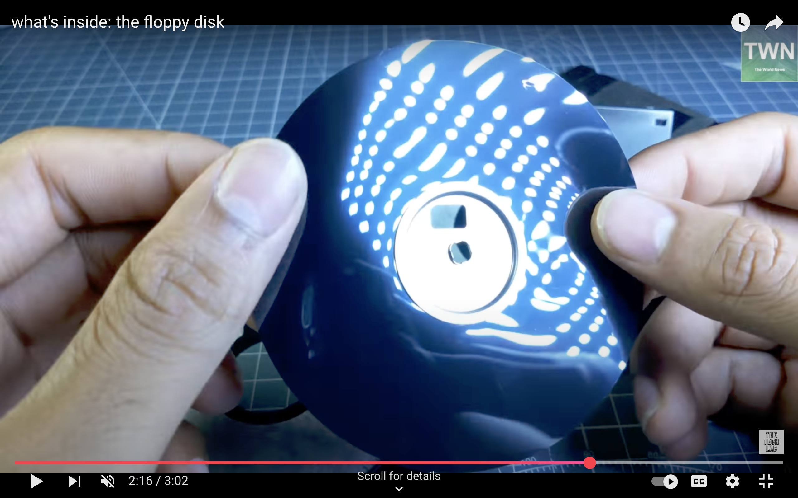 <!-- fit -->

<!--presenter notes

Screen capture from this YouTube video:
https://www.youtube.com/watch?v=1-oH2T3W-q4

-->

---

## Floppy disks use magnetism to encode binary data.
* A flexible piece of plastic is coated in a magnetic substrate made up of microscopic particles.
* The computer hard disk:
  * __Writes__ data by applying an electromagnetic field to particles. "Up" = 1 and "Down" = 0
  * __Reads__ data using a sensitive electromagnetic head that detects particle arrangements and translates into binary information.

---

## Definition
# Disk sector

A __disk sector__ is a fundamental unit of storage on a disk, whether it's a hard disk drive (HDD), solid-state drive (SSD), or other types of storage media like floppy disks. It represents the smallest addressable unit of data on the disk.

---

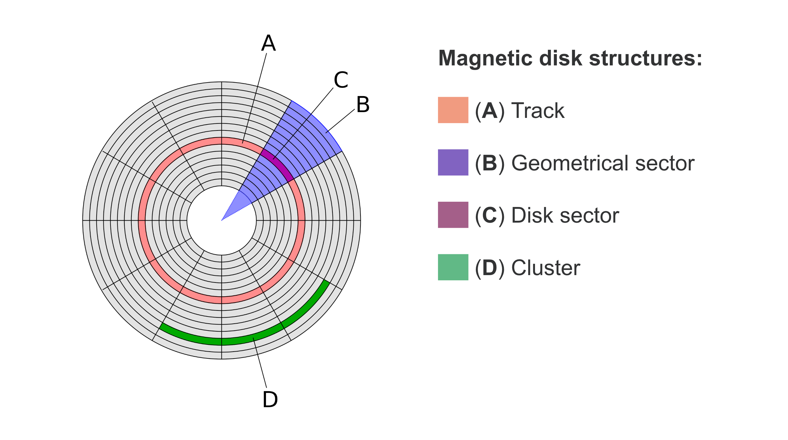

<!--presenter notes

Diagram from Wikipedia article on disk sectors: https://en.wikipedia.org/wiki/Disk_sector

This diagram illustrates how data is written to the surface of a magnetic storage disk, which can be thought of as a circular map with data stored in specific, measurable locations. Each disk is divided into sectors that correspond to precise points on the disk's surface and are defined by their size in bytes, making sectors the smallest unit of storage.  

When a file is saved to a hard drive, the file system assigns it to a series of contiguous sectors whenever possible. This grouping of sectors is known as a cluster, and would appear like tracks.

-->

---

## Definition
# Disk imaging

__Disk imaging__ describes the steps to create a bit-identical copy of the source media, resulting in a disk image. The imaging process copies data sector-by-sector from the disk.

<!--presenter notes

Disk imaging describes the process of creating a bit-identical copy of the source media. The imaging process copies data sector-by-sector from the raw device.

What is the purpose of creating disk images? A clear explanation is given in the Canadian Center for Architecture (CCA)’s digital archives workflows Github repo. Here, they say, “[D]isk images can be stored redundantly, backed up, and audited in ways that physical carriers like DVDs or external hard drives cannot…they are a much better suited for preservation of digital information over time, while retaining all characteristics of the original physical media as a storage volume.” (https://github.com/CCA-Public/digital-archives-manual/blob/master/guides/diskimaging.md)

The benefits of disk imaging are further described by an article written by Dorothy Waugh about Emory University’s digital forensics processes. Here, she says, “From a preservation perspective, this makes forensic imaging ideal; an exact copy of the original data can be ingested into a secure and long-term storage environment. Derivative copies can later be used for continued appraisal and processing.”

In short, disk imaging liberates bitstreams from digital storage media, which can otherwise be subject to all the inherent risks associated with born-digital items. Disk images can be migrated into modern computing environments where they can be analyzed. The analysis may be for appraisal purposes, or throughout the course of archival processing in arranging and describing the contents.

-->

---

## Mini Activity: Look at a disk image
### Steps
1. In a web browser search for "Apple II games Internet Archive."
2. Browse video game archives and select a game of interest.
3. On the game's page, look for the "Download Options" section; Click "Show All".
4. Find 2mg disk image file listed.

<!--presenter notes

https://archive.org/details/a2gs_Volcanoes_Deluxe_1988_Earthwave_Services

What does a disk image look like, and how can we look into it or interact with it once it is made?

One way to easily look at and experience a disk image is by perusing the Internet Archive. There are a number of vintage video game collections. Take a moment to look up a game on the Internet Archive by searching for “apple ii games internet archive” in a web browser. Click on any game that comes up that is interesting to you.

When you click on a video game, notice how the main screen will briefly show you a blue screen that says something along the lines of “Apple II” and some copyright information. When you see this, what you are seeing is the Internet Archive booting up a disk image of the Apple II operating system. This is necessary because these video games have a dependency on the Apple II operating system to be played. So right off the bat, you are interacting with a disk image, first of an operating system, and then immediately afterwards, the disk image of the videogame.

You can see the image file listed by clicking “Show all files” on the right/bottom-hand side of the game screen. In the list, locate the *.2mg file. This is the disk image. Really, it looks like any other file, with a name, a period, and a file extension, which you can even download to your computer, if you wish. This enables you and I to play these games without subjecting the original disks to wear and tear. And because it is an exact copy of the original, we can experience it in a similar way to an original game player.

-->

---

# Case Study: Alice Walker Papers (Emory University)
__Inventory:__
* 37 3.5" floppy disks
* 2 optical media
* 1 Mac laptop

__Issue:__ At first, archivists could only successfully image a few of the 37 disks. Other disks appeared totally un-imageable.

<!--presenter notes

We have talked about how disk imaging, data writing, file systems and operating systems work. I wanted to pull all of these concepts together into a digital archiving-centered case study. In 2007, Emory University acquired the papers of Alice Walker. Walker is an acclaimed novelist, essayist, poet and short story writer, who in 1983, became the first African American woman to win the Pulitzer Prize for Fiction for her novel The Color Purple. Her papers including drafts of all of her manuscripts, photographs, journals and memorabilia from her life, some which were in born-digital formats, with a total of 37 3.5” floppy disks, 2 optical media CDs, and 1 Mac laptop.

Finding aid for Alice Walker Papers: https://findingaids.library.emory.edu/documents/walker1061/series13/

Case study is written in depth at: https://practicaltechnologyforarchives.org/issue2_waugh/

-->

---

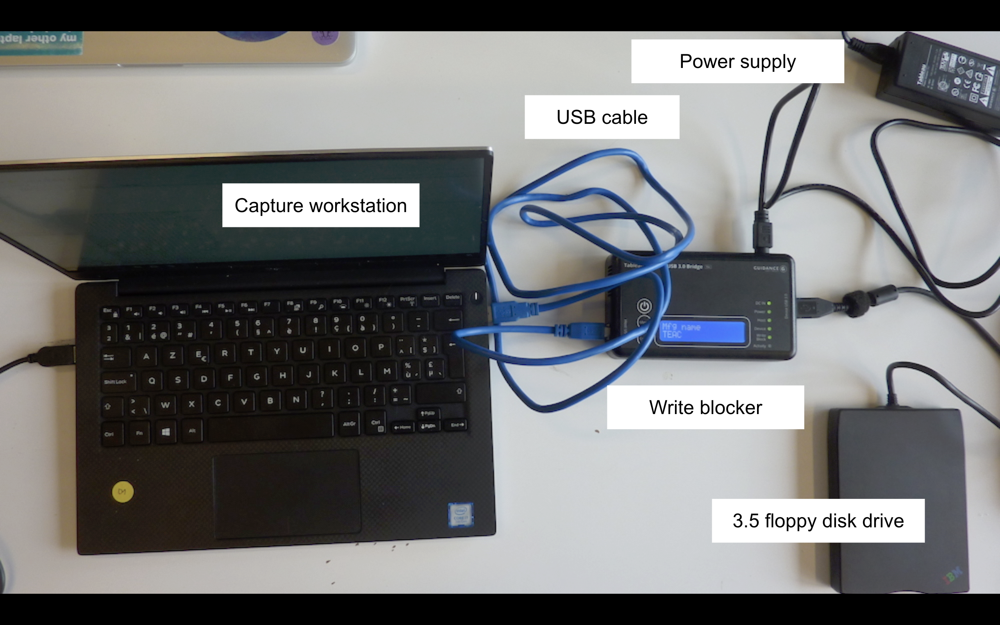

<!--presenter notes

Archivists first attempted to image disks using an external 3.5” floppy disk drive connected to a Windows workstation via the Tableau Ultrablock USB write blocker. The setup probably looked something like this, but note this is just a stock/sample image I found on the web to show you what this setup may have looked like, not an actual image of the Emory setup.

Here, we have a dedicated workstation, sometimes known as the capture workstation. This is connected to a device known as a write blocker, which is an intermediary between the capture workstation and a 3.5 floppy disk drive. All have power supplies.

-->

---

# The capture workstation will have some sort of tool that can interface with the drive making the image

---

## Tool
# Forensic Toolkit (FTK)

<!--presenter note

On the capture workstation at Emory, archivists working with the Alice Walker floppies first used a digital forensics tool known as FTK. FTK stands for Forensic Toolkit, and the software was created by a company called AccessData.

-->

---

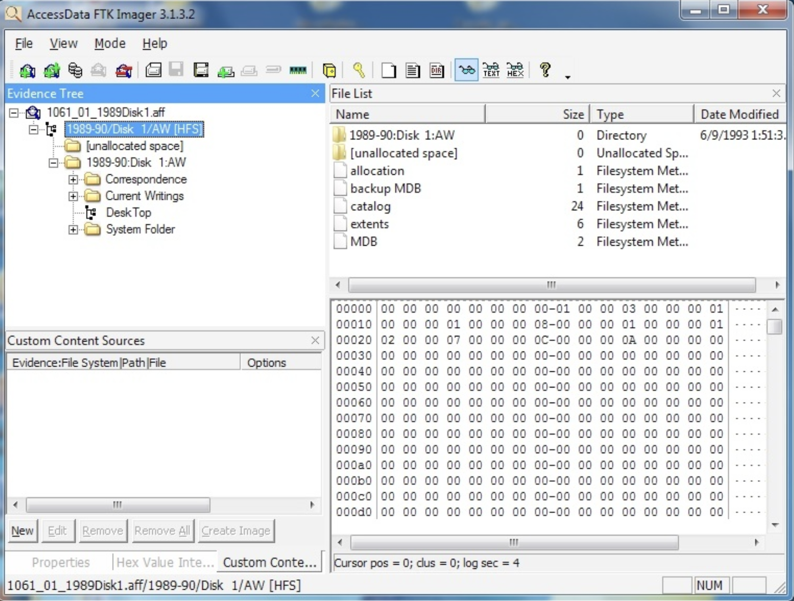

<!--presenter notes

This is a screen capture of the FTK Imager graphical user interface (GUI). On the left-hand side of the screen is a folder directory or "tree" showing one of the disk images (ending in the file format extension aff, which stands for "advanced file format", an dopen-source forensic disk image file format.) On the lower right-hand side of the screen is a hex editor, which lists the hexadecimal representations of the binary code stored on the image, as well as their sector location listed in the left-hand column.

Along with creating a disk image, FTK Imager also “...calculates MD5 and SHA-1 checksums in order to verify that the capture was successful … a text file including some technical metadata and fixity information, and a CSV file listing the file names and paths of data contained on the imaged media.”

“Unfortunately, FTK Imager was only able to capture images of a handful of the floppy diskss. When unsuccessful, the software frequently failed to recognize the external floppy disk drive or became unresponsive. Neither was this problem necessarily remedied by removing the problem disk and replacing it with another; on several occasions, an unreadable disk seemed to corrupt the entire imaging process, requiring that the drive be switched off and disconnected from the computer workstation, and the software restarted. Only then would another otherwise readable disk be recognized. As might be expected, this slowed the imaging process substantially.

Further attempts were made using another imaging tool, Acronis Backup & Recovery. As the name suggests, this is a proprietary product designed to help small businesses backup their data through the capture of forensic images. However, imaging attempts using this tool and the same configuration of hardware as had been used with FTK Imager were no more successful.”

-->

---

# Tool
## Write blocker

A piece of hardware or even physical component on a device that prevents a system from overwriting data held in a target born-digital item.

<!--presenter notes

A write blocker is piece of hardware or even physical component on a storage device that prevents a system from overwriting data held in a target born-digital item. It is a physical gate that puts you into read-only mode.

-->

---

<table>
  <tr>
    <td style="vertical-align: top; width: 60%;">
      <h1>Question</h1>
      Can you guess what might happen if you don't use a write blocker when imaging a disk?
    </td>
    <td style="vertical-align: top; width: 40%;">
      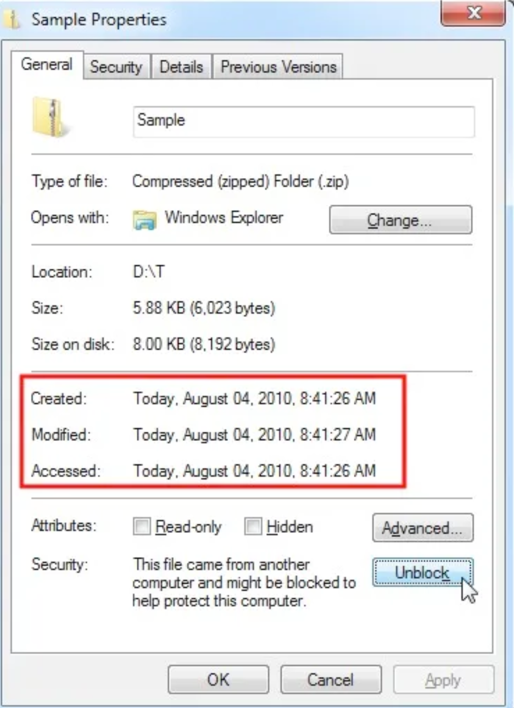
    </td>
  </tr>
</table>

<!--presenter notes

What happens when you don’t toggle a write blocker? A good example of this are the created, modified and accessed metadata properties of a file. Each of these three data points holds important details about provenance. File systems, by design, automatically update this data without asking you whether or not you would like to commit the change. As a result, if you were to image a disk without the write blocker turned on, you would see the Created, Modified and Accessed data change to today’s date, rather than the date the original file was accessed by its creator.

-->

---

Emory knew Walker was a Mac user. This meant her floppy disks were __formatted__ in a specific way (i.e. only a Mac could "read" the floppies). They attempted to image the remaining disks on a modern Mac workstation using the Disk Utility tool.

---

## Definition
# File System (1/2)

__File systems__ are the methods and rules that a computing system uses to manage, name, store, and retrieve stored data. All computing and storage devices, whether that is a laptop, a smartphone, a flash drive, have a file system in place.

<!--presenter notes

The term “file system” takes its name directly from paper-based management systems, and is the reason why we call computer files “files”.

File systems enable us, the users of computing and storage devices, to store, manage, organize and access files. If you’ve ever renamed, deleted, moved, or copied a file, you have directly interacted with the file system. 

Without a file system, a computer would not know how and where to look for data when you, or a piece of software, or anything else wishes to interact with files wants to do something with them. Remember, at its core, a storage device contains a long, seemingly endless string of 1s and 0s. A file system organizes these 1s and 0s in a way so that each sector is given a name and location. In this way, data can be easily called up.

The filesystem also serves another purpose: it “hides” complicated information from the user about “where and how it stores information.” For most purposes, the filesystem is a very valuable abstraction mechanism, because it does not require users to understand or directly access the underlying data.

-->

---

## Definition
# File System (2/2)

File systems contain an essential layer of technical, administrative, structural and provenance metadata:
1. File names (thumbnail.gif, preservation_edit.tif)
2. Format identifiers (.pdf, .tif, etc)
3. File size
4. Location addresses/pointers of sectors and clusters
5. Timestamps: created, last modified, last accessed

---

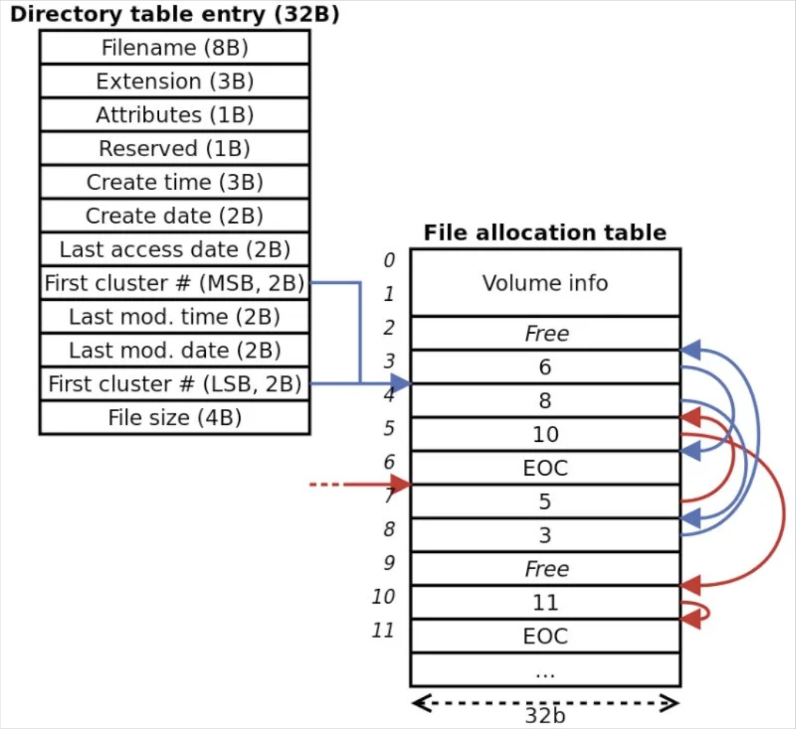

---

## Definition
# Operating System (OS)

An __operating system__ is a software program that manages the hardware and software resources of a computer system. It serves as a bridge between the user and the hardware, providing an interface for users to interact with the computer and controlling the allocation of system resources such as CPU, memory, and storage devices.

<!--presenter notes

An operating system is a software program that manages the hardware and software resources of a computer system. It serves as a bridge between the user and the hardware, providing an interface for users to interact with the computer, which includes interacting with the file system. OSs are the primary way that we interact with file systems. Computers and even smartphones all use operating systems.

-->

---

| Name                     | Operating System                                               |
|--------------------------|---------------------------------------------------------------|
| FAT12, FAT16             | MS-DOS, floppy disks                                          |
| FAT32 (VFAT)             | Windows 95, 98                                               |
| exFAT                   | Windows XP SP2 and later (primary use: USB drives, SD cards)  |
| NTFS                     | Windows NT, 2000, XP, Server 2003/2008, Vista, 7, 8/8.1, 10  |
| ReFS (Resilient File System) | Windows 10 Pro (Workstation/Enterprise, default starting 2018) |
| MFS                      | Macintosh System 1-3                                         |
| HFS (Hierarchical File System) | Macintosh System 4-8                                    |
| HFS+                     | Macintosh System 8.1-9, OS X 10.0 - 10.11                     |
| APFS (Apple File System) | MacOS 10.12                                                  |
| Ext2, ext3, ext4 (Extended File System) | Linux                                          |
| ZFS                      | Sun Microsystems (later Oracle as Open ZFS)                  |
| XFS                      | Linux, typically Enterprise variants (RHEL)                  |

<!--presenter notes

File systems are not universal, meaning there is no one file system that is used by all computing systems and storage devices. Different file systems are specific to certain operating systems, and within those, certain versions. This is a list of just some file systems out there. Notice how Windows started with FAT12 and FAT16, and now primarily uses NTFS.

What this means is that there are potential compatibility issues posed by this wide range of different file systems which may make it difficult to transfer data between different operating systems. For example, if an archivist is trying to access a video game from a series of floppies that were formatted to store data using the FAT12 file system, and you are using a modern Macintosh computer connected to the floppy drive via a USB cable, you may get an error message, or it may not even be able to show you a list of files. This is not always the case. However, knowing that there are different file systems that are not always compatible with one another can be helpful if and when you have to troubleshoot issues during disk imaging or other data transfers between systems.

-->

---

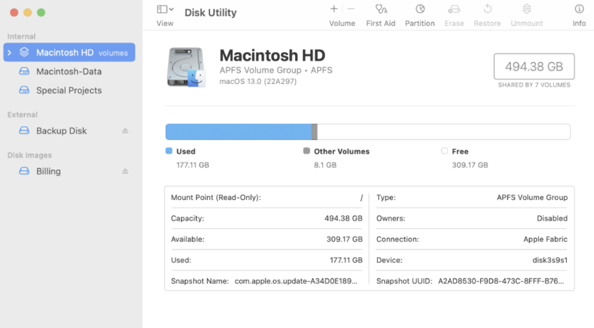

<!--presenter notes

After the imaging attempt with FTK was not totally successful, Emory archivists decided to use a modern Mac machine and the Disk Utility tool.

Again, an external 3.5” floppy disk drive was connected to the Mac with a Tableau Ultrablock USB write blocker. Like FTK Imager, Apple’s Disk Utility can be used to capture bitstream images of digital media. Unlike FTK Imager, however, it generates no metadata during that process and also only outputs DMG (stands for “disk image”) image files, which is an Apple proprietary disk image format. This approach to imaging the thirty-seven floppy disks was only marginally more successful than earlier attempts using FTK Imager on a Windows workstation. Having worked through the entire set of disks using Disk Utility, only two additional images were captured.

-->

---

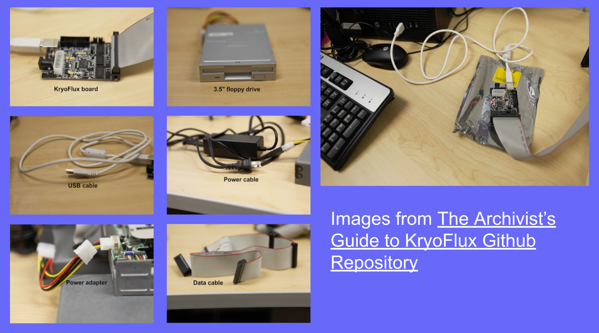

<!--presenter notes

Emory took one more step. After consulting with archivists on listservs, they decided to purchase a KryoFlux device.

On the slide is what a KryoFlux controller card and all of its various components looks like “out of the box”. These images were taken from a Github repo called “The Archivist’s Guide to KryoFlux”, which was a collaborative document written by several digital archivists from different repositories.

You have several components. Starting from the top left going from left to right, is the KryoFlux board, which looks like an exposed computer chip.

The KryoFlux board is connected to the floppy drive using a data cable. The data cable size will depend on the type of drive you are transferring from. The image on the slide shows a 3.5” floppy drive, but a KryoFlux board can be connected a multitude of floppy drives.

Once your floppy drive is connected to the KryoFlux board, you will next connect the board to your computer using a USB cable. Once your drive and board are connected to your computer, you launch the tool via the command line. Once this is done, you connect your floppy drive to an power source using a power adapter. Again, depending on the drive you are using for imaging, you will use a different power adapter.

This ultimately enabled Emory to capture all of Walkers disks. Why did the KryoFlux work so much better? KryoFlux is known to be able to capture disk images of a variety of formats.

Along with the KryoFlux card, you will need to install the Disk Tool Controller (DTC) software. DTC is used to control the board and interact with floppy disk drives and provides a user-friendly interface for controlling the board and performing various disk-related tasks. This software is available for various operating systems, including Windows, Linux, and macOS.

-->

---

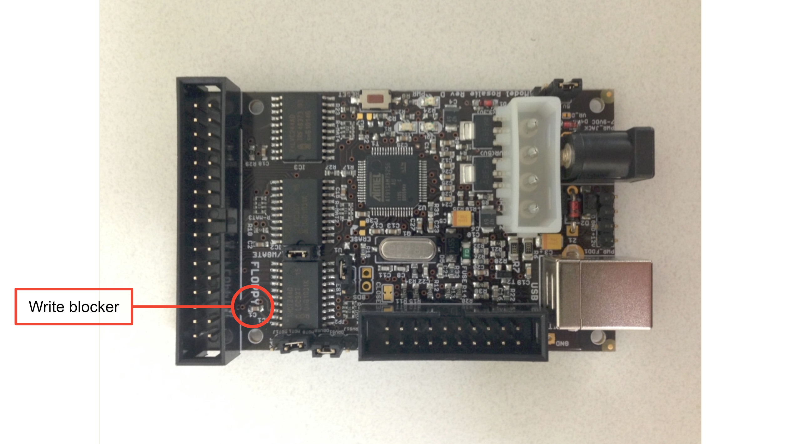

<!--presenter notes

Here is a photo of the KryoFlux board, which comes with a built-in write-blocker, circled in red. To enable write-blocking functionality, you would actually physically remove the jumper for the write gate.

-->

---

# Alice Walker Imaging Takeaways
1. **Appraisal**: Knowing the type of operating/file system used by the creator can help with troubleshooting.

3. **Potential imaging challenges**:
   - Damaged hardware/incompatible or outdated software
   - Unavailability of necessary hardware, software, or peripherals
   - Proprietary disk image formats
   - Insufficient or missing metadata

4. **Be prepared to try (and try) again**

---

# __Question__: Why is appraisal and accessioning important in terms of born-digital materials?

---

**Downstream effects**  
Uninformed appraisal decisions can create unintended negative outcomes later in the stewardship lifecycle.

**Scale**  
The scale we are dealing with (thousands of files on a harddrive, an entire laptop) complicates deciding what/not to keep.

**Format diversity**  
Unexpected media and file formats can challenge a repository's technical capacity.

---

## Definition
# Archival Appraisal

__Appraisal__ is the process of determining whether records and other materials have permanent (archival) value. Appraisal may be done at the collection, creator, series, file, or item level. Appraisal can take place prior to donation and prior to physical transfer, at or after accessioning.

<!--presenter notes

Definition source:
https://dictionary.archivists.org/entry/appraisal.html

The basis of appraisal decisions may include a number of factors, including the records’ provenance and content, their authenticity and reliability, their order and completeness, their condition and costs to preserve them, and their intrinsic value. Appraisal often takes place within a larger institutional collecting policy and mission statement.

-->

---

# Appraisal Considerations - Born-Digital Style
__Question 1:__ Do we have the tools to extract the record off the media?
__Question 2:__ Can we preserve/maintain the record over time?
__Question 3:__ Can we provide access to the record?
__Question 4:__ Do these records speak to our collection development policy, or its overall goals?
__Question 5:__ Do we have access to the creator/organization, who can provide us context as far as who and how records are being created?

---

## Definition
# Accessioning - 1/2

"Accessioning is ... the suite of activities through which archivists appraise, transfer, stabilize, and document archival acquisitions. Accessioning provides pathways to access, informs future decisions, and promotes sustained resource commitment for the care of archival materials."

_Archival Accessioning Best Practices (2024)_

---

## Definition
# Accessioning - 2/2

"Accessioning is the process of transferring and documenting the transfer of collections material into the Libraries' care. For __born-digital materials__, that means safely copying them into the Libraries' temporary storage system and documentating the process. Digital files should be accessioned within four months of receipt."

<!--presenter notes

This definition comes from University of Georgia Libraries Github documentation on born-digital accessioning. See: https://github.com/uga-libraries/born-digital-accessioning?tab=readme-ov-file

-->

---

# How are born-digital materials transferred to a repository?

* Physical shipment
* Donor deposits materials into an institutional repository
* Donor securely uploads materials to a shared drive/networked folder
* Archivist does transfer themselves (imaging)

---

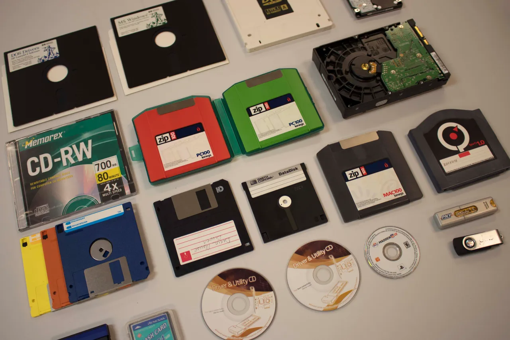

<!--presenter notes

Image credit:
"Assortment of obsolete and current media that the AHC’s Born Digital unit handles on a daily basis." Digital Preservation 101: Demystifying the Digital, American Heritage Center, 20 July 2020, https://ahcwyo.org/2020/07/20/digital-preservation-101-demystifying-the-digital/.

-->

---

## Definition
# File Format

A __file format__ defines the way information is encoded and structured within a file. It determines how data is stored, organized, and read by software or systems.

<!--presenter notes

When we are working with media containing files, it is very likely that we will encounter files at scale. For example, we may receive a pile of floppy disks, each containing 20 files. So, maybe it might be easy enough to just manually identify each file manually.

But what if an archivist is handling an entire harddrive, containing hundreds or even thousands of files. Performing a technical appraisal at this scale is simply impossible to do manually.

-->

---

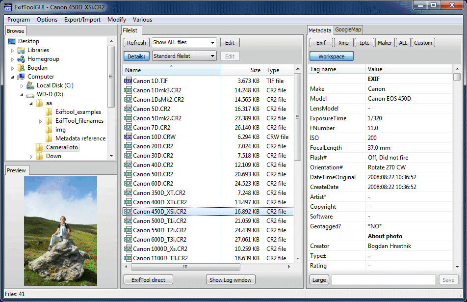

<!--presenter notes

On screen is an image of ExifTool, which can be used to extract so-called "technical metadata" from a file or group of files.

-->

---

## Definition
# Technical Metadata

__Technical Metadata__ refers to data that describes technical characteristics of a file, such as the file format, file size, provenance (i.e. creation date, last modified date), and other details.

---

## Tool
# File Information Tool Set (FITS)

Developed by Harvard University, the File Information Tool Set (FITS) is a suite of tools (including ExifTool) that, together, may be used to identify and extract technical metadata from files. The data is output into XML format.

---

# __Question:__ Why might a repository need to identify the file formats present in a specific accession? What practical purposes or benefits could this serve for managing and preserving the collection?

---

# Weed unnecessary, redundant files
- __Application data__: Files that are tied to specific applications (example: config.ini)
- __Encrypted or password-protected data__: Unless the decryption key is available, these files can be considered inaccessible.
- __Duplicates__: Identical files that waste storage space and complicate processing.
- __Temp files__: These often don’t hold any long-term value and can be safely discarded.
- __Binned files__: Files deleted by the creator.

---

# Reason 2: Determine processing plan
- __Size and complexity of the file system__: How much organization and descriptive file naming is already present.
- __Sensitive or personally-identifying information__: Identifying and addressing areas with potentially sensitive data that may require special handling.
- __Manual sampling needs__: Areas that may need manual review or sampling for appraisal.
- __Complexity of file formats__: Some formats may require special access or reformatting, which needs to be considered early on.

---

## Definition
# Digital forensics

__Digital forensics__ describes various techniques, practices and tools that focus on recovering and analyzing information from storage devices.

<!--presenter notes

So how do we address risks inherent to born-digital items, all the while making sure that provenance, original order, chain of custody, and other archival principles are maintained? This is especially important because storage media can contain swaths of data that ideally would be handled in bulk, but all the while enable the archivist to take precise measures to properly appraise, arrange and describe the contents.

One way to do this is through taking digital forensics measures. Know that digital forensics requires a little bit of understanding of how computers work, especially in terms of how they store, read, write, delete, and make sense of what it is that they store. Know that knowing this is what I would consider a necessary skill for any archivist, not just those archivists with “digital” in front of their names.

Archives have a need to create and analyze authentic, trustworthy and complete version of digital storage devices to preserve the digital historical record. One way to do this is to take digital forensics measures. Digital forensics refers to techniques, practices and tools that are used by archivists and other technicians to recover and analyze information from born-digital media and devices such as computer hard drives, floppy disks, flash drives, smartphones and so on.

-->