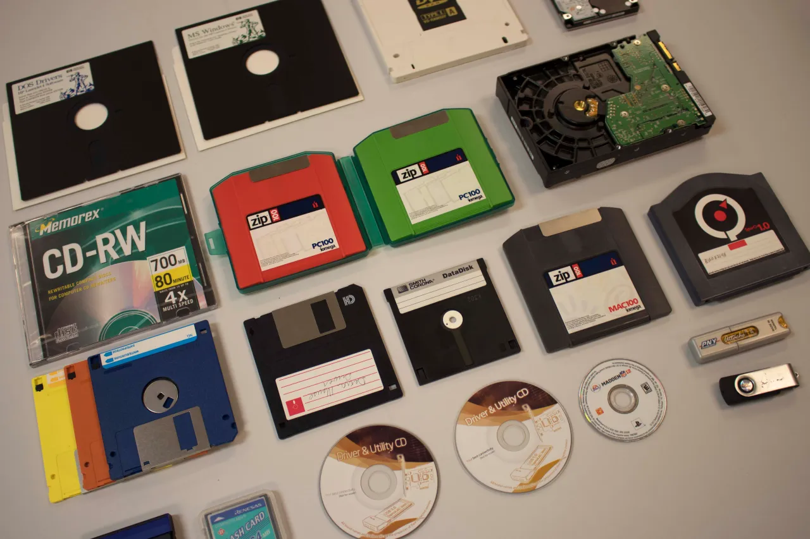

# Week 3 
## Processing Born-Digital Archives

---

# Today
- **Settle in/Reminders/Announcements** (15 min)
- **Discuss Last Week's Activity: Breaking BagIt** (20 min)
- **Lecture: Processing Born-Digital Archives** (45 min)
- **Break** (10 min)
- **Start Weekly Activity** (70 min)
- **Wrap up** (10 min)

---

# Announcements

* March 4/Week 7 class will be held virtually
* Archiving the Black Web - Web Archiving School/Fellowships <a href="https://www.archivingtheblackweb.org/apply/" target="_blank">https://www.archivingtheblackweb.org/apply/</a>
* <a href="https://memoryrising.us21.list-manage.com/subscribe?u=33964c505212f62c031cc170e&id=866da7c133" target="_blank">Memory Rising</a> Newsletter, No Time For Fear (podcast on the New Deal) by Eira Tansey</a>

---

# Activity Discussion: Breaking BagIt
Top-level folder
- `bagit.txt`
- `bag-info.txt`
- `manifest-md5.txt`
- `tagmanifest-md5.txt`
  - `data`
  - `file1.txt`

<!--presenter notes

https://datatracker.ietf.org/doc/html/rfc8493

-->

---

# Processing Born-Digital Archives
- Acquisitions
- Accessioning
- Processing (arrangement and description)

---

## Definition
# Born-digital

**Born-digital** refers to items or materials whose contents were captured using binary encoding.

Born-digital items are distinct from contents created using analog recording devices and subsequently digitized.

<!--presenter notes

Definition comes from: https://primarysources.yale.edu/what-does-born-digital-mean

-->

---

## Definition
# Digital storage device or media

A **digital storage device** (sometimes just referred to as "media") is a physical device used to store, read, or write digital-encoded data. 

Examples: hard drive, compact disc, floppy disk, computer, smartphone

---

<!--presenter notes

Some examples of digital storage devices include floppy disks, compact discs or CDs, and hard drives. All are used to store, read and write digital data, to varying degrees.

Digital storage devices are commonly associated with legacy born-digital collections, and look similar to the image on the slide. However, digital carriers are not exclusive to things that are “old”. Smartphones, at least at the moment, are a ubiquitous digital carrier that have and will likely continue to make their way into archival processing queues, and should be considered a digital storage device on its own.

-->

---

<!--presenter notes

Image credit:
"Assortment of obsolete and current media that the AHC’s Born Digital unit handles on a daily basis." Digital Preservation 101: Demystifying the Digital, American Heritage Center, 20 July 2020, https://ahcwyo.org/2020/07/20/digital-preservation-101-demystifying-the-digital/.

-->

---

## Definition  
# Acquisition  

An **acquisition** is the legal and physical transfer of materials to an institution, either through **purchase** (resulting in an invoice) or **donation, gift, or bequest** (formalized by a legally binding agreement such as a deed of gift). Acquisitions establish the institution's ownership and stewardship of the materials.  

---

## Definition
# Accessioning - 1/2

"**Accessioning** is ... the suite of activities through which archivists appraise, transfer, stabilize, and document archival acquisitions. Accessioning provides pathways to access, informs future decisions, and promotes sustained resource commitment for the care of archival materials."

_Archival Accessioning Best Practices (2024)_

---

## Definition
# Accessioning - 2/2

"Accessioning is the process of transferring and documenting the transfer of collections material into the Libraries' care. For **born-digital materials**, that means safely copying them into the Libraries' temporary storage system and documentating the process."

<a href="https://github.com/uga-libraries/born-digital-accessioning?tab=readme-ov-file" target="_blank">University of Georgia Libraries Github documentation</a>

<!--presenter notes

This definition comes from University of Georgia Libraries Github documentation on born-digital accessioning. See: https://github.com/uga-libraries/born-digital-accessioning?tab=readme-ov-file

-->

---

## Definition
# Appraisal - 1/2

**Appraisal** is the process of determining whether records and other materials have permanent (archival) value. It may be done at the collection, creator, series, file, or item level.

<!--presenter notes

Definition source:
https://dictionary.archivists.org/entry/appraisal.html

The basis of appraisal decisions may include a number of factors, including the records’ provenance and content, their authenticity and reliability, their order and completeness, their condition and costs to preserve them, and their intrinsic value. Appraisal often takes place within a larger institutional collecting policy and mission statement.

-->

---

## Definition
# Appraisal - 2/2

Born-digital materials may be appraised at **different points throughout its lifecycle**. When this happens largely depends on the type(s) of media received, and whether the repository has the necessary equipment to extract contents at the point at which appraisal is done.

---

### Workflow: Acquisition -> Processing

- Acquisition proposed
- Deliver raw materials (secure file transfer, or ship temporary and/or original physical media)
- Accession, stabilize (virus scan, create bit-level copies via imaging, or transfer select files from media)
- Pre-processing analysis
- Arranagement and description

---

## Definition
# Transfer

A **transfer** refers to moving select data from one device to another.

---

# Some media cannot be properly handled until their contents are _imaged_.

---

## Definition
# Floppy Disk 💾
A **floppy disk** is a thin, flexible magnetic storage medium encased in a rectangular plastic shell.

---

 <!-- fit -->

<!--presenter notes

Screen capture of a person handling the insides of a floppy disk, from this YouTube video:
https://www.youtube.com/watch?v=1-oH2T3W-q4

-->

---

## Floppy disks use magnetism to encode binary data.
- A flexible piece of plastic is coated in a substrate consisting of magnetic-sensitive particles.
- The computer:
  - **Writes** data to disk by applying an electromagnetic field to particles. Direction "Up" = 1 and Direction "Down" = 0
  - **Reads** data using a sensitive electromagnetic head that detects variance in directions amd translates to binary information.

---

## Definition
# Disk sector

A **disk sector** is a fundamental unit of storage on a disk. It represents the smallest addressable unit of data on the disk.

---

<!--presenter notes

Diagram from Wikipedia article on disk sectors: https://en.wikipedia.org/wiki/Disk_sector

This diagram illustrates how data is written to the surface of a magnetic storage disk, which can be thought of as a circular map with data stored in specific, measurable locations. Each disk is divided into sectors that correspond to precise points on the disk's surface and are defined by their size in bytes, making sectors the smallest unit of storage.  

When a file is saved to a hard drive, the file system assigns it to a series of contiguous sectors whenever possible. This grouping of sectors is known as a cluster, and would appear like tracks.

-->

---

## Definition
# Imaging - 1/2

**Imaging** describes the process of creating a bit-identical copy of some sort of physical source media such as a floppy disk or hard drive.

<!--presenter notes

Disk imaging describes the process of creating a bit-identical copy of the source media. The imaging process copies data sector-by-sector from the raw device.

-->

---

## Definition
# Imaging - 2/2

The **imaging process** copies data _sector-by-sector_ from the disk. The result is an image file or just image, containing not just files, but also things like the file system structure and deleted files.

---

## Definition
# File System

**File system** is metadata that describes where files start (in terms of sectors), what they're called, what sectors have been used versus are empty, and folder hierarchies.

<!--presenter notes

As a result of imaging you end up copying not just a bunch of files, but entire file systems. A file system is essentially the interpretive layer between the computer/user and the file locations written to disk. Meaning, you as the user, as well as the computer system itself uses file systems to make sense of where files live, how to interact with them, how and where they are organized.

-->

---

## Definition
# Emulation

An **emulator** is software that imitates a specific computer's hardware so that programs written for that original machine can run unchanged on a different, modern system.

<!--presenter notes

Once you have an image, then what? The answer usually is using some sort of emulator. An emulator is software that imitates a specific computer's hardware so that programs written for that original machine can run unchanged on a different, modern system. An emulator can, in this way, take an image, and treat it as if it were a real physical disk. Instead of inserting a floppy into a drive, you point the emulator at the disk image file, instead. The emulator then reads that file sector-by-sector, just like real hardware would read on a disk. So the image provides the data, the emulator provides the virtual machine and together they recreate the original computing environment.

-->

---

“[D]isk images can be stored redundantly, backed up, and audited in ways that physical carriers like DVDs or external hard drives cannot…they are a much better suited for preservation of digital information over time, while retaining all characteristics of the original physical media as a storage volume.” 

Canadian Center for Architecture (CCA)

<a href="https://github.com/CCA-Public/digital-archives-manual/blob/master/guides/diskimaging.md" target="_blank">Digital Archives Manual</a>

---

“From a preservation perspective, this makes forensic imaging ideal; an exact copy of the original data can be ingested into a secure and long-term storage environment. Derivative copies can later be used for continued appraisal and processing.”

Dorothy Waugh, Emory University

<a href="https://ecommons.cornell.edu/server/api/core/bitstreams/f85f26b7-859c-4f5e-9fab-aabed683c3c4/content" target="_blank">A Dogged Pursuit: Capturing Forensic Images of 3.5” Floppy Disks</a>

---

# A disk image
- "Liberates" the bitstream from its physical media
- Disk images can be evaluated on modern computing environments
- Resulting analyses can be used for appraisal and for coming up with a processing plan

<!--presenter notes

Disk imaging liberates bitstreams from digital storage media, which can otherwise be subject to all the inherent risks associated with born-digital items. Disk images can be migrated into modern computing environments where they can be analyzed. The analysis may be for appraisal purposes, or throughout the course of archival processing in arranging and describing the contents.

-->

---

## **Question - 1/2**
We now know of two ways to get born-digital contents from the source media: transfer specific contents directly off the media, or create a sector-by-sector image.

---

## **Question - 2/2**
Is disk imaging appropriate for every piece of born-digital media transferred to and accessioned by a collecting institution? Why or why not? 

---

  

  
  

Mini Activity - Disk Image

_Play an Apple II disk image file._

<ul class="activity-list">
<li><a href="https://archive.org/details/softwarelibrary_apple_games" target="_blank">Open the Apple II Games Library</a> on the Internet Archive.</li>
<li>Browse the archive and select <a href="https://archive.org/details/orion_202103" target="_blank">a game of interest</a>.</li>
<li>On your selected game's page, find the <b>Download Options</b> section; select <b>Show All</b>.</li>
<li>Try and see if you can find a disk image file listed.</li>
</ul>

<!--presenter notes

https://archive.org/details/a2gs_Volcanoes_Deluxe_1988_Earthwave_Services

What does a disk image look like, and how can we look into it or interact with it once it is made?

One way to easily look at and experience a disk image is by perusing the Internet Archive. There are a number of vintage video game collections. Take a moment to look up a game on the Internet Archive by searching for “apple ii games internet archive” in a web browser. Click on any game that comes up that is interesting to you.

When you click on a video game, notice how the main screen will briefly show you a blue screen that says something along the lines of “Apple II” and some copyright information. When you see this, what you are seeing is the Internet Archive booting up a disk image of the Apple II operating system. This is necessary because these video games have a dependency on the Apple II operating system to be played. So right off the bat, you are interacting with a disk image, first of an operating system, and then immediately afterwards, the disk image of the videogame.

You can see the image file listed by clicking “Show all files” on the right/bottom-hand side of the game screen. In the list, locate the *.2mg file. This is the disk image. Really, it looks like any other file, with a name, a period, and a file extension, which you can even download to your computer, if you wish. This enables you and I to play these games without subjecting the original disks to wear and tear. And because it is an exact copy of the original, we can experience it in a similar way to an original game player.

-->

---

<!--presenter notes

What does a disk imaging workstation look like?

- Dedicated capture workstation: A laptop or desktop computer used for disk imaging.  
- Write blocker: A hardware device that sits between the capture workstation and the disk reader, preventing accidental modification of the source media.  
- Disk reader: A device that reads the physical media (e.g., a floppy disk drive for floppy disks).  
- Various cables connect the workstation, write blocker, and disk reader to each other, ensuring proper data transfer, and to power.

-->

---

<!--presenter notes

Sometimes, imaging fails, and we have to use other devices and tools at our disposal to get the bitstream.

On the slide is a KryoFlux controller card. These images were taken from a Github repo called “The Archivist’s Guide to KryoFlux”, which was a collaborative document written by several digital archivists from different repositories.

You have several components. Starting from the top left going from left to right, is the KryoFlux board, which looks like an exposed computer chip.

The KryoFlux board is connected to the floppy drive using a data cable. The data cable size will depend on the type of drive you are transferring from. The image on the slide shows a 3.5” floppy drive, but a KryoFlux board can be connected a multitude of floppy drives.

Once your floppy drive is connected to the KryoFlux board, you will next connect the board to your computer using a USB cable. Once your drive and board are connected to your computer, you launch the tool via the command line. Once this is done, you connect your floppy drive to an power source using a power adapter. Again, depending on the drive you are using for imaging, you will use a different power adapter.

This ultimately enabled Emory to capture all of Walkers disks. Why did the KryoFlux work so much better? KryoFlux is known to be able to capture disk images of a variety of formats.

Along with the KryoFlux card, you will need to install the Disk Tool Controller (DTC) software. DTC is used to control the board and interact with floppy disk drives and provides a user-friendly interface for controlling the board and performing various disk-related tasks. This software is available for various operating systems, including Windows, Linux, and macOS.

-->

---

<!--presenter notes

Here is a close-up photo of the KryoFlux board, which comes with a built-in write-blocker, circled in red. To enable write-blocking functionality, you would actually physically remove the jumper for the write gate.

-->

---

# Tool
## Write blocker

A piece of hardware or even physical component on a device that prevents a system from overwriting data held in a target born-digital item.

<!--presenter notes

A write blocker is piece of hardware or even physical component on a storage device that prevents a system from overwriting data held in a target born-digital item. It is a physical gate that puts you into read-only mode.

-->

---

---

## **Question**

Can you guess what might happen if you attempt to image a disk without applying a write-blocker?

<!--presenter notes

What happens when you don’t toggle a write blocker? A good example of this are the created, modified and accessed metadata properties of a file. Each of these three data points holds important details about provenance. File systems, by design, automatically update this data without asking you whether or not you would like to commit the change. As a result, if you were to image a disk without the write blocker turned on, you would see the Created, Modified and Accessed data change to today’s date, rather than the date the original file was accessed by its creator.

-->

---

## Pre-Imaging Step: Virus Scan  

- **Run a virus scan**: Before creating a disk image, a virus scan should be performed to check for potential malware. A common tool used is known as ClamAV. 
- **Air-gapped workstations**: To reduce risk, capture workstations are sometimes **non-networked**, preventing malware from spreading beyond the imaging environment.  

---

# The capture workstation will have some sort of program that provides the archivist an interface with the drive making the image.

---

## Tool
# Disk Imaging Tools

**Guymager**: Imaging utility; part of the BitCurator suite of born-digital processing tools.
**Forensic Toolkit (FTK)**: Suite of born-digital processing tools; Windows-based
**ISO Buster**: Imaging specific to optical media (CDs, DVDs, etc.)

---

<!--presenter notes

This is a screen capture of the FTK Imager graphical user interface (GUI), which is one of many tools offered in the Forensic Toolkit environment.

On the left-hand side of the screen is a folder directory or "tree" showing one of the disk images (ending in the file format extension AFF, which stands for "advanced file format", a forensic disk image file format.) On the lower right-hand side of the screen is a hex editor, which lists the hexadecimal representations of the binary code stored on the image, as well as their sector location (a sector refers to a specific area of a disk) listed in the left-hand column.

Along with creating a disk image, FTK Imager also “...calculates MD5 and SHA-1 checksums in order to verify that the capture was successful … a text file including some technical metadata and fixity information, and a CSV file listing the file names and paths of data contained on the imaged media.”

-->

---

## Definition
# Digital forensics

**Digital forensics** describes various techniques, practices and tools that focus on recovering and analyzing information from storage devices.

<!--presenter notes

Digital forensics techniques are often deployed because storage media can contain swaths of data that would make analyzing it nearly impossible. Forensic technologies enable the archivist to take precise measures to properly appraise, arrange and describe the contents.

-->

---

# Forensics can give insight into:
- **File formats**: What file format signatures are present?
- **Encrypted or password-protected data**
- **Duplicate, temporary or binned files**: These often don’t hold any long-term value and can be safely discarded.
- **Personal identifying information (PID)**: Pattern recognition can root out social security numbers, credit cards numbers, etc.

---

## **Question**
Why might an archivist need to identify the file formats present in a specific accession?

---

## Definition
# File Format

A **file format** "...refers to the internal structure and encoding of a digital object, which allows it to be processed, or to be rendered in human-accessible form."

From the <a href="https://www.nationalarchives.gov.uk/aboutapps/pronom/pdf/pronom_unique_identifier_scheme.pdf" target="_blank">PRONOM PUID Scheme: A scheme of persistent unique identifiers for representation information</a>

<!--presenter notes

When we are working with media containing files, it is very likely that we will encounter files at scale. For example, we may receive a pile of floppy disks, each containing 20 files. So, maybe it might be easy enough to just manually identify each file manually.

But what if an archivist is handling an entire harddrive, containing hundreds or even thousands of files. Performing a technical appraisal at this scale is simply impossible to do manually.

-->

---

## Tool
# BitCurator

**BitCurator** is an open-source program providing a suite of tools used to help with born-digital processing tasks. BitCurator provides a number of tools that can be used to produce a file format analysis.

<a href="https://docs.google.com/spreadsheets/d/1doQYdCh2QxtwA7p2_FKXdy-D0g4jfUl8fjbx1KWKwHk/edit?gid=0#gid=0" target="_blank">Full list of tools</a>

---

## Tool
# fido
**Format Identification for Digital Objects (fido)** is an open-source command-line tool to identify the file formats of digital objects. FIDO utilises the PRONOM format registry, which is maintained by The National Archives UK.

---

## Tool
# Siegfried

**<a href="https://www.itforarchivists.com/siegfried" target="_blank">Siegfried</a>** is an open-source file format identification tool used for digital preservation and file forensics that uses the National Archives UK’s PRONOM file format signatures, MIME-info file format signatures, and Library of Congress’s FDD file format signatures.

<!--presenter notes

And another tool! Siegfried also does bulk identifying, but is known to be nimble and quick, and can compare against PRONOM database.

-->

---
## Definition
# Normalization
**Normalization** refers to the process of converting a digital object into a persistent file format.

<!--presenter notes

**Normalization** refers to the process of converting a digital object into a persistent file format. Normalization practices can vary from institution to institution. That said, institutions like the Library of Congress have put forth normalization recommendations. 

-->

---

## Resource
# Library of Congress Recommended Formats

<a href="https://www.loc.gov/preservation/resources/rfs/" target="_blank">https://www.loc.gov/preservation/resources/rfs/</a>

---

# Appraisal Considerations Raised by File Format Analysis
__Question 1:__ Do we have the tools to extract records?
__Question 2:__ Can we preserve/maintain the various file formats as-is or through normalization?
__Question 3:__ Can we provide access to the record?
__Question 4:__ Do the contents of records support institution's collection development policy?

---

## Tool
# PRONOM

**<a href="https://www.nationalarchives.gov.uk/pronom/" target="_blank">PRONOM</a>** is an on-line registry of data file formats, signatures, and their supporting software products.

<!--presenter notes

<a href="https://www.nationalarchives.gov.uk/pronom/" target="_blank">PRONOM</a> is an on-line registry of data file formats, signatures, and their supporting software products. Originally developed to support the accession and long-term preservation of electronic records held by the National Archives, PRONOM is now being made available as a resource for anyone requiring access to this type of information, and is integrated in a variety of file format identification tools and systems.

-->

---

  

  
  

Mini Activity - PRONOM

_Use PRONOM to look up a registered file format._

<ul class="activity-list">
<li>Open <a href="https://www.nationalarchives.gov.uk/pronom/" target="_blank">PRONOM</a> in a browser; select "Search PRONOM".</li>
<li>Select the "File format" tab.</li>
<li>Input the file format JPG; select Search.</li>
<li>Notice how there are a lot of results! Click on the first result for PRONOM unique ID fmt/41.</li>
<li>Have a look at the Summary.

</ul>

---

  

  
  

# Pronom Summary: Things to notice
- Name ("Raw JPEG Stream")
- Identifiers (LOC, PUID, MIME)
- Description
- Source date
- "Has lower priority than": Refers to format identification precedence when multiple related file formats could apply.

---

## Definition
# Format signature

A **format signature** is a unique pattern of bytes that identifies a specific file format.

_To see the signature of a JPEG, click the Signatures tab of a PRONOM entry._

---

# Format signature key
**BOF**: Beginning of file
**EOF**: End of file
**SOI**: Start of image
**EOI**: End of image

---

# Arrangement & Processing of Born-Digital Archives

---

## Considerations
- Maintaining **original order**
- Scale of files being described and arranged
- Researchers' needs
- Institutional priorities and values

_There is no one strategy that can be applied to any or all collections!_

---

## Approaches: Original Order

Born-digital contents can be **vast**, requiring the archivist to think strategically about **original order** without bogging down finding aids with long file groupings and lists.
  
- **Use file directories** to illustrate broad groupings and bring clarity to ambiguous filenaming conventions.
- **Provide context** by describing files in terms of **functions, activities, and file types**.

<!--presenter notes

I am distilling the information outlined in Yale's Libguide for Born Digital Archival Description Guidelines (https://guides.library.yale.edu/c.php?g=934566&p=6736587)

-->

---

## Approaches: Arrangement

1. In a separate "born-digital" series (e.g. Fonds -> Series: Digital files)
2. In separate "born-digital" sub-series within existing series (e.g. Fonds -> Series: Projects -> Sub-series: Digital files)
3. Co-arranged with other formats (e.g. Fonds -> Series: Projects -> Project File: Example Project -> File-level group of digital 3D models)

<!--presenter notes

Here I am taking queues from the Canadian Centre for Architecture's "Arrangement of born-digital archives" section: https://github.com/CCA-Public/digital-archives-manual/blob/master/guides/arrangement.md#arrprinciple

-->

---

# **How did the records arrive?**
  - **A creator's entire hard drive is...
    - More likely to reflect **original order**  
    - May have **dependencies** between files  
    - Less manual arrangement needed  
  - **Small (as in capacity) storage media** (e.g., floppies, CDs)  
    - Less likely to reflect **original order**
    - More likely to have a relationship with a physical item (i.e. a CD in a folder of correspondence)

---

  

  
  

_**Mini Activity**: Browse finding aids containing born-digital materials._

<ul class="activity-list">
<li>Open the <a href="https://archives.libraries.emory.edu/repositories/7/resources/2165" target="_blank">Alice Walker papers finding aid</a> (Emory University).
<li>In the collection organization section, select Born Digital Materials.
<li>Read the Processing Note.
<li>Browse the list of born-digital materials.

</ul>

---

  

  
  

_**Mini Activity**: Browse finding aids containing born-digital materials._

<ul class="activity-list">
<li>Open the <a href="https://findingaids.lib.buffalo.edu/repositories/3/resources/1148" target="_blank">kari edwards papers
 finding aid</a>.
<li>Review Extent; Arrangement and Processing Information.
<li>Read the Processing Note.
<li>Browse the list of born-digital materials.
<li>Click on Writings, 1992-2010 > Manuscripts and digital files, 1992-2010 and browse.

</ul>

---

  

  
  

_**Mini Activity**: Browse finding aids containing born-digital materials._

<ul class="activity-list">
<li>Open the <a href="https://findingaids.library.nyu.edu/nyhs/ms3216_rebuild_by_design/all/" target="_blank">Rebuild by Design Hurricane Sandy Competition records</a> (New York Historical Society/NYU).
<li>Review: Extent, Arrangement, Conditions Governing Use and Processing Information
<li>Click "View Inventory" button on the left-hand side of the page (beneath the Contents header)
<li>Look through each of the digital folders.

</ul>

---

# Break

---

# Weekly Activity: Corrupting a Bitstream
<a href="https://digital-archives.github.io/HISTGA1011/activities/corrupting_a_bitstream" target="_blank">https://digital-archives.github.io/HISTGA1011/activities/corrupting_a_bitstream</a>

---

_Final questions or reflections?_

mary.kidd@nyu.edu