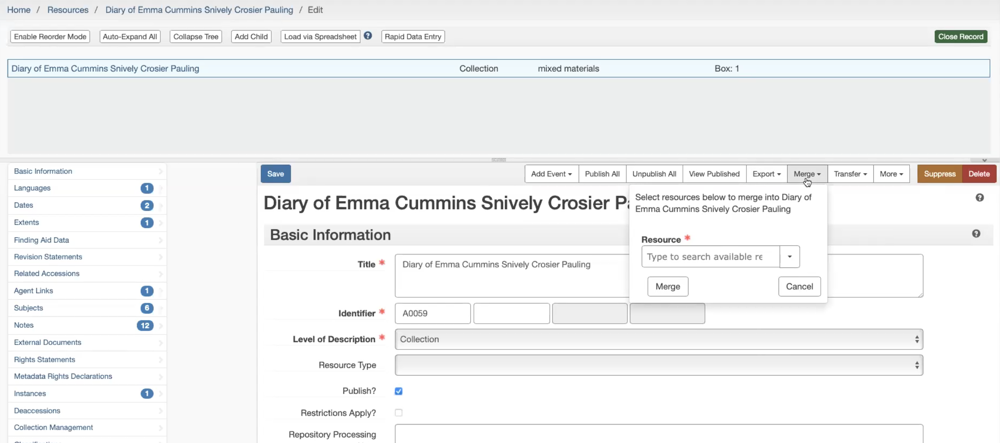
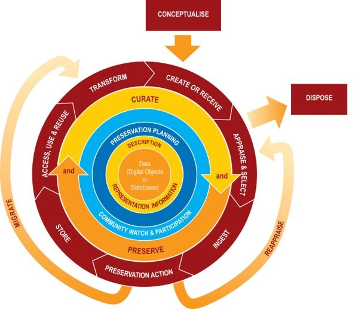
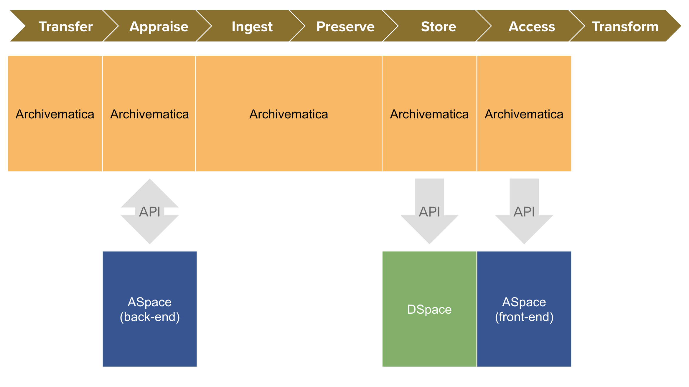

# Week 4
## Digital Archives Systems

---

# Today
- **Settle in/Reminders/Announcements** (15 min)
- **Discuss Last Week's Activity** (20 min)
- **Lecture: Digital Repository Systems** (45 min)
- **Break** (10 min)
- **Start Weekly Activity** (70 min)
- **Wrap up** (10 min)

---

# Announcements

- **Schedule Update:** Guest Speaker Karly Wildenhaus (Interim Manager, Metadata Services Unit, NYPL) will be joining us on 4/16

---

# Digital Archives Systems

- Systems help manage & provide access to digital collections.
- We will cover two real-life examples: Yale & Bentley Library systems in action.
- Systems must communicate with each other. This can be done using **APIs (Application Programming Interfaces)**.

<!--presenter notes 

Last week, we started discussing born-digital processing and the hands-on work of managing and preserving digital materials through imaging and transfers. We’ll continue exploring different aspects of that work in the coming weeks.

This week, we’re zooming out to look at systems: the tools that help us do this work at scale. To effectively manage digital collections, we need systems that can:
a.) Store and process data about files, such as those created through imaging or digitization.
b.) Make this data accessible to end-users—researchers, patrons, and casual browsers—so they can search, discover, and make sense of these materials.

I’ll walk through two real-life examples of archival systems in use:
- At Yale (where I work)
- At the Bentley Historical Library at the University of Michigan

These examples will show how different systems work together to support digital archiving.

Beyond just having systems, we also need to ensure that they communicate with each other—this is where interoperability comes in. If a system can send, receive, or exchange data with another system, it means they are interoperable.

One of the primary ways that systems "talk" to one another is through Application Programming Interfaces, or APIs. Today, we’ll introduce APIs and discuss how they allow different systems to share data, automate tasks, and enhance access to digital collections.

-->

---

## Definition
# Archival Repository

An archival **repository** describes a physical location where an archive stores the physical holdings of their collection. Ideally, this is a secure and stable environment to combat against risk of damage from threats like water, heat and pests over the long-term both in service of preservation and access/retrieval.

<!--presenter notes 

To approach the topic of systems used in a digital repository (and defining what a digital repository is), let’s start by exploring the systems that support a physical archival repository.

An archival repository is a physical place where archives are kept. The physical components of an archival repository are stored on shelves (aka “stacks”) in, ideally, highly monitored, climate-controlled spaces, to ensure the materials are protected from risks posed by things like rodents, bugs, and humidity, but also organized in a way so items can be retrieved for access or remediation.

-->

---

# Archival Repository Systems
- **Collection Management**: to manage and location track/audit individual objects
- **Archival Description**: to manage intellectual arrangement and description
- **Catalog Description**: to manage bibliographic descriptions of both individual items and entire collectios
- **Request & Patron Services**: Manage reading room requests and reproduction orders.

<!--presenter notes 

Let’s imagine we are working in a purely physical repository: just record boxes on shelves, no digital items. That would be pretty rare today, but for the sake of this example, let's focus only on the systems that help manage physical collections. Let's pretend it's the year 1995.

Here’s a non-exhaustive list of systems we might be using in this environment.

These systems, especially back in the day, worked separate from one another. For example, you would have the archivist entering finding aid data into a word processing document; you would have a spreadsheet or maybe a simple database tracking object locations and reading room requests, a separate website that published a list of archival collections, and an online catalog entry for the archival collection, maybe with a special instruction to email the archives to schedule an appointment. Once you got to your appointment, the archivist would hand you a paper-based finding aid.

This kind of systems set up worked for their time. But, this started to crumble, one repositories started handling digital materials. Additionally, there was an increased expectation for information to be online. Covid increased those expectations to allow for the avaiability of online-only reading rooms.

-->

---

“A <b>digital repository</b> is like the electronic equivalent of the library stacks; digital items are organized and searchable there, and they have a specific, persistent location so repository managers maintain intellectual control and researchers can find what they’re looking for. A digital repository does more than simply house digital objects online, it preserves their integrity in the long term.”

Rachael Zipperer

Masters Candidate at the University of Texas School of Information, 2019

<!--presenter notes 

Link to Rachael’s blog post: https://www.tdl.org/2019/04/what-is-a-digital-repository/

Digital repositories function much like physical archival repositories—both are designed to organize, store, and provide access to materials. The way digital repositories are set up, managed, and maintained often mirrors how physical stacks work, following similar principles of organization and preservation.

However, digital repositories introduce added complexity. The biggest difference is in how materials are managed, requiring multiple layers of systems to track different aspects of digital objects.

For example, a floppy disk in a box would be tracked in a collection management system, which records its physical location—inside a specific box, on a particular shelf, in a room with controlled temperature and humidity.

But that same floppy disk may also have a digital presence that needs additional tracking. A separate system would record that a disk image exists, where it is stored on a server, and when its checksum was last verified.

Modern archival systems also need to connect the physical object to its digital manifestation, ensuring that both are managed in relation to each other. It would need to make that information available both to repository managers, and end-users, in a way that is understandable and discoverable.

A digital repository is just one layer in a larger system that tracks both the physical and digital characteristics, versions, and events of an archival object. These layers work together to maintain integrity, access, and preservation across different formats.

-->

---

## Definition
# Technology Stack

A **technology stack** (or just "stack" for short) refers to a layered set of technologies or systems that work together in a structured way.

<!--presenter notes

Now that we’ve talked about how different archival systems interact, both for physical and digital materials, let’s step back and look at how these systems fit together structurally.

In the world of technology, we often refer to these interconnected systems as a technology stack or simply a stack. A stack is a layered set of technologies that work together in a structured way to support different functions.

Understanding technology stacks helps us see how different systems communicate, where different types of data live, and how they integrate to form a functional ecosystem, whether we’re managing physical collections, digital archives, or both.

-->

---

### **Typical Digital Repository/Archives System Types**  

  
<table>
<tr><th></th><th align=left>System Type</th></tr>
<tr><td>📖</td><td>Descriptive & Bibliographic</td></tr>
<tr><td>🖼️</td><td>Digitization Workflow</td></tr>
<tr><td>📁</td><td>Digital Asset Management</td></tr>
<tr><td>🏛️</td><td>Digital Preservation</td></tr>
<tr><td>🌍</td><td>Public Access & Discovery</td></tr>
<tr><td>📂</td><td>Metadata Management</td></tr>
</table>

<table>
<tr><th></th><th align=left>System Type</th></tr>
<tr><td>🎛️</td><td>Media Viewers</td></tr>
<tr><td>📊</td><td>Repository Storage & Access</td></tr>
<tr><td>🔐</td><td>Rights & Access Control</td></tr>
<tr><td>📝</td><td>Workflow & Project Mgmt</td></tr>
<tr><td>🏷️</td><td>Request & Patron Services</td></tr>
</table>

<!--presenter notes

The following slides describe each of these systems

-->

---

## 📖 Descriptive & Bibliographic  
**Role:** Descriptive system of record

- Organizes materials using metadata standards
- Provides controlled vocabularies for consistency
- Links related records for better navigation
- Supports discovery in catalogs and finding aids

---

## 🖼️ Digitization Workflow  
**Role:** Manage scanning and reformatting workflows

- Manages file creation
- Packages files for preservation and access
- Supports quality control
- Tracks progress of projects

---

## 📁 Digital Asset Management (DAM)  
**Role:** Organize, store, and manage digital assets for access and reuse  

- Centralizes storage for digital assets  
- Enables metadata-driven search and retrieval  
- Supports version control and asset tracking  
- Facilitates integration with preservation and access systems 

---

## 🏛️ Digital Preservation  
**Role:** Actively ensures the long-term accessibility, integrity, and authenticity of digital assets.  

- Detects & prevents data corruption  
- Migrates file formats for future readability  
- Protects against loss with redundant storage  
- Tracks provenance & authenticity  
- Balances security & usability  

---

## 🌍 Public Access & Discovery  
**Role:** Provides user-facing tools to search, browse, and access digital materials.  

- Aggregates metadata from multiple sources  
- Enables dynamic searching  

---

## 📂 Metadata Management  
**Role:** Standardizes, transforms, and distributes metadata across systems.  

- Normalizes metadata for consistency, standardization and accessibility
- Maps fields between different schemas
- Supports automated workflows & interoperability  

---

## 🎛️ Media Viewers  
**Role:** Renders digital objects for users in access systems.  

- Displays images, documents, and audio/visual, born-digital, and other files  
- Supports zooming, annotations, and side-by-side comparisons  
- Provides accessibility features such as transcription

---

## 📊 Repository Storage & Access  
**Role:** Manages the storage, organization, and retrieval of digital objects for long-term access and use.

- Stores and organizes digital objects for preservation and retrieval
- Maintains metadata to ensure discoverability and context
- Supports versioning & persistent identifiers (e.g., DOIs, ARKs) for citation and long-term reference
- Integrates with discovery and access systems to connect stored objects with descriptive records  

---

## 🔐 Rights & Access Control  
**Role:** Manages permissions, restrictions, and copyright compliance for digital content.  

- Controls who can view, edit, or download files  
- Implements embargoes & access tiers  
- Tracks copyright & licensing information  
- Supports authentication & authorization  

---

## 📝 Workflow & Project Management  
**Role:** Tracks digitization, preservation, and archival processing workflows.  

- Organizes tasks & project timelines including handoffs between various systems
- Assigns roles & responsibilities
- Logs progress for accountability
- Connects with metadata & preservation systems

---

## 🏷️ Request & Patron Services  
**Role:** Manages user requests for archival materials and digital reproductions.  

- Facilitates access to restricted materials  
- Tracks user requests & fulfillment status  
- Schedules reading room appointments  
- Interfaces with discovery & archival systems  

---

<!--presenter notes

Let's start with our first real life example. I decided to show you a kind of fun, informal, colorful diagram that comes from the perspective of our Digital Collections system, and how it "talks" to other systems in the stack.

-->

---

<table><tr><th>System Type</th><th>Yale System(s)</th></tr>
    <tr><td>📖 Descriptive & Bibliographic</td><td><a href="https://archives.yale.edu/" target="_blank">Archives @ Yale</a>, <a href="https://search.library.yale.edu/" target="_blank">Yale Catalog</a></td></tr>
    <tr><td>🖼️ Digitization Workflow</td><td><a href="https://www.projects.ed.ac.uk/project/dlib004" target="_blank">Goobi</a></td></tr>
    <tr><td>🏛️ Digital Preservation</td><td><a href="https://preservica.com/" target="_blank">Preservica</a></td></tr>
    <tr><td>🌍 Public Access & Discovery</td><td><a href="https://search.library.yale.edu/" target="_blank">QuickSearch</a>, <a href="https://collections.library.yale.edu/" target="_blank">Digital Collections</a></td></tr>
    <tr><td>📂 Metadata Management</td><td><a href="https://github.com/projectblacklight/blacklight" target="_blank">Metadata Cloud</a></td></tr>
    <tr><td>🎛️ Media Viewers</td><td><a href="https://avcollections.library.yale.edu/" target="_blank">Aviary</a>, <a href="https://collections.library.yale.edu/catalog/16712418" target="_blank">IIIF</a></td>
    </tr>
    <tr><td>📊 Repository Storage & Access</td><td><a href="https://dataverse.yale.edu/" target="_blank">Dataverse</a></td></tr>
    <tr><td>🔐 Rights & Access Control</td><td>Management App</td></tr>
    <tr><td>📝 Project Management</td><td>Sharepoint, spreadsheets</td></tr>
    <tr><td>🏷️ Reading room/patron requests</td><td><a href="https://guides.library.yale.edu/aeon_staff" target="_blank">Aeon</a></td></tr>
</table>

<!--presenter notes

This table maps each system type to the specific tools Yale uses. Some of these systems have public-facing components, while others are internal tools used by staff. For those with public-facing components, I've provided a link to the Yale-specific website. For those systems that are internal to Yale, I have provided a link to the general vendor system website.

Please click on each link to see more information.

- Descriptive & Bibliographic: Yale uses Archives @ Yale for archival descriptions and the Yale Catalog for bibliographic records. This is a branded website built on top of ArchivesSpace.
- Digitization Workflow: Goobi is used to manage digitization projects and file packaging. I've included a link to the vendor page.
- Digital Preservation: Preservica serves as the long-term digital preservation system. Again, this system is internal-facing, so I've provided a link to the general Preservica site.
- Public Access & Discovery: Users can search collections through QuickSearch and Yale Digital Collections. These are so-called "discovery layers", that take information from various catalogs like ASpace, the Yale library catalog, and others, to provide a sophisticated way to search for items across all of Yale's special collections.
- Metadata Management: Metadata Cloud is built on Blacklight, so I've included a link to the Blacklight Github repository, since this is an open-source system. Metadata Cloud acts as middleware, integrating metadata across multiple descriptive systems of record like ASpace and the catalog.
- Media Viewers: Yale uses Aviary for audio/video playback and IIIF for high-resolution image access.
- Repository Storage & Access: Dataverse is used for structured research data storage. Students and faculty can use Dataverse to submit various datasets to a repository for long-term safekeeping.
- Rights & Access Control: The Management App helps control visibility and access restrictions. This is a homegrown system with no real public-facing documentation, so no link provided.
- Project Management: Internally, staff use SharePoint and spreadsheets to manage workflows. Again, these are internal-only, so you will need to take my word for it! :-)
- Reading Room & Patron Requests: Aeon is used for handling patron requests and tracking reading room access. I provided a link to a Yale-authored LibGuide.

-->

---

# There are so many systems!

This might help:

<a href="https://docs.google.com/spreadsheets/d/1cXOug3qM0pNNeD_wssiVEv9c0W1Y5I1VDTnSPTk7fb4/edit?gid=0#gid=0" target="_blank">The Collection Management System Collection
</a>

This also might help:

<a href="https://coptr.digipres.org/index.php/Tools_Grid" target="_blank">COPTR Tools Grid</a>

<!--presenter notes

If you want to take a deep dive into all the systems that are out there, there are a couple of resources to check out. The first one is a crowd-sourced Google Sheet,
“The Collection Management System Collection”, which was kick-started by Ashley Blewer, a software developer, educator, writer, and artist who has done
incredible work, especially within the field of audio/visual and moving image preservation. In 2017, she made this spreadsheet publicly available for folks in the field to contribute system descriptions in a matrix form.

Another helpful resource is the Community Owned Digital Preservation Tool Registry (COPTR) Tools Grid, which uses a Wiki format. This grid starts off with a matrix of
general digital preservation object types like “audio” or “ebook” on the Y-axis, and broad digital preservation functional areas on the X-axis. You can click on any of the numbers to see a list of relevant tools for that object type/functional area, and further drill down into other functional area sub-categories. There are nearly 600 tools described in this Wiki.

-->

---

# Integrating Systems
## How to Knit Software Systems Together

<!--presenter notes

Image from GIF Cities (https://web.archive.org/web/20091027084349/http://hk.geocities.com/kieou/3.htm)

In the early days of digital archiving and preservation, a variety of platforms emerged, to better automate, standardize and streamline various processes. Systems like ArchivesSpace emerged, designed with the intention of enabling archivists to accession collections, describe them accurately, and create and publish finding aids. Yet, these systems were built in isolation, tailored to specific tasks without consideration for the full lifecycle of digital records.

-->

---

# Question
## Why might one digital archives system need to communicate with another?

---

# Challenges of Disconnected Systems
❌ High risk of human error: Manual updates encourage mistakes.
❌ Redundant data entry: The same information (e.g., box number, floppy label data, title) must be entered multiple times across systems.
❌ Inconsistent & fragmented metadata: Metadata stored in different systems may not align because of varied data models, reducing discoverability.

---

## Definition
# Systems Integration

 

"A functional coupling between software applications to act as a coordinated whole."

Max Eckard

Making Your Tools Work for You

<!--presenter notes

Systems integration describes “[a] functional coupling between software applications to act as a coordinated whole.” This quote comes from Max Eckard’s book *Making Your Tools Work for You*, which was originally “adopted from... the ArchivesSpace Technical Advisory Committee (TAC) Integrations sub-team, which goes on to state that ‘a defining characteristic of all integrations is communication, i.e., seamless data flow–without a manual, intermediary step–between systems” (4).

Integration characterizes the ability of one or multiple systems to “talk” to one another. The development of interoperable standards and the adoption of holistic digital asset management solutions have started to bridge the gaps between previously isolated systems. These integrated platforms streamline the archival process—from digitization to online accessibility—reducing redundancy, minimizing errors, and significantly improving the discoverability of digital archives.

In addition, integration allows you to maintain your current system “ecosystem,” which is advantageous because no single system can do everything. In fact, having a single all-encompassing system might not be ideal. This modular approach enables systems ecosystems to be more flexible and adaptable over time.

-->

---

## Case Study
# Bentley Historical Library

Archivematica-ArchivesSpace-Dspace Integration

<!--presenter notes

The Bentley Historical Library developed an integrated system using three of the four digital repository system types we just covered: **Digital Preservation System** (Archivematica), **Institutional Repository** (DSpace), and **Content Management System** (ArchivesSpace). The goal was to leverage each system’s strengths to fully support an “end-to-end digital archives workflow.”  

These types of integrative setups are quite common in digital archives. Such integrations are achieved using **application programming interfaces (APIs)**, which are essentially sets of instructions or protocols that allow one system to communicate with or update data in another.  

Let’s explore each of these systems further.

-->

---

# Bentley Systems

  
<table>
<tr><th></th><th align=left>System Type</th></tr>
<tr><td>📖</td><td class="highlighted">Descriptive & Bibliographic</td></tr>
<tr><td>🖼️</td><td>Digitization Workflow</td></tr>
<tr><td>📁</td><td>Digital Asset Management</td></tr>
<tr><td>🏛️</td><td class="highlighted">Digital Preservation</td></tr>
<tr><td>🌍</td><td>Public Access & Discovery</td></tr>
<tr><td>📂</td><td>Metadata Management</td></tr>
</table>

<table>
<tr><th></th><th align=left>System Type</th></tr>
<tr><td>🎛️</td><td>Media Viewers</td></tr>
<tr><td>📊</td><td class="highlighted">Repository Storage & Access</td></tr>
<tr><td>🔐</td><td>Rights & Access Control</td></tr>
<tr><td>📝</td><td>Workflow & Project Mgmt</td></tr>
<tr><td>🏷️</td><td>Request & Patron Services</td></tr>
</table>

---

<!--presenter notes

This is a screenshot of the system Archivematica. You will be using the Archivematica sandbox next week during your weekly activity.

-->

---

## 🏛️ Digital Preservation System
# Archivematica

* Web browser-based (aka "SaaS")
* Open source
* Modeled after OAIS
* Knits together various <a href="https://wiki.archivematica.org/Getting_started#Projects" target="_blank">microservices</a> to get lots of small and large jobs done, usually in a specific order, and following specific rules set by the institution.

<!--presenter notes

Don't worry, "SaaS", "open source" and "microservice" are defined in the next slides!

-->

---

## Definition
# Software as a Service (SaaS)

**Software as a Service (SaaS)** refers to any system that provides its services via the cloud. Rather than having to download software on your computer, you can access this software using a web browser. The software and all its data are hosted and maintained on remote servers by a third-party provider.

<!--presenter notes

A popular archives-specific example of a SaaS platforms are Archivematica, ArchivesSpace. A SaaS service you might have encountered in your own work: Google Drive, Zoom.

There are a lot of benefits to using a SaaS system. 
1. Users can access SaaS applications through a web browser, from any device with an internet connection.
2. Maintenance-free: The service provider manages updates, patches, and security, so users don't need to worry about maintenance.
3. Scalability: Users can scale up or down based on their needs, adjusting usage or subscription plans easily.

SaaS eliminates the need for users to install, manage, and maintain software, making it a convenient and cost-effective solution for many businesses and individuals.

-->

---

## Definition
# Open source

**Open source** refers to software whose source code is made available to the public, allowing anyone to view, modify, distribute, and use it. The key idea behind open-source software is that it promotes collaboration and transparency, enabling developers and users to contribute to its improvement, adapt it to their needs, and share it freely.

See: <a href="https://github.com/artefactual/archivematica" target="_blank">https://github.com/artefactual/archivematica</a>

---

## Definition
# Microservice

A **microservice** is an application responsible for performing a single function.

<!--presenter notes

A microservice is an application designed to perform a single function within the digital curation and preservation process.  

The concept of a microservice was developed by the California Digital Library (CDL), which in 2009 introduced a new approach to the curation and preservation of digital objects. This reconceptualization challenged the assumption that “the curation and preservation of digital objects required the installation and operation of a single, long-lived application combining the necessary functions behind one user interface.”  

Instead, CDL proposed that “small, relatively simple utilities would pose fewer challenges in their development, deployment, maintenance, and enhancement than a large, integrated system, especially in the context of constant technological change.” Additionally, they noted that users could “easily adapt a set of distributed services to local conditions in different divisions and departments of the university, and easily replace each of them upon their obsolescence.” 

-->

---

# Some Archivematica Microservices

<table><tr><td>
<h2>Identity</h2>
Assign a unique identifier  
  
<h2>Storage</h2>
Transfer data into protected environment
  
<h2>Fixity</h2>
Verify data integrity over time  
</td>
<td>
<h2>Inventory</h2>
Produce manifests/lists  
  
<h2>Replicate</h2>
Create and distribute redundant copies  
  
<h2>Characterize</h2>
Analyze/report on file formats  
</td></tr></table>

<!--presenter notes

-->

---

<!--presenter notes

ArchivesSpace (aka ASpace) is an archival system primarily used throughout the accessioning, arrangement and description of archival collections. The data entered
into ASpace can be used to produce finding aids in EAD XML format, so they may be viewed on the web.

Collections, or bodies of work, are called “resources”. Within each resource, you will find various levels of hierarchy that describe how a particular body of work is arranged, such as series or sub-series, which in ArchivesSpace are known as "archival objects". Archival objects can also be rolled up into what are known as "Top containers", which represent the physical containers/boxes that may be requested or circulated in a reading room or other special collection setting. So, ArchivesSpace also has a collection management side, as well as places to accession materials, and make connections between archival objects and digital objects.

-->

---

## 📖 Descriptive & Bibliographic System
# ArchivesSpace (Aspace)

* Web browser-based (aka "SaaS")  
* Open source  
* Designed for archival description and collection management  
* Supports hierarchical description following archival standards (e.g., DACS, EAD, MARC)  

---

---

## 📊 Repository Storage & Access System  
# DSpace  

<table><tr><td>
<ul>
<li>Web browser-based (aka "SaaS")  
<li>Open source  
<li>Designed for managing and providing access to digital objects
</ul></td>
<td>
<ul>
<li>Supports structured metadata (Dublin Core, MODS) and persistent identifiers (DOIs, Handles)  
<li>Enables long-term storage, retrieval, and dissemination of digital collections and research outputs
</ul></td></tr></table>

<!--presenter notes

DSpace is an open-source repository platform. If you were to encounter an institution that uses DSpace, what you, as the user would ultimately see is some sort of catalog.

This is a screencapture from the DSpace website using NYU's Faculty Digital Archive, but you can see that DSpace essentially looks and behaves like a library or archive catalog.

-->

---

<!--presenter notes

In the Bentley article you read about how they integrated Archivematica, ASpace and DSpace. The way they were integrated was modeled after the Digital Curation Center or DCC Lifecycle Model.

Before we look at the Bentley Library example, we should understand what the DCC Model is, what it is for, and how it differs from the OAIS, specifically.

-->

---

<!--presenter notes

The DCC Curation Lifecycle Model provides a high-level graphical overview of the stages required for successful curation and preservation of data, starting from initial conceptualization or receipt. This model can be used to plan activities within an organization or consortium to ensure all necessary stages are undertaken in the correct sequence. 

It enables granular functionality to be mapped against the lifecycle, helping to define roles and responsibilities and to build a framework of standards and technologies for implementation. Additionally, it supports the identification of extra steps that may be required, actions that are unnecessary for specific situations or disciplines, and ensures that processes and policies are thoroughly documented.

For more information, refer to the [DCC Curation Lifecycle Model PDF](https://www.dcc.ac.uk/sites/default/files/documents/publications/DCCLifecycle.pdf).

-->

---

## Definition
# Digital Curation

**Digital curation** encompasses the selection, preservation, maintenance, collection, and archiving of digital assets, including data, documents, multimedia, and other digital objects. It involves managing the entire lifecycle of digital content to ensure its usability, integrity, authenticity, and accessibility over time.

---

# Compare: DCC vs. OAIS

<table>
<tr>
<td valign=top>
<h1>DCC Model</h1> 
Looks at the entire digital curation lifecycle, which includes digital preservation, as well as selection, organization, and access to digital content.
</td>
<td valign=top>
<h1>OAIS Framework</h1> 
Focuses specifically on digital preservation activities, processes, and technological approaches to setting up a successful digital preservation system.
</td>
</tr>
</table>

---

<!--presenter notes

Here’s my cleaned-up more accessible version of the Bentley Diagram.

The Bentley Historical Library's integrated system achieved the following:

- Provided archivists with access to the ArchivesSpace interface directly from the context of the Archivematica system. This allowed them to use information generated during the Archivematica ingest process to inform appraisal tasks.  
- Enabled archivists to view ArchivesSpace resource records, add or edit archival descriptions, and create digital object instances in the finding aid—all without switching over to ArchivesSpace, using a tab within Archivematica.  
- Integrated Archivematica with DSpace to facilitate the deposit of Archival Information Packages (AIPs) into its preservation repository. Once deposited, the system returned a unique resource identifier (URI) to the ArchivesSpace access portal, enabling users to search for and access digital content.  

-->

---

## Definition
# Application Programming Interface (API)

**Application Programming Interfaces**, or APIs, provide a way for disparate systems to request and exchange data from each other without needing to understand the internal workings of the other.

<!--presenter notes

The interoperability of these systems at Bentley was achieved using APIs.

Application Programming Interfaces, or APIs, provide a way for different software applications to communicate and request services or data from each other without needing to understand the internal workings of the other system. They enable applications to interact and collaborate, simplifying the development of interoperability.  

While not always required, APIs often use web protocols—sets of instructions specific to computers or servers within a network—to execute requests, update data, and perform other tasks.

APIs are very commonly used throughout digital repositories.

-->

---

# You have likely used an API unknowingly. Examples:
- The weather app you use likely pulls in data from centralized weather forecast databases using APIs.
- An airline booking website pulls in data from airline fare databases and filters the results to show you lowest fares.

<!--presenter notes

Let’s unpack what we just said about APIs and the web. Why do they often go hand in hand?  

A common way we send instructions to other computers around the world is by opening a web browser and typing in a URL to access a website. Here we are unknowingly prompting our web browser to send instructions to a server somewhere in the world.

We are all very used to using HTTP for our own, human-centric purposes, especially for browsing the web. However, websites and the servers that host them contain parts or areas that enable them to speak to other computers, with or without a human prompting that communication.

-->

---

## Definition
# Hypertext Transfer Protocol (HTTP)

**Hypertext Transfer Protocol (HTTP)** is the foundation of communication on the web. It is the protocol that allows computers to exchange data over the World Wide Web.
- HTTP enables browsers to load web pages by requesting and receiving content from servers.
- It also powers APIs, allowing applications to send and receive data over the web using URLs.

---

## Definition
# JavaScript Object Notation (JSON)

**JavaScript Object Notation (JSON)** (pronounced "jay-sohn") is a lightweight, structured data format used for exchanging information between systems.
- Designed to be easy to read/write for humans and machines.
- Many APIs return data in JSON format because it is widely supported.

<!--presenter notes

When we make an API request, the response we get back needs to be structured in a way that both humans and computers can understand. One of the most common formats for this is JSON, or JavaScript Object Notation.

JSON is a lightweight, easy-to-read format used for exchanging data between systems. It’s widely used in APIs because it’s simple for machines to process while still being human-readable.

When we requested data from the Library of Congress API, the response came back in JSON format—structured as key-value pairs that represent information. On the next slide, we’ll take a look at how JSON is structured and why it’s useful for APIs.
-->

---

## Definition
# Endpoint

An API **endpoint** is a _specific URL_ where an API receives requests and sends back responses.

Think of an endpoint as a doorway to an API.

Each API has multiple endpoints, each designed for a specific task, like searching for weather data or retrieving digitized images.

<!--presenter notes

ArchivesSpace provides a list of API endpoints. An API endpoint is a specific point of interaction between an API (Application Programming Interface) and the outside world, typically represented by a URL where the API can receive requests and send responses.

ArchivesSpace offers online documentation for all available endpoints. Using our cooking analogy, an endpoint is like browsing the menu of a restaurant.

In this case, I want to "order up" a list of repositories. To do this, I would search the ASpace REST API documentation for the keyword "repository" to see what it offers. Sure enough, there is an endpoint called "Get a List of Repositories," which seems to be exactly what I need.

You can check out the documentation here: [Get a List of Repositories](https://archivesspace.github.io/archivesspace/api/#get-a-list-of-repositories)

The documentation tells me that the specific endpoint is called `/repositories`. So, what does this mean for me?

-->

---

## Definition
# REpresentational State Transfer (REST)

Representational State Transfer **(REST)** is a set of instructions that are transmitted between computers using HTTP.

Common methods include GET, POST, PUT, and DELETE.

---

## REST Method: GET

<table>
<tr>
<td width="50%" valign=top>
🖥️
 Computer A: "Hello, can I <b>GET</b> some information from you?"
</td>

<td valign=top>
🖥️
 Computer B: "Sure, here you go."
</td>
</table>

---

## REST Method: POST

<table>
<tr>
<td width="50%" valign=top>
🖥️
 Computer A: "Hello, can I add a new record?"
</td>

<td valign=top>
🖥️
 Computer B: "Sure, the record has been added."
</td>
</table>

---

## REST Method: PUT

<table>
<tr>
<td width="50%" valign=top>
🖥️
 Computer A: "Hello, can I update an existing record?"
</td>

<td valign=top>
🖥️
 Computer B: "Sure, the existing record has been updated."
</td>
</table>

---

## REST Method: DELETE

<table>
<tr>
<td width="50%" valign=top>
🖥️
 Computer A: "Hello, can I remove this record?"
</td>

<td valign=top>
🖥️
 Computer B: "Sure, the record has been deleted."
</td>
</table>

---

  

  
  

Mini Activity - API

_See the Library of Congress API in action._

<ul class="activity-list">
<li>Open any web browser.</li>
<li>Copy and paste this URL in your search bar: <a href="https://www.loc.gov/search/?q=maps&fo=json" target="_blank">https://www.loc.gov/search/?q=maps&fo=json</a></li>
<li>Check the "pretty-print" checkbox to format the text data so it's more human-readable. If you do not have this option, copy and paste the data into this online tool: <a href="https://jsonformatter.org/json-pretty-print" target="_blank">https://jsonformatter.org/json-pretty-print</a>
</ul>

---

  

  
  

<ul class="activity-list">

<i><b>What just happened?</b> What you are seeing on your browser screen is information returned from the LOC API, that allows users and computers access to their special collections database.</i>

<i>Using your browser, you sent an API request to the LOC API, using the **search  endpoint** (/search/ in the URL), which allows you to pass keyword search terms to the LOC API get matching results back. Within it, you asked it to find records matching "maps" (q=maps, q just means "query") and return it in JSON (fo=json, fo means "format").</i>

---

  

  
  

<ul class="activity-list">

Optional steps:

Although you cannot see this outright, your web browser is using the "GET" REST command to get these map records from the LOC API.

You can see this by opening up the **Inspect** feature in your browser (how to open this up will vary by browser and whether or not you are using a Mac or Windows). Inspect allows you to see the underlying mechanics of what your web browser is doing while you browsing the web.

</ul>

---

  

  
  

<ul class="activity-list">

Click on the "Network" tab, then type in "search/" into the filter field. Click on the result that comes up and look at the Request Method: it will be listed as GET.

So basically, your browser knocked on the LOC API's door, and asked it, "Can I GET maps records?" LOC then returned records in JSON.

</ul>

---

---

  

  
  

Example of a more complicated API URL: <a href="https://www.loc.gov/search/?q=photographs&fo=json&fa=partof:prints%20and%20photographs&dates=1900-1999
" target="_blank">https://www.loc.gov/search/?q=photographs&fo=json&fa=partof:prints%20and%20photographs&dates=1900-1999
</a>

Looking at the URL, what are we asking the LOC API for?
</ul>

---

# Recap

<table>
<tr>
<td valign=top>

<b>API</b>
A set of rules that disparate computers can use to talk to and work with each other.

<b>HTTP</b>
A web protocol that APIs use to operate through networks.

<b>REST</b>
A set of API methods (GET, PUT, POST, DELETE)

</td>

<td valign=top>

<b>Endpoint</b>
A specific URL representing different records an API can see and update.

<b>JSON</b>
A data structure that APIs commonly use to relay and output data.
</td></tr></table>

---

<!--presenter notes

Back to the Bentley!

In the Bentley integration system, we learned that Archivematica, a web-based system, can talk to ASpace, another web-based system, using an API. They do this
using a combination of both the HTTP protocol, as well as another protocol known as REST.

-->

---

# The ASpace/Archivematica API allows archivists to:  

- Search for ArchivesSpace resource records from within the context of Archivematica.
- Create ArchivesSpace digital object instances and associate them with AIPs from Archivematica from within the context of ASpace.
- Edit or add existing archival object instances.  
- Edit metadata, including rights metadata.

---

<!--presenter notes

Here we are seeing Archivematica calling up the archival object tree for a single ArchivesSpace resource using the ASpace API, and presenting it to the user as a list of nested folders.

-->

---

## Question

What ArchivesSpace API endpoints do you think Archivematica is using within the "Appraisal" tab to bring back and update information in ArchivesSpace?

Endpoints are listed here: <a href="https://archivesspace.github.io/archivesspace/api/#introduction" target="_blank">https://archivesspace.github.io/archivesspace/api/</a>

Hint: Use the keyword search bar and search for "resource".

<!--presenter notes

Although I am not 100% sure of the answer, my best guess is:
https://archivesspace.github.io/archivesspace/api/#generate-the-archival-object-tree-for-a-resource

-->

---

## Weekly Activity
# Tech Stack 🥞

Start: <a href="https://digital-archives.github.io/HISTGA1011/activities/tech_stack.html" target="_blank">https://digital-archives.github.io/HISTGA1011/activities/tech_stack.html</a>

---

_Final questions or reflections?_

mary.kidd@nyu.edu