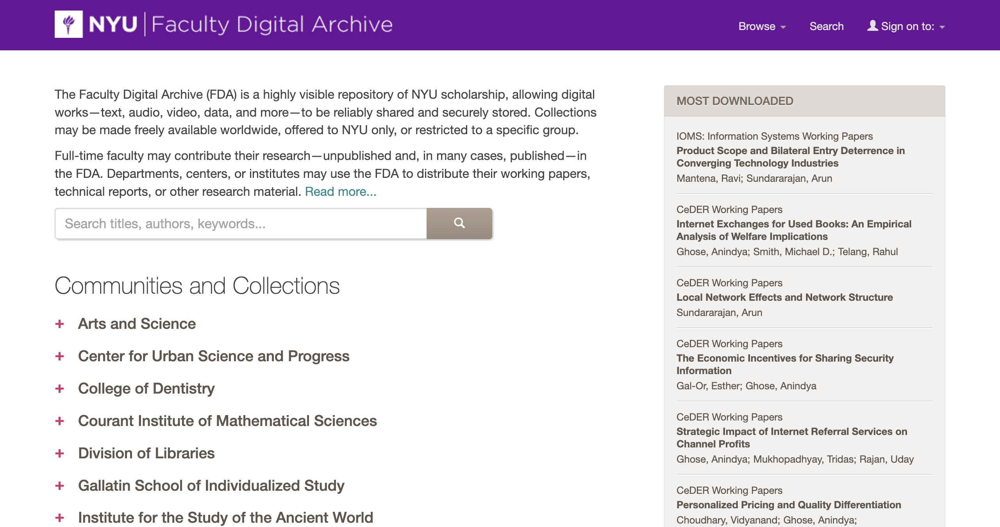

## Week 4
# Digital Archives Systems

---

# Today
- **Settle in/Reminders/Announcements** (15 min)
- **Discuss Last Week's Activity** (20 min)
- **Lecture: Digital Archives Systems** (45 min)
- **Break** (10 min)
- **Start Weekly Activity**

---

# Announcements

- I posted answers/responses to questions that came up during Week 3.
- In honor of the late Fobazi Ettarh, please consider reading <a href="https://www.inthelibrarywiththeleadpipe.org/2018/vocational-awe/" target="_blank">Vocational Awe and Librarianship: The Lies We Tell Ourselves</a>

---

# Digital Archives Systems

- Systems help manage & provide access to digital collections.
- We will cover a real-life example
- Systems must communicate with each other. This can be done using **APIs (Application Programming Interfaces)**.

<!--presenter notes 

Last week, we started discussing born-digital processing and the hands-on work of managing and preserving digital materials through imaging and transfers. We’ll continue exploring different aspects of that work in the coming weeks.

This week, we’re zooming out to look at systems: the tools that help us do this work at scale. To effectively manage digital collections, we need systems that can:
a.) Store and process data about files, such as those created through imaging or digitization.
b.) Make this data accessible to end-users—researchers, patrons, and casual browsers—so they can search, discover, and make sense of these materials.

I’ll walk through two real-life examples of archival systems in use:
- At Yale (where I work)
- At the Bentley Historical Library at the University of Michigan

These examples will show how different systems work together to support digital archiving.

Beyond just having systems, we also need to ensure that they communicate with each other—this is where interoperability comes in. If a system can send, receive, or exchange data with another system, it means they are interoperable.

One of the primary ways that systems "talk" to one another is through Application Programming Interfaces, or APIs. Today, we’ll introduce APIs and discuss how they allow different systems to share data, automate tasks, and enhance access to digital collections.

-->

---

## Definition
# Archival Repository (Physical)

An archival **repository** describes a physical location where an archive stores the physical holdings of their collection. Ideally, this is a secure and stable environment to combat against risk of damage from threats like water, heat and pests over the long-term both in service of preservation and access/retrieval.

<!--presenter notes 

To approach the topic of systems used in a digital repository (and defining what a digital repository is), let’s start by exploring the systems that support a physical archival repository.

An archival repository is a physical place where archives are kept. The physical components of an archival repository are stored on shelves (aka “stacks”) in, ideally, highly monitored, climate-controlled spaces, to ensure the materials are protected from risks posed by things like rodents, bugs, and humidity, but also organized in a way so items can be retrieved for access or remediation.

-->

---

# System Types - Physical Based
- **Collection Management**: to manage individual objects
- **Descriptive**: to manage intellectual arrangement/description
- **Catalog**: to manage bibliographic descriptions
- **Request & Patron**: Manage reading room requests, reproduction and other orders.

<!--presenter notes 

Let’s imagine we are working in a purely physical repository: just record boxes on shelves, no digital items. That would be pretty rare today, but for the sake of this example, let's focus only on the systems that help manage physical collections. Let's pretend it's the year 1995.

Here’s a non-exhaustive list of systems we might be using in this environment.

Oftentimes, these systems work separate from one another. For example, you would have the archivist entering finding aid data into a word processing document; you would have a spreadsheet or a simple database tracking object locations and reading room requests, a separate website that published a list of archival collections, and an online catalog entry for the archival collection, maybe with a special instruction to email the archives to schedule an appointment. Once you got to your appointment, the archivist would hand you a paper-based finding aid.
-->

---

# System Types
- **Collection Management**: to manage individual objects
- **Descriptive**: to manage intellectual arrangement/description
- **Catalog**: to manage bibliographic descriptions
- **Request & Patron**: Manage reading room requests, reproduction and other orders.
- **Digital Repository**: Accept, store, manage and deliver preserved digital assets.

---

A digital repository is like the electronic equivalent of the library stacks… digital items have a specific, persistent location… A digital repository does more than simply house digital objects online; it preserves their integrity in the long term.

Rachael Zipperer

Masters Candidate at the University of Texas School of Information, 2019

<!--presenter notes 

Link to Rachael’s blog post: https://www.tdl.org/2019/04/what-is-a-digital-repository/

Digital repositories function much like physical archival repositories—both are designed to organize, store, and provide access to materials. The way digital repositories are set up, managed, and maintained often mirrors how physical stacks work, following similar principles of organization and preservation.

However, digital repositories introduce added complexity. The biggest difference is in how materials are managed, requiring multiple layers of systems to track different aspects of digital objects.

For example, a floppy disk in a box would be tracked in a collection management system, which records its physical location—inside a specific box, on a particular shelf, in a room with controlled temperature and humidity.

But that same floppy disk may also have a digital presence that needs additional tracking. A separate system would record that a disk image exists, where it is stored on a server, and when its checksum was last verified.

Modern archival systems also need to connect the physical object to its digital manifestation, ensuring that both are managed in relation to each other. It would need to make that information available both to repository managers, and end-users, in a way that is understandable and discoverable.

A digital repository is just one layer in a larger system that tracks both the physical and digital characteristics, versions, and events of an archival object. These layers work together to maintain integrity, access, and preservation across different formats.

Just like physical stacks are supported by multiple systems, a digital repository is supported by multiple systems too.”

-->
---

# Systems Integration

Over time these systems started to become **integrated** with one another.

<!-- Presenter notes

While no perfect system of integrated systems exists, we are seeing more of an effort to make each of these system types work with one another. There are many reasons behind this push, and likely has had a lot to do with collections becoming increasingly online/networked. By nature, a network exchanges information, and in order to do that, systems need to be able to "talk" to each other in a way that makes them mutually understandable to one another. 

We also saw an extra push during COVID lockdown: this event increased patron expectations be able to look at materials in an online-only setting.

-->

---

## Definition
# Technology "Stack"

A **technology stack** (or just "stack" for short) refers to a layered set of technologies or systems that work together in a structured way.

<!--presenter notes

Now that we’ve talked about how different archival systems interact, both for physical and digital materials, let’s step back and look at how these systems fit together structurally.

In the world of technology, we often refer to these interconnected systems as a technology stack or simply a stack. A stack is a layered set of technologies, where different systems handle different responsibilities.

Here, we’re using the term broadly to describe how different archival and library systems fit together (hence the quotes around the term "Stack"), rather than a specific programming/software stack.

Examining examples of technology stacks helps us see how different systems communicate, where different types of data live, and how they integrate to form a functional ecosystem, whether we’re managing physical collections, digital archives, or both.

-->

---

### **List of Digital Repository System Functions**  

<ul class="system-list">
  <li>📖Descriptive/Bibliographic</li>
  <li>🖼️Digitization Workflow</li>
  <li>📁Digital/Media Asset Management</li>
  <li>🏛️Digital Preservation</li>
  <li>🌍Public Access and Discovery</li>
  <li>📂Metadata Management</li>
  <li>📊Repository Storage and Access</li>
  <li>🔐Rights and Access Control</li>
  <li>📝Workflow Management</li>
</ul>

<!--presenter notes

As you can see, the systems that support digital repository operations are varied. I’ll go through each of these next, but it’s worth keeping in mind that they rarely work in isolation. In practice, digital repository systems are often bundled together and handle multiple functions at the same time.

Also note that these describe systems in terms of functions.

-->

---

- Institutions bundle these functions differently
- One system may perform multiple roles
- Case studies show real-world trade-offs

<!--presenter notes

While I’m going to define each system function one-by-one, remember: real institutions often bundle these functions together. One system can do multiple jobs at once — and we’ll see that in the Bentley case study (coming up).

-->

---

# 📖 Descriptive and Bibliographic  
**Role:** System of record for description/authoritative metadata

- Organizes materials using metadata standards
- Provides controlled vocabularies for consistency
- For archives: expresses hierarchies, linked data
- Supports discovery with front-facing catalogs and finding aids

<!--Presenter notes

Please note that my use of "front-facing" or "front-end" refers to the parts of the system meant to be seen and consumed by an end-user (a patron, a researcher, a casual browser)

-->

---

# 🖼️ Digitization Workflow  
**Role:** Manage scanning and reformatting workflows

- Manages file creation
- Packages files for preservation and access
- Supports quality control
- Tracks progress of projects

---

# 📁 Digital/Media Asset Management 
**Role:** Manage digital files for access, reuse and distribution

- Store and organize access-ready files
- Links files to descriptive and administrative metadata
- Supports rights-aware access and reuse

---

# 🏛️ Digital Preservation  
**Role:** Ensure long-term accessibility, integrity, authenticity  
- Coordinate in/outflow of information packages
- Generate and apply provenance/preservation metadata
- Convert/migrate data objects to accessible formats
- Check and report on authenticity using fixity

---

# 🌍 Public Access and Discovery  
**Role:** Provide user-facing tools to search, browse, and access digital materials.  

- Aggregate metadata from multiple sources  
- Provide dynamic search and discovery across various systems of record

---

# 📂 Metadata Management  
**Role:** Standardize, transform, and distribute metadata.  

- Normalizes metadata for consistency and accessibility
- Maps fields between different schemas
- Supports automated workflows and interoperability

---

# 📊 Storage Infrastructure
**Role:** Manage storage environments

- Manage and report on space capacity/constraints
- Maintain administrative metadata
- Detect and prevent data corruption/errors  

---

# 🔐 Rights and Access  
**Role:** Manage permissions, restrictions, copyright compliance

- Control who can view, edit, or download files
- Control where access is granted (on/offsite)
- Track copyright & licensing information  
- Support authentication and authorization  

---

# 📝 Workflow and Project Management  
**Role:** Track digitization, preservation, and archival operations.  

- Organize tasks, project timelines
- Orchestrate handoffs between various systems
- Assign roles & responsibilities
- Log progress or blockers

---

# There are so many systems!

This might help:

<a href="https://docs.google.com/spreadsheets/d/1cXOug3qM0pNNeD_wssiVEv9c0W1Y5I1VDTnSPTk7fb4/edit?gid=0#gid=0" target="_blank">The Collection Management System Collection
</a>

This also might help:

<a href="https://coptr.digipres.org/index.php/Tools_Grid" target="_blank">COPTR Tools Grid</a>

<!--presenter notes

If you want to take a deep dive into all the systems that are out there, there are a couple of resources to check out. The first one is a crowd-sourced Google Sheet, “The Collection Management System Collection”, which was kick-started by Ashley Blewer, a software developer, educator, writer, and artist who has done incredible work, especially within the field of audio/visual and moving image preservation. In 2017, she made this spreadsheet publicly available for folks in the field to contribute system descriptions in a matrix form.

Another helpful resource is the Community Owned Digital Preservation Tool Registry (COPTR) Tools Grid, which uses a Wiki format. This grid starts off with a matrix of general digital preservation object types like “audio” or “ebook” on the Y-axis, and broad digital preservation functional areas on the X-axis. You can click on any of the numbers to see a list of relevant tools for that object type/functional area, and further drill down into other functional area sub-categories. There are nearly 600 tools described in this Wiki.

These lists show how many tools can fill the same function.

-->

---

# Integrating Systems
## How to Knit Software Systems Together

<!--presenter notes

Image from GIF Cities (https://web.archive.org/web/20091027084349/http://hk.geocities.com/kieou/3.htm)

In the early days of digital archiving and preservation, a variety of platforms emerged, to better automate, standardize and streamline various processes. Systems like ArchivesSpace emerged, designed with the intention of enabling archivists to accession collections, describe them accurately, and create and publish finding aids. Yet, these systems were built in isolation, tailored to specific tasks without consideration for the full lifecycle of digital records.

-->

---

## Question
# Why might one system need to communicate with another?

---

# Challenges of Disconnected Systems
❌ Redundant: The same information must be entered multiple times across systems.
❌ Human error: Manual updates encourage mistakes.
❌ Inconsistent: If metadata changes in one system, other systems may not get updated readily.

---

## Definition
# Systems Integration

A functional coupling between software applications to act as a coordinated whole.

Max Eckard

Making Your Tools Work for You

<!--presenter notes

Systems integration describes “[a] functional coupling between software applications to act as a coordinated whole.” This quote comes from Max Eckard’s book *Making Your Tools Work for You*, which was originally “adopted from... the ArchivesSpace Technical Advisory Committee (TAC) Integrations sub-team, which goes on to state that ‘a defining characteristic of all integrations is communication, i.e., seamless data flow–without a manual, intermediary step–between systems” (4).

Integration characterizes the ability of one or multiple systems to “talk” to one another. The development of interoperable standards and the adoption of holistic digital asset management solutions have started to bridge the gaps between previously isolated systems. These integrated platforms streamline the archival process—from digitization to online accessibility—reducing redundancy, minimizing errors, and significantly improving the discoverability of digital archives.

In addition, integration allows you to maintain your current system “ecosystem,” which is advantageous because no single system can do everything. In fact, having a single all-encompassing system might not be ideal. This modular approach enables systems ecosystems to be more flexible and adaptable over time.

-->

---

🥞

# 
Short Stack: Bentley Systems Integration

## 
Archivematica + ArchivesSpace + DSpace

---

<!--presenter notes

This is a screenshot of the system Archivematica. You will be using the Archivematica sandbox next week during your weekly activity.

-->

---

# 🏛️ Digital Preservation System
## Archivematica

* Open source; web browser-based (aka "SaaS")
* Modeled after OAIS
* Knits together various <a href="https://wiki.archivematica.org/Getting_started#Projects" target="_blank">**microservices**</a> to get lots of small and large jobs done, usually in a specific order, and following specific rules/policies.

<!--presenter notes

Don't worry, "SaaS", "open source" and "microservice" are defined in the next few slides!

-->

---

## Definition
# Software as a Service (SaaS) - 1/2

**Software as a Service (SaaS)** refers to any system that provides its services via the cloud.

<!--presenter notes

Rather than having to download software on your computer, you can access this software using a web browser. The software and all its data are hosted and maintained on remote servers by a third-party provider.

A popular archives-specific example of a SaaS platforms are Archivematica, ArchivesSpace. A SaaS service you might have encountered in your own work: Google Drive, Zoom.

-->

---

## Definition
# Software as a Service (SaaS) - 2/2

SaaS benefits

1. Users can access through a web browser.
2. Service provider manages updates, patches, and security.
3. Eliminates need to install, manage/ maintain software

---

## Definition
# Open source

**Open source** refers to software whose source code is made available to the public, allowing anyone to view, modify, distribute, and use it.

See: <a href="https://github.com/artefactual/archivematica" target="_blank">https://github.com/artefactual/archivematica</a>

<!--presenter notes

The key idea behind open-source software is that it promotes collaboration and transparency, enabling developers and users to contribute to its improvement, adapt it to their needs, and share it freely.

-->

---

## Definition
# Microservice

A **microservice** is an application responsible for performing a single or discrete set of functions/tasks.

<!--presenter notes

A microservice is an application designed to perform a single function within the digital curation and preservation process.  

The concept of a microservice was developed by the California Digital Library (CDL), which in 2009 introduced a new approach to the curation and preservation of digital objects. This reconceptualization challenged the assumption that “the curation and preservation of digital objects required the installation and operation of a single, long-lived application combining the necessary functions behind one user interface.”  

Instead, CDL proposed that “small, relatively simple utilities would pose fewer challenges in their development, deployment, maintenance, and enhancement than a large, integrated system, especially in the context of constant technological change.” Additionally, they noted that users could “easily adapt a set of distributed services to local conditions in different divisions and departments of the university, and easily replace each of them upon their obsolescence.” 

-->

---

# Just Some Archivematica Microservices

- Assign unique identifiers
- Generate and verify checksums
- Identify and report on file formats
- **Normalize** files into preservation and access formats

---

## Definition
# Normalize

**Normalize** refers to the activity of transforming files into standardized formats suitable for long-term preservation and/or access.

---

<!--presenter notes

ArchivesSpace (aka ASpace) is an archival system primarily used throughout the accessioning, arrangement and description of archival collections. The data entered
into ASpace can be used to produce finding aids in EAD XML format, so they may be viewed on the web.

Collections, or bodies of work, are called “resources”. Within each resource, you will find various levels of hierarchy that describe how a particular body of work is arranged, such as series or sub-series, which in ArchivesSpace are known as "archival objects". Archival objects can also be rolled up into what are known as "Top containers", which represent the physical containers/boxes that may be requested or circulated in a reading room or other special collection setting. So, ArchivesSpace also has a collection management side, as well as places to accession materials, and make connections between archival objects and digital objects.

-->

---

## 📖 Descriptive & Bibliographic System
# ArchivesSpace (Aspace)

* Open-source; web-browser based
* Intellectual arrangement; description
* Supports hierarchical description following archival standards (e.g., DACS, EAD)  

---

---

## 📁 Digital/Media Asset Management System  
# DSpace

- Web browser-based; Open source
- Stores and organizes access-ready digital objects
- Supports structured metadata (e.g., Dublin Core, MODS)
- Supports persistent identifiers (e.g., Handles; sometimes DOIs)
- Provides public-facing access

<!--presenter notes

In our system-type terms, DSpace is doing two jobs at Bentley:
1 - It stores and organizes access-ready objects
2 - It is the public interface where users find and retrieve them

That overlap is normal — it’s an example of bundled functions like we've been discussing throughout today.

-->

---

<!--presenter notes

In the Bentley article you read about how they integrated Archivematica, ASpace and DSpace. The way they were integrated was modeled after the Digital Curation Center or DCC Lifecycle Model.

Before we look at the Bentley Library example, we should understand what the DCC Model is, what it is for, and how it differs from the OAIS, specifically.

-->

---

<!--presenter notes

The DCC Curation Lifecycle Model provides a high-level graphical overview of the stages required for successful curation and preservation of data, starting from initial conceptualization or receipt. This model can be used to plan activities within an organization or consortium to ensure all necessary stages are undertaken in the correct sequence. 

It enables granular functionality to be mapped against the lifecycle, helping to define roles and responsibilities and to build a framework of standards and technologies for implementation. Additionally, it supports the identification of extra steps that may be required, actions that are unnecessary for specific situations or disciplines, and ensures that processes and policies are thoroughly documented.

For more information, refer to the [DCC Curation Lifecycle Model PDF](https://www.dcc.ac.uk/sites/default/files/documents/publications/DCCLifecycle.pdf).

-->

---

## Definition
# Digital Curation

**Digital curation** encompasses the selection, preservation, maintenance, collection, and archiving of digital assets, including data, documents, multimedia, and other digital objects. It involves managing the entire lifecycle of digital content to ensure its usability, integrity, authenticity, and accessibility over time.

---

<!--presenter notes

Here’s my cleaned-up more accessible version of the Bentley Diagram.

The Bentley Historical Library's integrated system achieved the following:

- Provided archivists with access to the ArchivesSpace interface directly from the context of the Archivematica system. This allowed them to use information generated during the Archivematica ingest process to inform appraisal tasks.  
- Enabled archivists to view ArchivesSpace resource records, add or edit archival descriptions, and create digital object instances in the finding aid—all without switching over to ArchivesSpace, using a tab within Archivematica.  
- Archivematica creates preservation packages (AIPs) and can deposit content into DSpace, which Bentley uses as the repository and access layer.  

-->

---

## Definition
# Application Programming Interface (API)

**Application Programming Interfaces**, or APIs, provide a way for disparate systems to request and exchange data from each other without needing to understand the internal workings of the other.

<!--presenter notes

The interoperability of these systems at Bentley was achieved using APIs.

Application Programming Interfaces, or APIs, provide a way for different software applications to communicate and request services or data from each other without needing to understand the internal workings of the other system. They enable applications to interact and collaborate, simplifying the development of interoperability.  

While not always required, APIs often use web protocols—sets of instructions specific to computers or servers within a network—to execute requests, update data, and perform other tasks.

APIs are very commonly used throughout digital repositories.

-->

---

# You have likely used an API unknowingly!
- The weather app you use likely pulls in data from centralized weather forecast databases using APIs.
- An airline booking website pulls in data from airline fare databases and filters the results to show you lowest fares.

<!--presenter notes

Let’s unpack what we just said about APIs and the web. Why do they often go hand in hand?  

A common way we send instructions to other computers around the world is by opening a web browser and typing in a URL to access a website. Here we are unknowingly prompting our web browser to send instructions to a server somewhere in the world.

We are all very used to using HTTP for our own, human-centric purposes, especially for browsing the web. However, websites and the servers that host them contain parts or areas that enable them to speak to other computers, with or without a human prompting that communication.

-->

---

## Definition
# Hypertext Transfer Protocol (HTTP)

**Hypertext Transfer Protocol (HTTP)** is the foundation of communication on the web. It is the protocol that allows computers to exchange data over the World Wide Web.

<!--presenter notes

- HTTP enables browsers to load web pages by requesting and receiving content from servers.
- It also powers APIs, allowing applications to send and receive data over the web using URLs.

-->

---

## Definition
# JavaScript Object Notation (JSON)

**JavaScript Object Notation (JSON)** (pronounced "jay-sohn") is a lightweight, structured data format used for exchanging information between systems.

<!--presenter notes

- Designed to be easy to read/write for humans and machines.
- Many APIs return data in JSON format because it is widely supported.

When we make an API request, the response we get back needs to be structured in a way that both humans and computers can understand. One of the most common formats for this is JSON, or JavaScript Object Notation.

JSON is a lightweight, easy-to-read format used for exchanging data between systems. It’s widely used in APIs because it’s simple for machines to process while still being human-readable.

When we requested data from the Library of Congress API, the response came back in JSON format—structured as key-value pairs that represent information. On the next slide, we’ll take a look at how JSON is structured and why it’s useful for APIs.
-->

---

## Definition
# Endpoint

An API **endpoint** is a _specific URL_ where an API receives requests and sends back responses.

<!--presenter notes

Think of an endpoint as a doorway to an API.

Each API has multiple endpoints, each designed for a specific task, like searching for weather data or retrieving digitized images.

ArchivesSpace provides a list of API endpoints. An API endpoint is a specific point of interaction between an API (Application Programming Interface) and the outside world, typically represented by a URL where the API can receive requests and send responses.

ArchivesSpace offers online documentation for all available endpoints. Using our cooking analogy, an endpoint is like browsing the menu of a restaurant.

In this case, I want to "order up" a list of repositories. To do this, I would search the ASpace REST API documentation for the keyword "repository" to see what it offers. Sure enough, there is an endpoint called "Get a List of Repositories," which seems to be exactly what I need.

You can check out the documentation here: [Get a List of Repositories](https://archivesspace.github.io/archivesspace/api/#get-a-list-of-repositories)

The documentation tells me that the specific endpoint is called `/repositories`. So, what does this mean for me?

-->

---

## Definition
# REpresentational State Transfer (REST)

Representational State Transfer **(REST)** is a set of instructions that are transmitted between computers using HTTP.

Common methods include `GET`, `POST`, `PUT`, and `DELETE`.

---

# REST Method: GET

Computer A: "Hello, can I `GET` some information from you?"
Computer B: "Sure, here you go."

---

# REST Method: POST

Computer A: "Hello, can I `POST` a new record?"
Computer B: "Sure, the record has been added."
Computer B (alt): "Nope, you don't have permission to do that."

---

# REST Method: PUT

Computer A: "Hello, can I `PUT` some data into an existing record?"

Computer B: "Sure, the existing record has been updated."
Computer B (alt): "Nope, you don't have permission to do that."

---

# REST Method: DELETE

Computer A: "Hello, can I `DELETE` this record?"

Computer B: "Sure, the record has been removed."
Computer B (alt): "Nope, you don't have permission to do that."

---

  

  
  

Mini Activity - API

_See the Library of Congress API in action._

<ul class="activity-list">
<li>Open any web browser.</li>
<li>Copy and paste this URL in your search bar: <a href="https://www.loc.gov/search/?q=maps&fo=json" target="_blank">https://www.loc.gov/search/?q=maps&fo=json</a></li>
<li>Check "pretty-print" checkbox to format the text data so it's more human-readable.
</ul>

<!--presenter notes

If you do not have the pretty-print option in your browser, you can copy and paste the data into this online tool: <a href="https://jsonformatter.org/json-pretty-print" target="_blank">https://jsonformatter.org/json-pretty-print</a>

-->

---

  

  
  

Using just your browser, you:
- Sent an API request to the Library of Congress API.
- Used the `/search/` **endpoint** to pass keyword search terms and get matching results back.
- Filtered results matching "maps" (`q=maps`) and return it in JSON (`fo=json`).</i>
- Used the `GET` REST command to **get** these map records.

<!--presenter notes

Q = "query"
FO = "Format"

-->

---

  

  
  

Inspect Steps:
- Open Inspect
- Click the "Network" tab and type in "search/" into the filter field.
- Click the result that comes up and look at its "Request Method": it will be listed as `GET`.

---

---

  

  
  

Example of a more complicated API URL: <a href="https://www.loc.gov/search/?q=photographs&fo=json&fa=partof:prints%20and%20photographs&dates=1900-1999
" target="_blank">https://www.loc.gov/search/?q=photographs&fo=json&fa=partof:prints%20and%20photographs&dates=1900-1999
</a>

Question: Looking at the URL, what are we asking the LOC API for?

---

**API**: A set of rules that networked computers can use to talk to and work with each other.

**HTTP**: A web protocol that APIs use to operate through networks.

**REST**: A set of API methods (`GET`, `PUT`, `POST`, `DELETE`)

**Endpoint**: A specific URL representing different records an API can see and update.

**JSON**: A data structure that APIs commonly use to represent data.

---

<!--presenter notes

Back to the Bentley!

In the Bentley integration system, we learned that Archivematica, a web-based system, can talk to ASpace, another web-based system, using an API. They do this using a combination of both the HTTP protocol, as well as another protocol known as REST.

-->

---

# APIs enable...  
**From within Archivematica (Appraisal tab):**
- `GET` ASpace resource records/hierarchies
- `PUT` updates/links back to ArchivesSpace

**From within ASpace:**
- `POST` Digital Object records linked to Archivematica outputs
- `PUT` descriptive/rights metadata updates to existing records

---

<!--presenter notes

Here we are seeing Archivematica calling up the archival object tree for a single ArchivesSpace resource using the ASpace API, and presenting it to the user as a list of nested folders.

-->

---

## Weekly Activity
# Short Stack 🥞

Start: <a href="https://digital-archives.github.io/HISTGA1011/activities/tech_stack.html" target="_blank">https://digital-archives.github.io/HISTGA1011/activities/tech_stack.html</a>

---

_Final questions or reflections?_

mary.kidd@nyu.edu