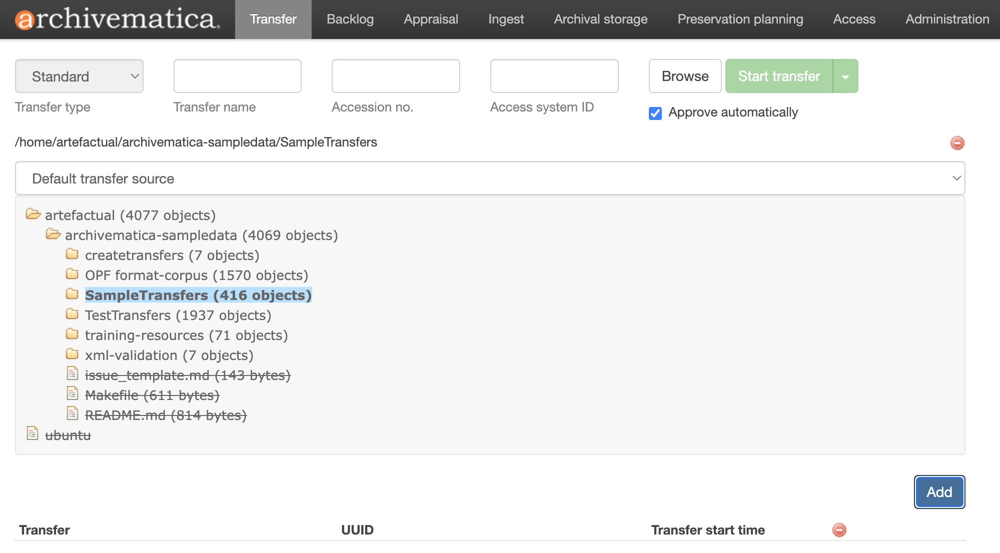
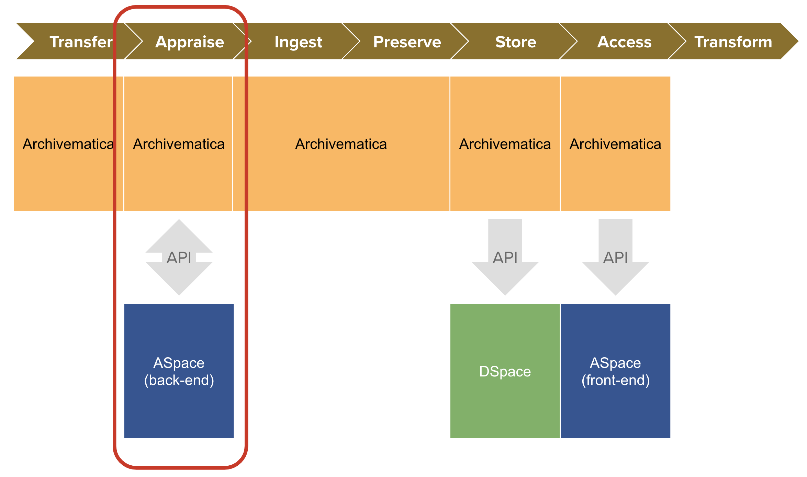
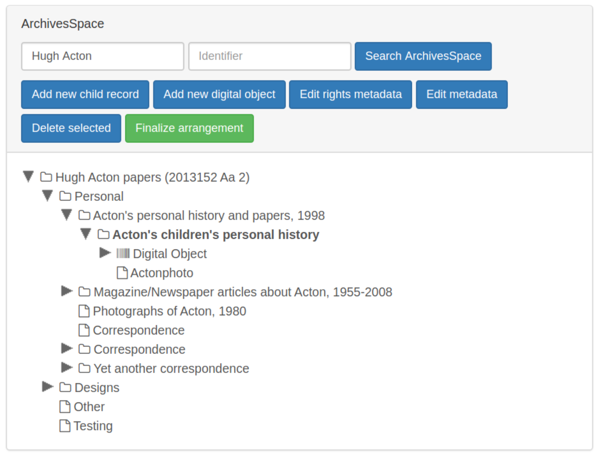

# Week 4
## Digital Repository Systems

---

# Today
- **Settle in/Reminders/Announcements** (15 min)
- **Discuss Last Week's Activity** (20 min)
- **Lecture: Digital Repository Systems** (45 min)
- **Break** (10 min)
- **Start Weekly Activity** (70 min)
- **Wrap up** (10 min)

---

# Announcements

_Feel free to email me with any announcements you would like me to boost (upcoming conferences, webinars, trainings, or other events/topics of interest)._

---

# Digital Archives Systems

---

## Definition
# Archival Repository

An__archival repository__ describes a physical location where an archive stores the physical holdings of their collection. Ideally, this is a secure and stable environment to combat against risk of damage from threats like water, heat and pests over the long-term both in service of preservation and access/retrieval.

<!--presenter notes 

Let’s start with a definition we are all probably fairly familiar with at this point: archival repository. An archival repository is a physical place where archives are kept. The physical components of an archival repository are stored on shelves (aka “stacks”) in, ideally, highly monitored, climate-controlled spaces, to ensure the materials are protected from risks posed by things like rodents, bugs, and humidity, but also organized in a way so items can be retrieved for access or remediation.

-->

---

## Definition
# Digital Repository

“A__digital repository__ is like the electronic equivalent of the library stacks; digital items are organized and searchable there, and they have a specific, persistent location so repository managers maintain intellectual control and researchers can find what they’re looking for. A digital repository does more than simply house digital objects online, it preserves their integrity in the long term.”

– Rachael Zipperer, Masters Candidate at the University of Texas School of Information, 2019

<!--presenter notes 

Link to Rachael’s blog post: https://www.tdl.org/2019/04/what-is-a-digital-repository/

Digital repositories function much in the same way as a “traditional” archival repository.

The way digital repositories are set up, managed and maintained in many ways are analogous to how physical stacks work, and why they are set up in the way they are set up. That said, a digital repository also has its differences. The main difference is in the way the things in the repository are managed. In archival repositories, you use rooms and shelves. In digital repositories, you use systems and databases, along with hardware, not just to store items securely, but manage them through their entire lifecycle across various digital preservation functions, such as ingest, access, and description.

-->

---

# System Functions
- Drive digital preservation workflows
- Manage deposits into repository
- Manage metadata workflows, taxonomies
- Manage digital assets
- Descriptive system of record
- Descriptive or archival processing
- Collection management
- Public-facing interface

---

# Islandora
### Open-source digital asset management system
#### Key Functions:
- Provides a dynamic, modern front-end based on Drupal for end-users, and a SOLR search engine
- Uses Fedora for back-end to manage preservation objects

<!--presenter notes

Digital preservation systems drive workflows specific to ingest, processing, auditing and analyzing digital objects entering into, being stored within, and being delivered from a digital repository. Many digital preservation systems take their queues from or
are directly modeled after the OAIS Reference Model. For a weekly activity, you will be testing out one widely-used digital preservation system called Archivematica.

-->

---

# Solr
#### Open-source search platform

Key Functions:
- Provides fast index-driven website search capability

---

## Fedora

### Key Function:
- Manage data objects on the "back-end"

### Examples:
- Fedora
- DSpace (specific to institutional repositories)

<!--presenter notes

Digital preservation systems drive workflows specific to ingest, processing, auditing and analyzing digital objects entering into, being stored within, and being delivered from a digital repository. Many digital preservation systems take their queues from or
are directly modeled after the OAIS Reference Model. For a weekly activity, you will be testing out one widely-used digital preservation system called Archivematica.

-->

---

<div style="width: 100%; padding: 20px; border: 2px solid #000; text-align: center; font-size: 24px; font-weight: bold; background-color: #f0f0f0;">
Digital Preservation System
</div>

### Key Function:
- Manage digital preservation workflows

### Examples:
- Preservica
- Islandora
- Rosetta

<!--presenter notes

Institutional repositories (sometimes shortened to "IR") manage submission workflows of digital works and provides access to various communities to these works. Institutional repositories are very common at university and other research-focused institutions, and are used to manage and provide access to things like scholarly articles, theses and dissertations, and other research outputs. A good example of an institutional repository system is DSpace, developed in the early 2000s by MIT.

-->

---

<div style="width: 100%; padding: 20px; border: 2px solid #000; text-align: center; font-size: 24px; font-weight: bold; background-color: #f0f0f0;">
  Digital Asset Management System (DAMS)
</div>

### Key Features:
- Streamlines digital content management
- Specific to files produced from digitization and/or born-digital files (images, audio, video)

### Examples:
- Orange Logic, ResourceSpace

<!--presenter notes

Digital Asset Management Systems (DAMS) streamline processes involved in managing digital content, including description, tracking, discovery, retrieval,
searching, and distribution of collections of digital objects. Unlike an institutional repository, a DAMS typically will be set up to handle formats beyond research outputs, such as images, audio and video formats. Examples: ResourceSpace

-->

---

<div style="width: 100%; padding: 20px; border: 2px solid #000; text-align: center; font-size: 24px; font-weight: bold; background-color: #f0f0f0;">
  Archival Management Systems
</div>

### Key functions:
- Maintain descriptive and arrangement data
- Produce finding aids
- Public user interface for search and discovery
- Collection management (acquisition, accession and location data)

### Examples:
- ArchivesSpace
- Archivist ToolKit (AT)

<!--presenter notes

Content Management Systems (CMS) are database applications intended to maintain descriptive and administrative metadata about the physical and digital
collections including records of provenance, acquisition, archival description, rights and location management. Some CMSs allow for storage of digital surrogates for access and management of collections NOT for digital preservation.

-->

---

# There are so many systems!

This might help:

<a href="https://docs.google.com/spreadsheets/d/1cXOug3qM0pNNeD_wssiVEv9c0W1Y5I1VDTnSPTk7fb4/edit?gid=0#gid=0" target="_blank">The Collection Management System Collection
</a>

This also might help:

<a href="https://coptr.digipres.org/index.php/Tools_Grid" target="_blank">COPTR Tools Grid</a>

<!--presenter notes

If you want to take a deep dive into all the systems that are out there, there are a couple of resources to check out. The first one is a crowd-sourced Google Sheet,
“The Collection Management System Collection”, which was kick-started by Ashley Blewer, a preeminent software developer, educator, writer, and artist who has done
incredible work, especially within the field of audio/visual and moving image preservation. In 2017, she made this spreadsheet publicly available for folks in the
field to contribute system descriptions in a matrix form.

Another helpful resource is the Community Owned Digital Preservation Tool Registry (COPTR) Tools Grid, which uses a Wiki format. This grid starts off with a matrix of
general digital preservation object types like “audio” or “ebook” on the Y-axis, and broad digital preservation functional areas on the X-axis. You can click on any of the numbers to see a list of relevant tools for that object type/functional area, and further drill down into other functional area sub-categories. There are nearly 600 tools described in this Wiki.

-->

---

## Definition
# Software as a Service (SaaS)

__Software as a Service (SaaS)__ refers to any system that provides its services via the cloud. Rather than having to download software on your desktop PC, you can access this software using an internet browser. The software and all its data are hosted and maintained on remote servers by a third-party provider.

A popular archives-specific example of a SaaS platform is ArchivesSpace. Other examples include Google Drive, Zoom

<!--presenter notes

There are a lot of benefits to using a SaaS system. 
1. Users can access SaaS applications through a web browser, from any device with an internet connection.
2. Maintenance-Free: The service provider manages updates, patches, and security, so users don't need to worry about maintenance.
3. Scalability: Users can scale up or down based on their needs, adjusting usage or subscription plans easily.

SaaS eliminates the need for users to install, manage, and maintain software, making it a convenient and cost-effective solution for many businesses and individuals.

-->

---

## Definition
# On-premesis hosting

Sometimes shortened to "on-prem", some institutions resort to hosting their own systems, which means they take responsibility for its maintenance and upgrades.

---

## Definition
# Open source

__Open source__ refers to software whose source code is made available to the public, allowing anyone to view, modify, distribute, and use it. The key idea behind open-source software is that it promotes collaboration and transparency, enabling developers and users to contribute to its improvement, adapt it to their needs, and share it freely.

Example: ArchivesSpace

---

# Interoperability and Integrations

<!--presenter notes

In the early days of digital archiving and preservation, a variety of platforms emerged, to better automate, standardize and streamline various processes. Systems like ArchivesSpace emerged, designed with the intention of enabling archivists to accession collections, describe them accurately, and create and publish finding aids. Yet, these systems were built in isolation, tailored to specific tasks without consideration for the full lifecycle of digital records.

-->

---

<!--presenter notes

Let’s imagine that the institution we work at have selected, from a collection, a set hand-written letters for digitization.

The process begins with recording the accession event in ArchivesSpace, then describing the letters to eventually be published as a finding aid.

Let's say, parallel to the archivist processing the letters, the acquiring curator expresses that they wish for the letters to be made available digitally, so that researchers can search the text.

The letters are sent to the photography lab, where each letter is scanned and color corrected, followed by careful renaming and organization into folders. These files were then transferred to a digital asset
management system for curation, and separately, submitted to a digital repository for long-term preservation. Each step in this example different systems, operating independently of one another. The result? A manual, time-consuming effort to link the
digital representations back to their descriptions in ArchivesSpace.

-->

---

# Implications of Siloed Systems

* Higher chance of human error
* Hard to maintain and troubleshoot
* Double (or triple... or more) data entry

Currently, we are seeing more efforts across the field to better integrate systems to "talk" to one another.

<!--presenter notes

This disjointed approach introduced several challenges:

- The risk of human error was high, as manual processes dominated the linking of digital objects to their metadata.
- Maintaining the integrity and accessibility of these digital archives over time becomes a Herculean task. For example, if you are using 4-5 systems and one system gets an upgrade, this can have a cascading effect on the other systems on which it depends, and one system may become incompatible with another.
- This also means you are entering the same information more than once across multiple systems. For example, the box number you enter into ArchivesSpace may need to be copied and pasted into another system. This increases drag, staff frustration, and introduces more opportunities for human error.
- Furthermore, the consistency and completeness of metadata across systems are perpetually at risk, compromising the discoverability and utility of these invaluable digital resources.

-->

---

## Definition
# Systems Integration

“A functional coupling between software applications to act as a coordinated whole.”
Max Eckard, Making Your Tools Work for You

<!--presenter notes

Systems integration describes “[a] functional coupling between software applications to act as a coordinated whole.” This quote comes from Max Eckard’s book *Making Your Tools Work for You*, which was originally “adopted from... the ArchivesSpace Technical Advisory Committee (TAC) Integrations sub-team, which goes on to state that ‘a defining characteristic of all integrations is communication, i.e., seamless data flow–without a manual, intermediary step–between systems” (4).

Integration characterizes the ability of one or multiple systems to “talk” to one another. The development of interoperable standards and the adoption of holistic digital asset management solutions have started to bridge the gaps between previously isolated systems. These integrated platforms streamline the archival process—from digitization to online accessibility—reducing redundancy, minimizing errors, and significantly improving the discoverability of digital archives.

In addition, integration allows you to maintain your current system “ecosystem,” which is advantageous because no single system can do everything. In fact, having a single all-encompassing system might not be ideal. This modular approach enables systems ecosystems to be more flexible and adaptable over time.

-->

---

## Case Study
# Bentley Historical Library

Archivematica-ArchivesSpace-Dspace Integration

<!--presenter notes

In this week’s assigned reading, we learned how the Bentley Historical Library developed an integrated system using three of the four digital repository system types we just covered: **Digital Preservation System** (Archivematica), **Institutional Repository** (DSpace), and **Content Management System** (ArchivesSpace). The goal was to leverage each system’s strengths to fully support an “end-to-end digital archives workflow.”  

These types of integrative setups are quite common in digital archives. Such integrations are achieved using **application programming interfaces (APIs)**, which are essentially sets of instructions or protocols that allow one system to communicate with or update data in another.  

Let’s explore each of these systems further.

-->

---



---

## Digital Preservation System
# Archivematica

* Web/browser-based
* Open source
* Modeled after OAIS
* Knits together various__microservices__ to get lots of small and large jobs done, in a specific order

<!--presenter notes

-->

---

## Definition
# Microservice

A__microservice__ is an application responsible for performing a single function.

<!--presenter notes

A microservice is an application designed to perform a single function within the digital curation and preservation process.  

The concept of a microservice was developed by the California Digital Library (CDL), which in 2009 introduced a new approach to the curation and preservation of digital objects. This reconceptualization challenged the assumption that “the curation and preservation of digital objects required the installation and operation of a single, long-lived application combining the necessary functions behind one user interface.”  

Instead, CDL proposed that “small, relatively simple utilities would pose fewer challenges in their development, deployment, maintenance, and enhancement than a large, integrated system, especially in the context of constant technological change.” Additionally, they noted that users could “easily adapt a set of distributed services to local conditions in different divisions and departments of the university, and easily replace each of them upon their obsolescence.” 

-->

---

# Microservices Examples

<table>
<tr>
<td>

## Identity
Assign a unique identifier

## Storage
Transfer data into protected environment

## Fixity
Verify data integrity over time

</td>
<td>

## Inventory
Produce manifests/lists

## Replicate
Create and distribute redundant copies

## Characterize
Analyze/report technical metadata

</td>
</tr>
</table>

<!--presenter notes

-->

---


<!--presenter notes

ArchivesSpace (aka ASpace) is an archival system primarily used throughout the accessioning, arrangement and description of archival collections. The data entered
into ASpace can be used to produce finding aids in EAD XML format, so they may be viewed on the web.

Collections, or bodies of work, are called “resources”. Within each resource, you will find various levels of hierachy that describe how a particular body of work is arranged, such as series or sub-series, which in ArchivesSpace are known as "archival objects". Archival objects can also be rolled up into what are known as "Top containers", which represent the physical containers/boxes that may be requested or circulated in a reading room or other special collection setting.

-->

---

## Archival Management System
# ArchivesSpace (Aspace)

---


---

## Institutional Repository
# DSpace

<!--presenter notes

DSpace is an open-source repository platform. If you were to encounter an institution that uses DSpace, what you, as the user would ultimately see is some sort of catalog.

This is a screencapture from the DSpace website using NYU's Faculty Digital Archive, but you can see that DSpace essentially looks and behaves like a library or archive catalog.

-->

---


<!--presenter notes

The article you read about the Bentley Archivematica - ASpace - DSpace integration maps out their integration with the Digital Curation Center or DCC Lifecycle Model.
Before we look at the Bentley Library example, we should understand what the DCC Model is, what it is for, and how it differs from the OAIS, specifically.

-->

---

<center></center>

<!--presenter notes

Here’s the cleaned-up version of the text:

---

The DCC Curation Lifecycle Model provides a high-level graphical overview of the stages required for successful curation and preservation of data, starting from initial conceptualization or receipt. This model can be used to plan activities within an organization or consortium to ensure all necessary stages are undertaken in the correct sequence. 

It enables granular functionality to be mapped against the lifecycle, helping to define roles and responsibilities and to build a framework of standards and technologies for implementation. Additionally, it supports the identification of extra steps that may be required, actions that are unnecessary for specific situations or disciplines, and ensures that processes and policies are thoroughly documented.

For more information, refer to the [DCC Curation Lifecycle Model PDF](https://www.dcc.ac.uk/sites/default/files/documents/publications/DCCLifecycle.pdf).

-->

---

## Definition
# Digital Curation

__Digital curation__ encompasses the selection, preservation, maintenance, collection, and archiving of digital assets, including data, documents, multimedia, and other digital objects. It involves managing the entire lifecycle of digital content to ensure its usability, integrity, authenticity, and accessibility over time.

---

<table>
<tr>
<td valign=top>
<h1>DCC Model</h1><br>
Looks at the entire digital curation lifecycle, which includes digital preservation, as well as selection, organization, and access to digital content.
</td>
<td valign=top>
<h1>OAIS Framework</h1><br>
Focuses specifically on digital preservation activities, processes, and technological approaches to setting up a successful digital preservation system.
</td>
</tr>
</table>

---


<!--presenter notes

Here’s the cleaned-up version:

---

The Bentley Historical Library's integrated system achieved the following:

- Provided archivists with access to the ArchivesSpace interface directly from the context of the Archivematica system. This allowed them to use information generated during the Archivematica ingest process to inform appraisal tasks.  
- Enabled archivists to view ArchivesSpace resource records, add or edit archival descriptions, and create digital object instances in the finding aid—all without switching over to ArchivesSpace, using a tab within Archivematica.  
- Integrated Archivematica with DSpace to facilitate the deposit of Archival Information Packages (AIPs) into its preservation repository. Once deposited, the system returned a unique resource identifier (URI) to the ArchivesSpace access portal, enabling users to search for and access digital content.  

-->

---

## Definition
# Application Programming Interface (API)

<!--presenter notes

APIs provide a way for different software applications to communicate and request services or data from each other without needing to understand the internal workings of the other system. They enable applications to interact and collaborate, simplifying the development of interoperability.  

While not always required, APIs often use web protocols—sets of instructions specific to computers or servers within a network—to execute requests, update data, and perform other tasks.

-->

---

## Definition
# API Endpoint

An API endpoint is a specific point of interaction between an API and the outside world. It is typically represented by a URL where the API can receive requests and send responses.

<!--presenter notes

ArchivesSpace provides a list of API endpoints. An API endpoint is a specific point of interaction between an API (Application Programming Interface) and the outside world, typically represented by a URL where the API can receive requests and send responses.

ArchivesSpace offers online documentation for all available endpoints. Using our cooking analogy, an endpoint is like browsing the menu of a restaurant.

In this case, I want to "order up" a list of repositories. To do this, I would search the ASpace REST API documentation for the keyword "repository" to see what it offers. Sure enough, there is an endpoint called "Get a List of Repositories," which seems to be exactly what I need.

You can check out the documentation here: [Get a List of Repositories](https://archivesspace.github.io/archivesspace/api/#get-a-list-of-repositories)

The documentation tells me that the specific endpoint is called `/repositories`. So, what does this mean for me?

-->

---

## Definition
# Hypertext Transfer Protocol (HTTP)

The underlying protocol used on the web to exchange data between computers using the world wide web.

---

# https://thebestestwebsite.net/

Translation: "Using the__Hypertext Transfer Protocol Secure (HTTPS)__, retrieve the contents of the resource specified after the Uniform Resource Identifier marker (`://`) (e.g., `thebestwebsite.net`) and render it on my screen."

<!--presenter notes

Let’s unpack what we just said about APIs and the web. Why do they often go hand in hand?  

A common way we send instructions to other computers around the world is by opening a web browser and typing in a URL to access a website. Here we are unknowingly prompting our web browser to send instructions to a server somewhere in the world.

We are all very used to using HTTP for our own, human-centric purposes, especially for browsing the web. However, websites and the servers that host them contain parts or areas that enable them to speak to other computers, with or without a human prompting that communication.

-->

---



<!--presenter notes

In the Bentley integration system, we learned that Archivematica, a web-based system, can talk to ASpace, another web-based system, using an API. They do this
using a combination of both the HTTP protocol, as well as another protocol known as REST.

-->

---

## Definition
# REpresentational State Transfer (REST)

Representational State Transfer__(REST)__ is a set of instructions that are transmitted between computers using HTTP.

Common methods include GET, POST, PUT, and DELETE.

---

## REST Method: GET

<table>
<tr>
<td width="50%" valign=top>
<span style="font-size: 250px;">🖥️
<br>Computer A: "Hello, can I <b>GET</b> some information from you?"
</td>

<td valign=top>
<span style="font-size: 250px;">🖥️
<br>Computer B: "Sure, here you go."
</td>
</table>

---

## REST Method: POST

<table>
<tr>
<td width="50%" valign=top>
<span style="font-size: 250px;">🖥️
<br>Computer A: "Hello, can I add a new record?"
</td>

<td valign=top>
<span style="font-size: 250px;">🖥️
<br>Computer B: "Sure, the record has been added."
</td>
</table>

---

## REST Method: PUT

<table>
<tr>
<td width="50%" valign=top>
<span style="font-size: 250px;">🖥️
<br>Computer A: "Hello, can I update an existing record?"
</td>

<td valign=top>
<span style="font-size: 250px;">🖥️
<br>Computer B: "Sure, the record is now updated."
</td>
</table>

---

## REST Method: DELETE

<table>
<tr>
<td width="50%" valign=top>
<span style="font-size: 250px;">🖥️
<br>Computer A: "Hello, can I remove this record?"
</td>

<td valign=top>
<span style="font-size: 250px;">🖥️
<br>Computer B: "Sure, the record has been removed."
</td>
</table>

---
# Python Code Snippet Using APIs

```
# Import the library that allows you to use APIs
import requests

# Form the URL through which we will make a request
url = 'https://archivesspace-staff.nypl.org/repositories/'

# Make a GET request through the URL and store the data in memory
response = requests.get(url)

# Check if the request was successful
if response.status_code == 200:
    # Take the data and print it on screen
    users = response.json()
    print(users)
    # If not successful, let me know
else:
    print(f'Failed to get data, sorry! Status code: {response.status_code}')

```
<!--presenter notes

Here’s some Python code!  
Python is a widely-used programming language, popular in many fields, including digital preservation and archives.

This code snippet starts off with "import requests". What this means is that we are importing what's known in programming as a "library" of functionality that allows us to make API "calls" to ArchivesSpace. You can think of a library as a cookbook filled with recipes you can use to make a meal. Similarly, a library has a bunch of little pre-written code snippets we can use to call up a computer and ask things of it.

In this example, I am queringy the ArchivesSpace API and asking it to return a list of repositories. So let's say I was querying the NYU ASpace API, it would return a list of repositories that use ASpace here, like Fales or Taimament.

Of course, you could do this manually. You could visit the ASpace NYU website, and click on the Repositories dropdown, and then just re-type a list of the repositories listed there. Easy enough: but automating this cuts down on errors and is faster, especially if you are doing it multiple times.

In my code, notice how tacked on at the end of the NYPL ASpace URL is "/repositories/". This is what I mean by how REST uses HTTP: Here, you are basically saying, at this address, open this particular door to the repositories room, and GET me information about repositories.

-->

---
# JavaScript Object Notation (JSON)

```
[

  {
  "id": 1,
  "name": "Manuscripts and Archives Division",
  "uri": "/repositories/2",
  "repo_code": "MSS",
  "location": "Stephen A. Schwarzman Building"
  },

  {
  "id": 2,
  "name": "Rare Books Division",
  "uri": "/repositories/3",
  "repo_code": "RBD",
  "location": "Stephen A. Schwarzman Building"
  },

  { ...etc
```

<!--presenter notes

APIs return data in what is known as JavaScript Object Notation, or JSON (pronounced kind of like the name "Jason"). If you are seeing JSON for the first time it may look a bit strange at first, especially because of the brackets and curly braces. But look a bit closer and you'll also not only see human-readable information, but also a kind of repeating structure. Each repository (Manuscripts and Archives Division, Rare Books Division) and its associated data is contained within a pair of curly braces {}.

-->

---

## Definition
# JavaScript Object Notation (JSON)

__JavaScript Object Notation (JSON)__ is a data interchange format that is easy for both humans and machines to parse and use.

<!--presenter notes

JavaScript Object Notation (JSON) is a lightweight data-interchange format that is easy for humans to read and write and easy for machines to parse.

-->

---

# Recap

<table>
<tr>
<td valign=top>

<b>API</b>
A set of rules that disparate computers can use to talk to and work with each other.

<b>HTTP</b>
A web protocol that APIs use to operate through networks.

<b>REST</b>
A set of API methods (GET, PUT, POST, DELETE)

</td>

<td valign=top>

<b>Endpoint</b>
A specific URL representing different records an API can see and update.

<b>JSON</b>
A data structure that APIs commonly use to relay and output data.
</td></tr></table>

---


---

# The ASpace/Archivematica API allows archivists to:  

- Search for ArchivesSpace resource records from within the context of Archivematica.
- Create ArchivesSpace digital object instances and associate them with AIPs from Archivematica from within the context of ASpace.
- Edit or add existing archival object instances.  
- Edit metadata, including rights metadata.

---

<center></center>

---

## Question

What ArchivesSpace API endpoints do you think Archivematica is using within the “Appraisal” tab to bring back and update information in ArchivesSpace?

---

## Weekly Activity
# Tech Stack

Start: <a href="https://digital-archives.github.io/HISTGA1011/activities/tech_stack.html" target="_blank">https://digital-archives.github.io/HISTGA1011/activities/tech_stack.html</a>

---


_Final questions or reflections?_

mary.kidd@nyu.edu