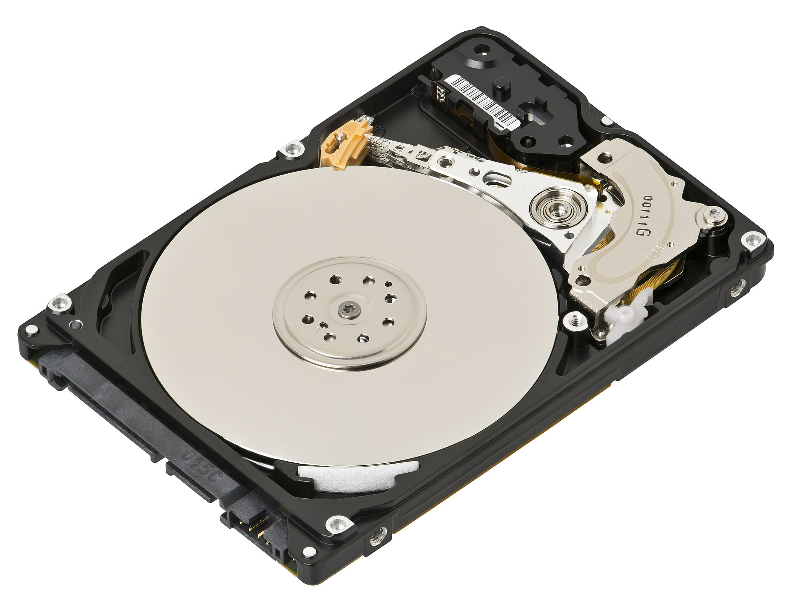
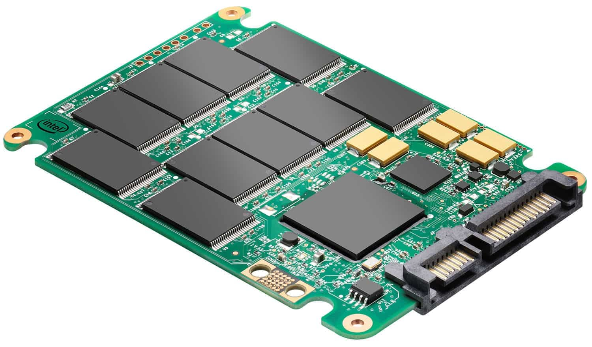
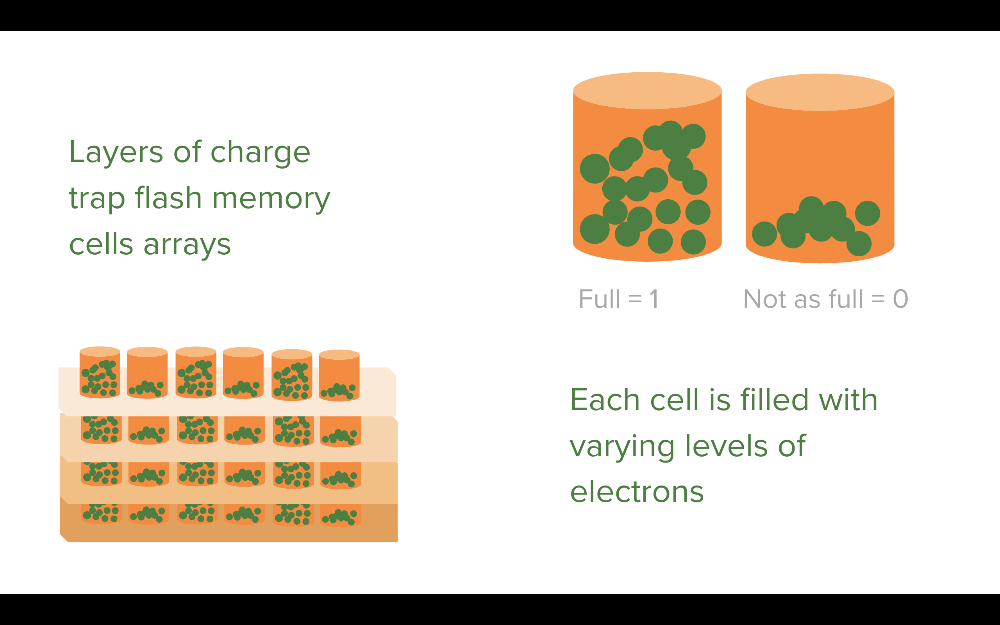
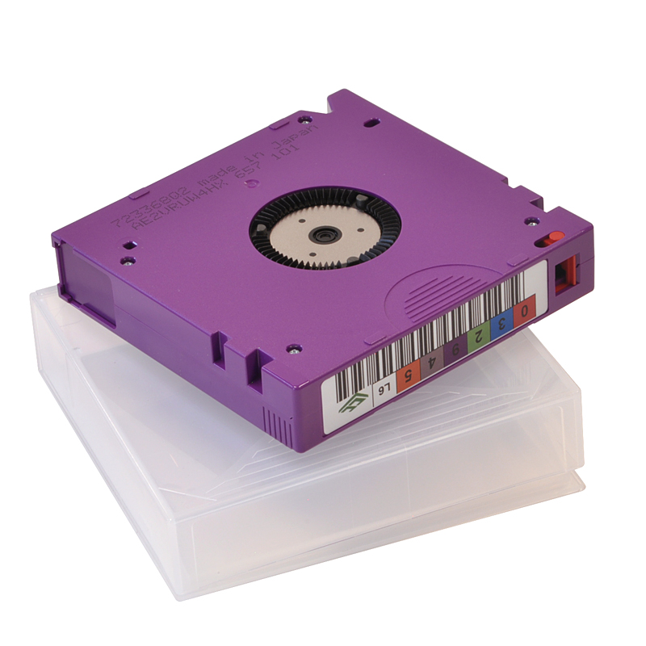
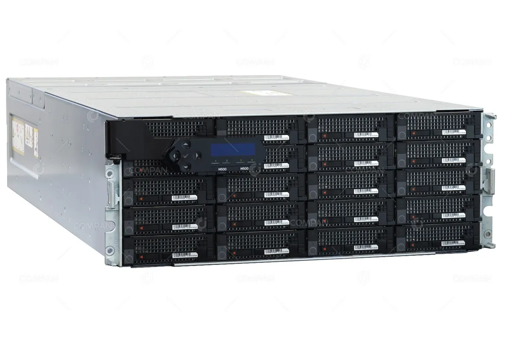
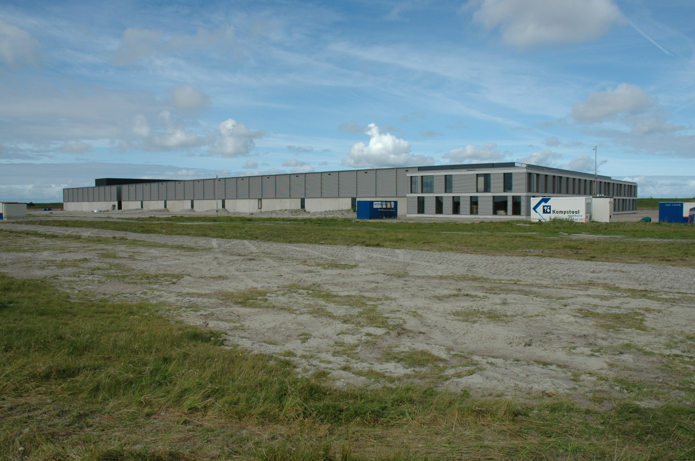
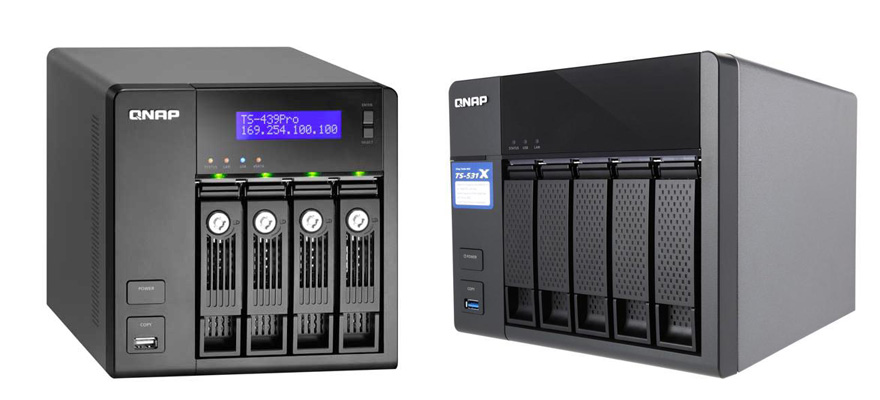
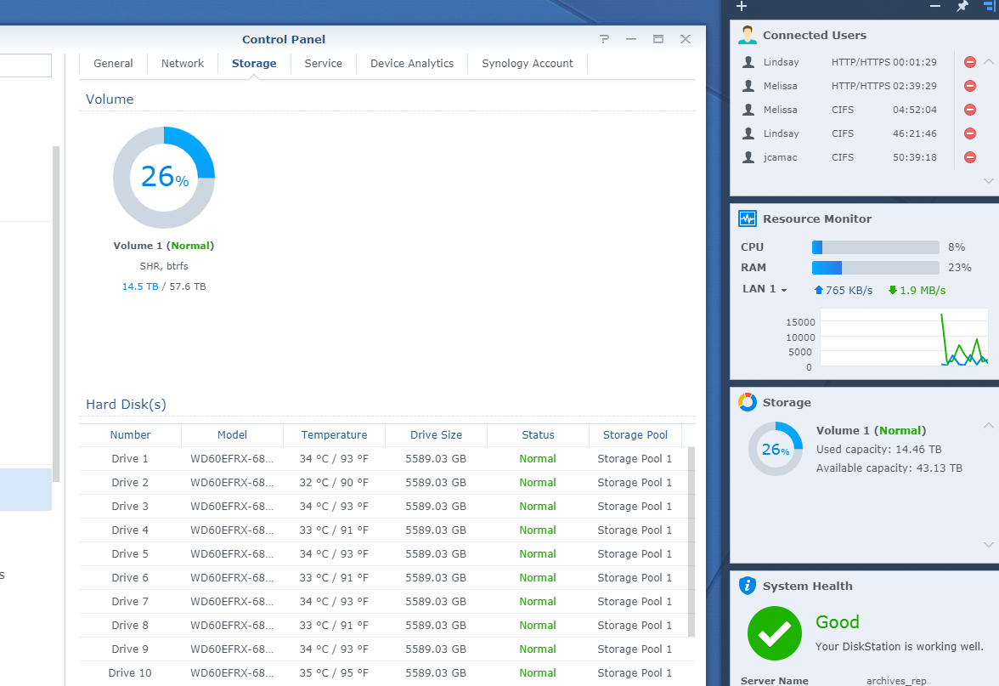
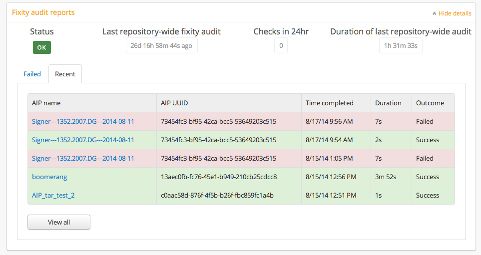

## Week 5
# Digital Preservation Storage Systems

---

# Today
- **Settle in/Reminders/Announcements** (15 min)
- **Discuss Final Project** (20 min)
- **Lecture: Storage Systems** (45 min)
- **Break** (10 min)
- **Start Weekly Activity** (70 min)
- **Wrap up** (10 min)

---

# Announcements

---

# Final Project

https://digital-archives.github.io/HISTGA1011/final_project/

---

# 1. Decide on a collection
# 2. Reach out to a repository
# You will thank yourself later!
---

# Storage Systems
- Architectures
- Hardware
- Solutions
- Risks and Techniques to Prevent Loss

<!--presenter notes

This week we are going to focus on storage systems.

Digital repositories rely on redundant storage to function. By redundant, I mean setting up a system that does not rely on a single solution - like one hard drive or one cloud storage account.

By "storage", we are going to spend some time specifically focusing on how storage is set up by going over various storage architectures, then hardware where I'll show you pictures of how storage devices are constructed and how they work, then solutions (how institutions implement storage in practice) and finally risks: much like a physical space is prone to leaks, mold, and pests, storage environments vulnerable to these same threats, but also to threats that happen on a microscopic scale in terms of the site or sites of failure, that cannot be discerned by the naked eye, as well as threats on an economic scale, tied to the cost of maintaining and powering storage devices.

We will discuss strategies to detect and mitigate failure, that can lead to loss on scales of incredible magnitude.

-->

---

## Definition
# Data Storage - 1/2

**Data storage** (or just "storage" for short) refers to the process of saving, retaining, and accessing digital data on various media and devices. It enables computers and other electronic systems to store files, applications, and system information for immediate or future use.

<!--presenter notes

Beginning with a basic definition, data storage refers to the process of saving, retaining, and accessing digital data on various media and devices.

It’s what allows computers to store files, applications, and system information so that they can be used again and again.

-->

---

## Definition
# Data Storage - 2/2

1. **Primary Storage** – Fast, temporary storage used by active processes. Example: RAM (Random Access Memory).

2. **Secondary Storage** (Persistent Storage) – Long-term data storage that retains information even when powered off. Example: HDD (Hard Disk Drive)

_Today we will focus on Secondary Storage._

<!--presenter notes

There are two main categories of storage.

First, primary storage. This is fast and temporary. It’s used by active processes — things happening right now. Random Access Memory (aka RAM) is session-specific. It holds memory for as long as you need it; as soon as you power down your laptop or device, that information is forgotten. An example of this is, typing into a document where you haven't turned on autosave. If your power goes out before you've saved it, the next time you power up your laptop, whatever you written will have been lost.

Second, secondary storage — also called persistent storage. This is long-term storage. It retains data even when the system is powered off. Hard disk drives and solid-state drives (we'll go into how these work in a second) are an example of this.

-->

---

## Definition
# Storage Architecture

**Storage architecture** refers to the overall design and organization of a storage system. This usually includes the types of storage devices/technologies used, the way data is stored and organized, and the methods used to access and manage the stored data.

<!--presenter notes

Storage architecture refers to the overall design and organization of a storage system, including the types of storage devices used, the way data is stored and organized, and the methods used to access and manage the stored data.

The storage architecture of a system can have a significant impact on the overall performance and reliability of an organization's digital preservation infrastructure, as well as its ability to meet the demands of growing amounts of data and changing business requirements.

-->

---

# Storage Architectures: Three Types

# **1. Online**
# **2. Nearline**
# **3. Offline**

<!--presenter notes

Source: https://www.nedcc.org/fundamentals-of-av-preservation-textbook/chapter-4-introduction/chapter-4-section-3
There are three common types of storage infrastructures used in digital preservation.

These categories describe how accessible the data is and how the system is designed to retrieve it.

-->

---

# 🔥 Online Storage
  
- Data is always immediately accessible: real-time input/output (I/O)
- Supports real-time reading and writing
- Is always powered on and connected
- Usually used in active production environments

<!--presenter notes

Online: Let’s start with online storage sometimes called ‘hot’ storage, hence the fire emoji. Online storage means the data is immediately accessible. It supports real-time reading and writing, so the system can retrieve or modify files without delay.

This storage is always powered on and connected. It’s designed for speed and responsiveness.

For example, when I worked at New York Public Radio, reporters and producers needed immediate access to recently used audio and video clips. That content lived in online storage because any delay would interrupt production.

-->

---

## **Question**
Based on what we just discussed about online storage (immediate access, real-time input and output, always powered on) which types of information packages (SIPs, AIPs, DIPs) do you think are most appropriate for this environment?

---

# 🐌 Offline Storage
- Passive, non-networked or detached media
- Requires action to connect and access

<!--presenter notes

Offline: Offline storage architecture refers to non-networked storage. Depending on your offline storage solution, as well as the size of file you are trying to access, delivering the file to you could take several hours. However, the purpose of offline storage is never for quick access and so is sometimes referred to as “cold storage”.

The type of storage architecture established should take into consideration the types of data being stored, the expected growth of the data over time, the access patterns to the data, and the requirements for data protection and data availability. Each type of storage architecture has advantages and disadvantages which we will discuss later on in the lecture.

-->

---

# ⏳ Nearline Storage
Storage generally designed to provide retrieval performance between online and offline storage. Typically, nearline storage is designed in a way that file retrieval is not instantaneous but is available to the user in the same session.

<!--presenter notes

Nearline: The term “nearline” is a portmanteau of “near” and “online”. Like online storage, it is also accessible via a network. However, it is not instantly accessible. This storage may be more suitable for less used archival data.

Definition comes from: 

Trends in Digital Preservation Capacity and Practice: Results from the 2nd Bi-annual National Digital Stewardship Alliance Storage Survey

D-Lib Magazine
July/August 2017
Volume 23, Number 7/8

https://doi.org/10.1045/july2017-gallinger

-->

---

# Storage Hardware

<!--presenter notes

Next, we will discuss different types of technologies, which may be used in any of these three architecture types. You will see that some storage technologies are more appropriate for the different types.

-->

---
    
  <!-- Image -->
  

<!--presenter notes

Hard disk drive (HDD): Mechanical spinning disk; arm reads/writes bitstreams using magnetism.

-->

---

## Definition
# Hard Disk Drive (HDD)

A **hard disk drive (HDD)** is a data storage device that uses spinning magnetic disks (platters) to store and retrieve digital information. It consists of a rotating platter, a read/write head, and an actuator arm that moves across the disk to read or write data.

---
  

<!--presenter notes

Great video to watch that clearly explains how SSD technology works: https://www.youtube.com/watch?v=5Mh3o886qpg

You have likely encountered solid state drive technology if you have ever used a laptop, or a smartphone, or flash drive.

Layers of charge trap flash memory cells arrays

Each cell is filled with varying levels of electrons

-->

---

## Definition
# Solid State Drive (SSD)

A **solid-state drive (SSD)** is a high-speed storage device that uses flash memory to store data, rather than spinning magnetic disks like a traditional hard disk drive (HDD). SSDs have no moving parts, which makes them faster, more durable, and energy-efficient compared to HDDs.

---

<!--presenter notes

How does solid state drive (SSD) technology work?

Reads/writes data onto layers of silicon chips. This stacking method allows for high-storage density over a small space.

These chips, in turn, contain arrays of tiny “charge trap memory cells”. Data is encoded by filling the charge trap memory cells with volumes of electrons. The quantity of electrons contained in a cell corresponds to a single bit, so a lot of electrons corresponds to a 1, and a little bit of electrons corresponds to a 0.
Today’s technology allows for one memory cell to hold up to 3 bits. Advances in SSD storage technology are bound to increase this.

The cells trap or “save” the level of electrons, which is how SSD drives store memory. To read the information, the level is measured. The measurement corresponds to a bitstream. To erase what is stored, you empty the cell of all electrons.

-->

---

<!--presenter notes

Illustrations and text from http://hyperphysics.phy-astr.gsu.edu/hbase/Audio/tape2.html

Magnetic tape, such as what you would find in a cassette tape cartridge or reel-to-reel, is made up of long thin strips of polyester plastic. The tape is coated in an emulsion, which is bound to the tape using a plastic-based “binder”, or a kind of glue that makes the emulsion stick to the tape. The emulsion is embedded with tiny magnetic-sensitive oxide particles.

-->

---

# Definition
## Linear Tape Open (LTO)

**Linear Tape-Open (LTO)** is a high-capacity, magnetic tape storage format designed for long-term data backup and archival storage. It is an open standard, meaning multiple manufacturers can produce compatible tapes and drives, ensuring widespread adoption and longevity.

---

# Comparison: Storage Hardware

| **HDD**        | **SSD**         | **Tape**            |
| -------------- | --------------- | ------------------- |
| 💲 ~$40/TB     | ⚡ Fast          | 💲 $4–8/TB          |
| Mechanical     | No moving parts | Energy efficient    |
| Slower         | Expensive       | Slow access         |
| Higher failure | Limited writes  | Proprietary systems |

<!--presenter notes

Comparison chart (updated February 2023) showing cost per terabyte of various HDD/SSD devices:
https://edwardbetts.com/price_per_tb/

We’ve covered three common storage technologies, using HDDs, SSDs and magnetic tape, and various solutions using these technologies.

HDD
Pros: The cost comparison between an HDD and SSD shows that HDDs are less costly than SSDs, coming in at $40 a TB.
Cons
An HDD is made up of moving parts, meaning, mechanical action must occur for it to read and write data. As a result, HDDs, especially when compared to SSDs, tend to run slower. You’ll notice this especially on computers booting up; typically, a computer with an SSD drive tend to start up quicker than those using an HDD.
Because HDDs are mechanical, they are less durable and more prone to physical damage.

SSD
Good overview written by Backblaze on SSD reliability: https://www.backblaze.com/blog/how-reliable-are-ssds/

Pros
- Faster: unlike a hard drive, a solid state drive has no moving parts (i.e. arm/spinning disk). Therefore, it takes less time for it to “seek”. If you boot up an operating system running on an SSD, it will take a shorter amount of time than running off an HDD.
- Durable: because it does not require moving parts, it is more resistant to damage due to physical shock
- Smaller

Cons
- More expensive
- Set life expectancy with a finite number of write cycles before performance becomes erratic.
- Tiered storage uses SSD with backup to cloud or HD

Tape

Pros
- Tape is the least expensive storage solution, especially in terms of cost per terabyte, averaging between $4-$8 per terabyte.
- The latest generations of LTO tape (LTO-8 is the latest, as of 2023) can now hold up to 30 TB per tape.

Cons
- Tape is slower, but in some ways this is less a “con” and more just telling us what it is good for, which is, offline or “cold” storage, and only accessed when you are either performing a routine backup to it, or you are needing whatever it contains to restore part of your repository.

As a result of tape libraries being a type of cold storage, they end up using less energy. Data centers that use HDD or SSD technologies, conversely, require more intensive climate control. This makes tape libraries the most sustainable of the three technologies.

Because tape libraries tend to be used more for cold storage, it also means less wear and tear on the tape library itself. Less wear and tear translates to a longer life expectancy overall for a tape library.
One big con of a tape library is its reliance on proprietary hardware and software. Tapes are made by companies that require specific machines and software to read, write and access them.

-->

---

## Definition
# Storage Solution

A **storage solution** refers to specific devices or services that can be used for storage. Each solution may use one or more storage technologies we just covered.

<!--presenter notes

Next, we are going to talk about storage solutions. Each of the storage solutions presented can utilize any of the three storage technologies and architectures we just stepped through, but you’ll see that some solutions are more specific to one or another technology.

-->

---

---

## Definition
# Network-Attached Storage (NAS)

**Network-attached storage (NAS)** is a type of data storage device that is connected to a network, allowing users to access and share data over that network.

NAS devices typically consist of multiple hard drives (SSD or HDD). NASs are often served out through a local data center.

Example: Isilon

<!--presenter notes

Network-attached storage (NAS) is a type of data storage device that is connected to a network, allowing users to access and share data over that network.

NAS devices typically consist of multiple hard drives. NASs are often served out through a local data center. At NYPL, we keep preservation copies on a type of NAS called “Isilon” that uses what is known as cluster based storage, which is a type of storage that stores data across multiple servers or nodes. To users who have access privileges to the Isilon, it will show up on their File Explorer and appear like any other folder on their local workstation. Because of their networked nature, NAS’ are often used as part of online storage architectures.

Some of the benefits of NAS include:
Centralized storage: NAS devices provide centralized storage for a network, making it easy for users to store, access, and share data from a single location.
Easy access: NAS devices can be accessed from any device on the network, making it easy for users to access their data from multiple locations.
Enhanced security: NAS devices often have built-in security features such as user authentication and data encryption, making it easy to secure sensitive data.
Scalability: NAS devices can be expanded with additional hard drives as needed, making it easy to increase storage capacity as data needs grow.

-->

---

<!--presenter notes

Image credit: https://www.server-parts.eu/post/ibm-ts-tape-library-ts2900-ts3100-ts3200-ts3310-ts3500-ts4300-ts4500-lto-storage-tape-drive

-->

---

## Definition
# Tape Library

A **tape library** (aka robotic tape library) is a data storage system that manages multiple tape drives and cartridges for efficient long-term data backup.

Example: <a href="https://blogs.loc.gov/thesignal/2016/03/data-migration-digital-asset-management-and-microservices-at-cuny-tv/" target="_blank">CUNY TV uses LTO tape storage</a> for their videotape archive

<!--presenter notes

Read more about CUNY TV’s migration from LTO-5 to LTO-7 here: https://blogs.loc.gov/thesignal/2016/03/data-migration-digital-asset-management-and-microservices-at-cuny-tv/

Photo credit: Dinah Handel, who was an NDSR resident at CUNY TV in 2015/2016

A Linear Tape-Open (LTO) tape library is a type of tape storage system that uses magnetic tape technology to store and retrieve data, and is best suited for long-term data retention. Therefore, it is often used in offline storage architectures. LTO tape libraries consist of one or more tape drives and one or more tape cartridges that are housed in a removable magazine or a rack-mounted cabinet.

The LTO format is an open-format standard developed by Hewlett-Packard, IBM, and Quantum, and has been widely adopted by various tape storage vendors.

LTO tapes can store large amounts of data, with capacities in the tens of terabytes, making them well-suited for large-scale data storage.

LTO tapes are highly durable and can last for several decades, making them an ideal choice for long-term data preservation.

Tape storage is often more cost-effective than other types of storage, especially for large-scale data storage, making it a good choice for preserving large amounts of data.

The tapes themselves are small and lightweight, making them easy to store and transport, especially when it comes to off-site storage and disaster recovery.

Tape storage is known for its reliability and longevity, and is less likely to experience data loss due to disk failures, which can be a concern with other types of storage.

-->

---

---

## Definition
# Cloud Storage

**Cloud storage** is a data storage model where digital information is stored on remote servers maintained by a cloud service provider, rather than on a local hard drive or on-premises server. These remote servers are accessed via the internet, allowing users to store, manage, and retrieve data from anywhere. Ex: Amazon S3

<!--presenter notes

Image source: https://en.wikipedia.org/wiki/Google_data_centers#/media/File:Google_datacenter_(2007)_-_panoramio_-_erwinboogert_(2).jpg

Cloud storage involves storing data on remote servers that are accessed over the internet, rather than being stored on a local device or server and accessible through a local network. Cloud storage solutions use a network of servers in data centers to store and manage data. Cloud storage is often used for near- or offline storage architectures.

Cloud storage solutions can use either Hard Disk Drives (HDD) or Solid State Drives (SSD) to store data. Some cloud storage providers offer the option to choose between HDD and SSD storage, while others only offer one or the other. The choice between the two technologies depends on the specific needs of the user, such as the amount of data being stored, the performance requirements, and the budget.

If considering cloud storage services, one thing to keep in mind is that the costs are not just specific to the amount of data you intend to store in the cloud; you will likely also be charged by the amount of data being transferred from the cloud to you, or to your access platform, or somewhere else. Something to keep in mind when thinking about storage budgets. The Rosenthal article assigned to you this week talks specifically about the cloud and associated costs.

-->

---

# **Risks**

- **Corrupt Backups:** Accidentally copying mistakes.
- **Ransomware/Cyberattacks**
- **Accidental Deletion or Overwriting**
- **Media Degradation**: Physical components fail.
- **Natural Disasters**
- **Vendor Lock-In**: Relying only on one provider risks data loss if they become insolvent.

<!--presenter notes

There are a considerable number of risks posed to digital storage, a few which I have listed in the slide, many which I have alluded to in covering various storage technologies and solutions. Over the next few slides, we will talk about these risks in terms of how we can mitigate them over the short- and long-term.

-->

---

# **Data Protection and Redundancy Methods**

---

## Case Study
# How to recover from loss
# **North Carolina State Libraries**

<!--presenter notes

See: https://aptrust.org/2025/01/21/lessons-from-the-frontlines-navigating-data-loss-and-recovery-in-digital-preservation/

-->

---

In June 2021, NC State Libraries experienced an incident that many in the digital preservation community dread: an accidental staff action deleted 35TB of locally hosted special collections storage, including its only backup. As Jill Sexton described it, <b>'That was a bad day.'</b>

---

## A post-mortem revealed a combination of contributing factors:

- **Incomplete Documentation:** Critical system dependencies and workflows were not thoroughly documented.
- **Knowledge Silos:** Staff expertise was concentrated among individuals, creating bottlenecks during the crisis.
- **Inadequate Testing:** Recovery processes were not practiced, leaving the team to rely on theoretical knowledge.

---

# **LOCKSS (Lots of Copies Keep Stuff Safe)**

Originally developed by Standard University, **LOCKSS (Lots of Copies Keep Stuff Safe)** is a distributed digital preservation system that focuses primarily on archives of electronic journals. Member institutions maintain redundant copies of each other's subscribed materials on dedicated computers (aka "nodes").

<!--presenter notes

LOCKSS, which stands for 'Lots of Copies Keep Stuff Safe,' is a distributed digital preservation system focused primarily on electronic journals and other types of digital content. The core idea is simple: institutional failure is inevitable at some point, whether due to financial challenges, cyberattacks, or technical issues. LOCKSS provides a safety net by ensuring that multiple institutions hold copies of the same materials—so if one archive goes down, another can provide access.

Each participating institution runs LOCKSS software on its own servers, creating a network of redundant digital copies. This decentralization ensures that even if one or several institutions lose access to their data, the information is still available elsewhere.

LOCKSS operates under the same logic as the 3-2-1 backup rule—but on a larger scale, at the level of libraries, universities, and other preservation institutions. It protects digital scholarship not just from localized data loss, but from broader systemic risks, ensuring that electronic journals and other critical publications remain accessible long-term.
-->

---

# **Delta differencing**

**Delta differencing** is a data storage and transmission technique that saves space and bandwidth by storing only the differences (or "deltas") between two versions of a file, rather than saving the entire file each time it changes.

<!--presenter notes

Delta differencing: a backup strategy only backs up blocks that have changed after the first full backup. The differences are recorded in files called deltas. The process involves examining a backup file set and locating the blocks that have changed since the last backup period. Changed data, rather than the entire file set, can then be sent to the backup target. Because only those blocks that contain differences are extracted and backed up, it is possible to perform much faster and more frequent backup cycles without monopolizing bandwidth.

-->

---

       

Redundant Array of Independent Disks (RAID)

---

## Definition
# Redundant Array of Independent Disks (RAID)

A RAID is an array of hard disk or solid state drives, that work in concert with one another to ensure that if one drive fails, another can pick up where it left off.

<!--presenter notes

RAID stands for “redundant array of independent disks”. A RAID is an array of hard disk or solid state drives, that work in concert with one another to ensure that if one drive fails, another can pick up where it left off.

One thing to note about RAIDS is that they are not without their own faults. For one, RAIDS tend to use the same type of hardware across the array, which means that there is a risk of concurrent failures after a certain point.

RAIDS use what is known as parity to restore and repair damaged bitstreams.

-->

---

# **Parity**

**Parity** describes the process that some storage systems use to identify and recover corrupted bits.

It can do this by storing additional information (parity bits) about two twin bits stored on different drives.

<!--presenter notes

Along with storing bitstreams, RAIDs store what are known “parity bits” or “parity data”, which it uses to both identify when a bit has become corrupted, and restore the corrupted bits to their original form. Parity information is stored in its own spot in the RAID adjacent to the data it is storing.

-->

---

| Date | Bit A Value | Bit B Value | Bit A + Bit B | Parity bit value |
| :-: | :-: | :-: | :-: | :-: |
| 1/1/2024 | 1 | 1 | 1 + 1 = 2 | 1 (Even) |
| 1/2/2024 | 1 | 1 | 1 + 1 = 2 | 1 (Even) |
| … | … | … | … | … |
| 12/31/2024 | 0 | 1 | 0 + 1 = 1 | 0 (Odd) |

<!--presenter notes

Parity data stores information about whether or not the sum of the two identical bits over two or more hard drives adds up to an even number, or an odd number. For example, let’s pretend that we have a very simple RAID system with two hard drives. Each hard drive contains exactly 1 bit each, and are a copy of one another.

The first day we hook up our RAID to our computer, we decide to store a bit of information on the RAID: the number 1. The RAID will copy this bit to each of the two drives, as well as record whether or not the sum of these two bits (1 + 1) is even or odd. The sum of 1+1 is 2, so it is even, so the RAID stores the fact that the sum of these two twin bits are even in the place where it stores parity information as a bit itself. In this system, a 1 means “parity bit is even” and a 0 means “parity bit is odd”.

A day later, the RAID, through the course of its usual responsibilities, adds the two bits up together again, 1 and 1, and checks that the sum is even. It is. Great! This means the bit in both drives are the same.

A week later, the RAID notices that one of hard drives has failed. It makes note of which hard drive has failed, and checks the parity, which now calculates to an odd number, because 1 plus nothing or 0 equals 1, which is an odd number. However, because it knows it expects an even number, it can surmise that the bit “flipped”, and additionally, know that the flipped bit is supposed to be a 1, because it knows the sum result must be even.

This is a somewhat oversimplification of how parity works. However, it’s good to know that there are things like parity that devices and software can use to not just check for data corruption, but also restore data. I think this is an important thing to know because when it comes to digital technologies, we are often told that we never really know what’s going on inside of whatever device we are using, and as a result we are always just waiting for catastrophic failure. But just know that there are systems in place that are self-checking, and self-correcting.

-->

---

# **Mirroring**

**Mirroring** is the process of creating an exact copy of data, files, or systems in multiple locations to ensure redundancy, availability, and protection against data loss. Mirroring can occur locally (e.g., across two or more disks in a RAID) or geographically (across different locations or servers).

<!--presenter notes

Mirroring: Data is mirrored across multiple cloud storage locations to enhance accessibility and disaster recovery, ensuring data availability even if one cloud service experiences an outage.

-->

---

# **Storage System Monitoring**

<!--presenter notes

Regular monitoring should be done over the digital repository to ensure all parts are functioning as they should. Ideally this should be automated.

This is a screenshot of a Synology NAS system monitoring dashboard. Here, there is a Storage panel that lists all hard disk storage devices, lists their temperatures, and status. On the right-hand side, notice that there are some other facets showing you things like total volume versus used capacity, and a security panel showing you logged in users. Systems like Synology provide these sorts of out-of-the-box dashboards that enable you and your colleagues to better monitor the overall performance of your storage. You can also set it up to receive email or other notifications if, for example, your available capacity reaches a certain threshold.

-->

---

# **Fixity Checks/Monitoring**

<!--presenter notes

Image source: https://qanda.digipres.org/332/what-tools-do-you-use-for-the-ongoing-monitoring-of-checksums (note, the screenshot is a “fake” audit log that does not display real data, per the author’s explanation!)

Rehash: Fixity is a term used to describe the integrity of digital files over time. Checking the fixity of digital files at regular intervals involves verifying that the content of the file has not changed or been altered. There are a number of tools and techniques that can be used to check the fixity of files in a digital preservation storage system:

Checksum or hash values: A checksum or hash value is a unique digital signature that can be calculated for a file. By comparing the calculated hash value of a file with the original hash value, it is possible to determine if the file has been altered. Popular hashing algorithms include MD5, SHA-1, and SHA-256. Many digital repository systems include fixity checks as part of the standard software package features. You can set up fixity to run as often as you wish, but keep in mind that fixity monitoring can be very time and energy consuming. You could, for example, only run fixity when files are transferred, for example, from temporary storage to long-term storage.

Logging and auditing: Keeping a log of all changes made to the files in the digital preservation storage system can help identify if any files have been altered or corrupted. Regular auditing of the logs can help ensure that the system is working as intended and that the content of the files remains intact.

-->

---

# **Air-Gapped/Un-Synced Storage**
- Prevents accidental syncing of corruption, ensuring an unaltered version remains safe by creating a "time capsule" of data
- Defends against malware, cyber attacks

<!--presenter notes 

Offline storage: Consider using some sort of offline storage solution. Not only is it cheap compared to on- or nearline solutions, but by nature of being non-networked, provides added protection against network-specific threats. This includes obvious things like viruses and malware infecting networked devices.

Offline storage also provides protection against accidentally backing up a mistake. For example, let’s say you get a fixity report that shows that some files have been compromised on your NAS. Your NAS is set up to be auto-synced to a cloud backup system, which means that whatever files have been compromised have now been backed up to your backup, which means 2 of your 3 backup devices contain incorrect data. However, your offline backup has not been altered, therefore, you can pull the unaltered copies from your tape library and restore these compromised files back to their original form.

-->

---

## Storage Case Studies
# Library of Congress
# UC San Diego, Chronopolis

<!--presenter notes

-->

---

# Library of Congress Storage Evolution

| **Past**                 | **Current**                    | **Future**              |
| ------------------------ | ------------------------------ | ----------------------- |
| Oracle HSM (Solaris)     | Versity Storage Manager (RHEL) | Versity 2.0 (RHEL8)     |
| Hierarchical disk → tape | Two copies, two data centers   | LTO-9 (higher capacity) |
| LTO Tape Library         | LTO Tape Library               | Additional cloud copies |

<!--presenter notes

These details were derived from a 2023 LOC presentation: https://digitalpreservation.gov/meetings/DSA2023/loc_dsa2023_website_0102b_barr_DSA2023_OM_Preservation.pdf

Past:
In the past, the Library of Congress used the Oracle Hierarchical Storage Manager (OHSM), a system designed to manage large-scale archival storage by automatically moving files between different types of storage media based on access needs. OHSM functioned within a Solaris-based environment, which was once widely used for enterprise storage. This system relied on a hierarchical storage model, meaning frequently accessed data was stored on faster disks, while less frequently accessed files were migrated to tape storage. Over time, as digital collections grew and newer, more flexible storage solutions became available, OHSM became outdated and less efficient for modern preservation needs.

Current:
Today, LOC has transitioned to a more modern system—Versity Storage Manager (VSM), running on RedHat Linux. This upgrade provides better scalability and integrates more effectively with modern hardware. To ensure redundancy and long-term preservation, LOC maintains two copies of preservation data, stored in two separate data centers. In addition, they continue to use LTO Tape Libraries, which offer reliable, cost-effective long-term storage compared to disk-based solutions. Tape remains a key component of archival storage strategies due to its durability and low power requirements.

Future:
Looking ahead, LOC plans to upgrade to Versity 2.0, integrating with RedHat Enterprise Linux 8 (RHEL8) for improved performance and support for new storage features. They are also adopting LTO-9 tape technology, which significantly expands storage capacity per tape, reducing the overall physical footprint needed for long-term storage. To further enhance redundancy and ensure disaster recovery protection, LOC is also planning to replicate preservation data to the cloud, creating additional copies that can be accessed in case of failures in the on-premise infrastructure.

-->

---

# UC San Diego, Chronopolis Storage Evolution

| **Past**               | **Current**                        | **Future**                     |
| ---------------------- | ---------------------------------- | ------------------------------ |
| 2-TB drives on RAID 10 | Isilon NAS (1.6 PB) on 5 nodes     | Amazon cloud storage           |
| Hard disk failures     | Added second cluster (5 yrs later) | AWS Snowball for data transfer |
|                        | Fixity every 45 days               |                                |

<!--presenter notes

This example is from the Module 13: Digital Preservation Case Studies SAA publication assigned to you this week. Here, they provide transcribed interviews with various digital preservation archivists and administrators, who describe what systems they have used, their experiences with them, and their plans for the future.

In the UC San Diego example, we are looking at a fairly large institutional repository system that at first used a RAID 10 system. Here, they reflect on how the their RAID often failed, which spurred them to purchase a refurbished Isilon NAS. They remark how the Isilon system allowed them to better scale up their storage capacity, in light of the fact that they are seeing a storage growth rate of about 5TB year-over-year, and expect that rate to increase with the launch of their new DAMS and migrations of their born-digital holdings. Here, they talk about how appraisal may decrease how much of these holdings they actually end up ingesting into their repository.

In the future, it sounds like they are considering cloud storage services. In particular, they talk about how Amazon, for large data transfers, prefer that they use something called a “Snow ball”. A snowball is basically a beefed up hard drive that Amazon sends to the transferring institution. The institution then moves a copy of their archive to the snowball, and then physically ships it back to the data center for processing. Snow balls are useful because transferring over networks means there are bandwidth limitations. Also, networks can be unstable, which could compromise the data.

-->

---

## Weekly Activity
# Archivematica Sandbox

Start: <a href="https://digital-archives.github.io/HISTGA1011/activities/archivematica.html" target="_blank">https://digital-archives.github.io/HISTGA1011/activities/archivematica.html</a>

---

_Final questions or reflections?_

mary.kidd@nyu.edu