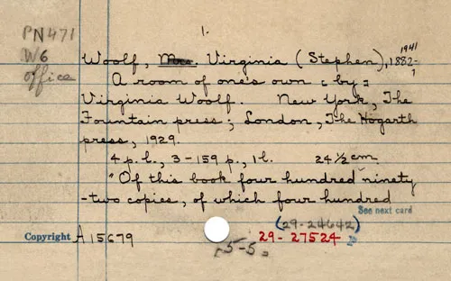
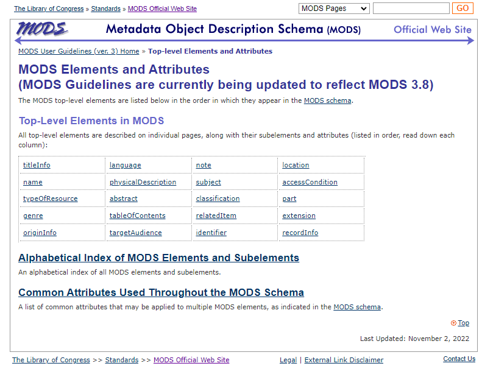
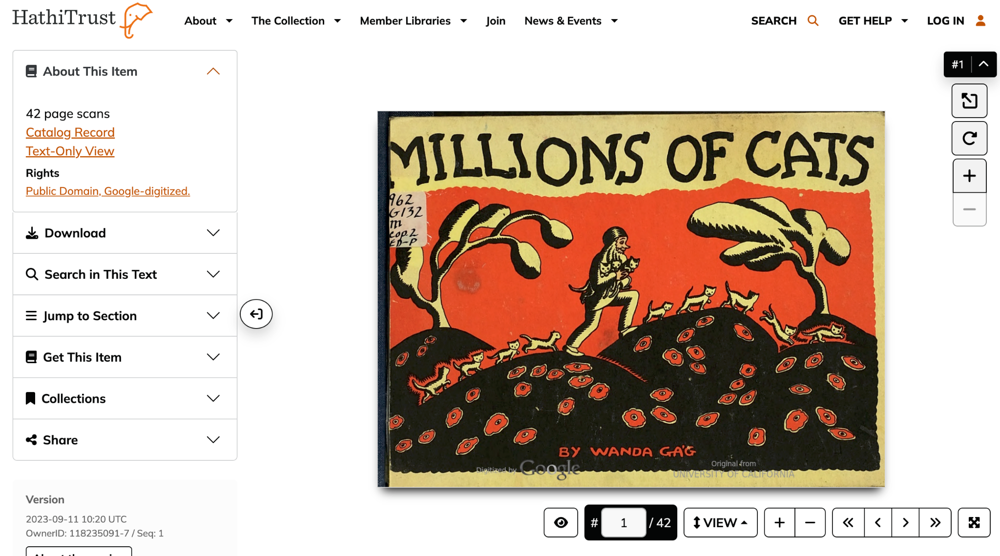

## Week 6
# Digital Preservation Metadata

---

# Today
- **Settle in/Reminders/Announcements** (15 min)
- **Discuss Last Week's Activity** (20 min)
- **Discuss The Final Project** (20 min)
- **Lecture: Digital Preservation Metadata** (45 min)
- **Break** (10 min)
- **Start Weekly Activity** (70 min)
- **Wrap up** (10 min)

---

# Announcements

- ROMChip

---

# Final Project Walkthrough
<a href="https://digital-archives.github.io/HISTGA1011/final_project/" target="_blank">https://digital-archives.github.io/HISTGA1011/final_project/</a>

---

# Lecture: Digital Preservation Metadata

---

# Why is preservation metadata important?

* Discovery and access
* Provenance and authenticity of digital objects
* Asset management
* Interoperability with other catalogs
* Provides structure to complex objects

<!--presenter notes

Understanding preservation metadata is crucial for several reasons. Firstly, it ensures long-term access to digital materials, safeguarding against format obsolescence and technological changes.

Additionally, preservation metadata documents the provenance and authenticity of digital materials, supporting their trustworthiness and reliability.

Effective management of digital collections relies on robust preservation metadata, facilitating systematic organization, monitoring, and decision-making processes. Moreover, standardized preservation metadata formats promote interoperability and exchange of digital materials across diverse systems and institutions.

Lastly, preservation metadata aids in legal and ethical compliance, helping institutions adhere to copyright laws, privacy regulations, and access restrictions.

In summary, preservation metadata plays a fundamental role in the preservation, management, and accessibility of digital materials.

-->

---

<div class="quote">
“... [Metadata is a] means by which the complexity of an object is represented in a simpler form.”
</div>

<div class="author">Jeffrey Pomerantz</div>

<div class="work">Metadata (2015)</div>

<!--presenter notes

One definition I have often heard about what metadata is is that metadata is “data about data”. This is quite possibly the least helpful definition I have ever heard.

A somewhat better definition comes from Jeffrey Pomerantz, information science educator, who has taught courses both at Simmons College and UNC Chapel Hill, and has also published a number of MOOCs, many which address many of the topics/standards we will be covering today.

In 2015, wrote a book titled Metadata. Here, he describes metadata as “a means by which the complexity of an object is represented in a simpler form”.

-->

---



<!--presenter notes

You can consider hand-written or typed cards in card catalogs as a pre-computer type of metadata.

Image credit: https://www.themarginalian.org/2013/10/01/card-catalog-chronicle/

-->

---

## Definition
# Digital Preservation Metadata

**Digital preservation metadata** refers to structured information that describes the long-term management and preservation of digital objects.

It encompasses various attributes and characteristics necessary for maintaining the integrity, authenticity, and accessibility of digital materials over time.

---

# Preservation Metadata Types 

* Administrative
* Structural
* Technical
* Descriptive

<!--presenter notes

These categories are derived from the Library of Congress’ Digital Preservation Metadata Standards document: https://www.loc.gov/standards/premis/FE_Dappert_Enders_MetadataStds_isqv22no2.pdf

-->

---

## Metadata Type
# Administrative Metadata
Provenance information, such as who has cared for the digital object, and what preservation actions have been performed on it, as well as rights and permission details.

---

## Metadata Type
# Structural Metadata
Captures relationships between different parts of an information package as well as logical structural relationships, such as which page follows which in a digitized book.

---

## Metadata Type
# Technical Metadata
Includes technical information that applies to any file type, such as information about the software and hardware on which the digital object can be rendered or executed, or checksums and digital signatures to ensure fixity and authenticity. It also includes content type-specific technical information, such as image width for an image or elapsed time for an audio file.

---

## Metadata Type
# Descriptive Metadata
Describes the intellectual entity through properties such as author and title, and supports discovery and delivery of digital content. It may also provide an historic context (i.e. this file was derived from a cassette tape)

---

## Definition
# Metadata standard

A **metadata standard** is a set of guidelines, rules, or best practices for describing data that has been established by a recognized organization or community.

<!--presenter notes

A metadata standard is a set of guidelines, rules, or best practices for describing data that has been established by a recognized organization or community which helps ensure consistency and interoperability between different data systems and applications.

-->

---

## Definition
# Metadata schema

A **metadata schema** is a structured framework for organizing and describing information about a specific type of resource, like a document, image, or video.

<!--presenter notes

A metadata schema is a specific implementation of a metadata standard and provides a more detailed set of guidelines for describing a specific type of resource or domain, such as images, audio files, video files, or other data about specific formats. A metadata schema may include additional elements or refinements to the standard, and may also provide guidelines for encoding or storing the metadata.

-->

---

# Some Metadata Standards
## Specific to libraries and archives

| Name | Acronym | Describes |
| :-: | :-: | :-: |
| Dublin Core | DC | Digital resources |
| MAchine-Readable Cataloging | MARC | Bibliographic items |

<!--presenter notes

Here are two examples of metadata standards: MARC (Machine-Readable Cataloging) and Dublin Core. Each standard is used to describe a broad set of things. Dublin Core, for example, is best suited for digital resources; MARC cataloging is more suited towards bibliographic items.

These standards have enabled us to structure data about broad categories of things. However, most of these standards, because of their broad-ness, can be quite limited, especially when we are describing something very specific.

-->

---

## Definition
# Dublin Core

Dublin Core is a metadata standard made specific for digital resources that live on the web/networked environments.

<!--presenter notes

Dublin Core is a metadata standard made specific for digital resources that live on the web/networked environments. Dublin core is named after the city (Dublin, Ohio) where this development took place. This standard was in response to the rapid uptick in internet usage by users and library systems in the mid-1990s.

-->

---

# 15 Dublin Core Elements


<!--presenter notes
- Contributor
- Coverage
- Creator
- Date
- Description
- Format
- Identifier
- Language
- Publisher
- Relation
- Rights
- Source
- Subject
- Title
- Type

-->

---

# Schemas based on Dublin Core

| Full Name | Acronym | Describes | Based on |
| :-: | :-: | :-: | :-: |
| Encoded Archival Description | EAD | Online finding aids | Dublin Core |
| Visual Resources Association Core | VRACore | Visual materials/images | Dublin Core |
| Public Broadcasting Metadata Dictionary | PBCore | Audiovisual materials | Dublin Core |

<!--presenter notes

For those very specific things, we have developed metadata schemas. For example, Dublin Core, which is used to describe, broadly, digital resources, has been used as the basis for three other schemas: EAD, specific to finding aids, VRACore, specific to visual materials and images, and PBCore, specific to audio/visual materials. If you look into how these schemas are structured, you will see a lot of similarities to Dublin Core, as well as certain additions that veer away from Dublin Core.

-->

---

## Definition
# Metadata element

A __metadata element__ is a discrete piece of information that describes a digital or physical object. It provides descriptive, administrative, technical, or structural information about the object to facilitate its management, discovery, access, and preservation. Metadata elements are typically organized into a standardized schema or framework to ensure consistency and interoperability across different systems, domains, and communities.

<!--presenter notes

A metadata element is a discrete piece of information that describes a digital or physical object. It provides descriptive, administrative, technical, or structural information about the object to facilitate its management, discovery, access, and preservation. Metadata elements are typically organized into a standardized schema or framework to ensure consistency and interoperability across different systems, domains, and communities.

-->

---

## Definition
# Machine-Readable Cataloging (MARC)

**Machine-Readable Cataloging (MARC)** is a standard for the representation and communication of bibliographic and related information in machine-readable form.

<!--presenter notes

Machine-Readable Cataloging (MARC) is a standard for the representation and communication of bibliographic and related information in machine-readable form. MARC was developed by the Library of Congress in the 1960s, and was used by libraries to store and share catalog records with each other.

Each MARC record contains bibliographic data in a structured format that computers can easily process, allowing for efficient cataloging, searching, and sharing of resources across library systems.

-->

---

## Definition
# Metadata Object Description Schema (MODS)

__Metadata Object Description Schema (MODS)__ was developed as a simpler, more flexible, and more semantically rich alternative to MARC specifically for describing digital resources. While MODS shares some similarities with MARC in terms of descriptive elements and data structure, it offers greater flexibility, extensibility, and compatibility with XML-based technologies.

<!--presenter notes

MODS (Metadata Object Description Schema) is a metadata standard developed by the Library of Congress for describing digital resources. It provides a flexible and extensible framework for encoding bibliographic and descriptive metadata about various types of digital objects, including electronic texts, images, audiovisual materials, and more. MODS is XML-based and designed to be interoperable with other metadata standards and systems.

The relationship between MODS and the MARC is that MODS is considered a derivative of MARC. MARC is a widely used metadata format for bibliographic records, originally developed for library cataloging purposes. However, MARC is highly complex and not well-suited for describing digital resources or accommodating the needs of modern digital libraries and repositories.

-->

---



<!--presenter notes

https://www.loc.gov/standards/mods/userguide/generalapp.html

This screen capture shows the “MODS Elements and Attributes” Guidelines page, where you can see a list of what they refer to as “top-level elements”: things like titleInfo, language, note, location, name, physicalDescription, subject, etc.

-->

---

## Definition
# eXtensible Markup Language (XML) - 1/2

**EXtensible Markup Language (XML)** is a platform- and language-independent schema used for encoding and exchanging structured data on the internet.

<!--presenter notes

Most of the metadata schemas that you will come across will be written in or at least be compatible with Extensible Markup Language, or XML. This reflects the fact that we live in a networked world, which requires that information can be transferable across systems.

Metadata schemas were not always written with networks in mind. For example, the first finding aids written describing information contained in archival repositories were often typed (using a typewriter) onto paper and later input into electronic word processing documents, and stored locally.

Nowadays, finding aids are more likely to be input into a descriptive system such as ASpace, which will transform whatever information the archivist inputs into Electronic Archival Description (EAD) format, a metadata schema used for finding aids, that is written and expressed in XML. By writing finding aid data using the EAD schema, we can post finding aids online, relay information about archival holdings to other platforms, and also represent repository information in a structured, hierarchical way.

Most metadata schemas are written in XML format, primarily because XML is platform- and language independent. XML was developed in the 1990s as a way to exchange data over the internet, and has become a sort of universal data exchange language.

-->

---

## Definition
# eXtensible Markup Language (XML) - 2/2

XML **tags** are used to define a schema's elements. Tags can then be nested within one another to express certain attributes or relationship hierarchies.

Example of a tag pair: \<originInfo>\</originInfo>

---

```
<mods xmlns="http://www.loc.gov/mods/v3" version="3.0">
  <originInfo>
    <place>
      <placeTerm type="text">Ithaca, NY</placeTerm>
    </place>
    <publisher>Cornell University Press</publisher>
    <copyrightDate>1999</copyrightDate>
  </originInfo>
</mods>
```

<!--presenter notes

Over the next few slides we will be looking at an example of a MODS metadata file snippet, written in XML (see MODS schema), in order to give you a sense for how to read XML, and how it is structured.

Starting from the top, we will always first declare what metadata schema and version we are using throughout the entire document.

Here, we are saying, this file uses MODS by using the <mods> element on the first line. Within the <mods> element, we use attributes, which are basically pieces of data that qualify an element. So here, we are using the xmlns attribute of mods to point to the specific standard we are using on the LOC website. We further qualify the mods element using the version attribute, to say we are using version 3.0.

In the context of XML, an "element" is a fundamental building block of an XML document. It is used to represent data structure and content.

-->

---

For each element or tag, you can look up the definition of each, including its proper use, attributes, and see sample applications.

For example, if you were curious about the \<originInfo> element, you could read more about it here:

https://www.loc.gov/standards/mods/userguide/origininfo.html

---

- Every XML tag comes in pairs: a "start" tag and an "end" tag.
- XML tag pairs contain either information, or other tags "nested" within, referred to as "sub-elements".
- In this way, you can hierarchically relate tags to others.
- Nested tags can be indented for readability.

```
<originInfo>
  <place>
    <placeTerm type="text">Ithaca, NY</placeTerm>
  </place>
</originInfo>
```

<!--presenter notes

In the example on the slide, we are seeing the start of information to do with origin – i.e., publishing details like the city the item was created, the press that published it, etc. Once we done describing these origin-related aspects of the file, we use the </originInfo> closing tag.

-->

--- 

**Attributes** (i.e. type="code" or authority="marccountry") can be added to an element to provide additional information about it.

```
<placeTerm type="code" authority="marccountry">
  nyu
</placeTerm>
```

[MARC Code List for Countries](https://www.loc.gov/marc/countries/countries_code.html)

<!--presenter notes

Attributes can be added to an element or sub-element to provide additional qualifying information for that element. Attributes are usually structured by the attribute name, followed by an equals sign, and then the value in opening and closing quotes.

For example, within the <placeTerm> element, we have two attributes listed: type=”code” and authority=”marccountry”. Here, we are saying that we are providing some information about a place using the <placeTerm> element, and this particular information about a place will be encoded using the MARC Code List for Countries. This list is a controlled list of three-digit alphacharacter codes that represent both countries and states. In this case, “nyu” represents “New York State”. So here, we are using metadata to not just record information about something, but also referring to an existing encoding schema to qualify the thing we are recording information about.

-->

---

# Any questions so far?

---

## Definition 
# Metadata Encoding and Transmission Standard (METS)

The **Metadata Encoding and Transmission Standard (METS)** is a standard used for describing the structure and content of digital objects, such as digital collections, archives, and libraries.

<!--presenter notes

The Metadata Encoding and Transmission Standard (METS) is a metadata standard used for describing the structure and content of digital objects. It was developed by the Library of Congress in collaboration with other institutions, and was first released in 2001. METS is always written in XML.

-->

---

| Element / Tag | Section name |
| :-: | :-: |
| \<mets:mets> | METS |
| \<mets:metsHdr> | METS Header |
| \<mets:dmdSec> | Descriptive Metadata Section |
| \<mets:amdSec> | Administrative Metadata Section |
| \<mets:fileSec> | File Section |
| \<mets:structMap> | Structural Map Section |
| \<mets:structLink> | Structural Link Section |
| \<mets:behaviorSec> | Behavior Section |

<!--presenter notes

A METS file is typically composed of seven main sections: <metsHdr>, <dmdSec>, <amdSec>, <fileSec>, <structMap>, <structLink>, <behaviorSec>.

“Sec” means “section”, and “Hdr” means “header”, or the beginning of the document.

-->

---

## METS
# \<mets:mets>

All METS files start off with a top-most \<mets:mets> tag, sometimes referred to as the “root”, establishing the namespaces and metadata schemas referenced throughout the rest of the file.

<!--presenter notes

All METS files start off with a top-most <mets:mets> tag, sometimes referred to as the “root”. Notice that it starts with “<mets”, followed by a “:” and then “mets” again. What is going on here?

First mets: This is the namespace prefix. In XML, a namespace is a collection of names, identified by a URI reference, used to avoid conflicts between elements that have the same name but are used in different contexts. The prefix mets: indicates that the elements (and attributes) are defined within the METS schema, which is associated with a specific URI (usually something like http://www.loc.gov/METS/). Before you can use a prefix like mets:, it must be declared in the document, typically in the root element, using the xmlns:mets attribute.

Second mets: This is the local name of the element within the METS namespace.

-->

---

## Definition
# Namespace

A **namespace** is a collection of names which are used in XML documents as element and attribute names.  Namespaces are denoted in XML by stating the name of the namespace (mets) followed by a colon i.e. \<mets:[element]>

<!--presenter notes

A namespace is a collection of names which are used in XML documents as element and attribute names.

Namespaces are a way of ensuring that the names of elements and attributes used in an XML file are unique and do not conflict, and can be disambiguated from any other names in the same file. METS files can use XML vocabularies from multiple sources.

-->

---

```
<mets:mets
    xmlns:mets="http://www.loc.gov/METS/" 
    xmlns:xlink="http://www.w3.org/1999/xlink"
    xmlns:xsi="http://www.w3.org/2001/XMLSchema-instance">
</mets:mets>
```

<!--presenter notes

In this XML example, we start off with the root element <mets:mets>. This can be qualified with attributes; specifically “xmlns” which stands for “XML Namespace”, which clarifies various other namespaces that may be used throughout the METS file. For example, we have the URL to the Library of Congress’ page for the METS standard, followed by the URL to W3’s xlink standard.

-->

---

## METS Header
# \<mets:metsHdr>

The Header <mets:metsHdr> contains administrative metadata about the METS file itself: the who/what/when of the file's creation. It usually positioned at the very top of the document.

_Unlike other elements, the METS Header never repeats itself within the same file._

<!--presenter notes

Next, we have the <mets:metsHdr> element containing administrative metadata about the METS file itself: who created the file, what created it, when it was created, etc. It usually positioned at the very top of the document. Unlike other elements, the METS Header never repeats itself within the same file.

-->

---

```
<mets:mets>
  <mets:metsHdr CREATEDATE="2003-07-04T15:00:00">
    <mets:agent ROLE="CREATOR" TYPE="INDIVIDUAL">
      <mets:name>Jerome McDonough</mets:name>
    </mets:agent>
    <mets:agent ROLE="ARCHIVIST" TYPE="INDIVIDUAL">
      <mets:name>Ann Butler</mets:name>
    </mets:agent> 
  </mets:metsHdr>
</mets:mets>
```

<!--presenter notes

In this example, we are saying that this document was created by two individuals, with two different roles.

We also are using the <mets:agent> sub-element attribute “CREATEDATE” to indicate each “agent’s” role (i.e. archivist), followed by the <mets:name> element.

-->

---

## Descriptive Section
# \<mets:dmdSec>

The Descriptive Section \<mets:dmdSec> contains or links out to descriptive metadata for the resource being described.

<!--presenter notes

The <dmdSec> Descriptive Section contains descriptive metadata for the resource being described by the METS record.

METS is agnostic to which metadata schema is used and allows for multiple <dmdSec>

Data is either wrapped or linked (examples in next 2 slides)

-->

---

```
<mets:mets>
  <mets:dmdSec>
    <mets:mdWrap MIMETYPE="text/xml" MDTYPE="DC" LABEL="Dublin Core Metadata">
      <mets:xmlData>
        <dc:title>Alice's Adventures in Wonderland</dc:title>
        <dc:creator>Lewis Carroll</dc:creator>
        <dc:date>between 1872 and 1890</dc:date>
        <dc:publisher>McCloughlin Brothers</dc:publisher>
        <dc:type>text</dc:type>
      </mets:xmlData>
    </mets:mdWrap>
  </mets:dmdSec>
</mets:mets>
```

<!--presenter notes

This example contains a bibliographic description for the book, Alice in Wonderland, which in this pretend system uses the Dublin Core metadata schema. Because Dublin Core uses a different namespace from METS, we have to first declare this namespace, and “wrap” the bibliographic metadata within it.

To do this, we use the <mdWrap> tag nested within <dmdSec>: “mdWrap” stands for for “metadata wrapper”. Within <mdWrap>, we declare the descriptive data schema we are using–Dublin Core–using <mdwrap> attributes (MDTYPE=”DC”, LABEL=”Dublin Core Metadata”.) Nester within <mdWrap> is the <xmlData> tag, which contains the actual bibliographic metadata like title, creator, date, publisher and format type.

Notice how each bibliographic tag starts with dc:. This is how we say, “This tag uses the Dublin Core namespace, tthat is different from the METS default namespace used throughout this file”.

-->

---

```
<mets:mets>
  <mets:dmdSec ID="dmd001">
    <mets:mdRef 
      LOCTYPE="URN" 
      MIMETYPE="application/xml" 
      MDTYPE="EAD" 
      LABEL="Berol Collection Finding Aid">
    urn:x-nyu:fales1735
    </mets:mdRef>
  </mets:dmdSec>
</mets:mets>
```

<!--presenter notes

Here we have a second example of bibliographic data contains in a METS file, but instead of including the actual bibliographic metadata within the file, like creator and title, we link out to a bibliographic record, in a different database. To do this, we use the <mdRef> tag, which tells us that we are referencing an EAD-encoded finding aid.

Either way (wrapping, or referencing) works here: it really depends on your local system setup and standards.

-->

---

# Administrative Section \<mets:amdSec>

Information about files that make up the digital objects described by the METS file. It has 4 subsections:

1. \<mets:techMD> Technical Metadata
2. \<mets:digiprovMD> Digital Provenance Metadata
3. \<mets:sourceMD> Source Metadata
4. \<mets:rightsMD> Rights Metadata

<!--presenter notes

The Administrative Section <amdSec> contains information pertaining to the files that make up the digital objects described by the METS file. It has 4 subsections:
<techMD> Technical Metadata
<digiprovMD> Digital Provenance Metadata
<sourceMD> Source Metadata
<rightsMD> Rights Metadata

We are going to look at two specific sub-sections of <mets:amdSec>: Technical Metadata, and Digital Provenance Metadata.

We are going to especially focus on Digital Provenance Metadata, especially in regards to PREMIS.

-->

---

```
<mets:mets>
  <mets:amdSec>
    <mets:techMD ID="AMD001">
      <mets:mdWrap MIMETYPE="text/xml" MDTYPE="NISOIMG" LABEL="NISO Img. Data">
        <mets:xmlData>
          <niso:MIMEtype>image/tiff</niso:MIMEtype>
          <niso:Compression>LZW</niso:Compression>
          <niso:Orientation>1</niso:Orientation>
          <niso:ScanningAgency>NYU Press</niso:ScanningAgency>
        </mets:xmlData>
      </mets:mdWrap>
    </mets:techMD>
  </mets:amdSec>
</mets:mets>
```

<!--presenter notes

Here we start with <amdSec>, followed immediately by the <techMD> tag. <techMD> contains technical metadata, pertaining to the technical characteristics of the digital object or objects described by the METS file.

In this example, let’s pretend we are dealing with a book (Alice in Wonderland) that was scanned in by a photographer technician at NYU. The technical metadata uses a different metadata schema/namespace, the National Information Standards Organization or NISO Data Dictionary for Technical Metadata for Digital Still Images. We are declaring this namespace within the <mdWrap> tag (i.e. MDTYPE=”NISOIMG” and LABEL=”NISO Img. Data”) in the same way we did when linking out to the EAD finding aid earlier within the descriptive metadata section.

What this means is you can use <mdWrap> throughout the METS file: it is not specific to any particular section.

Notice that each technical metadata detail is preceded by “<niso:” which disambiguates them from the default METS namespace used throughout the rest of the file.

https://www.niso.org/publications/ansiniso-z3987-2006-r2017-data-dictionary-technical-metadata-digital-still-images

-->

---

# File Section \<mets:fileSec>

Lists all files containing content comprising the digital object.

<!--presenter notes

The <mets:fileSec> section lists all files containing content which comprise the electronic versions of the digital object.

This is where METS starts to become interesting (and maybe even a little bit fun)

-->

---



<!--presenter notes

<span style="color:#2200CC"> _[https://babel.hathitrust.org/cgi/pt?id=uc1.c030214385&seq=1](https://babel.hathitrust.org/cgi/pt?id=uc1.c030214385&seq=1)

Take for example, a digitized book, like Millions of Cats, which you can browse on the HathiTrust website. https://babel.hathitrust.org/cgi/pt?id=uc1.c030214385&seq=1

In some systems, this is considered a single digital resource (i.e. a book, a video, a sound recording)

However, a single digital resource can comprise multiple related files.

For example, Millions of Cats is composed of 42 page scans, one for each side of each page, along with the cover, inner cover, back inner cover, and back cover.

Along with full-resolution scans of each page, there might also be derivative files, such as thumbnail previews.

We can use the METS file, specifically the File Section element <fileSec> to express this relationship between a digital resource, and its derivative components.

-->

---
```
<mets:mets>
  <mets:fileSec>
    <mets:fileGrp ID="page_images">
      <mets:file ID="page1" MIMETYPE="image/jpeg" USE="image">
        <mets:FLocat LOCTYPE="URL" xlink:href="page1.jpg" />
      </mets:file>
      <mets:file ID="page2" MIMETYPE="image/jpeg" USE="image">
        <mets:FLocat LOCTYPE="URL" xlink:href="page2.jpg" />
      </mets:file>
    </mets:fileGrp>
  </mets:fileSec>
</mets:mets>
```

<!--presenter notes

In the example, we start with the <mets:fileSec> tag. Beneath this, is the sub-element <mets:fileGrp> or “file group”, which we have given the nickname “page_images”. Beneath <mets:fileGrp>, we have listed two files, one for Page 1, and another for Page 2.

Each file is contained within the <mets:file> tag. Within each <mets:file> tag, we have applied the ID attribute (which we will use later on). So the first file has an ID of page1. We then declare the type of file (JPEG), and using the <FLocat> tag (stands for “file location”) where we can say where the image file is located and its filename.

We repeat the <mets:file> tag for every file in this group.

-->

---


# Structure Map \<mets:structMap>

Works with the File Section to define the order of digital objects. This enables digital objects to be presented to users of the digital library.

<!--presenter notes

This is where things get really interesting in METS!

The Structure Map <mets:structMap> section refers back to the files listed within the File Section <mets:fileSec>, and outlines how these files are structured in a digital library.

This information is used by things like the digital library front-end, so that the end-user is presented with the files in a way that they can logically browse. Though not always the case, it often is set up to mimic the experience of paging through a physical book (i.e. front to back).

-->

---

```
<mets:mets>
  <mets:structMap TYPE="logical">
    <div ID="book" TYPE="book">
      <div ID="pg1" ORDER="1" TYPE="page">
        <fptr FILEID="page1" />
        <smLink 
          xlink:href="http://example.com/thumbnail_page1.jpg" 
          xlink:type="simple" 
          xlink:role="alternate" />
      </div>
      <div ID="pg2" ORDER="2" TYPE="page">
        <fptr FILEID="page2" />
        <smLink 
          xlink:href="http://example.com/thumbnail_page2.jpg" 
          xlink:type="simple" 
          xlink:role="alternate" />
      </div></div></mets:structMap>
</mets:mets>
```

<!--presenter notes

In this example, we are continuing our example of a book that is composed of pages.

Here, we use a series of nested <div> tags (“div” stands for division).
The first <div> tag declares that we have a book, so we use the ID attribute to give it the nickname “book”.
Nested beneath the book are <div>
Beneath the page1 <div>, we use the <fptr> or “file pointer” tag to reference the ID of the file listed in the <fileSec>.
This repeats for the next page, Page 2 (nickname “page2” in the <fileSec>)
In addition, each page has a thumbnail counterpart, which is specified using <smLink>.

This is followed by an <smlink> or structural link tag. Here, we are saying that for page 1, we have a related thumbnail image that shared the same part of the structural map hierarchy with the high-resolution image. We then point to the location of the thumbnail using a URL.

Overall, the <smLink> element provides a way to associate metadata with specific parts of a digital object, making it easier to manage and organize metadata related to the object. This can be particularly useful in complex digital collections with many components and related records.

-->

---

# Behavior \<mets:behavior>

An optional METS element where behaviors or actions can be associated with specific objects or sections within the digital object. The <behavior> element can be used to define behaviors that are intended to be performed by software systems that process METS files.

---
```
<mets:mets>
  <mets:behaviorSec>
    <mets:behavior ID="playAudio">
      <mets:interfaceDef>
        <mets:playAudio />
      </mets:interfaceDef>
      <mets:mechanism><mets:script>
          <![CDATA[
            var audio = document.getElementById("audioPlayer");
            if (audio.paused) {
              audio.play();
            } else {
              audio.pause();
            }
          ]]>
        </mets:script></mets:mechanism></mets:behavior></mets:behaviorSec>
</mets:mets>
```

<!--presenter notes

In this example, the <behavior> element is used to create a behavior called "playAudio". The behavior is defined using two sub-elements: <interfaceDef>, which defines the user interface for the behavior, and <mechanism>, which defines the actual code that implements the behavior. The code itself basically calls up an audio player that can be played or paused.

-->

---

# Preservation Metadata: Implementation Strategies (PREMIS)

---

## Definition
# PREservation Metadata Implementation Strategies (PREMIS)

**PREMIS** is an implementation-neutral data dictionary that defines a core set of metadata elements for describing preservation objects and their associated metadata activities.

---

# PREMIS Structure 

| Element / Tag |
| :-: |
| \<premis:objects> |
| \<premis:environments> |
| \<premis:agents> |
| \<premis:events> |
| \<premis:rights> |

<!--presenter notes

PREMIS has 5 main elements: Objects, Environments, Agents, Events, and Rights.

-->

---

# Objects \<premis:objects>

Describes the digital file(s) being preserved.

---

```
<premis>
  <premis:object>
    <premis:objectIdentifier>
      <premis:objectIdentifierType>ARK</premis:objectIdentifierType>
      <premis:objectIdentifierValue>ark:/12345/abc123</premis:objectIdentifierValue>
    </premis:objectIdentifier>
    <premis:objectCategory>File</premis:objectCategory>
    <premis:objectCharacteristics>
      <premis:messageDigestAlgorithm>MD5</premis:messageDigestAlgorithm>
      <premis:messageDigest>05fc1aedc9f5d48f6c3fdc221f2ff674</premis:messageDigest>
      <premis:size>2.5 GB</premis:size>
    </premis:objectCharacteristics>
  </premis:object>
</premis>
```

<!--presenter notes

Here, we are describing an object’s characteristics in terms of a unique identifier, type (file), an MD5 checksum, and file size (2.5 gigabytes).

The <premis:environments> element contains two <premis:environment> sub-elements, one for software type and one for note. The software environment is identified as Archivematica. You could also use this section to declare what hardware you used to run Archivematica, such as a computer model or type. This information can be useful for understanding the technical context in which the digital object was created, accessed, or modified.

-->

---

# Rights \<premis:rights>

Aggregates information related to statements of rights and permissions.

---

```
<premis:rightsStatement>
  <!-- Identifier information -->
  <premis:rightsStatementIdentifier>
    <premis:rightsStatementIdentifierValue>
      http://creativecommons.org/licenses/example
    </premis:rightsStatementIdentifierValue>
  </premis:rightsStatementIdentifier>

  <!-- Rights details -->
  <premis:rightsBasis>License</premis:rightsBasis>
  <!-- Other rights information -->
</premis:rightsStatement>
```

<!--presenter notes

In this example, the metadata describes a digital object. The <rights> element contains a <rightsStatement> sub-element that describes the intellectual property rights associated with the digital object. The rights statement is identified by a URI, which in this case is a Creative Commons Attribution-NonCommercial 4.0 International license. The basis for the rights is identified as a license, and the specific rights granted are listed as Attribution-NonCommercial 4.0 International. The rights statement also includes start and end dates for the license.

-->

---

# Events \<premis:events>

Describes an event performed by an agent to the digital object.

Events document an object’s digital provenance, tracking the history of each object through the chain of events that occur during its lifecycle, and is essential to implementing preservation strategies.

---

```
<premis>
  <premis:event>
    <premis:eventIdentifierValue>1de1f888-fbf7-47e5</premis:eventIdentifierValue>
    <premis:eventType>format identification</premis:eventType>
    <premis:eventDateTime>2014-04-16T22:22:22</premis:eventDateTime>
    <premis:agent>
      <premis:agentName>Mary Kidd</premis:agentName>
      <premis:agentNote>Used fido to ID the file</premis:agentNote>
    </premis:agent>
  </premis:event>
</premis>
```

<!--presenter notes

In this example, we have used the <event> element to describe a distinct event that has happened to a digital object.

In this case, a person–Mary Kidd–performed a file format identification step using the fido tool (https://openpreservation.org/tools/fido/). Here, we have given the event a unique ID, and know when it happened.

-->

---

# How METS and PREMIS work together

* METS describes the digital objects themselves
* PREMIS describes/logs events that happen to digital objects
* METS typically will contain PREMIS data

---
```
<mets:mets>
  ...
  <mets:digiprovMD ID="digiprovMD_54">
    <mets:mdWrap MDTYPE="PREMIS:EVENT">
      <mets:xmlData>
        <premis:event xmlns:premis="http://www.loc.gov/premis/v3">
          <premis:eventIdentifier>
            <premis:eventIdentifierValue>b0d7f0ce-1c47-42b9-b2f1-941ca8f90bfe</premis:eventIdentifierValue>
          </premis:eventIdentifier>
          <premis:eventType>format identification</premis:eventType>
          <premis:eventDateTime>2019-11-14T11:05:37Z</premis:eventDateTime>
          <premis:eventDetail>program="Siegfried"</premis:eventDetail>
          <premis:eventOutcome>Positive</premis:eventOutcome>
        </premis:event>
      </mets:xmlData>
    </mets:mdWrap>
  </mets:digiprovMD>
  ...
</mets:mets>
```

_... Continued on the next slide_

<!--presenter notes

This is an example of PREMIS metadata contained or wrapped within a METS metadata file. The PREMIS metadata is contained specifically within the <mets:digiprovMD> element, which stands for “Digital Provenance Metadata”. This is followed by a <mets:mdWrap> element that defines a new namespace using the attribute MDTYPE (metadata type) = “PREMIS:EVENT”. So here, we are not only declaring that we are using the PREMIS namespace, we are also specifically using its event element. After declaring the <mets:xmlData> element, our PREMIS chunk begins.

First, we use the xmlns (XML namespace) attribute of <premis:event> to point to the PREMIS standard, using a URL. We then assign a UUID to the event.

Next, we declare the event type (“format identification”), declare when the event happened (using a timestamp), and then say what program we used to do the format identification (in this case, we used Siegfried, which is a popular format identification tool).

-->

---

## Definition
# Semantic Web

The **semantic web** is a concept that sees data on the internet as dynamic, meaningful and machine-readable. Unlike the standard web, which primarily focuses on linking documents through hyperlinks, the semantic web uses structured data, standardized ontologies, and metadata to create connections between individual pieces of information.

---

## Definition
# Ontology

An **ontology** is a structured framework that defines the relationships between concepts, terms, and data within a specific domain. It serves as a formal representation of knowledge by outlining categories, properties, and the connections between entities, enabling both humans and machines to understand and process complex information.

---

## Definition
# Linked Open Data

Sometimes referred to simply as "linked data", linked open data (LOD) is a framework that enables organizations and individuals to share information in a machine-readable format. By using standardized protocols, LOD allows for the seamless connection of related data across multiple websites, creating a vast, interconnected web of datasets known as Linked Open Data.

<!--presenter notes

This definition is gleaned from Digital Preservation Framework Linked Open Data page: https://www.archives.gov/preservation/digital-preservation/linked-data

-->

---

## Case Study
# PRiSMHA (Providing Rich Semantic Metadata for Historical Archives)

The **PRiSHHA** Project (2017-2020) was a digital curation/humanities project that explored how an ontology-driven platform could facilitate deeper research and access of digitized materials.

<!--presenter notes

Definition derived from https://dl.acm.org/doi/full/10.1145/3484398

-->

---

## Project focused on a small digitized set of the Gramsci Institute's records (~200 documents, mainly typewritten leaflets often with annotations and drawings, some pictures, some newsprint) covering students' and workers' protests occurring between 1968-1969 in Italy.

---


_A leaflet about a strike at FIAT._

<!--presenter notes

A leaflet about a strike at FIAT (copyright: Fondazione Istituto piemontese Antonio Gramsci Onlus).

Transcription/Translation:

FIAT WORKERS

Why do students participate in the workers' struggle?

In these months of struggle in the schools, students have begun to fight against the power of the professors: they are tired of having their heads filled without being able to discuss or decide.

But through this struggle, they also realized that fighting in the university and in school is not enough. Authoritarianism, meaning that a few command while many are oppressed, exists not only in school: it is present throughout society and especially in the factory.

FIAT is the most typical example.

For this reason, even if students manage to obtain a less tyrannical school, this is not enough: because after school, students enter the workforce, and this generally means becoming a teacher, a technician, or an office worker in a factory. In the first case, students do not want to become like those authoritarian professors they fought against for years. In the second case, they do not want to become the boss’s henchmen, who follow his orders and oppress the workers according to the management’s directives.

Therefore, it is not enough to change things in the school; we must change them everywhere. For this reason, everyone who wants to change things, everyone who is tired of enduring impositions, must unite and fight together.

Circled in red:
For this reason, we are in front of the factories: our participation in the picket lines is a first step toward connecting students and workers, to discuss and decide future actions together.

-->


---

### Consider Antonio, a schoolteacher who wants to enrich his lessons with information directly taken from original documents. He is talking to his students about protest actions that took place in Torino in 1968. In particular, he is searching a digital online archive system, looking for leaflets referring to strikes that both students and workers participated in.

---

### Even with a (very) good OCR tool, if the system is based on a keyword search mechanism, the results of a query for “sciopero” (strike) would not include [the leaflet] ... [T]he document ... does not contain the world “sciopero/i” (strike/es), although it actually talks about a strike, using the very specific word “picchetti” (picketings).

---


_A leaflet mentioning Italian journalist Guido Viale_

<!--presenter notes

A leaflet mentioning Guido Viale (copyright: Fondazione Istituto piemontese Antonio Gramsci Onlus).

Translation:

Interfaculty circular, print run 6,000 copies

THIS AFTERNOON AT 2:30 PM
AT THE CHAMBER OF LABOR

HIGH SCHOOL AND UNIVERSITY STUDENTS
PARTICIPATE!!!
NEW FORMS OF CITIZEN ACTION TO DEMAND THE RELEASE OF GUIDO VIALE

TOWARD NEIGHBORHOOD WORK: OPEN DISCUSSION

THE DELEGATION FROM ALLARA

ORGANIZED BY A WORKING GROUP OF THE COMMITTEE OF AGITATION

-->

---

### Antonio also looks for leaflets mentioning specific people (e.g., Guido Viale, a leader of the ‘68 Movement in Torino) involved in protest actions. The results for a query for “Guido Viale” in a keyword-based system would probably include the leaflet.

---

### However, that leaflet would not be retrieved if the query also contains (in AND) a keyword for the action (such as “sciopero”/strike, “manifestazione”/demonstration, and so on), since the protest action is not explicitly mentioned, although it is clear to a human reader that the document talks about a protest action.

---

### Moreover, Guido Viale, although mentioned in the document, is not an active participant; the leaflet indeed says that he has been arrested and the demonstration is organized to ask for his release (he could be considered the “topic” of the protest action, or a participant in his release from prison, i.e., in the event representing the goal of the protest action).

---

### This scenario demonstrates that, in order to both provide users with the possibility of posing such queries and be able to answer them, the system needs a semantic layer over archival documents, containing a formal machine-readable representation of their content, based on the conceptual vocabulary represented by computational ontologies.

---

### If Antonio was searching for the active involvement of Guido Viale in protest actions [...] he would need a tool enabling him to ask for all documents talking about any type of protest action that have a relation of type active participation with the person Guido Viale. 

---


<!--presenter notes

ISA: "Is a" relationship. Indicates a hierarchical connection where one category is a specific type of another.

Example: Protest March ISA Protest Action (A protest march is a type of protest action.)
instance-of: Represents an instance relationship, showing that a specific event or object is an example of a broader class.

Example: ev01 instance-of Demonstration (ev01 is a specific event categorized as a demonstration.)
ev01, ev02, ev03, ev04: Event identifiers, representing specific, real-world instances of protest actions.

Each "ev" label marks a distinct event within the ontology.
hasParticipant: Shows the relationship between an event and the individual or group involved.

Example: ev02 hasParticipant Guido Viale (Guido Viale participated in the event ev02.)
isAbout: Indicates the subject or focus of the event or action.

Example: ev03 isAbout Person (The event ev03 is about a particular person.)

-->

---

# What does the labor of linked data look like?
<a href="https://linkedjazz.org/" target="_blank">Linked Jazz</a>

---

## Resource
# WikiData

**Wikidata** is a free, collaborative, and structured knowledge base that acts as a central repository for data used by Wikimedia projects, including Wikipedia, as well as external applications and services. It was launched by the Wikimedia Foundation in 2012 with the goal of providing a machine-readable, linked open data platform that anyone can edit.

See <a href="https://www.wikidata.org/wiki/Q83003" target="_blank">WikiData entry for Antonio Gramsci</a>

---

## Resource
# SNAC (Social Networks and Archival Context) - 1/2

**SNAC** (Social Networks and Archival Context) is an online resource that links archival collections to the people, organizations, and events they are associated with.

---

## Resource
# SNAC (Social Networks and Archival Context) - 1/2

- **Authority Control**: Helps standardize names of individuals and organizations across collections.
- **Relationship Mapping**: Connects archival metadata to a network of related entities, offering richer context.
- **Linked Data**: Uses EAC-CPF, aligning well with linked open data initiatives.

---

## Standard
# EAC-CPF

**EAC-CPF** (Encoded Archival Context – Corporate Bodies, Persons, and Families) is an XML-based standard used in archival metadata to describe entities such as people, organizations, and families that are associated with archival materials.

---

## Weekly Activity
# Digital Preservation Metadata

Start: <a href="https://digital-archives.github.io/HISTGA1011/activities/metadata.html" target="_blank">https://digital-archives.github.io/HISTGA1011/activities/metadata.html</a>

---


_Final questions or reflections?_

mary.kidd@nyu.edu