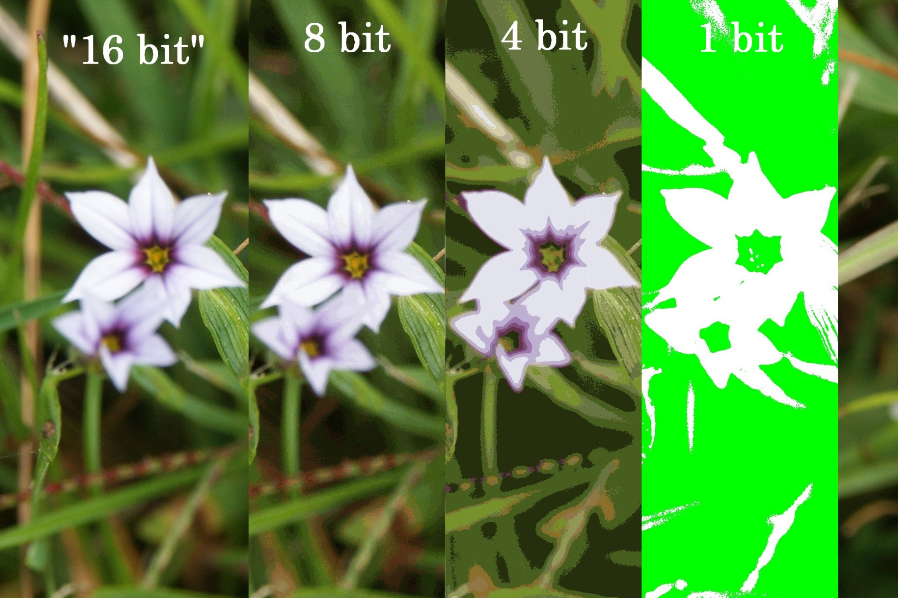
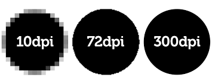

  
## Week 7
# Digitization

---

# Today
- **Lecture: Digitization**
- **Break**
- **Weekly Activity Discussion**
- **Start Weekly Activity**

---

# Digitization

For this week's lecture, we will be focusing specifically on the digitization of materials that are digitized either by photography or scanning technologies.

---

## Equipment
# Flatbed scanner  

- Easy to learn and use
- Best for flat, unbound materials
- Slow, especially for series
- Good for optical character recognition
- Inexpensive
- Can fit in a small space

---


<!--presenter notes

Sustainable Heritage Network has a variety of videos available teaching you how to set up equipment, and pros and cons of different types of equipment. See: https://sustainableheritagenetwork.org/digital-heritage/flatbed-scanner-vs-overhead-camera-digitization and https://sustainableheritagenetwork.org/digital-heritage/equipment-selection-your-digitization-project

-->

---

## Equipment
# Copy Stand
- Versatile for materials of varying sizes
- Fast for series
- Requires operator skill for setup and adjustments
- Good for 3D or textured items like embossed documents
- Higher upfront cost due to camera and lighting requirements
- Requires space

---


<!--presenter notes

https://sustainableheritagenetwork.org/digital-heritage/copystand-equipment-and-setup-tutorial

DSLR camera attached to adjustable column (can be motorized or manual) with light sources (LEDs).

DSLR stands for “digital single-lens reflex”. A digital single-lens reflex camera (digital SLR or DSLR) is a digital camera that combines the optics and the mechanisms of a single-lens reflex camera with a digital imaging sensor (https://en.wikipedia.org/wiki/Digital_single-lens_reflex_camera)

DSLR cameras are more “gentle” to cultural heritage materials, especially when compared to a flatbed scanner.

Requires time for setup, but quick to use after setup 

Great for bound materials

The tethered workstation/DSLR can be set up to give the technician a “live view” of the material(s) so you can adjust as needed
Color is truer to life
$$ - $200-$15,000

-->

---

# Planetary scanner   
- Extremely efficient and known as a "contactless scanner” (i.e. can turn pages of a book automatically)
- Works by moving a scanning head above/over the material without touching it
- Prohibitively expensive
- Requires dedicated space
- Maintenance likely requires dedicated technician

---


<!--presenter notes

Image source: https://www.elarscan.com/model-range/elarskan-a2/elarskan-a2-ra/

As described by FADGI: “This class of scanner uses one of two methods to capture an image. Either the sensor moves in the camera head capturing the image one line at a time or the sensor remains stationary and the object moves under the camera, again capturing the image one line at a time. Beyond this difference, there is great similarity to a digital camera on a copy stand. Planetary scanners have the advantage of being able to capture images in very high resolution, due to the very long high-resolution linear sensors available, and the unlimited ability to add rows of scans in one dimension if the system moves the original under the camera. However, they take time to capture an image and are only efficient for original materials that can be held flat during the long exposure cycle.”

-->

---

# Digital Image Specifications

<!--presenter notes

When digitizing flat or paper-based materials, precision matters. Every detail — from the depth of color to the sharpness of the smallest text — depends on adhering to standardized specifications.

-->

---

## Definition
# Bit depth / Color depth
—

 __Bit or color depth__ refers to the number of bits used to record each red, green and blue color channel for each pixel. The higher the bit depth, the wider the range of possible colors a digital camera is able to capture. 

<!--presenter notes

In digital images, bit or color depth refers to the number of bits used to represent the color of each pixel in an image. Each bit can represent two possible values, either 0 or 1. Therefore, a bit depth of 1 can represent two colors (black and white), while a bit depth of 8 can represent 256 colors (2^8 = 256), and a bit depth of 24 can represent 16,777,216 colors (2^24 = 16,777,216).

The bit depth determines the number of different colors that can be represented in an image. A higher bit depth means that more colors can be represented, which results in a more detailed and realistic image. For example, a photograph with a higher bit depth will have smoother transitions between shades of color, while a lower bit depth image may have visible banding or posterization in areas of smooth color transitions.

The most common bit depths used in digital images are 8-bit and 16-bit. 8-bit images are commonly used for web graphics, while 16-bit images are used in professional photography and graphic design to capture and edit more detail in the image. It is important to note that a higher bit depth also results in larger file sizes, which might influence considerations over digital storage, access, and transfer.

-->

---



---

## Definition
# Dots Per Inch (DPI) / Points Per Inch (PPI)
—

 Dots Per Inch (DPI) or Points Per Inch (PPI) is a measure of display resolution that specifies the number of dots that can be placed in a linear inch. It is commonly used to describe the resolution of images, scanners, and screens. 

 ---



---

## Definition
# Resolution

Total number of pixels or dots in an image, and is usually expressed as the width and height of the image in pixels.
```
DPI or PPI
x
Image Width x Height (Pixels) 
=
Resolution (total pixels in an image) 
```

<!--presenter notes

Now that we have gone over what a typical digital imaging lab setup looks like, let’s talk about digital image technology. How are digital image files encoded? What are their technical aspects? Knowing this can then help us understand preservation standards for digital images.

-->

---

## Standard
# Federal Agencies Digital Guidelines Initiative (FADGI)

The Federal Agencies Digital Guidelines Initiative (FADGI) is a document detailing standards and guidelines for digitizing cultural heritage materials, such as books, photographs, and documents. 

<!--presenter notes

https://www.digitizationguidelines.gov/guidelines/DRAFT%20Technical%20Guidelines%20for%20Digitizing%20Cultural%20Heritage%20Materials%20-%203rd%20Edition.pdf

FADGI was established to develop common guidelines and technical specifications for digitizing cultural heritage materials, such as manuscripts, photographs, maps, and audiovisual materials, among others. Its goal is to ensure that digital copies of these materials are created with high quality and are suitable for long-term preservation and access.

These guidelines cover a wide range of topics related to digitization, such as image capture, color management, file formats, metadata, and quality assurance. The guidelines are based on best practices from the fields of library science, archival science, and digital imaging, among others.

-->

---

## FADGI Technical Recommendations   

| Category | Recommendation |
| :-: | :-: |
| Preservation or access file format | TIFF, JPEG 2000, or PDF/A |
| Dots per inch (DPI) minimum | Manuscripts, Text, Maps - 300 DPI<br>Photographs/Graphics - 400-800 DPI |
| Bit / Color Depth | Color - 16-bit<br />Grayscale - 8-bit |

---

## FADGI File Naming Conventions   

| Requirement | Example |
| :-: | :-: |
| File-name extension required | collection001.jpeg |
| Express order that takes into account number of items to be scanned. Use leading 0s. | image0001.tif<br />image0002.tif<br />etc |
| Lowercase | NOTTHIS.tiff butthis.tiff |
| Unique across records | collection12345_0001.tif |
| No spaces; use underscores | lowResImage_0002.tif |

<!--presenter notes

Require that a file format extension must always be present. We recommend using a period followed by a three-character file extension at the end of all file names for identification of data format (for example, .tif, .jpg, .gif, .pdf, .wav, .mpg, etc.)

Take into account the maximum number of items to be scanned and reflect that in the number of digits used (if following a numerical scheme).

Use leading 0’s to facilitate sorting in numerical order (if following a numerical scheme).

Do not use an overly complex or lengthy naming scheme that is susceptible to human error during manual input.

Use lowercase characters and file extensions.

Record metadata embedded in file names (such as scan date, page number, etc.) in another location in addition to the file name. This provides a safety net for moving files across systems inthe future, in the event that they must be renamed. In particular, sequencing information and major structural divisions of multi-part objects should be explicitly recorded in the structural metadata and not only embedded in filenames.

Although it is not recommended to embed too much information into the file name, a certain amount of information can serve as minimal descriptive metadata for the file, as an economical alternative to the provision of richer data elsewhere. Alternatively, if meaning is judged to be temporal, it may be more practical to use a simple numbering system. An intellectually meaningful name will then have to be correlated with the digital resource in an external database.

-->

---

```
greenleaf_b12_f03_0001.tif
bcs_b03_f14_0001.tif
[collection_code]_[box#]_[folder#]_[sequence#]

mss24_0001.jpg
[manuscript#]_[sequence#]

023491827_0001.pdf
[cataloging#]_[sequence#]
```

<!--presenter notes

Here are three examples of filenaming conventions that generally abide to what was discussed in the previous slide. As you can see, filenames can vary, and will depending on your institution, the system(s) you are using to generate files, other systems’ conventions, etc.

-->

---

## Weekly Activity
# Imaging and Conservation Review

Start: <a href="https://digital-archives.github.io/HISTGA1011/activities/imaging.html" target="_blank">https://digital-archives.github.io/HISTGA1011/activities/imaging.html</a>

---


_Final questions or reflections?_

mary.kidd@nyu.edu

