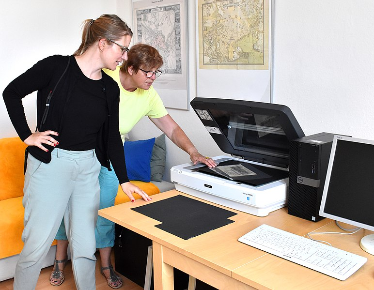
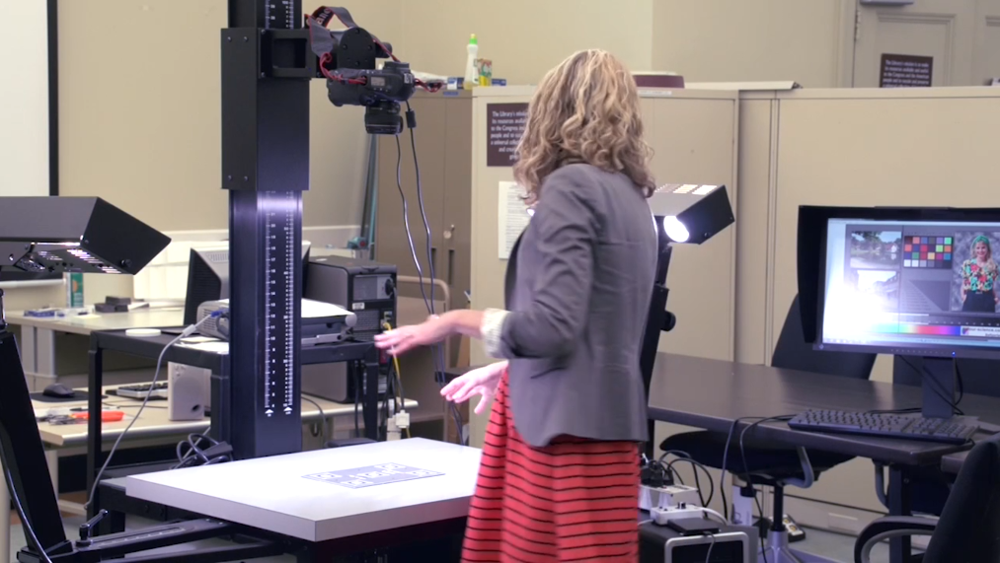
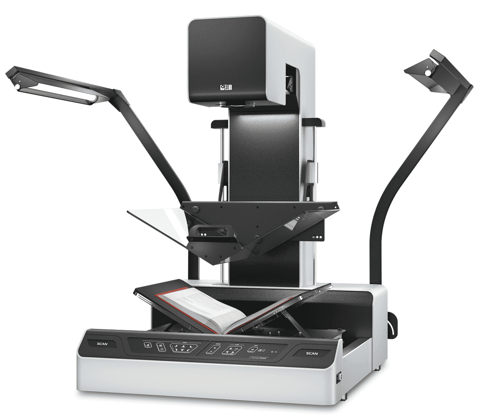
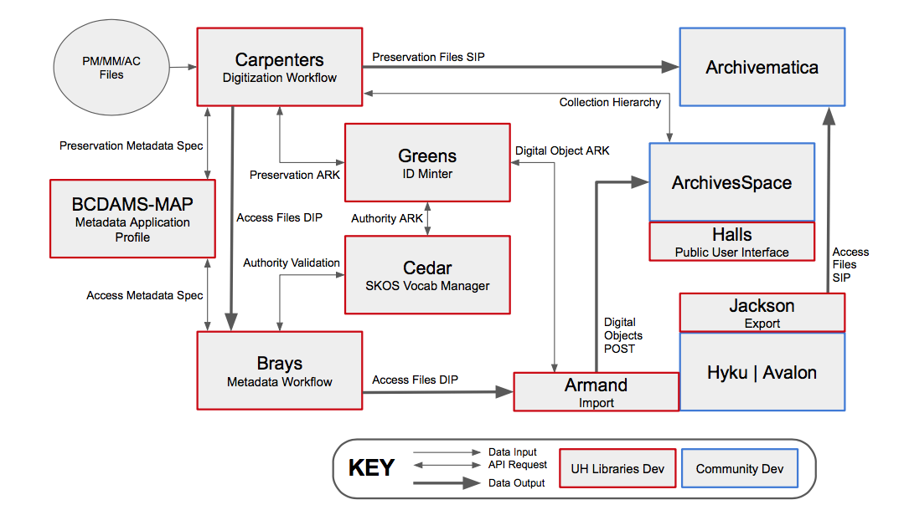
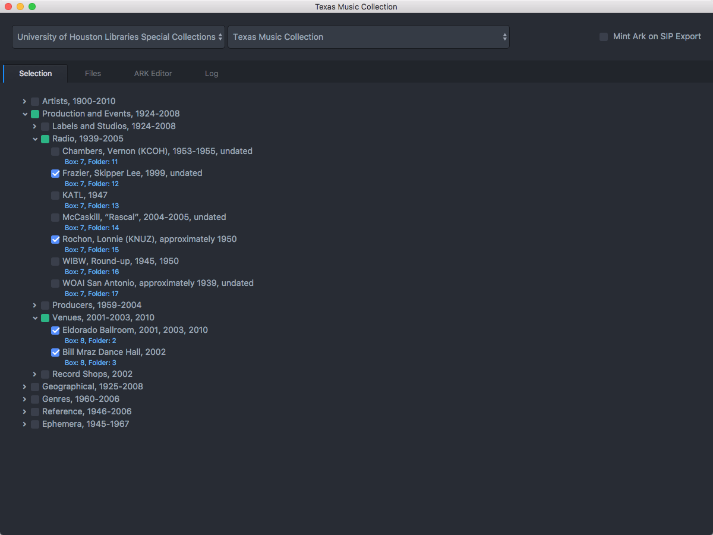
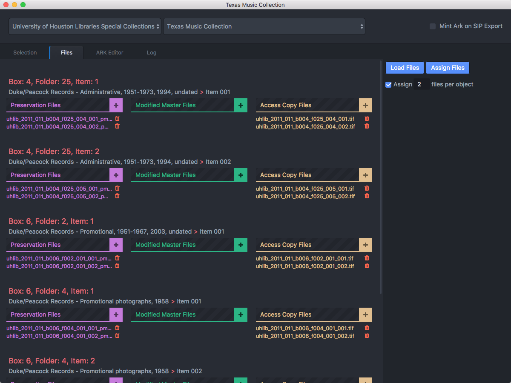
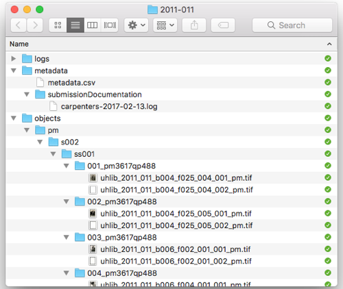
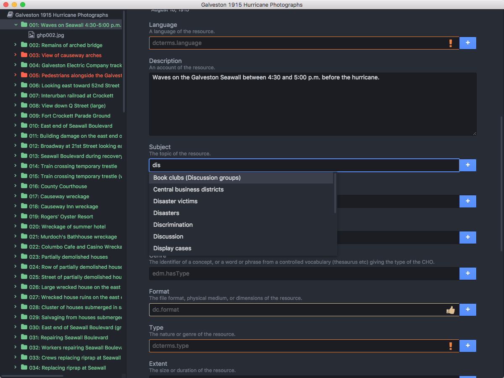
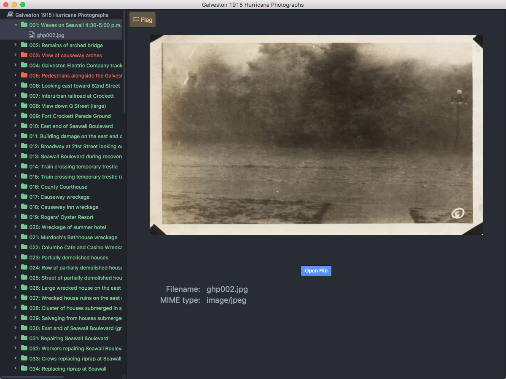

  
## Week 7
# Digitization

---

# Today
- **Lecture: Digitization**
- **Break**
- **Weekly Activity Discussion**
- **Start Weekly Activity**

---

# Digitization

For this week's lecture, we will be focusing specifically on materials that are digitized either by photography or scanning technologies. We will review equipment, workflows, and standards.

---

# Equipment
## Flatbed scanner  
## Copy stand
## Planetary scanner

<!--presenter notes

Sustainable Heritage Network has a variety of videos available teaching you how to set up equipment, and pros and cons of different types of equipment. See: https://sustainableheritagenetwork.org/digital-heritage/flatbed-scanner-vs-overhead-camera-digitization and https://sustainableheritagenetwork.org/digital-heritage/equipment-selection-your-digitization-project

-->

---



<!--presenter notes

Flatbed Scanner
- Affordable
- Best for flat materials (not great for bound)
- Slow and steady
- Can fit in a small space
- Does not require special training or expertise, low-barrier

See also: https://sustainableheritagenetwork.org/digital-heritage/copystand-equipment-and-setup-tutorial

-->

---



<!--presenter notes

Copy Stand
- Versatile for materials of varying sizes and formats, especially bound items
- Fast for series
- Requires operator skill for setup and adjustments
- Good for 3D or textured items like embossed documents
- Higher upfront cost due to camera and lighting requirements
- Requires space

A copy stand usually consists of a DSLR camera attached to adjustable column (can be motorized or manual) with light sources (LEDs).

DSLR stands for “digital single-lens reflex”. A digital single-lens reflex camera (digital SLR or DSLR) is a digital camera that combines the optics and the mechanisms of a single-lens reflex camera with a digital imaging sensor (https://en.wikipedia.org/wiki/Digital_single-lens_reflex_camera)

DSLR cameras are more “gentle” to cultural heritage materials, especially when compared to a flatbed scanner.

The tethered workstation/DSLR can be set up to give the technician a “live view” of the material(s) so you can adjust as needed
Color is truer to life
$$ - $200-$15,000

-->

---



<!--presenter notes

Image source: https://www.elarscan.com/model-range/elarskan-a2/elarskan-a2-ra/

Planetary scanner   
- Extremely efficient and known as a "contactless scanner” (i.e. can turn pages of a book automatically)
- Works by moving a scanning head above/over the material without touching it
- Prohibitively expensive
- Requires dedicated space
- Maintenance likely requires dedicated technician

As described by FADGI: “This class of scanner uses one of two methods to capture an image. Either the sensor moves in the camera head capturing the image one line at a time or the sensor remains stationary and the object moves under the camera, again capturing the image one line at a time. Beyond this difference, there is great similarity to a digital camera on a copy stand. Planetary scanners have the advantage of being able to capture images in very high resolution, due to the very long high-resolution linear sensors available, and the unlimited ability to add rows of scans in one dimension if the system moves the original under the camera. However, they take time to capture an image and are only efficient for original materials that can be held flat during the long exposure cycle.”

-->

---

# Digital Image Specifications

<!--presenter notes

When digitizing flat or paper-based materials, precision matters. Every detail, from the depth of color to the sharpness of the smallest text, depends on adhering to standardized specifications. These specs are usually first set through image capture policies, which dictates how the equipment is calibrated. However, calibrations depend on the material being captured, and may require adjustments or re-captures.

-->

---

## Initiative
# Federal Agencies Digital Guidelines Initiative (FADGI)

The Federal Agencies Digital Guidelines Initiative (FADGI) is a collaborative effort started in 2007 by federal agencies to articulate common sustainable practices and guidelines for digitized and born digital historical, archival and cultural content.

https://www.digitizationguidelines.gov/

<!--presenter notes

https://www.digitizationguidelines.gov/guidelines/DRAFT%20Technical%20Guidelines%20for%20Digitizing%20Cultural%20Heritage%20Materials%20-%203rd%20Edition.pdf

FADGI was established to develop common guidelines and technical specifications for digitizing cultural heritage materials, such as manuscripts, photographs, maps, and audiovisual materials, among others. Its goal is to ensure that digital copies of these materials are created with high quality and are suitable for long-term preservation and access.

-->

---

## Document
# May 2023: Technical Guidelines for Digitizing Cultural Heritage Materials (Third Edition)

https://www.digitizationguidelines.gov/guidelines/FADGITechnicalGuidelinesforDigitizingCulturalHeritageMaterials_ThirdEdition_05092023.pdf


<!--presenter notes

The FADGI Technical Guidelines for Digitizing Cultural Heritage Materials document, last updated a little over a year ago, covers a wide range of topics related to digitization, such as ideal image capture, color management, file formats, metadata, and quality assurance. The guidelines are based on best practices from the fields of library science, archival science, and digital imaging, among others.

-->

---

## Workflow: File Naming

| Requirement | Example |
| :-: | :-: |
| File format extension required | collection001.__jpeg__ |
| Express order that takes into account number of items to be scanned. Use leading 0s. | image0001.tif<br />image0002.tif<br />etc |
| Lowercase | NOTTHIS.tiff this.tiff |
| Unique across records | collection12345_0001.tif |
| No spaces; use underscores | lowResImage_0002.tif |

<!--presenter notes

Require that a file format extension must always be present. We recommend using a period followed by a three-character file extension at the end of all file names for identification of data format (for example, .tif, .jpg, .gif, .pdf, .wav, .mpg, etc.)

Take into account the maximum number of items to be scanned and reflect that in the number of digits used (if following a numerical scheme).

Use leading 0’s to facilitate sorting in numerical order (if following a numerical scheme).

Do not use an overly complex or lengthy naming scheme that is susceptible to human error during manual input.

Use lowercase characters and file extensions.

Record metadata embedded in file names (such as scan date, page number, etc.) in another location in addition to the file name. This provides a safety net for moving files across systems inthe future, in the event that they must be renamed. In particular, sequencing information and major structural divisions of multi-part objects should be explicitly recorded in the structural metadata and not only embedded in filenames.

Although it is not recommended to embed too much information into the file name, a certain amount of information can serve as minimal descriptive metadata for the file, as an economical alternative to the provision of richer data elsewhere. Alternatively, if meaning is judged to be temporal, it may be more practical to use a simple numbering system. An intellectually meaningful name will then have to be correlated with the digital resource in an external database.

-->

---

```
greenleaf_b12_f03_0001.tif
bcs_b03_f14_0001.tif
[collection_code]_[box#]_[folder#]_[sequence#]

mss24_0001.jpg
[manuscript#]_[sequence#]

023491827_0001.pdf
[cataloging#]_[sequence#]
```

<!--presenter notes

Here are three examples of filenaming conventions that generally abide to what was discussed in the previous slide. As you can see, filenames can vary, and will depending on your institution, the system(s) you are using to generate files, other systems’ conventions, etc.

-->

---

# Post-Digitization Workflows
Driven largely by reconciling digital preservation (managing of SIPs, AIPs and DIPs) with archival and access-driven metadata application.

<!--presenter notes

After a capture is taken, we cross a particular digitization threshold, where many workflows are informed primarily by metadata. We will look at a particular case study to tie together all that we have learned so far about metadata and digitization.

-->

---



<!--presenter notes

Case study: University of Houston (UH) Libraries made an institutional commitment in late 2015 to migrate the data for its digitized cultural heritage collections to open source systems for preservation and access: Hydra-in-a-Box, Archivematica, and ArchivesSpace.

Let’s move from the abstract into a real life scenario. Here, we have a workflow diagram created by the University of Houston, representing their digital preservation workflow that we are going to break down into something more digestible and understandable.

A code4lib article provides additional details: https://journal.code4lib.org/articles/12342#unit5

-->

---

# Bayou City Digital Asset Management System (BCDAMS)
<br>

<div class="row">
  <div class="pink-box">ArchivesSpace</div>
  <div class="pink-box">Archivematica</div>
  <div class="pink-box">Hydra-in-a-Box (HyKu)</div>
</div>

<div class="row">
  <div>
    <div class="green-box">Carpenters</div>
    <div class="description">Interface used by digitization staff to manage digitization workflow and preservation ingest.</div>
  </div>
  <div>
    <div class="green-box">Brays</div>
    <div class="description">Interface used by staff working with digital objects to view files and create metadata in preparation for HyKu ingest.</div>
  </div>
  <div>
    <div class="green-box">CEDAR</div>
    <div class="description">Linked data vocabulary manager</div>
  </div>
  <div>
    <div class="green-box">Greens</div>
    <div class="description">Mints persistent identifiers applied to preservation packages like SIPs</div>
  </div>
  <div>
    <div class="green-box">Halls</div>
    <div class="description">Public user interface</div>
  </div>
</div>

<!--presenter notes

The University of Houston uses a preservation systems “ecosystem” of both open-source and homegrown applications and tools, each working in concert with one another to fully or partially automate the entire digital preservation-to-access workflow.

UH uses three open-source tools:
- ArchivesSpace: Used by archivists to describe collections and produce finding aids
- Archivematica: Used to automate workflows into and from the digital repository.
- Hydra-in-a-Box (aka Hyku): open-source digital repository software platform that allows institutions to manage, preserve, and provide access to digital collections.

UH also uses a number of homegrown tools:
- Carpenters: an internal staff interface used by digitization staff to manage digitization workflow and preservation ingest.
- Brays: a metadata management system used by staff working with digital objects to view files and create metadata in preparation for ingest into HyKu
- CEDAR: A linked data vocabulary manager
- Greens: A persistent identifier minter
- HALLS: HALLS (stands for Houston Area Library Automated Network Delivery System) is a front-end interface for searching and discovering content from various digital repositories and collections maintained by the libraries in the Houston area

-->

---

### **Selection and Preparation Workflow**

1. **Archivist** creates finding aid in **ArchivesSpace**.
2. **Archivist** opens **Carpenters**, navigates to the “Selection” tab, and imports the finding aid hierarchy.
3. **Archivist** checks boxes next to the folders/items to be digitized.
4. **Carpenters** populates the shot list in the “Files” tab.
5. **Digitization Unit Tech** opens **Carpenters** and navigates to the “Files” tab, and photographs images in the sequence specified by the shot list.

---



<!--presenter notes

This is a screenshot of the Carpenters interface, with the “Selection” tab open, which is where the archivist works to import the finding aid components and hierarchy.

As you can see, Carpenters allows preservation administrators to organize digitized content into hierarchies that preserve the contextual linkages and provenance of the original archival collection.

-->

---

### **Digitization and File Management Workflow**
1. **Digitization Unit Tech** creates a **preservation file** along with **derivative files** such as **mezzanine and access copies** for each archival object, storing them on the local file system.
2. **Digitization Unit Tech** opens **Carpenters**, navigates to the “Files” tab, and associates each file created with its corresponding archival object.
3. **Carpenters** links the **ArchivesSpace URI** for each archival object to its digital surrogate during the association process.

---

## Definition
# Preservation File

A __preservation file__ is a high-quality, minimally processed digital file created to serve as the authoritative source for long-term preservation. It is typically produced during digitization and retains the maximum amount of detail, accuracy, and integrity from the original material.

---

## Definition
# Mezzanine File

A __mezzanine file__ is an intermediate-quality digital file derived from a preservation file. It is used for specific workflows, such as editing, while still maintaining a high level of fidelity. Mezzanine files strike a balance between the size and usability of the file and the quality of the original preservation file.

---

## Definition
# Access File

An __access file__ is a derivative digital file used for providing convenient, user-friendly access to the content. Access copies are optimized for distribution, sharing, and everyday use, often with reduced file size and quality compared to the original preservation file.

---

## Definition
# Uniform Resources identifier

A __Uniform Resource Identifier (URI)__ in the context of ArchivesSpace is a persistent and unique identifier that represents a specific resource or object within the ArchivesSpace system. It serves as a stable reference to digital or physical items, collections, or metadata records, enabling interoperability, linkage, and retrieval across systems.

---



<!--presenter notes

In this screenshot, we are looking at the Carpenters interface “Files” tab, which is where Digitization Unit staff work. Each row has a box and folder listed, followed by the name of the collection and series title. Here, they can click on the plus sign next to the derivative file type, such as Preservation Master, and add the filename. In this way, they are connecting image captures to archival objects in the finding aid.

-->

---

### **File Transfer and Packaging Checklist**

1. **Carpenters** automatically moves **preservation files** from the local file system to a set of nested directories.
2. These directories are organized into an **Archivematica-compatible Submission Information Package (SIP)**.
3. The SIP structure replicates the **intellectual arrangement** of the original collection.

---



---

### **Persistent Identifier and Access Package Checklist**

1. **Carpenters** requests an **Archival Resource Key (ARK)** for each preservation package, creating a persistent identifier to link preservation master files to access objects in Hyku.
2. **Carpenters** outputs a **Dissemination Information Package (DIP)** containing access files and a metadata CSV file.
3. The metadata CSV is used as input for the **Brays descriptive metadata application**.

---

## Definition
# Persistent Identifier (PID)

An identifier that is unique, universal, and persistent.
- Identifier: a string used to refer to an object
- Unique: identifier is only used for one object
- Persistent: remains available independently of individual institutions, systems or system implementations.
- Universal: unique within a specific context

---

### **Access - Editing Metadata Checklist**

1. **Metadata Unit Staff** loads the **Carpenters-generated DIP** into the **Brays descriptive metadata editor**.
2. **Metadata Unit Staff** creates descriptive metadata for all objects.
3. During editing, **Brays**:
   - Suggests controlled vocabulary terms from **Cedar**.
   - Dynamically reads and writes to the **metadata CSV file** in the DIP.
   - Color-codes fields as **required**, **recommended**, or **optional**.

---



<!--presenter notes

This is the Brays metadata creation staff interface. On the left-hand side, you see a list of all the digital preservation objects, in order. You can click into any one of them, and open up a descriptive metadata record. This record is connected to the CEDAR linked data vocab, which provides controlled lists, metadata validation and type-ahead suggestions.

-->

---



<!--presenter notes

You can also use BRAYS to view a copy of the preservation file in full screen mode, so you can toggle back and forth between the image and the description quickly and seamlessly.

-->

---

### **Access - HALLS End-User Interface Checklist**

1. **HALLS** displays search results that convey:
   - The **intellectual arrangement** of archival objects, including series, sub-series, and file-level titles and descriptions.
   - The **physical instance** information, such as box and folder details.

2. **HALLS** presents digital objects in two ways:
   - Integrated within the **structure of the finding aid**.
   - As a **standalone record** for direct access.

---

# Try it out

- Visit https://digitalcollections.lib.uh.edu/
- Search for 'Galveston 1915 Hurricane Photographs'
- Click on any image that appears in results
- Scroll and find the ARK, rights statement, and descriptive metadata
- Click "View item in finding aid"
- Locate your photograph in the context of the archival hierarchy (note: you can widen the "Collection organization" section using your mouse pointer)

---

## Weekly Activity
# Imaging and Conservation Review

Start: <a href="https://digital-archives.github.io/HISTGA1011/activities/imaging.html" target="_blank">https://digital-archives.github.io/HISTGA1011/activities/imaging.html</a>

---


_Final questions or reflections?_

mary.kidd@nyu.edu

