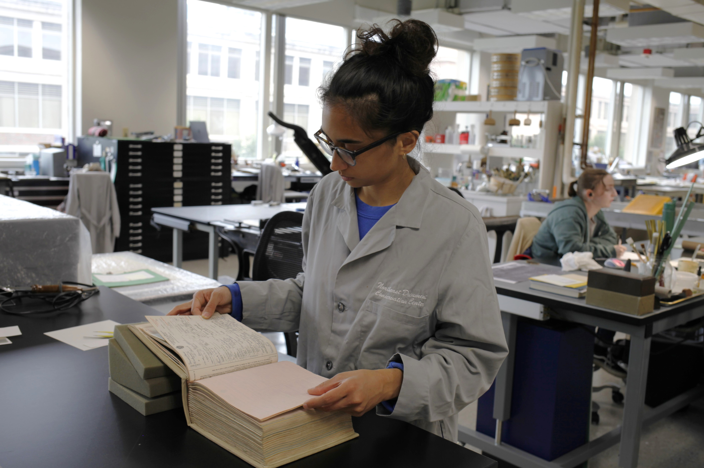
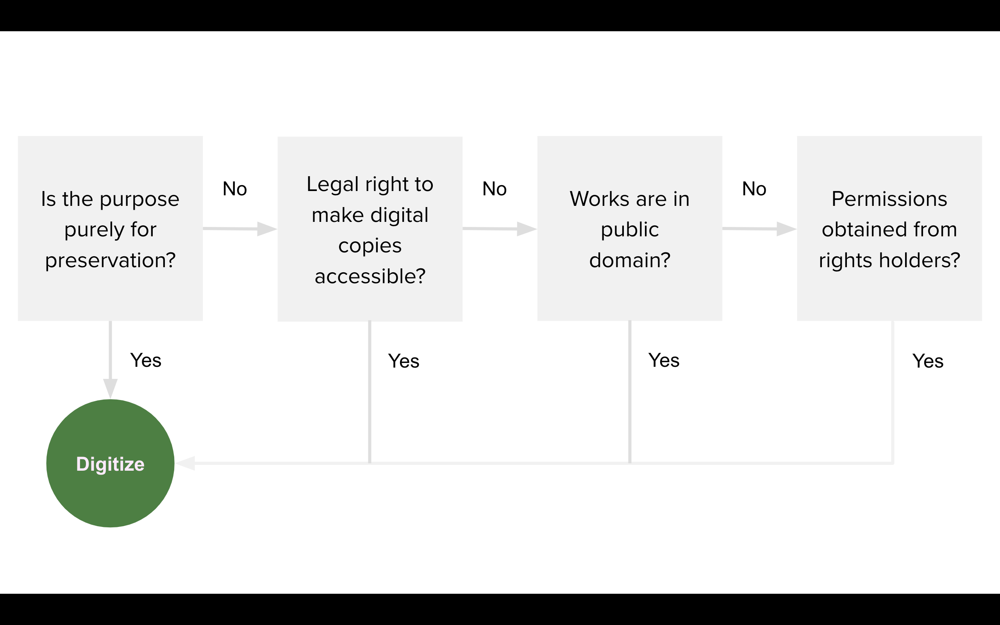
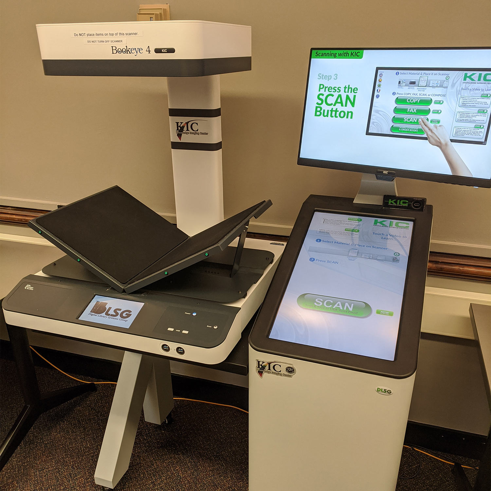
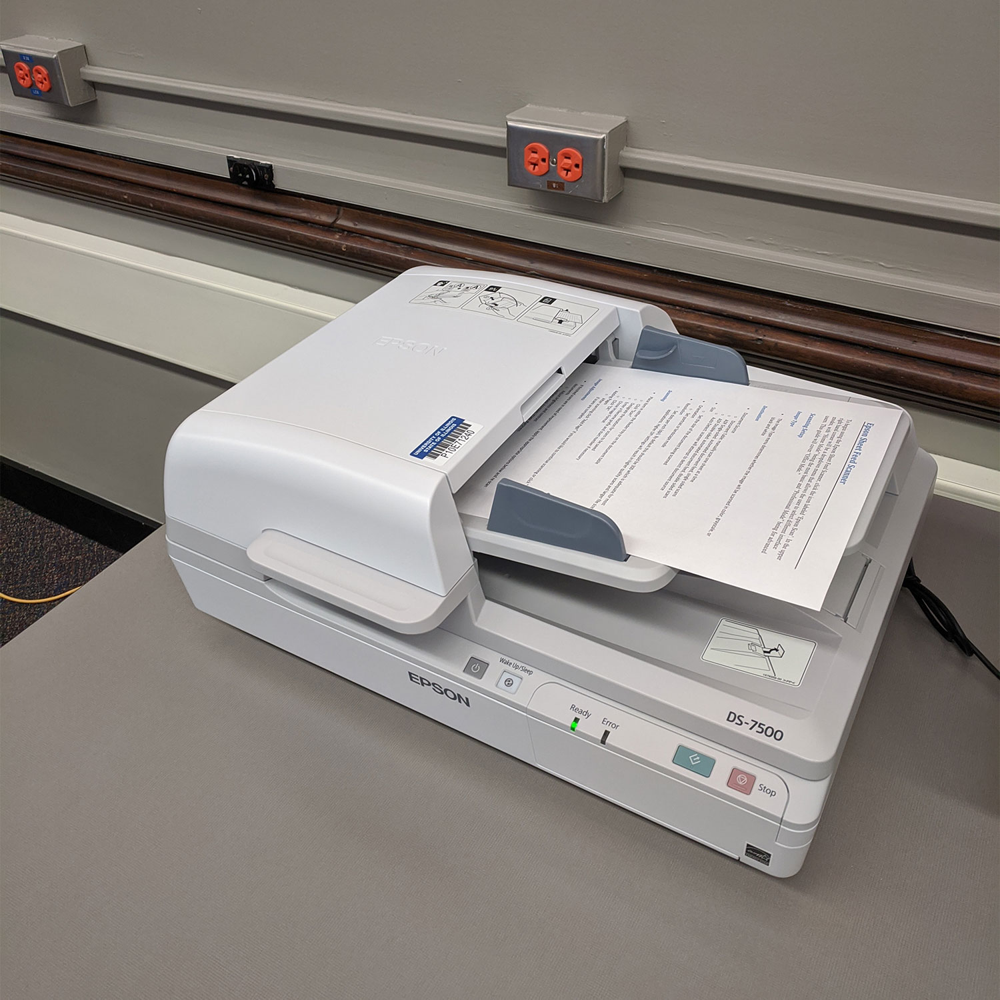

  
## Week 7
# Digitization

---

# Today
- **Settle in/Reminders/Announcements** (15 min)
- **Lecture: Digitization** (45 min)
- **Break** (10 min)
- **Start Weekly Activity: Imaging and Conservation** (70 min)
- **Wrap up** (10 min)

---

# Announcements

- <a href="https://drive.google.com/drive/folders/118J38a-pgbk0-RqhJXE4OLZB4xQ8lp2t" target="_blank">Examples</a> of past Final Project slide decks (1 so far, will add others soon!)
- I posted a <a href="https://digital-archives.github.io/HISTGA1011/activities/digipres_md_cheatsheet" target="_blank">Digital Preservation Metadata Cheat Sheet</a>, if you'd like to double-check your work.
- Did you know about the <a href="https://www2.archivists.org/news/2025/37-earn-digital-archivist-specialist-certificate-from-saa" target="_blank">DAS (Digital Archives Certificate)</a> offered through SAA?

---

# Digitization Selection

<!--presenter notes

How do institutions approach what is digitized? How do they prioritize what gets digitized now, or later?

-->

---

## Question
# Why can’t institutions, organizations, or individuals just **digitize it all** now?

<!--presenter notes

In the Prescott, Andrew and Hughs reading from this week, they addressed concepts of both “slow” and “mass” digitization. They wrote: “[S]trategic approach[es] to the selection of material for digitization has not been widely adopted”.

Issues surrounding patchwork funding models for digitization has resulted in “a lack of consensus as to what criteria should be adopted in selecting material for digitization” and that “[L]ibraries frequently undertake digitization programs in response to ad hoc managerial requirements rather than any strategic need.” They also point to more scathing critiques of digitization efforts, highlighting “preoccupation[s] with cultural treasures and canonical works” which are made more for “entertainment” rather than scholarship, and how digitization for the purpose of access subjects cultural materials to a “a digital sausage machine”.

Given this quote, and other readings that you were assigned this week, try and answer: Why can’t institutions, organizations, or individuals just “digitize it all” now?

-->

---

<!--presenter notes

Image from: https://www.nedcc.org/about/nedcc-stories/town-death-records

Over the next few slides, we will be reviewing digitization considerations put forth by the Northeast Document Conservation Center (NEDCC). NEDCC was founded in 1973, and was the first independent conservation laboratory in the United States to specialize exclusively in the conservation and preservation of paper-based collections. They have since expanded their work to include other materials, like audio-visual works. They produce guides, blog posts, and other literature online with helpful information for individuals and institutions on how to approach conservation and digitization management. This includes their Preservation and Selection for Digitization guidelines, which we will be stepping through over these next few slides.

-->

---

# Selection Criteria: 3 Questions

## 1. Should they be digitized?
## 2. May they be digitized?
## 3. Can they be digitized?

<!--presenter notes

Per Northeast Document Conservation Center (NEDCC)’s guidance to selection (https://www.nedcc.org/free-resources/preservation-leaflets/6.-reformatting/6.6-preservation-and-selection-for-digitization), there is “No absolute criteria guide selection for digitization, only questions to be addressed within the context of the individual institution. Each institution has its own reasons and priorities for digitization, from a national library responsible for preserving and presenting the published heritage of its citizens, to a small museum seeking publicity for its collections. The selector’s job is to apply local interpretation to a general set of selection criteria and principles, matching local goals and priorities to the materials and media in the collection.”
These questions are: 1) Should they be digitized; 2) May they be digitized; 3) Can they be digitized?

-->

---

# 1. Should the materials be digitized?

- Focuses on content to justify the expenditure of effort and resources
- Considers intellectual, historic, and physical characteristics?
- Looks to alignment with collection development policies
- Reveals value add (enhanced search capabilities, collaborative initiatives)

<!--presenter notes

Before embarking on any sort of digitization effort, whether ad hoc or programmatic, it’s important for initiators to ask themselves, Should we digitize? Digitization decisions should consider content value, demand, potential enhancements, and technical feasibility to ensure the preservation and accessibility of valuable materials.

-->

---

# 2. May the materials be digitized?

- Centers on the legal rights associated with digitization
- Addresses intellectual property rights early in the selection process
- Considers copyright issues, permissions from rights holders, and privacy
- Examines the institution's control over access and use of digital assets

<!--presenter notes

A huge deciding factor in selecting for digital preservation is whether or not your institution holds the appropriate rights to make digitized items available through a digital library or other public-facing catalog. 

You should know, first and foremost, that institutions have the legal right to digitize materials that are under copyright if the purpose is preservation only. Access, in these cases, will likely be restricted to on-premises, which obviously bars users for a variety of reasons. But, if your purpose for preservation is for preservation only, then you can go ahead and digitize.

However, it is so rarely the case that institutions preserve for preservation’s sake. Unless you hold the legal right to make these digital copies accessible, or know that these works are in the public domain, then your last step would be to obtain permissions from rights holders. This step alone can be very time consuming, especially for those works where there are multiple rights holders.

Additionally, you may have collections that contain a variety of public domain and copyrighted materials. An example of this type of collection was given by the Yolkowski and Jamieson article. Here, they placed orphaned collection items into 1 of 2 risk factor buckets. By categorizing the works in this way, they could make quick decisions about prioritizing processing works at a lower risk, first. This is an interesting approach to a rights framework.

We will cover rights more in Digitization Workflows - Part II. But just know that this is a very important question to ask first.

https://www2.archivists.org/publications/brochures/deeds-of-gift

-->

---

---

# 3. Can the materials be digitized?

- Examines technical aspects and capabilities required for digitization
- Considers the institution's technical infrastructure and staff expertise
- Evaluates digital capture quality, metadata, and preservation strategies
- Considers physical characteristics of the materials

---

  

  
  

Should, May, Can

  <b>Scenario:</b>  
  You have been selected to serve on your institution’s <b>Digitization Selection Committee</b>. Your role is to help develop a structured approach to prioritizing digitization projects based on institutional needs, resources, and impact.  

  A curator has proposed acquiring a **collection of an early jazz pioneer’s papers and master recordings**, which would require future digitization planning. Meanwhile, another curator has requested urgent digitization of **fragile lacquer discs** that are deteriorating rapidly.  

---

  

  
  

Your task is to determine <b>which project should be prioritized first</b> and what key questions should be asked to support that decision.

<ul class="activity-list">
  <li><b>Should</b> this item be digitized? (Institutional significance, demand, access needs)</li>  
  <li><b>May</b> this item be digitized? (Copyright, donor agreements, legal concerns)</li>
  <li><b>Can</b> this item be digitized? (Technical feasibility, fragility, cost, time)</li>
</ul>

---

  Using the <a href="https://airtable.com/appCwXm06oZ7Pae3Q/shrwaqKRGMC5v8sPm" target="_blank">Airtable form</a>, I will go around the room and ask students to contribute a question.

  _Example question:_ What is the current condition of the lacquer discs, and how much time do we have before they become unreadable?

---

# Equipment for Digitization  

## Scanners & Cameras  

---

# Contained Scanners

---

# Scanners

- Best for flat, unbound or loose materials
- Can be flatbed or roller-fed
- Some scanners can be quite compact and affordable (though large-format scanners exist and can be quite expensive!)
- Can set scanning capture parameters and not be obligated to control for lighting settings

---

# Copy Stand  

---

# Copy Stand  

- Versatile for different material sizes, including bound books and fragile documents  
- Ideal for reflective materials, cased images (e.g. daguerrotypes), and oversized items.
- Requires a **DSLR camera with proper lighting**  
- Faster for batch processing than flatbed scanners  

---

# Overhead Scanners (Book Scanners)  

<!--presenter notes

Image credit: University Library Media Commons: Scanning https://www.library.illinois.edu/sc/technology/scanning/

-->

---

# Overhead Scanners (Book Scanners)  

- Designed for bound and fragile materials
- Uses **V-shaped cradles** to reduce strain on book bindings
- Allows scanning without fully opening books to 180°

---

# Document Sheet-Fed Scanners  

<!--presenter notes

Image credit: University Library Media Commons: Scanning https://www.library.illinois.edu/sc/technology/scanning/

-->

---

# Document Sheet-Fed Scanners  

- Best for high-volume scanning of loose sheets  
- Fastest option for bulk document digitization  
- Used for paper archives, business records, and manuscripts

---

# 3D & Computational Imaging  

- Includes **photogrammetry and object scanning**  
- Used for **artifacts, sculptures, and scientific specimens**  
- Requires specialized software to build **3D models**  

---

# Specifications
## Digital Image Capture

<!--presenter notes

When digitizing flat or paper-based materials, precision matters. Every detail, from the depth of color to the sharpness of the smallest text, depends on adhering to standardized specifications. These specs are usually first set through image capture policies, which dictates how the equipment is calibrated. However, calibrations depend on the material being captured, and may require adjustments or re-captures.

-->

---

## Standard
# Federal Agencies Digital Guidelines Initiative (FADGI)

The **Federal Agencies Digital Guidelines Initiative (FADGI)** is a collaborative effort started in 2007 by federal agencies to articulate common sustainable practices and guidelines for digitized and born digital historical, archival and cultural content.

https://www.digitizationguidelines.gov/

<!--presenter notes

https://www.digitizationguidelines.gov/guidelines/DRAFT%20Technical%20Guidelines%20for%20Digitizing%20Cultural%20Heritage%20Materials%20-%203rd%20Edition.pdf

FADGI was established to develop common guidelines and technical specifications for digitizing cultural heritage materials, such as manuscripts, photographs, maps, and audiovisual materials, among others. Its goal is to ensure that digital copies of these materials are created with high quality and are suitable for long-term preservation and access.

-->

---

## Document
# May 2023: Technical Guidelines for Digitizing Cultural Heritage Materials (Third Edition)

https://www.digitizationguidelines.gov/guidelines/FADGITechnicalGuidelinesforDigitizingCulturalHeritageMaterials_ThirdEdition_05092023.pdf

<!--presenter notes

The FADGI Technical Guidelines for Digitizing Cultural Heritage Materials document, last updated  a couple of years ago, covers a wide range of topics related to digitization, such as ideal image capture, color management, file formats, metadata, and quality assurance. The guidelines are based on best practices from the fields of library science, archival science, and digital imaging, among others.

-->

---

| **Category**                    | **FADGI Recommendation**                            |
|----------------------------------|----------------------------------------------------|
| **Format**     | TIFF (preferred), JPEG 2000 (lossless), PDF/A |
| **Access Format** | JPEG, PDF, PNG (for web or access copies) |
| **Resolution** | - **Manuscripts, Text, Maps**: 300-400 PPI - **Photographs/Graphics**: 400-600 PPI - **Film/Negatives/Slides**: 3,000-4,000 PPI  |
| **Bit/Color Depth** | - **Bitonal (Black & White)**: 1-bit - **Grayscale**: 8-bit minimum - **Color**: 24-bit |
| **Compression** | None (TIFF), Lossless JPEG 2000 (optional), JPEG (lossy for access copies) |

<!--presenter notes

This is a very, very simplified table showing high-level FADGI recommendations.

-->

---

#### No Compression
No data is removed (TIFF is best for preservation)
 
#### Lossless Compression
Data is reduced without quality loss (e.g., PNG, JPEG 2000 lossless)
 
#### Lossy Compression
Data is discarded for smaller file sizes (JPEG sacrifices quality for file size).

---

## Concept
# Lossless Compression

In standard image storage, every pixel is stored individually, even if one pixel is exactly the same as another.

Lossless compression, like **Discrete Wavelet Transformation (DWT)**, identifies these redundancies and stores them in a way that avoids repeating the same pixel information multiple times. This allows the image to be reconstructed exactly as it was, with no loss of quality, while reducing file size.

---

# FADGI Guidelines for File Names

---

| Guideline | Description |
|-----------|------------|
| **File extension** | Include **file extension** (e.g., `.jpg`, `.tiff`) |
| **Max items** | Consider the **total number of files**. |
| **Leading zeros** | Ensures files **sort in proper sequence**. |
| **Keep it simple** | Avoid **complex/long filenames**. |
| **Use lowercase** | Easier for computers to read. |
| **Metadata** | Don't overload filenames with metadata. |

<!--presenter notes

Require that a file format extension must always be present. We recommend using a period followed by a three-character file extension at the end of all file names for identification of data format (for example, .tif, .jpg, .gif, .pdf, .wav, .mpg, etc.)

Take into account the maximum number of items to be scanned and reflect that in the number of digits used (if following a numerical scheme).

Use leading 0’s to facilitate sorting in numerical order (if following a numerical scheme).

Do not use an overly complex or lengthy naming scheme that is susceptible to human error during manual input.

Use lowercase characters and file extensions.

Record metadata embedded in file names (such as scan date, page number, etc.) in another location in addition to the file name. This provides a safety net for moving files across systems inthe future, in the event that they must be renamed. In particular, sequencing information and major structural divisions of multi-part objects should be explicitly recorded in the structural metadata and not only embedded in filenames.

Although it is not recommended to embed too much information into the file name, a certain amount of information can serve as minimal descriptive metadata for the file, as an economical alternative to the provision of richer data elsewhere. Alternatively, if meaning is judged to be temporal, it may be more practical to use a simple numbering system. An intellectually meaningful name will then have to be correlated with the digital resource in an external database.

-->

---

# Example

#### bcs0945_b03_f14_0001.tif
[call_number]\_[box#]\_[folder#]\_[sequence#].[extension]

<!--presenter notes

Here are three examples of filenaming conventions that generally abide to what was discussed in the previous slide. As you can see, filenames can vary, and will depending on your institution, the system(s) you are using to generate files, other systems’ conventions, etc.

-->

---

## Weekly Activity
# Imaging and Conservation Review

Start: <a href="https://digital-archives.github.io/HISTGA1011/activities/imaging.html" target="_blank">https://digital-archives.github.io/HISTGA1011/activities/imaging.html</a>

---

_Final questions or reflections?_

mary.kidd@nyu.edu