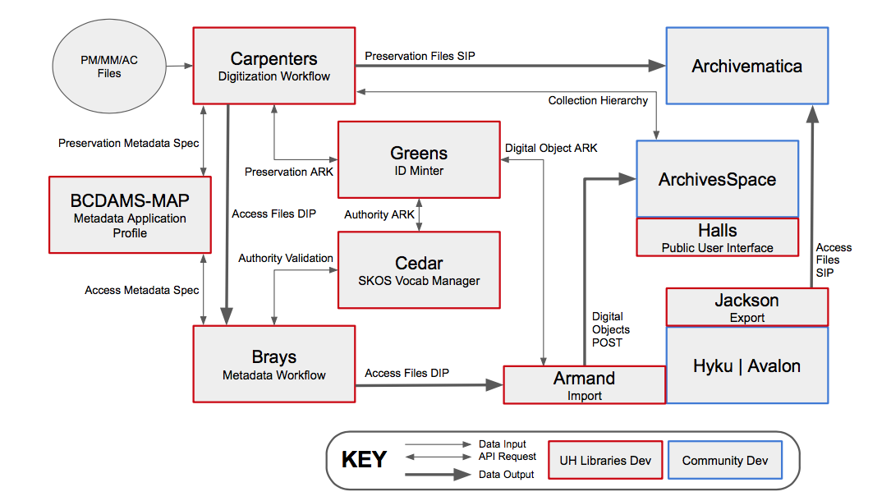
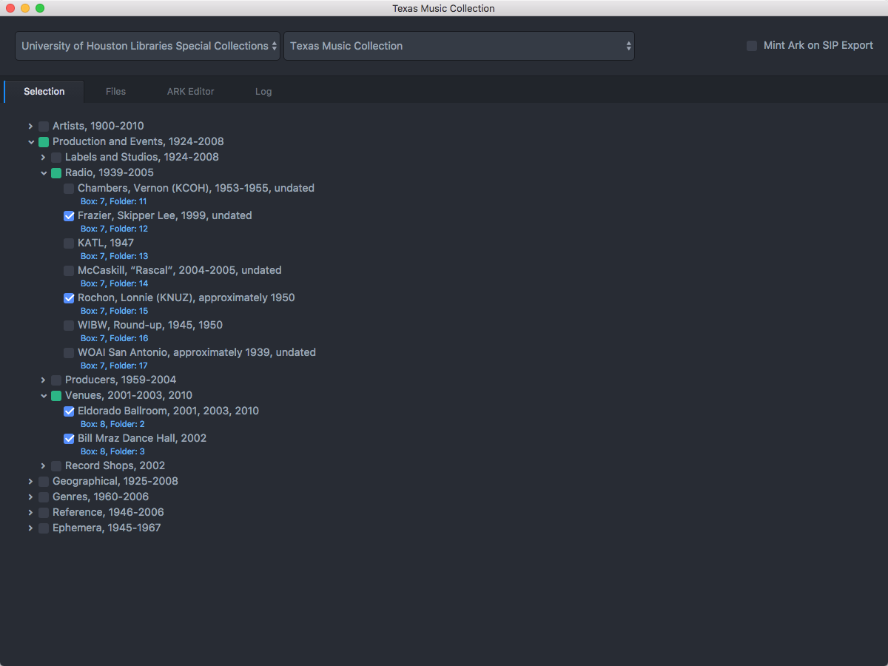
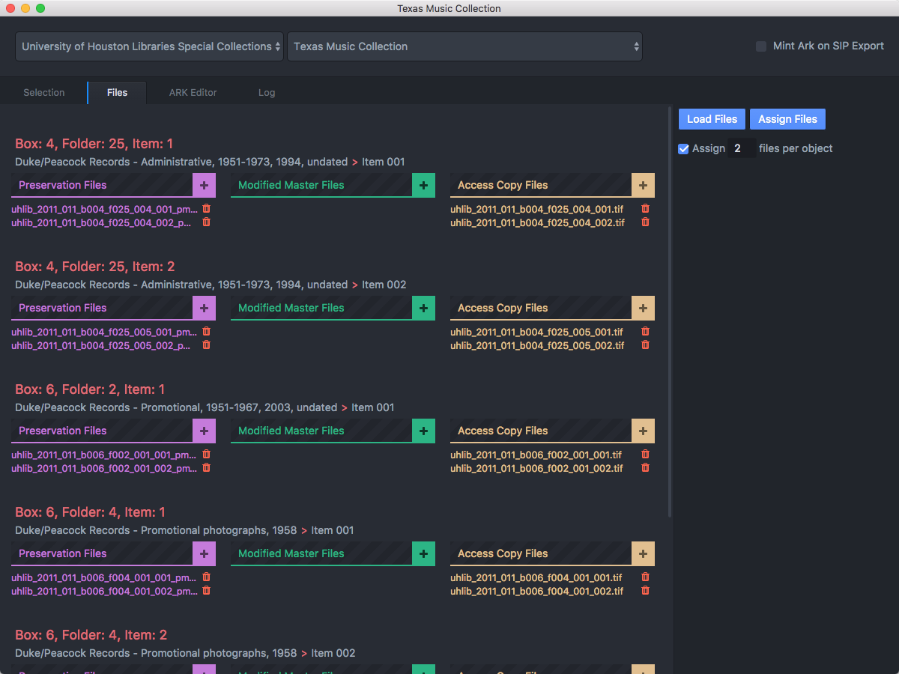
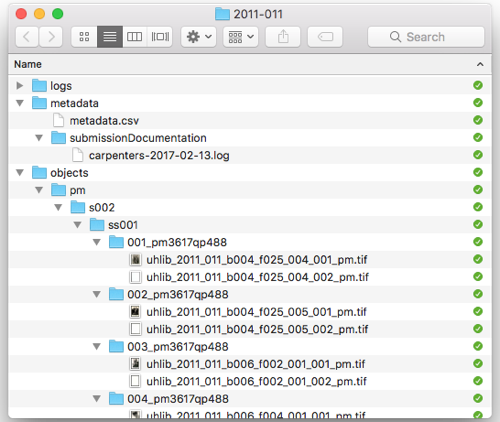
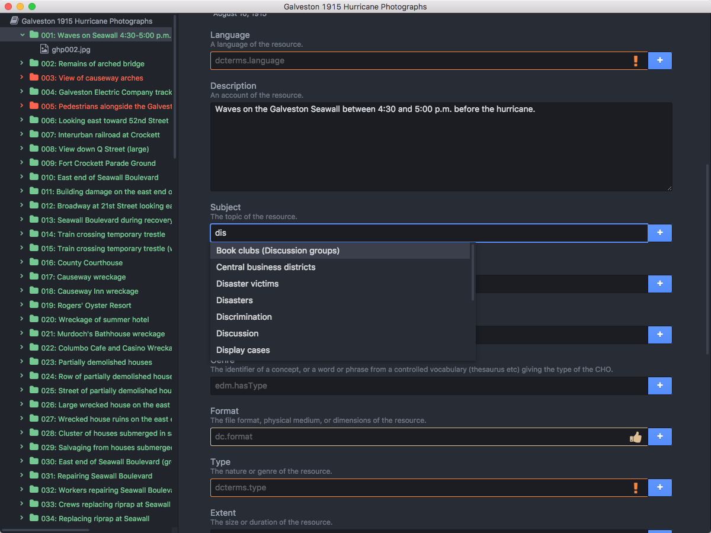
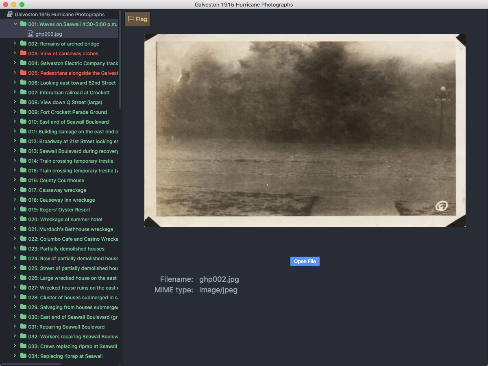

_Metadata\-driven digital preservation workflow_

Catalog record or finding aid  __serves as basis for digitization request/work order__

Digitization staff captures raw images\, produce derivatives\, rename

Image and metadata files are packaged and ingested into archival storage; checksums and identifiers created

Finding aid\, catalog or other access endpoints updated

---

Digital preservation metadata workflows vary a lot from one institution to another. The bulleted list here represents a very generalized, high-level description of how metadata informs digitization workflows. Just know that the order which these events occur may differ.

Digitization work usually starts with gathering existing descriptive metadata. Although most descriptive metadata, like through a finding aid, will likely be at a collection or series level, it is still is useful because it contains data that can be used to give the project a name, populate digitization work orders or requests, and structure the work performed by digitization staff, such as putting forth the proper order in which to create captures.

With existing metadata in hand, digitization staff will create image captures, which will serve as the basis for derivatives such as a preservation master and access copies. These captures will result in the creation of additional technical metadata describing the systems and environments in which captures were created and manipulated.

Since these additional files are in relationship with one another, we need to capture this metadata through structural metadata. One basic way to do this is through filenaming or foldering files in a uniform and sequential manner. You might also use some sort of system, like a digital asset or metadata management system, to import or point to these files, enter information about their relationships, and maybe even use them to create preservation metadata files, like a METS file.

Lastly, you will need to update your digital library in some way that brings the project full circle, syncing the digitized files back to the finding aid component, a catalog record, or an exhibition site. This can be accomplished through descriptive metadata systems like ASpace, an institutional repository or other access system.

_University of Houston Digital Preservation Workflow_

---

Case study: University of Houston (UH) Libraries made an institutional commitment in late 2015 to migrate the data for its digitized cultural heritage collections to open source systems for preservation and access: Hydra-in-a-Box, Archivematica, and ArchivesSpace.

Let’s move from the abstract into a real life scenario. Here, we have a workflow diagram created by the University of Houston, representing their digital preservation workflow that we are going to break down into something more digestible and understandable.

_Bayou City Digital Asset Management System \(BCDAMS\)_

 __Hydra\-in\-a\-Box \(HyKu\)__ 

Interface used by staff working with digital objects to view files and create metadata in preparation for Hyku ingest\.

Public user interface

Linked data vocabulary manager

Mints persistent identifiers applied to preservation packages like SIPs

Interface used by digitization staff to manage digitization workflow and preservation ingest

---

https://journal.code4lib.org/articles/12342#unit5

The University of Houston uses a kind of preservation systems “ecosystem” of both open-source and homegrown applications and tools, each working in concert with one another to fully or partially automate the entire digital preservation workflow.

UH uses three open-source tools:
ArchivesSpace: Used by archivists to describe collections and produce finding aids
Archivematica: Used to automate workflows into and from the digital repository.
Hydra-in-a-Box (aka Hyku): open-source digital repository software platform that allows institutions to manage, preserve, and provide access to digital collections.

UH also uses a number of homegrown tools:
Carpenters: an internal staff interface used by digitization staff to manage digitization workflow and preservation ingest.
Brays: a metadata management system used by staff working with digital objects to view files and create metadata in preparation for ingest into HyKu
CEDAR: A linked data vocabulary manager
Greens: A persistent identifier minter
HALLS: Stands for Houston Area Library Automated Network Delivery System. HALLS is a front-end interface for searching and discovering content from various digital repositories and collections maintained by the libraries in the Houston area

Now that we have covered all the systems used in UH’s workflow, I am going to step you through their digital preservation workflow, and break down what that looks like.

* Archivist creates a finding aid in ArchivesSpace\.
* In the Carpenters system\, archivist opens the “Selection” tab and
  * imports finding aid; Carpenters replicates the collection hierarchy
  * selects items for digitization by checking boxes next to the folder or item
* Carpenters populates the shot list in the “Files” tab\. This list is used by Digitization Unit staff to guide them which items need to be photographed/scanned\, and in what order\.

---

https://journal.code4lib.org/articles/12342#unit5

---

This is a screenshot of the Carpenters interface, with the “Selection” tab open, which is where the archivist works to import the finding aid components and hierarchy.

As you can see, Carpenters allows preservation administrators to organize digitized content into hierarchies that preserve the contextual linkages and provenance of the original archival collection.

* __Digitization Unit staff__
  * __photograph and scan materials\, eventually creating a preservation master\, as well as modified master and access copies for each archival object\, each of which are stored on the local file system\.__
  * __In the Carpenters “Files” tab\, associate each file they have created with the corresponding archival object\. __
  * __Through this process\, the ArchivesSpace URI for each archival object is linked to its digital surrogate\.__

---

In this screenshot, we are looking at the Carpenters interface “Files” tab, which is where Digitization Unit staff work. Each row has a box and folder listed, followed by the name of the collection and series title. Here, they can click on the plus sign next to the derivative file type, such as Preservation Master, and add the filename. In this way, they are connecting image captures to archival objects in the finding aid.

__After scanning is complete\, the Carpenters system automatically moves the preservation masters from the local file system to a set of nested directories in an Archivematica\-compatible Submission Information Package \(SIP\)\, that replicates the intellectual arrangement of the original collection\.__

_Archivematica SIP exported from Carpenters_

---

After scanning is complete, the Carpenters system automatically moves the preservation masters from the local file system to a set of nested directories in an Archivematica-compatible Submission Information Package (SIP), that replicates the intellectual arrangement of the original collection.

“By eliminating the need for manually creating directories or moving files on the file system, the Carpenters application streamlines batch ingest preparation for preservation master files, making it ideal for large-scale workflows.”

_Persistent Identifier_

__The Carpenters system also:__

__requests an __  __Archival Resource Key \(ARK\)__  __ for each preservation package\, creating a persistent identifier that connects the preservation master files to the access objects published in Hyku\.__

__outputs a DIP of access files and a metadata CSV file that is used as input for the Brays descriptive metadata application\.__

---

The Carpenters system does even more!

It also requests an Archival Resource Key (ARK) for each preservation package, creating a persistent identifier that connects the preservation master files to the access objects published in HyKu. It also outputs a DIP of access files and a metadata CSV file that is used as input for the Brays descriptive metadata application.

So not only does Carpenters create relationships between image files and archival objects, it also creates unique IDs that allow the system to express relationships between different file derivatives.

# Definition: 
Persistent Identifier (PID)

An identifier that is unique\, universal\, and persistent\.

Identifier: a string used to refer to an object

Unique: identifier is only used for one object

Persistent: remains available independently of individual institutions\, systems or system implementations\.

Universal: unique within a specific context

---

Take a pause and talk about what a persistent identifier, or PID, is. A PID is defined as an identifier that is unique, universal, and persistent.

Break this down:
Identifier: a string used to refer to an object. A string is a sequence of characters, which can include letters, numbers, symbols, and spaces. Strings are often used to represent text-based data and are a fundamental data type in most programming languages.
Unique: identifier is only used for one object
Persistent: remains available independently of individual institutions, systems or system implementations. Persistent also implies that the ID will be usable for the long term. However, as Koster acknowledges in the Persistent identifiers for heritage objects article, this isn’t totally possible and requires maintenance by and continued existence of the institutions supporting the PIDs.
Universal: implies that the identifier is unique within a specific context. For example, a single identifier like "12345" might be used to identify different objects in different domains, such as a book in a library catalog, or an image in an online museum. Without knowing the specific context in which the identifier is being used, it may not be possible to ensure that it is globally unique. PIDs are assigned within a defined context to guarantee its uniqueness and distinguish it from other identifiers.

PIDs are composed of unique resource identifiers (URIs).

# Definition: 
Web Namespace

DOI example: 10\.  __17723__  /aarc\.76\.2\.6q005254035w2076

PID URI: https://doi\.org/10\.  __17723__  /aarc\.76\.2\.6q005254035w2076

| System | Type | Registry | Mint | Assign | Persistence | Resolve | Server admin | Rule based |
| :-: | :-: | :-: | :-: | :-: | :-: | :-: | :-: | :-: |
| NBN | PID (+ PID-URI) | National | Local | Local | National | National | National | No |
| Handle | PID (+ PID-URI) | Central | Local | Local | Central | Central/Local | Local | Yes |
| DOI | PID/PID-URI | Central/Nodes | Nodes | Nodes | Central | Central | Nodes | No |
| ARK | PID | Central | Local | Local | Local | Local | Local | Yes (NOID) |
| Purl | PID-URI/URL | Central | Local | Local | Central/Local | Central/Local | Central/Local | Partial url |
| Private | PID/PID-URI | Local | Local | Local | Local | Local | Local | Optional |

---

A web namespace is a logical grouping of resources or digital objects that share a common context, such as a particular domain or subject area. Various institutions administer identifiers and guarantees their uniqueness within a unique namespace on the web.

Let’s look at one example: A Digital Object Identifiers, or DOIs, which are a type of persistent identifier. You have probably seen DOIs listed in electronic journal articles you’ve read. In the slide I’ve included the DOI for one for the Miller article assigned this week, published in The American Archivist. Digital Object Identifiers are managed and administered by the International DOI Foundation. Here, the publisher The American Archivist registered with the DOI Foundation. Once registering with the DOI, they are assigned their own namespace and given a registration agency code, highlighted in the example as 17723. This code is then used in the DOI id naming convention. If another publisher by some change had the same suffix, even though there would be a slim chance of that, you could still disambiguate it using the registrant code.

# Definition: 
Unique Resource Identifier (URI)

PIDs are composed of Unique Resource Identifiers\, which is a string of characters that identifies and locates a unique resource on the internet\. There are 2 types of URIs:

 __Uniform Resource Locators__    \(URLs\)

Example: http://purl\.org/dc/elements/1\.1/

 __Uniform Resource Names__    \(URNs\)

Example: urn:nbn:nl:ui:29\-8f66e0a8\-b7c9\-40a4\-be28\-54a7c01770

---

Persistent identifiers are composed of one or more Unique Resource Identifiers, or URIs.

A Unique Resource Identifier or URI is a string of characters that identifies and locates a unique resource (such as a web page, image, video, etc.) on the internet. There are 2 types of URIs:
Uniform Resource Locators (URLs): resolvable on the web (uses protocols like http:// or https://) and points to a website
Uniform Resource Names (URNs): specific to a particular namespace, not a locator (not a web address on their own.)

The composition or syntax of a PID is determined by the institution administering it.

 __NBN \(National Bibliographic Number\) __ 

Syntax: urn:nbn:\[country code\]:\[institutional code\]\-\[pid\-suffix\]

Example: urn:nbn:nl:ui:29\-8f66e0a8\-b7c9\-40a4\-be28\-54a7c01770

Resolving: National: PID\-URI = \[national resolver URL\]/\[NBN\]

 __Handle__ 

Syntax: \[naming authority code\]\.\[sublevel\(s\)\]/\[pid\-suffix\]

Example: 11245\.1/8f66e0a8\-b7c9\-40a4\-be28\-54a7c0177061

Resolving: Central/Local: PID\-URI = https://hdl\.handle\.net/\[handle\]

 __ARK__ 

Syntax: ark:/\[name assigning authority number\]/\[pid\-suffix\]

Example: ark:/84475/do53246r617

Resolving: Central: PID\-URI = \[local resolver URL\]/\[ARK\]

---

Here are examples of various administering organizations and their persistent identifier syntaxes. The last example, ARK, is the PID system used by the University of Houston.

* _Access \- Editing Metadata_
* Metadata Unit staff loads the Carpenters\-generated DIP in the Brays descriptive metadata editor and creates descriptive metadata for all objects\. During editing\, Brays:
  * Suggests controlled vocabulary terms from Cedar
  * Dynamically reads and writes to a metadata CSV file in the DIP\.
  * Color\-codes which fields are required\, recommended\, and optional\.

---

The access portion of the workflow begins when Metadata Unit personnel loads the Carpenters DIP in the Brays descriptive metadata editor and creates descriptive metadata for all objects. 
Brays suggests controlled vocabulary terms from the Cedar linked data vocabulary manager and validates the record against their descriptive metadata specification.
Brays dynamically reads and writes to a metadata CSV file included in the DIP.
Color coding in the metadata creation interface indicates to staff  which fields are required, recommended, and optional.
Additionally, once the record contains all required fields, the object name in the object viewer turns from red to green.

---

This is the Brays metadata creation staff interface. On the left-hand side, you see a list of all the digital preservation objects, in order. You can click into any one of them, and open up a descriptive metadata record. This record is connected to the CEDAR linked data vocab, which provides controlled lists, metadata validation and type-ahead suggestions.

---

You can also use BRAYS to view a copy of the preservation file in full screen mode, so you can toggle back and forth between the image and the description quickly and seamlessly.

_Access \- HALLS End\-User Interface_

HALLS displays search results that clearly convey both the intellectual arrangement \(series\, sub\-series\, and file\-level titles and descriptions\) and the physical instance \(box and folder information\) associated with an archival object\.

_[Digital object in the structure of the finding aid](https://findingaids.lib.uh.edu/repositories/2/archival_objects/1454)_

_[Digital object standalone record](https://digitalcollections.lib.uh.edu/concern/images/8w32r5748?locale=en#?c=0&m=0&s=0&cv=0&xywh=-415%2C-9%2C4635%2C2362)_

---

Lastly, the Houston Area Library Automated Network Delivery System, or HALLS system, provides front-end access to the user. This interface brings together the EAD finding aid created by the archivist in ArchiveSpace with the digital object records maintained in the HyKu digital repository, and presents digital objects in the context of the archival hierarchy.

This item on Digital Collections: https://digitalcollections.lib.uh.edu/concern/images/8w32r5748?locale=en#?c=0&m=0&s=0&cv=0&xywh=-415%2C-9%2C4635%2C2362

This item in finding aid

__Access and Discovery__

---

Last week, we discussed and explored workflows leading up to the point where a digital surrogate is created (i.e. snapping a high-resolution photo of a 2D image, and giving the file a name).

We are going to first speak generally about how metadata drives digitization workflows, and then look at a particular case study to tie together all that we have learned so far.

# Definition: Discovery and delivery
—

__“\[D\]escrib\[es\] what people\, processes\, and systems do to support finding\, accessing\, and using material from archives and special collections\.”__

__Maria Matienzo and Dinah Handel\, Lighting the Way White Paper \(2021\)__

 __Question__ 

Wiedeman discusses the challenge that current archival access and discovery platforms face in accommodating the hierarchical nature of archival description\. He suggests that this difficulty may stem from users' preference for bibliographic\-based systems\, which they find less confusing and more intuitive compared to the complex and specialized nature of archival description\.    __Should the design of these systems prioritize “traditional” finding aid structures\, or should they lean towards the formats that are more widely understood and accepted by users? Provide your reasoning for or against this approach\.__ 

---

This is an example of bibliographic description. Most library items (books, CDs, DVDs, whatever) use a 1-to-1 relationship between thing (book) and description (record).

_[https://www\.archives\.gov/research/guide\-fed\-records/groups/095\.html](https://www.archives.gov/research/guide-fed-records/groups/095.html)_

---

Archival collections, on the other hand, do not have the same 1-to-1 relationship between a single item, and its description. Instead, we have different levels of description: collection, series, box, folder. Rarely, do you ever go beyond folder (at least, in terms of a “traditional” finding aid. However, we are seeing more systems emerging that connect digital items to finding aids).

---

In this NYPL example, we are looking at the James Baldwin finding aid; specifically, the Correspondence series.

Let’s flip this example over and look at the XML.

---

Here is the XML describing the Correspondence series of the James Baldwin collection. As you can see here (and as you saw within several examples presented during last week’s lecture on preservation metadata), XML is expressed hierarchically. You can see that plainly here: wherever there are indentations. What is powerful about this is that this allows for lower-level components, like folders, to inherit the metadata of higher-level components, like box, or series.

“…\[T\]he approaches used by archivists are useful primarily because of the scale of the materials they manage\. Got a large but manageable amount of stuff? Use bibliographic description\. Got a seemingly never\-ending vast mountain of materials? Use archival description\. This is an oversimplification \[\.\.\.\] but scale alone is a useful distinction to show how archival systems are meaningfully different\.”

Gregory Wiedeman\,    _Designing Digital Discovery and Access Systems for Archival Description_    \(2023\)

“When you compare catalog cards to finding aids or OPACs to ArchivesSpace\, bibliographic description is often more familiar and comfortable for most users\. The usability problems of online finding aids and archives access systems are very well\-documented\.”

Gregory Wiedeman\,    _Designing Digital Discovery and Access Systems for Archival Description_    \(2023\)

 __Online Finding Aid Usability: 8 Takeaways__ 

 __Need for dynamic navigation__ 

The complexity and hierarchical nature of archival description requires sophisticated navigation options\.

 __It’s easy to get lost__ 

Users\, especially those new to navigating through online finding aids\, report feeling lost\, confused or unsure over where they are within the collection\.

 __Online availability is difficult to determine__ 

Because they are online resources\, users assume all components listed are available online \(and feel frustrated when they realize some or all parts are not available\)\.

 __Training and guidance needed__ 

Users would appreciate more training that goes beyond a “Help” page\.

---

These takeaways were derived from Joyce Celeste Chapman’s article “Observing Users: An Empirical Analysis of User Interaction with Online Finding Aids” in the Journal of Archival Organization (JAO), 8:4–30, 2010 (DOI: 10.1080/15332748.2010.484361)

 __Online Finding Aid Usability: 8 Takeaways__ 

 __Too much jargon__ 

Certain words displayed in finding aids can lead to further confusion if required later on to successfully navigate the site\.

 __Want quick results__ 

Rather than navigating a table of contents\, users would rather a finding aid be navigable in the same way a modern search engine works\.

 __Less texts\, more lists__ 

Large blocks of text are distracting; users prefer hyperlinked\, easy\-to\-read bulleted lists\.

 __Archival intelligence can be developed__ 

Though not always immediately attainable\, studies show users can quickly learn to navigate finding aids through 1\+ sessions\.

---

These takeaways were derived from Joyce Celeste Chapman’s article “Observing Users: An Empirical Analysis of User Interaction with Online Finding Aids” in the Journal of Archival Organization (JAO), 8:4–30, 2010 (DOI: 10.1080/15332748.2010.484361)

*  __Mini Activity \- Part 1__ 
* Go to archives\.nypl\.org
* Search for the James Baldwin Papers finding aid
* This collection has been partially digitized\. Knowing that:
  * Try to find the digitized items\.
  * Click on and open a digitized item\. Make a note of its name to use in Part 2 of this activity\.
*  __Report to the class: __   How was your experience navigating to the digitized portion of this collection?

 __Mini Activity \- Part 2__ 

Go to digitalcollections\.nypl\.org

Search for James Baldwin: try and find the digital item you just opened in the finding aid\.

Look at the record\, not just in terms of the digitized item\, but other metadata made available\.

 __Report to the class: __   How was your experience navigating the Digital Collections “version” of the digitized item?

 __Mini Activity \- Part 3__ 

 __Report to the class: __   How was your experience navigating the Archives Portal and Digital Collections?

How easy/hard were the sites to search\, browse\, filter?

What metadata is displayed?

How do images/text/sound/moving image files display? What do you like/think works?

What do you not like/does not work as well?

What sites do you think a scholar would find useful? Student? General public?

__Within the archival profession the term __  __accessibility__  __ commonly refers to the general discoverability and ease of use of archival collections\. In the context of enabling equal or equivalent access to archival facilities and services for people with disabilities\, accessibility refers to minimizing or eliminating barriers\. Accessibility should be integral to institutional cultures\, workflows\, and services\.__

---

Within the archival profession the term accessibility commonly refers to the general discoverability and ease of use of archival collections. In the context of enabling equal or equivalent access to archival facilities and services for people with disabilities, accessibility refers to minimizing or eliminating barriers. Accessibility should be integral to institutional cultures, workflows, and services.

This definition comes from SAA’s Guidelines for Accessible Archives for People with Disabilities document.

https://www2.archivists.org/groups/reference-access-and-outreach-section/guidelines-for-accessible-archives-for-people-with-disabilities

 __Accessibility is essential to building access platforms__ 

Most institutions’ accessibility expectations will be informed by federal law\, state law\, and/or institutional best practices\. Section 508 Standards for Accessible Electronic and Information Technology\, the World Wide Web Consortium’s Web Content Accessibility Guidelines \(WCAG\)\, and PDF\-UA \(ISO 14289\-1\) are the most common tools used to build digital accessibility policies\.

 _General_    __ Recommendations__ 

__Font size can be changed without impacting navigability/meaning__

__Sufficient foreground and background contrast __

__Avoid color combos problematic for people who are color\-blind__

__Ensure content is navigable when:__

__Using a screen reader/magnification program__

__Keyboard without a mouse__

__Do not rely solely on color\, font to convey meaning__

__Use responsive design\, adaptable for mobile/desktop views__

__Test accessibility of digital content frequently__

---

The following recommendations apply to a variety of digital content media including electronic documents, websites, apps and other software, and social media platforms. 

 _Website_    __ Recommendations__ 

__Include an accessibility information and feedback section__

__Use proper HTML markup with correct nesting of elements\.__

__Use ARIA landmark roles to properly indicate navigable regions of the page__

__Use meaningful page titles and document file names\.__

__Indicate the document language in markup\.__

__Proper use of heading tags__

__Ensure that tables have headings and structure\.__

__Use proper form markup\.__

__Use descriptive text for hyperlinks \(i\.e\. not "click here"\)\.__

__Use Plain Language Guidelines when generating content for your site\. __

__Provide alternative text for visual content__

 _Repository_    __ Recommendations__ 

__Advocate for accessibility provisions in contracts for vendor solutions__

__Scan text documents as text \(not as images\) or convert scanned documents from image files to text\, and use OCR to improve accessibility\.__

__Include transcripts for those materials that cannot be OCRed\, such as handwritten manuscripts\. __

 _Audio\-visual_    __ Recommendations__ 

__Provide captions and transcripts__

__Use audio description for video content__

__Avoid content with flashing\, flickering\, or strobing__

 _Social Media _    __Recommendations__ 

__Use alt\-text where possible__

__Do not use special characters ex\. 𝕭𝖆𝖉 𝕱𝖔𝖓𝖙__

__Avoid emojis in succession or in excess__

__Use alternating for hashtags ex\. \#HashTag__

__Research the culture of the platform before posting__

__Include contact and physical site details__

__Use automated messaging for DMs__

*  __Mini Activity__ 
* Open the    _[Web Accessibility Evaluation Tool](https://wave.webaim.org/)_    \(WAVE\)
* Input the URL for these two sites:
  *  _[https://library\.uta\.edu/txdisabilityhistory/](https://library.uta.edu/txdisabilityhistory/)_ 
  *  _[https://archives\.albany\.edu/espy/](https://archives.albany.edu/espy/)_ 
* Use the TopTal Color Blind Filter to analyze the contrast and visibility of a site\.
*  __Report back to class: __   Identify what are the most common issues you observed\.

 __In\-class activity__ 

 _[The User’s Experience](https://digital-archives.github.io/HISTGA1011/activities/user_experience.html)_ 

