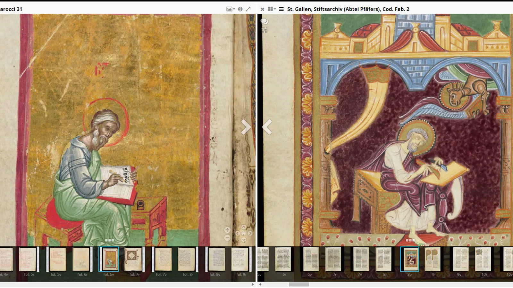
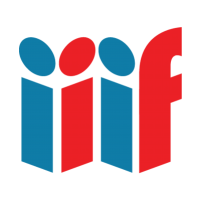
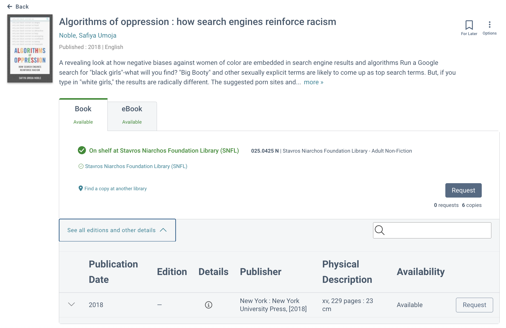
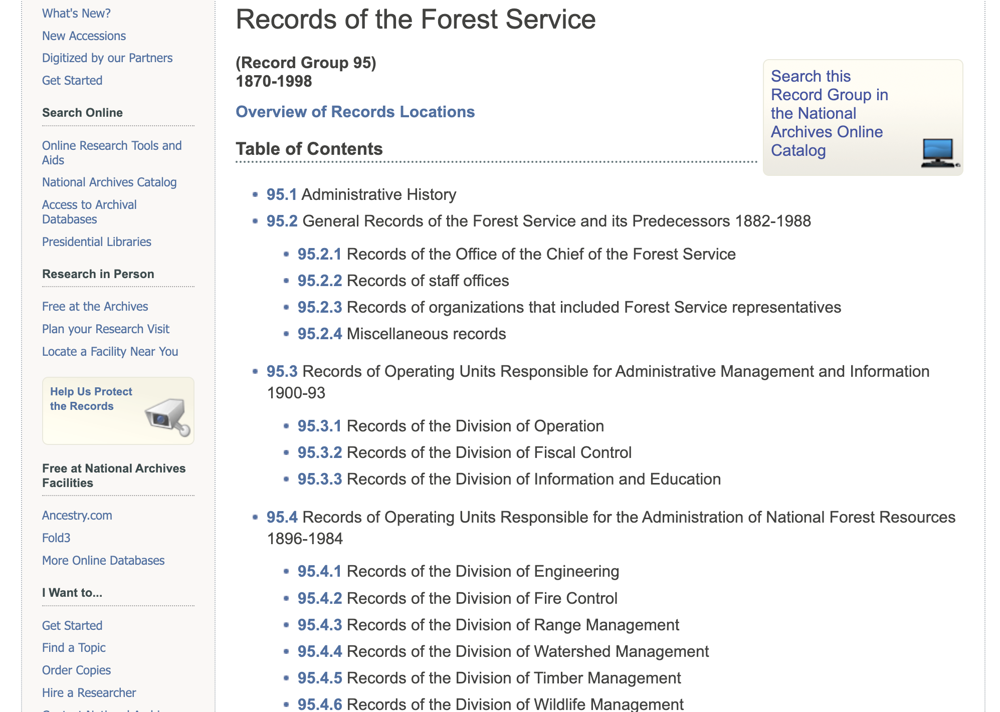
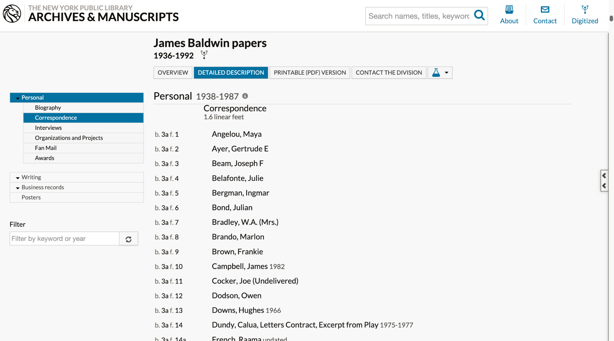

## Week 8
# Access and Discovery

---

# Today
- **Settle in/Reminders/Announcements** (15 min)
- **Discuss Last Week's Activity** (20 min)
- **Lecture: Access and Discovery** (45 min)
- **Break** (10 min)
- **Start Weekly Activity** (70 min)
- **Wrap up** (10 min)

---

# Announcements

_Feel free to email me with any announcements you would like me to boost (upcoming conferences, webinars, trainings, or other events/topics of interest)._

---

# Recap: Digitization

_Metadata-driven digital preservation workflow_

1. Catalog record or finding aid serves as basis for digitization work.

2. Digitization staff create preservation files and derivatives.

3. Files are packaged and ingested into archival storage.

4. Finding aid, catalog or other access endpoints, like a digital library, are updated.

<!--presenter notes

Digital preservation metadata workflows vary a lot from one institution to another. The bulleted list here represents a very generalized, high-level description of how metadata informs digitization workflows. Just know that the order which these events occur may differ.

Digitization work usually starts with gathering existing descriptive metadata. Although most descriptive metadata, like through a finding aid, will likely be at a collection or series level, it is still is useful because it contains data that can be used to give the project a name, populate digitization work orders or requests, and structure the work performed by digitization staff, such as putting forth the proper order in which to create captures.

With existing metadata in hand, digitization staff will create image captures, which will serve as the basis for derivatives such as a preservation master and access copies. These captures will result in the creation of additional technical metadata describing the systems and environments in which captures were created and manipulated.

Since these additional files are in relationship with one another, we need to capture this metadata through structural metadata. One basic way to do this is through filenaming or foldering files in a uniform and sequential manner. You might also use some sort of system, like a digital asset or metadata management system, to import or point to these files, enter information about their relationships, and maybe even use them to create preservation metadata files, like a METS file.

Lastly, you will need to update your digital library in some way that brings the project full circle, syncing the digitized files back to the finding aid component, a catalog record, or an exhibition site. This can be accomplished through descriptive metadata systems like ASpace, an institutional repository or other access system.

-->

---

# Post-Digitization Workflows
Driven largely by reconciling digital preservation (managing of SIPs, AIPs and DIPs) with archival and access-driven metadata application.

<!--presenter notes

After a capture is taken, we cross a particular digitization threshold, where many workflows are informed primarily by metadata. We will look at a particular case study to tie together all that we have learned so far about metadata and digitization.

-->

---

<!--presenter notes

Case study: University of Houston (UH) Libraries made an institutional commitment in late 2015 to migrate the data for its digitized cultural heritage collections to open source systems for preservation and access: Hydra-in-a-Box, Archivematica, and ArchivesSpace.

Let’s move from the abstract into a real life scenario. Here, we have a workflow diagram created by the University of Houston, representing their digital preservation workflow that we are going to break down into something more digestible and understandable.

A code4lib article provides additional details: https://journal.code4lib.org/articles/12342#unit5

-->

---

# Bayou City Digital Asset Management System (BCDAMS)
 

  
ArchivesSpace

  
Archivematica

  
Hydra-in-a-Box (HyKu)

  

    
Carpenters

    
Interface used by digitization staff to manage digitization workflow and preservation ingest.

  

  

    
Brays

    
Interface used by staff working with digital objects to view files and create metadata in preparation for HyKu ingest.

  

  

    
CEDAR

    
Linked data vocabulary manager

  

  

    
Greens

    
Mints persistent identifiers applied to preservation packages like SIPs

  

  

    
Halls

    
Public user interface

  

<!--presenter notes

The University of Houston uses a preservation systems “ecosystem” of both open-source and homegrown applications and tools, each working in concert with one another to fully or partially automate the entire digital preservation-to-access workflow.

UH uses three open-source tools:
- ArchivesSpace: Used by archivists to describe collections and produce finding aids
- Archivematica: Used to automate workflows into and from the digital repository.
- Hydra-in-a-Box (aka Hyku): open-source digital repository software platform that allows institutions to manage, preserve, and provide access to digital collections.

UH also uses a number of homegrown tools:
- Carpenters: an internal staff interface used by digitization staff to manage digitization workflow and preservation ingest.
- Brays: a metadata management system used by staff working with digital objects to view files and create metadata in preparation for ingest into HyKu
- CEDAR: A linked data vocabulary manager
- Greens: A persistent identifier minter
- HALLS: HALLS (stands for Houston Area Library Automated Network Delivery System) is a front-end interface for searching and discovering content from various digital repositories and collections maintained by the libraries in the Houston area

-->

---

### **Selection and Preparation Workflow**

1. **Archivist** creates finding aid in **ArchivesSpace**.
2. **Archivist** opens **Carpenters**, navigates to the “Selection” tab, and imports the finding aid hierarchy.
3. **Archivist** checks boxes next to the folders/items to be digitized.
4. **Carpenters** populates the shot list in the “Files” tab.
5. **Digitization Unit Tech** opens **Carpenters** and navigates to the “Files” tab, and photographs images in the sequence specified by the shot list.

---

<!--presenter notes

This is a screenshot of the Carpenters interface, with the “Selection” tab open, which is where the archivist works to import the finding aid components and hierarchy.

As you can see, Carpenters allows preservation administrators to organize digitized content into hierarchies that preserve the contextual linkages and provenance of the original archival collection.

-->

---

### **Digitization and File Management Workflow**
1. **Digitization Unit Tech** creates a **preservation file** along with **derivative files** such as **mezzanine and access copies** for each archival object, storing them on the local file system.
2. **Digitization Unit Tech** opens **Carpenters**, navigates to the “Files” tab, and associates each file created with its corresponding archival object.
3. **Carpenters** links the **ArchivesSpace URI** for each archival object to its digital surrogate during the association process.

---

## Definition
# Preservation File

A preservation file is a high-quality, minimally processed digital file created to serve as the authoritative source for long-term preservation. It is typically produced during digitization and retains the maximum amount of detail, accuracy, and integrity from the original material.

---

## Definition
# Mezzanine File

A mezzanine file is an intermediate-quality digital file derived from a preservation file. It is used for specific workflows, such as editing, while still maintaining a high level of fidelity. Mezzanine files strike a balance between the size and usability of the file and the quality of the original preservation file.

---

## Definition
# Access File

An access file is a derivative digital file used for providing convenient, user-friendly access to the content. Access copies are optimized for distribution, sharing, and everyday use, often with reduced file size and quality compared to the original preservation file.

---

## Definition
# Uniform Resources identifier

A Uniform Resource Identifier (URI) in the context of ArchivesSpace is a persistent and unique identifier that represents a specific resource or object within the ArchivesSpace system. It serves as a stable reference to digital or physical items, collections, or metadata records, enabling interoperability, linkage, and retrieval across systems.

---

<!--presenter notes

In this screenshot, we are looking at the Carpenters interface “Files” tab, which is where Digitization Unit staff work. Each row has a box and folder listed, followed by the name of the collection and series title. Here, they can click on the plus sign next to the derivative file type, such as Preservation Master, and add the filename. In this way, they are connecting image captures to archival objects in the finding aid.

-->

---

### **File Transfer and Packaging Checklist**

1. **Carpenters** automatically moves **preservation files** from the local file system to a set of nested directories.
2. These directories are organized into an **Archivematica-compatible Submission Information Package (SIP)**.
3. The SIP structure replicates the **intellectual arrangement** of the original collection.

---

---

### **Persistent Identifier and Access Package Checklist**

1. **Carpenters** requests an **Archival Resource Key (ARK)** for each preservation package, creating a persistent identifier to link preservation master files to access objects in Hyku.
2. **Carpenters** outputs a **Dissemination Information Package (DIP)** containing access files and a metadata CSV file.
3. The metadata CSV is used as input for the **Brays descriptive metadata application**.

---

## Definition
# Persistent Identifier (PID)

An identifier that is unique, universal, and persistent.
- Identifier: a string used to refer to an object
- Unique: identifier is only used for one object
- Persistent: remains available independently of individual institutions, systems or system implementations.
- Universal: unique within a specific context

---

### Definition  
## Persistent Identifier (PID)

**Oersistent identifiers (PIDs)** are **unique**, **universal** and **persistent**.

- **Identifier**: Group of characters that names or references an object.  
- **Unique**: Ensures the identifier is used only for one object.  
- **Persistent**: Guarantees continued accessibility, even as systems or institutions change.  
- **Universal**: Ensures uniqueness within a specific context, such as an institution, repository, or domain.

<!--presenter notes
A persistant identifier or "PID" is defined as an identifier that is unique, universal, and persistent.

Break this down:
- Identifier: a group of characters (a-z 0-9) used to refer to an object.
- Unique: only used for one object and not repeated.
- Persistent: remains available independently of individual institutions, systems or system implementations. Persistent also implies that the ID will be usable for the long term. However, as Koster acknowledges in the Persistent Identifiers for Heritage Objects article, this isn’t totally possible and requires maintenance by and continued existence of the institutions supporting the PIDs.
- Universal: implies that the identifier is unique within a specific context. For example, a single identifier like "12345" might be used to identify different objects in different domains, such as a book in a library catalog, or an image in a separate online museum. Without knowing the specific context in which the identifier was produced or is being used, it may not be possible to ensure that it is globally unique. PIDs are assigned within a defined context to guarantee its uniqueness and distinguish it from other identifiers.

-->

---

## Definition  
# Unique Resource Identifier (URI) - 1/2

A **Unique Resource Identifier (URI)** is a string of characters that uniquely identifies and, in some cases, locates a resource on the internet. **Persistent Identifiers (PIDs)** often use URIs to ensure resources can be consistently referenced and accessed over time.

---

### Definition
## Unique Resource Identifier (URI) - 2/2

There are two main types of URIs:

1. **Uniform Resource Locators (URLs):** Identify and locate a resource by specifying its address.  
Example: `http://purl.org/dc/elements/1.1/`

2. **Uniform Resource Names (URNs):** Identify a resource by name within a specific namespace, without implying its location.  
Example: `urn:nbn:nl:ui:29-8f66e0a8-b7c9-40a4-be28-54a7c01770`

<!--presenter notes

Persistent identifiers are composed of one or more Unique Resource Identifiers, or URIs.

A Unique Resource Identifier or URI is a string of characters that identifies and locates a unique resource (such as a web page, image, video, etc.) on the internet. There are 2 types of URIs:
- Uniform Resource Locators (URLs): resolvable on the web (uses protocols like http:// or https://) and points to a website
- Uniform Resource Names (URNs): specific to a particular namespace, not a locator (not a web address on their own.)

The composition or syntax of a PID is determined by the institution administering it.

-->

---

## Definition  
# Web Namespace

A **web namespace** is a structured and standardized space on the internet used to assign and manage unique identifiers for resources. It provides a way to ensure that every resource has a globally unique and resolvable identifier, allowing for consistent referencing, discovery, and access.

<!--presenter notes

A web namespace is a logical grouping of resources or digital objects that share a common context, such as a particular domain or subject area. Various institutions administer identifiers and guarantees their uniqueness within a unique namespace on the web.
-->

---

| **System**  | **Type**           | **Registry**      | **Mint**  | **Persistence** | **Resolve**       |
|-------------|--------------------|-------------------|-----------|------------------|-------------------|
| **NBN**     | PID (+ PID-URI)    | National          | Local     | National         | National          |
| **Handle**  | PID (+ PID-URI)    | Central           | Local     | Central          | Central/Local     |
| **DOI**     | PID/PID-URI        | Central/Nodes     | Nodes     | Central          | Central           |
| **ARK**     | PID                | Central           | Local     | Local            | Local             |
| **Purl**    | PID-URI/URL        | Central           | Local     | Central/Local    | Central/Local     |
| **Private** | PID/PID-URI        | Local             | Local     | Local            | Local             |

<!--presenter notes

Let’s look at one example: Digital Object Identifiers, or DOIs, are a type of persistent identifier. You have probably seen DOIs listed in electronic journal articles you’ve read. In the slide is a table of PIDs, including DOI, and their characteristics. Digital Object Identifiers are managed and administered by the International DOI Foundation. Here, the publisher The American Archivist registered with the DOI Foundation. Once registering with the DOI, they are assigned their own namespace and given a registration agency code, highlighted in the example as 17723. This code is then used in the DOI id naming convention. If another publisher by some change had the same suffix, even though there would be a slim chance of that, you could still disambiguate it using the registrant code.

-->

---

**NBN (National Bibliographic Number)**
Syntax: urn:nbn:[country code]:[institutional code]-[pid-suffix]
Example: urn:nbn:nl:ui:29-8f66e0a8-b7c9-40a4-be28-54a7c01770
Resolving: National: PID-URI = [national resolver URL]/[NBN]

**Handle**
Syntax: [naming authority code].[sublevel(s)]/[pid-suffix]
Example: 11245.1/8f66e0a8-b7c9-40a4-be28-54a7c0177061
Resolving: Central/Local: PID-URI = https://hdl.handle.net/[handle]

**ARK**
Syntax: ark:/[name assigning authority number]/[pid-suffix]
Example: ark:/84475/do53246r617
Resolving: Central: PID-URI = [local resolver URL]/[ARK]

<!--presenter notes

Here are examples of various administering organizations and their persistent identifier syntaxes. The last example, ARK, is the PID system used by the University of Houston.

-->

---

### **Access - Editing Metadata Checklist**

1. **Metadata Unit Staff** loads the **Carpenters-generated DIP** into the **Brays descriptive metadata editor**.
2. **Metadata Unit Staff** creates descriptive metadata for all objects.
3. During editing, **Brays**:
   - Suggests controlled vocabulary terms from **Cedar**.
   - Dynamically reads and writes to the **metadata CSV file** in the DIP.
   - Color-codes fields as **required**, **recommended**, or **optional**.

---

<!--presenter notes

This is the Brays metadata creation staff interface. On the left-hand side, you see a list of all the digital preservation objects, in order. You can click into any one of them, and open up a descriptive metadata record. This record is connected to the CEDAR linked data vocab, which provides controlled lists, metadata validation and type-ahead suggestions.

The access portion of the workflow begins when Metadata Unit personnel loads the Carpenters DIP in the Brays descriptive metadata editor and creates descriptive metadata for all objects. 

Brays suggests controlled vocabulary terms from the Cedar linked data vocabulary manager and validates the record against their descriptive metadata specification.
Brays dynamically reads and writes to a metadata CSV file included in the DIP.

Color coding in the metadata creation interface indicates to staff  which fields are required, recommended, and optional.

Additionally, once the record contains all required fields, the object name in the object viewer turns from red to green.

-->

---

<!--presenter notes

You can also use BRAYS to view a copy of the preservation file in full screen mode, so you can toggle back and forth between the image and the description quickly and seamlessly.

-->

---

### **Access - HALLS End-User Interface Checklist**

1. **HALLS** displays search results that convey:
   - The **intellectual arrangement** of archival objects, including series, sub-series, and file-level titles and descriptions.
   - The **physical instance** information, such as box and folder details.

2. **HALLS** presents digital objects in two ways:
   - Integrated within the **structure of the finding aid**.
   - As a **standalone record** for direct access.

---

# Try it out - UH Digital Collections - 1/3

- Visit https://digitalcollections.lib.uh.edu/
- Search for "Galveston 1915 Hurricane Photographs"
- Click on any image that appears in results
- Scroll and find the ARK, rights statement, and descriptive metadata
- Click "View item in finding aid"
- Locate your photograph in the context of the archival hierarchy (note: you can widen the "Collection organization" section using your mouse pointer)

---

# Try it out - New-York Historial Society Museum & Library - 2/3

- Visit https://findingaids.library.nyu.edu/nyhs/ms3216_rebuild_by_design/all/
- Browse finding aid's contents. Focus specifically on: Extent, Abstract, Arrangement, Genres, and Conditions Governing Use, Processing Information
- On the left-hand side of the screen, click "View Inventory". Find "Digital-Folder: 14"; read the Technical Requirements section.

---

## Tool
# International Image Interoperability Framework (IIIF) - 1/2

**IIIF** is a set of open standards for delivering high-quality, attributed digital objects online at scale. It’s also an international community developing and implementing the IIIF APIs. IIIF is backed by a consortium of leading cultural institutions.

---

## Tool
# International Image Interoperability Framework (IIIF) - 2/2

IIIF is best known for its ability for institutions hosting digitized content to be interoperable with each other.

---

<!--presenter notes

This image is a screencapture of two medieval manuscripts, each held by a different repository: one from the Bodleian Libraries, the other from St. Gallen. Along with side-by-side comparisons or two high-resolution images from their digital collections, IIIF viewers allow deep zoom to see exacting/tiniest details, which supports research, scholarship and interest.

Read more here: https://blog.digitizedmedievalmanuscripts.org/iiif-international-image-interoperability-framework/

-->

---

# Try it out - IIIF - 1/2

- Return to the results page for "Galveston 1915 Hurricane Photographs"; click on a different image.
- Notice the IIIF logo beneath the photo: that indicates that the viewer is IIIF-compliant. 
- Click on the IIIF logo to generate a JSON manifest; click on the "Pretty-print" checkbox to make the data more readable.
- Copy the URL for the manifest.

---

# Try it out - IIIF - 2/2

- Visit [https://projectmirador.org/](https://projectmirador.org/); click `DEMO` at the top of the page.
- Click `Add Resource` button (blue circle with +) in the upper left-hand corner.
- Click `+ ADD RESOURCE` (lower right-hand corner)
- In the Resource location field, paste the IIIF manifest URL; Click `ADD
- Your selected image should now appear at the top: click on it to open within the viewer. Notice how the image, title, etc. were auto-imported.

---

## Definition
# Discovery and delivery

“[Discovery and delivery] [d]escribes what people,processes, and systems do to support finding accessing and using material from archives and special collections.”

Maria Matienzo and Dinah Handel, _Lighting the Way_ White Paper 2021

---

## Question

Wiedeman discusses the challenge that current archival access and discovery platforms face in accommodating the hierarchical nature of archival description. He suggests that this difficulty may stem from users' preference for bibliographic-based systems which they find less confusing and more intuitive compared to the complex and specialized nature of archival description.

__Should the design of these systems prioritize “traditional” finding aid structures or should they lean towards the formats that are more widely understood and accepted by users?__

---

<!--presenter notes

This is an example of bibliographic description. Most library items (books, CDs, DVDs, whatever) use a 1-to-1 relationship between thing (book) and description (record).

-->

---

<!--presenter notes

https://www.archives.gov/research/guide-fed-records/groups/095.html](https://www.archives.gov/research/guide-fed-records/groups/095.html

Archival collections, on the other hand, do not have the same 1-to-1 relationship between a single item, and its description. Instead, we have different levels of description: collection, series, box, folder. Rarely, do you ever go beyond folder (at least, in terms of a “traditional” finding aid. However, we are seeing more systems emerging that connect digital items to finding aids).

-->

---

<!--presenter notes

In this NYPL example, we are looking at the James Baldwin finding aid; specifically, the Correspondence series.

Let’s flip this example over and look at the underlying XML.

-->

---

<!--presenter notes

Here is the XML describing the Correspondence series of the James Baldwin collection. As you can see here (and as you saw within several examples presented during last week’s lecture on preservation metadata), XML is expressed hierarchically. You can see that plainly here: wherever there are indentations. What is powerful about this is that this allows for lower-level components, like folders, to inherit the metadata of higher-level components, like box, or series.

-->

---

  “...The approaches used by archivists are useful primarily because of the scale of the materials they manage. Got a large but manageable amount of stuff? Use bibliographic description. Got a seemingly never-ending vast mountain of materials? Use archival description.”

  Gregory Wiedeman

  <em>Designing Digital Discovery and Access Systems for Archival Description</em>, 2023

---

# Descriptive Practices

---

# General Overview: ArchivesSpace Record Types

---

- Repository
  - Resource Record (i.e. "Arthur Russell papers")
    - Component Records: Describe logical or physical parts of a resource that make up an aggregation of archival materials
    - Instances: Embodiments of the same content in different media (example, a hand-written letter: ink on paper, microfilm image, digital object)
    - Digital Objects

---

## Use Case: Archives @ Yale
# Digital Object Record

The **digital object record** holds technical and administrative metadata about digital objects. This type of record can be multi-layered (meaning, it can say something about a metadata record and its associated scanned pages)

---

## Use Case: Archives @ Yale
# Digital Object Record

Though **digital object records** can be manually created by staff, most digital object records are created automatically by Preservica, which "talks" to ArchivesSpace via an API.

---

## Use Case: Archives @ Yale
# Digital Object Record

The title of a digital object, in the case of Yale, uses the name of the SIP folder, and the Preservica-generated identifier.

---

Online Finding Aid Usability: 8 Takeaways

---

  
1

  

    <h2>Need for dynamic navigation</h2>
    
Archival description requires sophisticated navigation options.

  

  
2

  

    <h2>It’s easy to get lost</h2>
    
Users, especially those new to navigating finding aids, report feeling lost, confused, or unsure over where they are within the collection.

  

  
3

  

    <h2>Online availability is difficult to determine</h2>
    
Users assume all components listed are available online and feel frustrated when they realize some or all parts are not available.

  

---

  
4

  

    <h2>Training and guidance needed</h2>
    
Users would appreciate more training beyond a “Help” page.

  

  
5

  

    <h2>Too much jargon</h2>
    
Certain words displayed in finding aids can lead to further confusion if required later on to successfully navigate the site.

  

  
6

  

    <h2>Want quick results</h2>
    
Rather than navigating a table of contents, users would rather a finding aid be navigable in the same way a modern search engine works.

  

---

  
7

  

    <h2>Less texts, more lists</h2>
    
Large blocks of text are distracting; users prefer hyperlinked, easy-to-read bulleted lists.

  

  
8

  

    <h2>Finding aid savvy can be developed</h2>
    
Though not always immediately attainable, studies show users can quickly learn to navigate finding aids through 1+ sessions.

  

<!--presenter notes

These takeaways were derived from Joyce Celeste Chapman’s article “Observing Users: An Empirical Analysis of User Interaction with Online Finding Aids” in the Journal of Archival Organization (JAO), 8:4–30, 2010 (DOI: 10.1080/15332748.2010.484361)

-->

---

  

  
  

Mini Activity - Part 1

<ul class="activity-list">
  <li>Go to <strong>archives.nypl.org</strong></li>
  <li>Search for the <strong>James Baldwin Papers finding aid</strong>.</li>
  <li>This collection has been partially digitized. Knowing that, find and open a digitized item. Make a note of its name to use in Part 2 of this activity.</li>
  </li>
  <li><strong>Report back:</strong> How was your experience navigating to the digitized portion of this collection?</li>
</ul>

---

  

  
  

Mini Activity - Part 2

<ul class="activity-list">
  <li>Go to <strong>digitalcollections.nypl.org</strong></li>
  <li>Try to find the digital item you noted earlier.</li>
  <li>Look at the record, not just in terms of the digitized item, but other metadata made available.</li>
</ul>

---

  

  
  

Mini Activity - Part 3

<ul class="activity-list">
  <li><strong>Discuss:</strong> How was your experience navigating the Archives Portal and Digital Collections?</li>
  <li>How easy/hard were the sites to search, browse, filter?</li>
  <li>What metadata is displayed?</li>
  <li>How are media files (audio, video) files displayed?</li>
  <li>What do you not like/does not work as well?</li>
  <li>What sites do you think a scholar would find useful? Student? General public?</li>
</ul>

---

# Accessibility

---

## Definition
# Accessibility

Within digital archives, __accessibility__ commonly refers to the general discoverability and ease of use of online archival collection, enabling equal or equivalent access to archival facilities and services for people with disabilities, and minimizing or eliminating barriers. Accessibility should be integral to institutional cultures, workflows, and services.

---

# Accessibility is essential to building access platforms

Most institutions’ accessibility expectations will be informed by federal law, state law, and/or institutional best practices. Section 508 Standards for Accessible Electronic and Information Technology, the World Wide Web Consortium’s Web Content Accessibility Guidelines (WCAG), and PDF-UA (ISO 14289-1) are the most common tools used to build digital accessibility policies.

---

Accessibility Recommendations

---

  
1

  

    <h2>General Recommendations</h2>
    <ul>
<li>Font size can be changed without impacting navigability</li>
<li>Sufficient foreground and background contrast 
<li>Avoid color combos problematic for people who are color-blind</li>
<li>Ensure content is navigable when:</li>
<ul>
<li>Using a screen reader/magnification program
<li>Keyboard without a mouse</li>
<li>Do not rely solely on color, font to convey meaning</li>
<li>Use responsive design, adaptable for mobile/desktop views</li>
<li>Test accessibility of digital content frequently</li>
</li>
  

---

  
2

  

    <h2>Website Recommendations</h2>
    <ul>
      <li>Include an accessibility information and feedback section.</li>
      <li>Proper HTML markup with correct nesting of elements.</li>
      <li>ARIA landmark roles to indicate navigable regions of the page.</li>
      <li>Use meaningful page titles and document file names.</li>
      <li>Indicate the document language in markup.</li>
      <li>Ensure proper use of heading tags.</li>
      <li>Use descriptive text for hyperlinks (e.g., not "click here").</li>
      <li>Follow Plain Language Guidelines when generating content.</li>
      <li>Provide alternative text for visual content.</li>
    </ul>
  

---

  
3

  

    <h2>Repository Recommendations</h2>
    <ul>
      <li>Advocate for accessibility provisions in contracts for vendor solutions.</li>
      <li>Scan text documents as text (not as images) or convert scanned documents from image files to text, and use OCR to improve accessibility.</li>
      <li>Include transcripts for materials that cannot be OCRed, such as handwritten manuscripts, media (audio and video).</li>
      <li>Use audio description for video content</li>
      <li>Avoid content with flashing, flickering, or strobing or provide warnings</li>
    </ul>
  

---

  
4

  

    <h2>Social Media Recommendations</h2>
    <ul>
      <li>Use alt-text where possible.</li>
      <li>Avoid special characters (e.g., 𝕭𝖆𝖉 𝕱𝖔𝖓𝖙).</li>
      <li>Avoid using emojis in succession or in excess.</li>
      <li>Use alternating capitalization for hashtags (e.g., #HashTag).</li>
      <li>Research the culture of the platform before posting.</li>
      <li>Include contact and physical site details.</li>
      <li>Use automated messaging for DMs.</li>
    </ul>
  

---

  

  
  

Activity - Accessibility Review

<ul class="activity-list">
  <li>Open the <a href="https://wave.webaim.org/" target="_blank">Web Accessibility Evaluation Tool (WAVE)</a>.</li>
  <li>Input the URL for these two sites:
    <ul>
      <li><a href="https://library.uta.edu/txdisabilityhistory/" target="_blank">https://library.uta.edu/txdisabilityhistory/</a></li>
      <li><a href="https://archives.albany.edu/espy/" target="_blank">https://archives.albany.edu/espy/</a></li>
    </ul>
      </li>
  <li>Use the TopTal Color Blind Filter (to start) to analyze the contrast and visibility of a site.</li>
  <li><strong>Report back</strong>: Identify the most common issues you observed.</li>
    </ul>
</ul>

---

## Weekly Activity
# The User's Experience

Start: <a href="https://digital-archives.github.io/HISTGA1011/activities/user_experience.html" target="_blank">https://digital-archives.github.io/HISTGA1011/activities/user_experience.html</a>

---

_Final questions or reflections?_

mary.kidd@nyu.edu