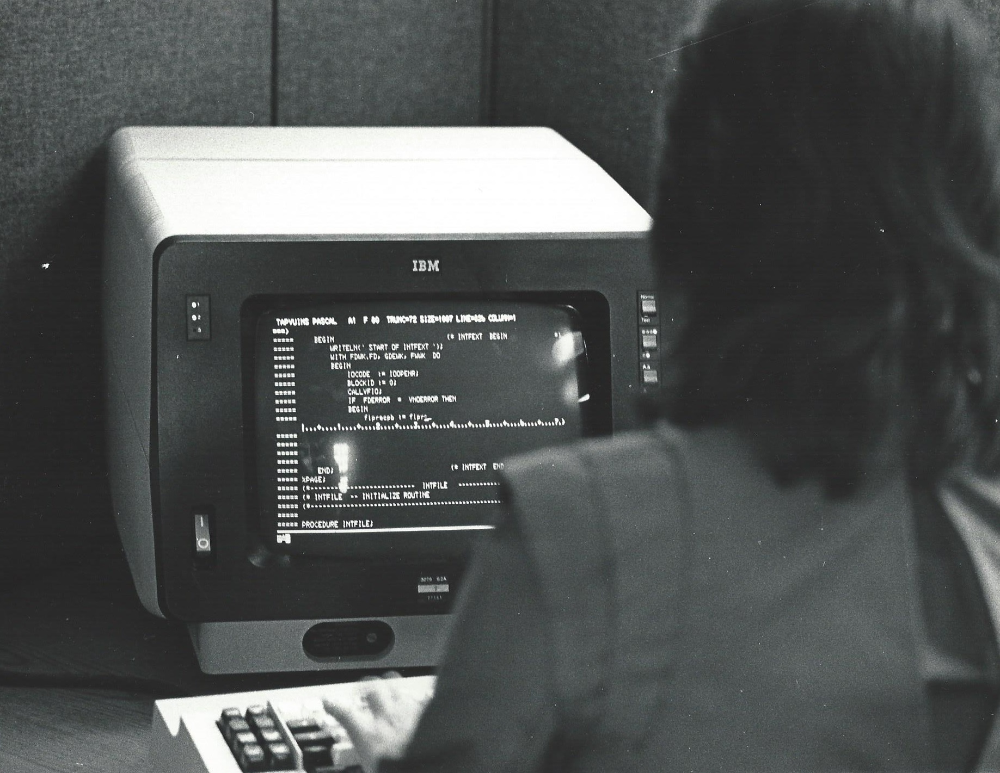

## Week 9
# Automation and Scripting

---

# Today
- **Settle in/Reminders/Announcements** (15 min)
- **Discuss Last Week's Activity** (20 min)
- **Lecture: Automation and Scripting** (45 min)
- **Break** (10 min)
- **Start Weekly Activity** (70 min)
- **Wrap up** (10 min)

---

# Announcements

_Feel free to email me with any announcements you would like me to boost (upcoming conferences, webinars, trainings, or other events/topics of interest)._

---

# Question

Can you think of anything from your current work, or a past job, that was highly repetitive, that you wish could have been easier?

---

# Scripting is helpful

**Interoperability**: Systems can exchange info or make each other do things

**Scale**: Allows users to handle large quantities of records/data

**Automate work**: Reduce repetitive clicking, mousing, typing

**Error reduction**: Less manual data entry can reduce mistakes

**Maintain standards**: Fosters conformance to accepted preservation standards

<!--presenter notes

So why learn to scripting in the first place? There are a number of reasons, some more specific to just work, in general, and how to make it easier, and some more specific to digital preservation environments.

Some of the reasons I have listed here are
Automate yours and other’s work: Reduce repetitive clicking, mousing, typing
Reduce error
Maintain file integrity and standards
Promote scale up without increasing workload
Allow systems to “talk” to each other

-->

---

# How do I learn scripting?

- Other people's code repositories.
- Formal training through universities or "bootcamps".
- Blogs and websites.
- Classes, workshops and webinars.
- Conferences like code4lib, Bitcurator forum, Associate for Moving Image Archivists.
- YouTube, TikTok, LinkedIn Learning.
- Experimenting with your own projects.

---

## Definition
# Terminal (1/2)

**Terminal** is an application that provides a way for users to interact with their computer by typing in commands. In response to commands, terminal returns outputs and messages.

<!--presenter notes

How do we access the command line? This is usually accomplished by accessing what is known as “the terminal” or just “terminal”. Terminal is a computer program that provides a user interface for interacting with the operating system through typed commands.

Most operating systems, like Windows or Mac machines, come with some sort of terminal program. On a Mac, it is called “Terminal” (with a capital T) and can be accessed by clicking on the Finder, opening the Utilities folder, and opening the icon labeled Terminal. In Windows, the terminal program is called Command Prompt. To get to it, click on the Windows button on your keyboard, and either search for the Run utility and type in “cmd” (nickname for Command Prompt), or just search for the Command Prompt application and double-click to open. It’s as simple as opening up any program.

-->

---

## Definition
# Terminal (2/2)

You can think of terminal like a piece of software, like Adobe Photoshop. Just as Photoshop’s purpose is to provide a workspace for creating and editing images, the terminal’s purpose is to provide a space for interacting with your computer’s command line (definition in the next slide).

---

## Definition
# Command Line

The **command line** provides the user a text-based interface where users type instructions for the computer to execute. Each command you type tells the system what to do, like "Go to this folder".

<!--presenter notes

A really good introduction to automation is through what is known as the Command Line Interface or CLI (I prefer and often refer to it as just “the command line”).

The command line is a pretty powerful tool, and is used heavily by professionals in the digital archiving and preservation field.

If you have a computer, you likely have a way to access the command line now.

All Mac and Windows machines come with a terminal program. Meaning, there isn’t anything that you have to install to use the command line.

-->

---

## Definition
# Command Line (2/2)

You can think of the command line as the terminal’s palette. For example, in Photoshop, you have tools to apply a color, texture, or filter. Similarly, the command line provides a set of tools and actions you can use to interact with your computer in specific ways.

And better yet, the majority of these tools are **open-source** and **free to use**.

<!--presenter notes

This, I think, is one of the most important reasons why the command line is great: it tends to not share the same fate as software applications, that often become obsolete over time. Though this is anecdotal, I have been using the command line since I was a kid (I started using the computers in the late 1980s) and the command line has basically looked and operated in the same way since.

Another reason why the command line is great is because it can do a lot, and is not specific to one type of kind of thing to do. Its non-specificity makes it universal.
It is also easy to learn, in part because it has been around for so long, and has generally behaved the same way over time, therefore it is well documented. Basically, once you get the syntax down, and see a few examples, it’s fairly easy to turn around and just start using it.

-->

---

## Definition
# Shell (1/2)

The **shell** is the program that interprets the commands you type in the command line. It processes your instructions and communicates with the operating system to perform the requested tasks, such as creating files or running scripts.

<!--presenter notes

A shell is a specific command-line interpreter that takes input from the user, interprets it, and then executes the appropriate commands. There are many different types of shells such as PowerShell (Windows) and bash (Mac). My Mac, by default, uses Z Shell or zsh, another type of shell. So what makes shells different from one another?

-->

---

## Definition
# Shell (2/2)

There are many different types of shells such as PowerShell (windows), bash (Mac), zsh (Mac). You can think of the shell as a specific type of engine that interprets your commands into actions.

---

# Understanding Shell, Terminal, and Command Line

| **Component** | **Emoji** | **Analogy**                        |
|---------------|-----------|-------------------------------------|
| **Shell**     | 🛠️        | The engine that processes commands. |
| **Terminal**  | 💻        | The application where commands are typed. |
| **Command Line** | 🖋️       | The canvas where you write the commands. |

---


<!--presenter notes

Teletype Model 33, an electromechanical teleprinter from the 1960s with actual cylinders as its keys

Photo credit: https://retrocomputing.stackexchange.com/questions/2697/could-you-see-what-you-are-typing-in-a-teletype

Like most things in computing, the term “terminal” has its roots in the physical world.

In the early days of computing, large mainframe computers were used to process and store data for businesses and organizations. A mainframe is a type of large, powerful computer designed for processing and storing large amounts of data. A user could access the mainframe by using a device known as a teletype. A teletype, also known as a teleprinter, teletypewriter, or just “tty” for short, was a device that could both send and receive messages to and from a mainframe. The user would type commands or queries using the keys which would be relayed to the mainframe, which in turn would return information that would be printed on a piece of paper. Some models could also be used to create punched tape for data storage (either from typed input or from data received from a remote source) and to read back such tape for local printing or transmission.

-->

---



<!--presenter notes

Photo credit: From https://en.wikipedia.org/wiki/IBM_3270#/media/File:Informatics_General_programmer_at_terminal.jpg

Eventually, TTYs were replaced with computers with electric computer screens. Commands would still be entered in by a human using a keyboard. The computer’s answers would “print” to a screen rather than to paper in the form of text or graphics.

These sorts of computers were referred to as “terminals”.

Most terminals on modern-day computers have a similar look and feel to that of the screen you see the computer programmer using on the slide from 1983. Very text-heavy, light typeface on stark background, not much else going on. This sometimes can be intimidating: we are so used to what are known as graphical user interfaces, or GUIs, with graphics, colors, and shapes; in comparison, the terminal looks very stark.

-->

---


<!--presenter notes

Prompt:  The space following the prompt (in this case, an angle bracket, or >) is   where you input commands.

Your location in the file directory structure (Documents and Settings folder within the C: drive)

CLI Anatomy

Command line prompt: A text-based symbol that appears in a command line interface, indicating that the interface is ready to accept commands from the user. The prompt typically appears on a new line and is followed by a cursor, indicating the position at which the user can begin typing commands. The exact appearance of the prompt varies depending on the operating system and the specific command line interface being used. For example, on Windows operating system, the default prompt in Command Prompt is a greater than symbol (>). On macOS and Linux systems, the default prompt in Terminal is typically the user's username followed by the name of the current directory and a dollar sign ($).

The prompt character is usually preceded by some information about where the user is, in terms of which part of the file directory commands will be executed. In this example, by default, when we launch the Command Prompt in a Windows machine, the user by default starts off in the Documents and Settings folder, in the Drive called “C”.

This can look a little bit different in a Mac.

-->

---


<!--presenter notes

Prompt:  Where you type in commands. Here, the prompt is the % character

Username (marykidd) at (@) computer name (Marys-MacBook-Air)

Symbol that indicates which shell you are running (definition in next slide)

Here, % = zsh (stands for “Z Shell”)

On my Mac, my command line prompt character is a percent sign (%), preceded by a tilde (~). A tilde, in the context of a Mac CLI, refers to my home directory. So, it’s the directory that contains my Downloads, Desktop, Documents, Pictures and other folders. Prior to this is a little bit of information about my computer. “marykidd” is my username. If you use a computer shared by multiple users, it’s a good thing to check that this shows the correct username. This is followed by an @ sign and then “Marys-MacBook-Air”, which is the name of my computer. You can read the prompt in a similar way you would read an email address. For example, my NYU email address is mary.kidd@nyu.edu. So I’m the user Mary in the NYU domain. Similarly, on my local computer, I am the user marykidd on the Marys-MacBook-Air domain.

This is by default where my Mac starts when I open up the terminal. However, let’s say you have a folder of scripts that you want to work out of all the time, you can change the default directory where you start.

Let’s go back to the % sign here. On a Mac, the particular symbol used is actually indicate of the shell my CLI is using. In this case, my command line, by default, uses the “zsh” shell.

-->

---


<!--presenter notes

In the screenshot is my Mac terminal, where I've typed in the zsh command "ls" which stands for “list contents of the directory I am in”.

Once you type in a command like "ls", or any command, you execute it by pressing the [return] or [enter] key. Once I do that, the terminal will list all the folders within the directory I am in, my home directory: Applications, Downloads, Movies, Desktop, etc.

-->

---


<!--presenter notes

This screenshot features another shell, specific to PCs in the 1990s, called COMMAND.COM.COM.

This shell was around when I was a kid, so I weirdly feel at home seeing this screen! I'm assuming though if this is your first time seeing terminal screens, this may look a bit stark. It's okay to think that (I felt the same way when I first encountered it, too).

However, this behaves in pretty much the same way my modern Mac's terminal behaves, with slight differences. Here, I typed in the “dir” command, which is short for "list directory contents". Similar to the "ls" command, entering this in and pressing [return] or [enter] produces a list of folders and files in the current directory.

Learning how one shell takes commands versus another is like learning a different dialect of a language.

That said, commands that appear similar from one shell to another may actually behave differently. For example, notice how the ls command just shows a list of folder names, whereas the dir command shows both names, dates, a file count, a folder count, etc. We could modify the ls command with additional information to output similar information. What this indicates is that different shells not only have different commands, but different command behaviors and results.

-->

---

<div class="shapes">
  <div class="triangle"></div>
  </span>
  </span>
</div>

<div class="activity-title">Mini Activity - Shell Switch</div>

_Using your Terminal program, you will identify and switch shells._

<ul class="activity-list">
  <li>Open your terminal program and enter    <code>echo $0 [Mac]</code> or <code>echo %COMSPEC%</code> [Windows]; Press [return].
</li>
  <li>Enter <code>bash</code> [Mac] or <code>powershell</code> [Windows]; Press [return].</li>
  </li>
  <li><i>Notice what happens to the prompt.</i></li>
  <li>Enter <code>echo $0</code> [Mac] or  <code>echo %COMSPEC%</code> [Windows] one last time; Press [return].

</ul>

<!--presenter notes

What this mini activity shows you to do is switch between different shells on a Mac or Windows operating system using the "echo" command (yes, different shells/operating systems can have the same-named commands!)

The "echo" command can be read similar to “print this [thing]”. Echo is a command used to print text to the command prompt so that it can be seen by the user.

The $0/%COMSPEC% are the names of two variables. You can think of a variable as a little named drawer in a shelf that stores a little bit of information. So here, we are saying, "Please print the information stored within the drawer called $0".

-->

---

# Command Breakdown

`echo` = "Get this information and print it for me so I can see it"
`$0` \= variable (\$) with the name "0"
`%COMSPEC%` \= variable (\%%) with the name "COMSPEC"

_Think of variables as shelves with labels that hold a piece of information. So here, we are asking, "Hey, computer, what's on the shell shelf?"_

---

# Question 

### Imagine you need to quickly find out what version of your operating system you’re using.

What steps would you take to find the same information using your mouse and keyboard? Which method do you think is faster, and why?

---

## Definition
# Command line tool
—

A type of computer program that is designed to be executed through the command line.

<!--presenter notes

So far, we have used the command line to run fairly simple commands using commands native to the shells we are using. However, you should know that the command line can be used to run command line tools or programs. A command line tool or program is a type of computer program designed to be executed through the command line. It is similar to how when you purchase a new computer, it comes with your usual basic suite of things you can do like use the Finder, open and use a calculator or whatever else. However, you can download and install other different programs, like Garage Band or Photoshop or whatever else. Similarly, the command line has its own sorts of distinct tools that are used for different purposes.

-->

---

## Definition
# Package manager - 1/2

A type of command line tool that is used to automate the process of installing, updating, configuring, and removing software packages on a computer system.

---
## Package manager examples

<br>

<div style="display: flex; align-items: flex-start; gap: 20px;">
  <!-- Image -->
  <div style="width: 20%;">
    
  </div>

  <!-- Text -->
  <div>
    <p><b>Homebrew</b>: A common Mac package manager is homebrew.
    <code>brew install ffmpeg</code>
    </p>
  </div>
</div>

<br>

<div style="display: flex; align-items: flex-start; gap: 20px;">
  <!-- Image -->
  <div style="width: 20%;">
    
  </div>

  <!-- Text -->
  <div>
    <p><b>Chocolatey</b>: A common Windows package manager is chocolatey.
    <code>choco install notepadplus</code>
    </p>
  </div>
</div>


<!--presenter notes

So how do you install programs in the command line? This is somewhat similar to how you would download and install a program through your Windows GUI: you go somewhere, download a file, unzip it, run the installer, check off some options, and now the program is ready to use on your computer.

The easiest way to install a program into your CLI is by using what is known as a package manager. A package manager is a software tool that is used to automate the process of installing, updating, configuring, and removing software packages on a computer system. It provides a simple and efficient way to manage software dependencies and ensure that all required libraries and components are installed and working correctly.

Different operating systems, and even different programs, have different package managers. For example, the default package manager for the Mac operating system CLI is known as homebrew. For Windows, it’s chocolatey. There are many other options, but these are some of the most common.

Installing a program using a package manager makes installation a cinch, and is quicker than going to a website, clicking around for the right version, etc. All you need to do is type in a simple command: the name of the package manager, the word “install”, and then the name of the program you want to install. The package manager will take care of all the rest.

-->

---

## Tool
# rsync

`rsync` is a command-line utility used for file synchronization and transfer. It copies and synchronizes files and directories between two locations locally or over a network.

---

# **Basic `rsync` Command Syntax**

```bash
> rsync [Optional Modifiers] [SRC] [DEST]
```

---

# **Basic `rsync` Command Syntax**

```bash
> rsync [Optional Modifiers] [SRC] [DEST]
```
**Syntax** refers to the order in which to execute a line of code. It also includes the terminologies used in the command.

**[Optional Modifiers]**: Additional options to customize how `rsync` runs (e.g., `-a`, `-v`, `--delete`).

**[SRC]**: The source directory or file path (where the data comes from).

**[DEST]**: The destination directory or file path (where the data goes).

<!--presenter notes

This is the basic syntax of how to run a command in the rsync program. Rsync commands are all, more or less, structured like this. An important thing to know is that the rsync commands - and really, any command – are always written in a specific order, with specific words/terms. This sequence or order is sometimes referred to as “syntax”.

-->

---

# **`rsync` Command as Pseudocode**

```bash
rsync -avz /local/files/ mkidd@remote:/backup/files/
```

"Using **rsync**, **archive** and **compress** the files contained in the folder called **/local/files/**, and transfer them to another folder called **/backup/files/** on a computer in **another building** using the computer's login **mkidd**."

---

## Case Study
# Digital Systems at Human Rights Watch 

 **Problem:** Archivist Nicole Martin noticed that using Mac’s Finder to transfer large amounts of files (>500 gigabytes) were failing mid-way through._ 

 **Solution:** Use the command line tool `rsync` to reliably transfer files.

<!--presenter notes

https://twobitpreservation.com/blog/2020/6/11/why-use-the-command-line-for-digital-archiving-and-preservation

rsync is one of many command line tools used across the digital preservation field.

The rsync program is a powerful tool that is used in a variety of digital preservation contexts. One case study where rsync came into play comes from one of the week’s assigned readings, authored by Nicole Martin, who is the Associate Director of Archives and Digital Systems at Human Rights Watch, as well as an Adjunct Professor here at NYU and former Associate Director of the Digital Preservation and Handling Complex Media courses at New York University’s Moving Image Archiving and Preservation (MIAP) graduate program.

-->

---

<div class="quote">
“I would set up a Finder drag-and-drop transfer to run overnight, and four mornings out of five, I’d arrive at my workstation to discover the entire operation had failed because of a network drop or corrupted file. A colleague who was familiar with BASH [shell] suggested I use the <code>rsync</code> utility.”
</div>

<div class="author">
Nicole Martin
</div>

<div class="work">
  <em><a href="https://twobitpreservation.com/blog/2020/6/11/why-use-the-command-line-for-digital-archiving-and-preservation" target="_blank">twoBit Digital Preservation blog post</a>, 2020</em>
</div>

---

## Real-life `rsync` command used by Johns Hopkins

<a href="https://github.com/jhu-archives-and-manuscripts/electronic-records" target="_blank">Johns Hopkins Github repository</a>

```bash
$ rsync -av --progress 12345-bag.tar /mnt/sam/archiveimages/electronic-records/
```

_Review list of modifiers here_
[https://ss64.com/bash/rsync_options.html](https://ss64.com/bash/rsync_options.html)

<!--presenter notes

Let’s look at a real rsync command used by the Johns Hopkins University Archives and Manuscripts. They use the rsync command in their electronic records accessioning workflow. Let’s step through this briefly by looking at their Github repo: https://github.com/jhu-archives-and-manuscripts/electronic-records

-->

---

<div class="shapes">
  <div class="triangle"></div>
  </span>
  </span>
</div>

<div class="activity-title">Mini Activity - Pseudocode</div>

```bash
$ rsync -av --progress 12345-bag.tar /mnt/sam/archiveimages/electronic-records/
```
<ul class="activity-list">
  <li>Using a text editor or pen/paper, spend 5 minutes writing out what you think this command is doing.</li>
  <li>For the not-so-obvious parts of the code (i.e. -av or --progress), you may need to consult <code>rsync</code> documentation (search for "rsync documentation" in your web browser).
</ul>

<!--presenter notes

What is pseudocode? Pseudocode is a way of writing out the steps or logic of a computer program in plain, informal language that is not tied to any specific programming language syntax. It is a form of "fake" or "pretend" code that is used to plan out the structure and flow of a program before actually writing the code in a specific programming language, or can be used to interpret some code that has already been written.

There is no right way to write out pseudo code, since it’s not going to be executed in any way. It’s just a way to describe what is going on in plain speak By laying out pseudo code, you can draft or sketch what you ultimately want to write or what you understand is going on.

Take a minute or two to look at the chunk of code on screen, and write out what you think it is doing. You may need to look up a couple of the command’s modifiers. I’ve included the basic rsync syntax at the top, as a reminder of how, generally, an rsync command is structured.

-->

---

# <code>rsync</code> Syntax Breakdown

<!-- Syntax Highlighting -->
<div class="code-block">
  <br>$ <span class="highlight purple">rsync</span></span> 
  <span class="highlight green">-av</span> 
  <span class="highlight orange">--progress</span> 
  <span class="highlight red">12345-bag.tar</span> 
  <span class="highlight cyan">/mnt/sam/archiveimages/electronic-records/</span>
</div>

<!-- Explanation Table -->
<div class="explanation-table">
  <div class="explanation-item purple-bg">
    <b>Using the rsync program</b>
  </div>
  <div class="explanation-item green-bg">
    <b>Make an exact copy (-a)<br></b>
    <b>Output a verbose log of actions (-v)</b>
  </div>
  <div class="explanation-item orange-bg">
    <b>Display a progress bar</b>
  </div>
  <div class="explanation-item red-bg">
    <b>Transfer this folder</b>
  </div>
  <div class="explanation-item cyan-bg">
    <b>To this destination folder</b>
  </div>
</div>

<!--presenter notes

“Use rsync program to move files from the current directory containing a TAR file to the SAM. When you transfer over the files, please preserve the synced file’s metadata with the source file’s metadata. Please also show me additional information about the transfer, such as file size and transfer speed. Lastly, please show me a progress bar so I know how far along the transfer you are.”

-->

---

# Question

### Now that you’ve seen demos of how terminals work—both on a modern Mac computer and on a 1990s computer using COMMAND.COM—why do you think programmers, archivists, and other professionals might choose to use the terminal instead of a proprietary software program like Adobe Photoshop?

---

## Tool
# ffmpeg

Short for "Fast Forward MPEG" (but works with more than just MPEGs), **ffmpeg** is a multi-functional command line tool that allows you to quickly and efficiently work with media files.

---

# <code>ffmpeg</code> Syntax Breakdown

<!-- Syntax Highlighting -->
<div class="code-block">
  <br>% <span class="highlight purple">ffmpeg</span></span> 
  <span class="highlight green">-i</span> 
  <span class="highlight orange">Mushroom_forest_video.webm</span> 
  <span class="highlight red">Mushroom_forest_video-output.gif</span>
</div>

<!-- Explanation Table -->
<div class="explanation-table">
  <div class="explanation-item purple-bg">
    <b>???</b>
  </div>
  <div class="explanation-item green-bg">
    ???
  </div>
  <div class="explanation-item orange-bg">
    <b>???</b>
  </div>
  <div class="explanation-item red-bg">
    <b>???</b>
  </div>
</div>

<!--presenter notes

Notice I've included ???. I don't want you to guess this time. Instead, I'd like for you to open up the <a href="https://www.ffmpeg.org/" target="_blank">ffmpeg</a>, click on the  "Documentation" section, click the "Command Line Tools Documentation > ffmpeg section (so you ultimately end up at https://ffmpeg.org/ffmpeg.html) and search for the meaning of the -i option.

-->

---

# <code>ffmpeg</code> Syntax Breakdown

<!-- Syntax Highlighting -->
<div class="code-block">
  <br>% <span class="highlight purple">ffmpeg</span></span> 
  <span class="highlight green">-i</span> 
  <span class="highlight orange">Mushroom_forest_video.webm</span> 
  <span class="highlight red">Mushroom_forest_video-output.gif</span>
</div>

<!-- Explanation Table -->
<div class="explanation-table">
  <div class="explanation-item purple-bg">
    <b>Using the ffmpeg program</b>
  </div>
  <div class="explanation-item green-bg">
    Take this input file
  </div>
  <div class="explanation-item orange-bg">
    <b>Take this video</b>
  </div>
  <div class="explanation-item red-bg">
    <b>And output it as a GIF</b>
  </div>
</div>

---

# ffmprovisr
## <a href="https://amiaopensource.github.io/ffmprovisr/" target="_blank">https://amiaopensource.github.io/ffmprovisr/</a>

_This app helps users through the command generation process so that more people can reap the benefits of FFmpeg._

---

# Python and Related Tools

---

## Case Study
# Python at the National Library of New Zealand

---

<style>
  table {
    width: 100%;
    border-collapse: collapse;
    margin: 20px 0;
  }
  th, td {
    padding: 10px;
    text-align: left;
    vertical-align: top;
    border: 1px solid #ddd;
  }
  th {
    background-color: #f4f4f4;
    font-weight: bold;
  }
  h2 {
    font-size: 1.2rem;
    margin: 0 0 5px;
  }
  ul {
    padding-left: 20px;
    margin: 0;
  }
</style>

| **Transfer**                              | **Appraisal**                           | **Analysis**                                |
|-------------------------------------------|------------------------------------------|---------------------------------------------|
| Generate file manifests<br><br>Transfer files off the original digital media to storage servers | Identify duplicates<br><br>Add file extensions so material opens in the correct software<br><br>Flatten complex folder structures to support easy assessment | Sort files into groups based on file extension to isolate unknown files<br><br>Extract file signature information from unknown files |

<!--presenter notes

https://saaers.wordpress.com/2018/07/31/small-scale-scripts-for-large-scale-analysis-python-at-the-alexander-turnbull-library/

The National Library of New Zealand case study also mentions, generally speaking, what Python can be used for in a digital preservation or archives environment.

Transfer
Generating a list of files on original storage media
Transferring files off the original digital media to our storage servers
Appraisal
Identifying duplicate files across different locations
Adding file extensions so material opens in the correct software
Flattening complex folder structures to support easy assessment
Technical Analysis
Sorting files into groups based on file extension to isolate unknown files
Extracting file signature information from unknown files

…and much more!

-->

---

## Definition
# Python

**Python** is a high-level, interpreted programming language that was first released in 1991 by Guido van Rossum. It is designed to be easy to read and write, with a simple syntax and minimalistic approach to coding, making it a popular language for beginners and experts alike.

<!--presenter notes

Python is a high-level, interpreted programming language that was first released in 1991 by Guido van Rossum. It is designed to be easy to read and write, with a simple syntax and minimalistic approach to coding, making it a popular language for beginners and experts alike.

Python has a large standard library and a vast collection of third-party libraries and modules, making it suitable for a wide range of applications, including web development, scientific computing, data analysis, artificial intelligence, machine learning, and more.

Python's popularity has grown rapidly over the years, and it is now one of the most widely used programming languages in the world, with an active and vibrant community of developers and users. It is open-source, free to use, and available for various platforms, including Windows, macOS, and Linux.

-->

---

## Definition
# Programming Library

A **programming library** (aka "library") is a collection of pre-built functions that can be imported and used in your own Python code, rather than having to write everything from scratch.

<!--presenter notes

Most programming languages, once installed on your workstation, come with a standard “library” of pre-built functions. For example, when you download and install Python, it comes with a standard library called “os”. The os module is a standard library module in Python that provides a way for Python programs to interact with the operating system on which they are running. The os module provides functions for performing common tasks such as navigating directories, reading and writing files, renaming files, listing folders and files: the usual things that you are used to when interacting with your file system. You can kind of think of them as recipe books for different cuisines.

-->

---

## Tool
# ArchivesSnake

A Python Library enabling the user to query and update the underlying database of an ArchivesSpace instance.

---

## Case Study
# Alexander Turnbull Library Uses ArchivesSnake

_Archivist Flora Feltham writes about their experience learning and working with Python in the context of an archive_

<!--presenter notes

https://saaers.wordpress.com/2018/07/31/small-scale-scripts-for-large-scale-analysis-python-at-the-alexander-turnbull-library/

-->

---

<div class="quote">

“Recently, we received a Mac-formatted 1TB hard drive from a local composer and performer. When [our Safe Mover] script stopped in the middle of transferring files, we wondered if there was a file path clash... [continued]

</div>

---

<div class="quote">

"...Generally speaking, in a Windows formatted file system there’s a limit of 255 characters to a file path. Some older Mac systems have no limit on the number of file path characters so, if they’re really long, there can be a conflict when you’re transferring material to a Windows environment. To troubleshoot this problem we wrote a [Python] script.”

</div>

---


<!--presenter notes

On slide is a screencap of a Python library called ArchivesSnake, which is something I am currently using to pull data out of NYPL’s ArchivesSpace database using Python commands and ArchiveSpace’s Application Programming Interface or API. ArchivesSnake provides a set of tools for working with archival collections and data. It was developed by the Rockefeller Archive Center and is designed to simplify the process of working with large and complex archival collections, such as those containing manuscripts, photographs, and other historical documents.

This particular library does not come with Python. It has to be downloaded separately by the user.

Python has a package manager known as pip3 that can make downloading these sorts of libraries easy. Similar to what we just saw with homebrew and chocolatey, if I wanted to install ArchivesSnake, I would use the pip3 package manager and type into my command line, pip3 install archivessnake, and voila, ArchivesSnake would be installed onto my computer in a matter of minutes. 

-->

---

```
import os

top = "D:example_folder_01collection"

for root, dir_list, file_list in os.walk(top):

    for item in file_list:

    file_path = os.path.join(root,item)

    if len(file_path) > 255:

        print (file_path)
```

---

| **Code** | **Pseudocode** |
| :-: | :-: |
| `import os` | Import the **operating system module** to work with files and folders. |
| `top = "D:\\example_folder_01\\collection"` | Let the value "top" equal the folder path. |
| `for root, dir_list, file_list in os.walk(top):` | For each **folder (`root`)**, its **subdirectories (`dir_list`)**, and its **files (`file_list`)** starting from the top folder... |

---

| **Code** | **Pseudocode** |
| :-: | :-: |
| `for item in file_list:` | ...and each file in the current folder... |
| `file_path = os.path.join(root, item)` | Combine the folder path and file name into a **complete file path**. |
| `if len(file_path) > 255:` | Check if the total path length (folder + filename) is **greater than 255 characters**... |
| `print(file_path)` | ...and if it is, print the long file path to the **command line** so I can locate and fix it. |

---

## Case Study
# NYPL Digital Preservation

NYPL's Digital Preservation department uses pandas to understand reports from Siegfried, to understand file format acquisition patterns.

---

```
import pandas as pd
df = pd.read_csv('path/to/siegfried.csv')

# How big are the files in the Siegfried report?
print(df.filesize.sum())

# What 10 file formats have the largest average file size?
print(df.groupby('format').filesize.mean().sort_values(ascending = False).head(10))

# What are the 5 most common file formats with a modified data in the 1980s?
print(df[df['modified']<'1990'].groupby('format').size().sort_values(ascending = False).head(5))
```

<!--presenter notes

https://nypl.github.io/digpres/posts/data-analysis-tools

This code example comes from NYPL’s Digital Preservation blog, which shows some examples of using pandas, which is an open-source Python library used for data manipulation and visualization. Again, here we see that the code starts by importing pandas by saying “import pandas” and then giving it a nickname “pd”. Next, we declare a variable, “df” (which stands for dataframe, but just know that you can name variables whatever you want, this is just a common variable name referring to some data). The variable’s value is that of a comma-separated value or CSV spreadsheet. So using pandas, you can actually store the contents of a spreadsheet into a variable, and then do things with that variable. Here, we have a spreadsheet created using siegfried, which is a tool used by digital archivists to identify file formats.

In the first example, we take the variable df, containing our spreadsheet, pointing to the column “filesize”, containing a numeric value per file listed, and uses the sum method, which stands for “summary”, to summarize the total filesize across all files in the spreadsheet. This is similar to, if you’ve used Excel or Google Sheets, creating a grand total across an entire column’s worth of values. In fact, you can think of pandas as just another kind of spreadsheet analysis tool, but instead of clicking on buttons to understand a spreadsheet’s contents, you are using text.

In the second example, it will group the rows in the "df" DataFrame by their file format, calculate the average file size for each group, sort the results in descending order based on the average file size, select the top 10 rows from the sorted data, and finally, print out those 10 rows to the console.

Lastly, we have some code that is selecting a subset of rows from the "df" DataFrame where the "modified" column is less than the year 1990, grouping the selected rows by their file format, counting the number of rows in each group, sort the results in descending order based on the group size, and finally, printing out 5 rows to the console.

What does the output look like when you press enter and run these scripts? I will show you in just a sec…

-->

---


<!--presenter notes

 _[https://towardsdatascience.com/visualizations-with-matplotlib-part-1-c9651008b6b8](https://towardsdatascience.com/visualizations-with-matplotlib-part-1-c9651008b6b8)

 -->

---


<!--presenter notes
https://www.crummy.com/software/BeautifulSoup/

-->

---

## Weekly Activity
# Scripting Reflection

Start: <a href="https://digital-archives.github.io/HISTGA1011/activities/scripting_reflection.html" target="_blank">https://digital-archives.github.io/HISTGA1011/activities/scripting_reflection.html</a>

---


_Final questions or reflections?_

mary.kidd@nyu.edu