## Week 13
# Moving Image and Audio Preservation

---

# Today
- **Settle in/Reminders/Announcements** (15 min)
- **Discuss Last Week's Activity** (20 min)
- **Lecture: Moving Image and Audio Preservation** (45 min)
- **Break** (10 min)
- **Start Weekly Activity** (70 min)
- **Wrap up** (10 min)

---

# Announcements

Feel free to email me with any announcements you would like me to boost (upcoming conferences, webinars, trainings, or other events/topics of interest).

---

# Analog Recording Technology

In order to fully understand audio-visual preservation reformatting techniques and tools, it’s important to know a little bit about how analog recording technology works.

---

“All audiovisual signal/information is ultimately just electricity passed along on wires, whether that signal is interpreted as analog (a continuous wave) or digital (a string of binary on/off data points). So at some level measuring a signal quantitatively (rather than how it looks or sounds) always means getting down and interpreting the voltage: the fluctuations in electric charge passed along a cable or wire.”

Ethan Gates

<a href="https://patchbay.tech/see-what-you-hear-audio-calibration-for-video-digitization/" target="_blank">See What You Hear: Audio Calibration for Video Digitization</a>

---

## Definition
# Analog signal
—

An **analog signal** is a continuous wave that represents information through varying properties such as amplitude, frequency, or phase.

---

Analog = smooth wave

<!--presenter notes

Image credit: Mary Kidd

Before the rise of digital technologies, both professionals and everyday consumers relied on analog recording and playback devices. These devices operated by capturing information using what we call analog signals.

What do we mean by "analog signal"? When you hear "analog", imagine the waves and ripples made by a pebble or a flower dropped into a lake. The resulting waves rise up and down in a smooth, continuous pattern. The water's undulations are a direct, physical result of the rock displacing water, and therefore, the water is reacting in an "analogous" fashion.

-->

---

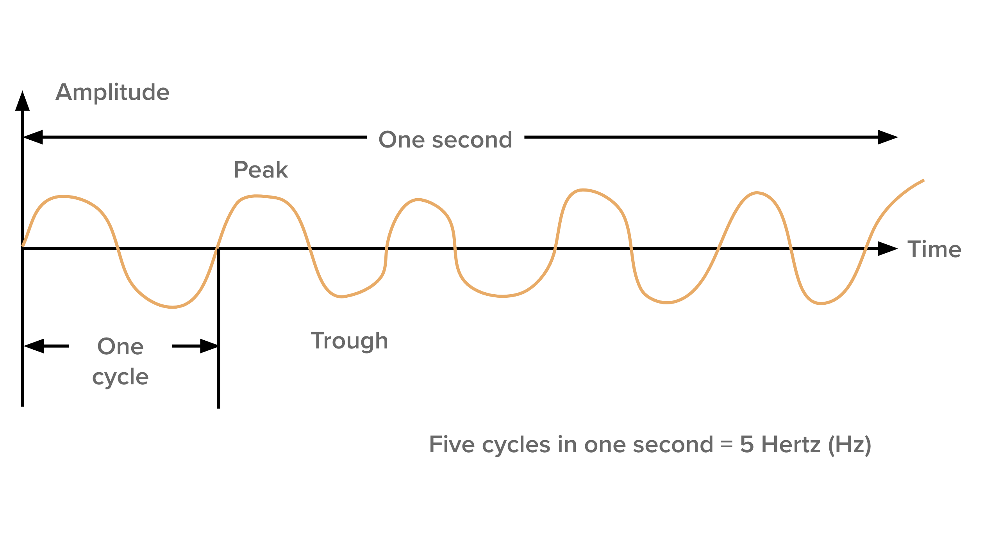

<!--presenter notes

When sound is made, similar to waves on a pond, it ripples through particles in the air in a particular shape, form and frequency.

This is a diagram of a waveform, showing its characteristics likes peaks and troughs, and cycles through time. The combination of characteristics is what produces a specific type, quality and tone, like high- or low-pitch, loud or quiet, a certain or combination of notes.

-->

---

**Image Title:** SEM vinyl record 
**Author:** [Tbraunstein](https://commons.wikimedia.org/wiki/User:Tbraunstein) 
**Source:** [Wikimedia Commons](https://commons.wikimedia.org/wiki/File:SEM_vinyl_record.jpg) 
**License:** [CC BY-SA 3.0](https://creativecommons.org/licenses/by-sa/3.0/)

<!--presenter notes

When a vinyl record, made of plastic, is made, its surface is etched into, in the shape and form of the sound waves that it captured from a recording. This physical imprint is analagous to the waves produced by the instruments and voices.

-->

---

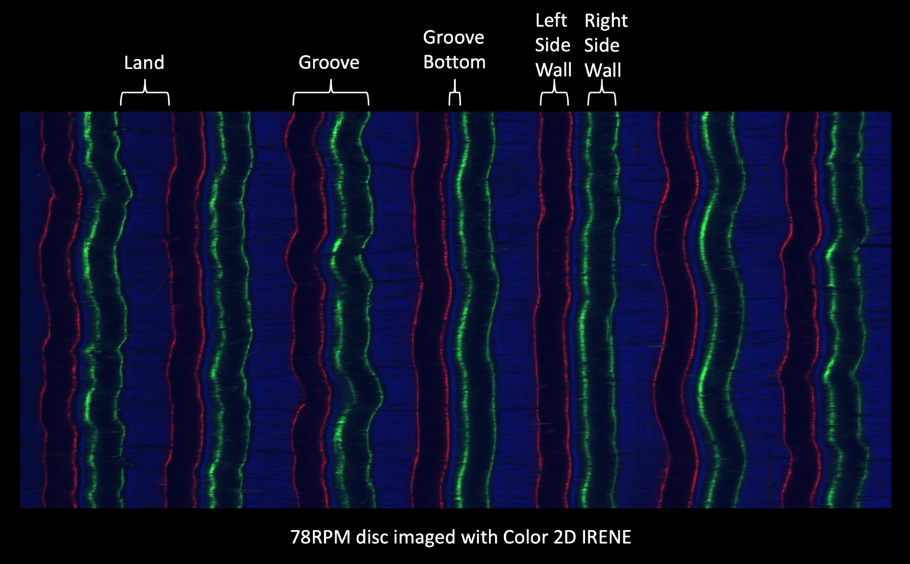

<!--presenter notes

Record grooves being analagous to "real life" sound waves make tools like IRENE work. IRENE is a high-powered image scanner than can photograph the surface of a disc, and translate the image directly to sound. IRENE is used for records too fragile or broken to be digitized using normal means.

-->

---

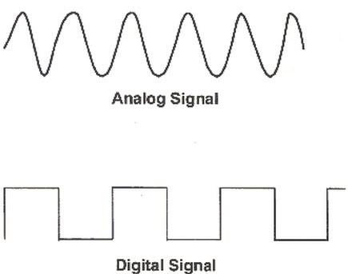

<!--

Analog signals look different from digital signals. Compared to an analog signal, which is a continuous wave, digital information looks more like buildings on a city block, or a staircase.

Keep this in mind as we go through how analog recording works. We are going to use the example of a 1940s analog video camera.

Image from: https://ez.analog.com/ez-blogs/b/engineerzone-spotlight/posts/accurately-measuring-our-analog-world?ADICID=ARWDEMEAP328165eBookAD7134-Blog

-->

---

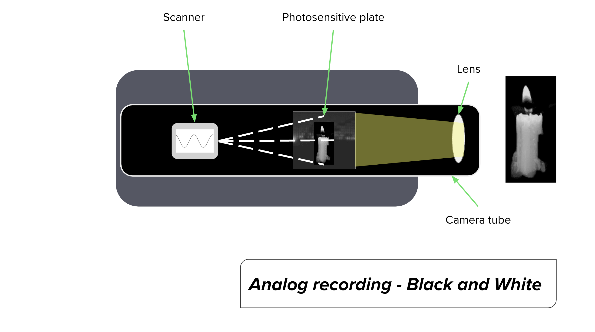

<!--presenter notes

Analog cameras use an analog recording technology that, unlike a record player, feels a bit more "hidden" since it all takes place inside of a dark metal or plastic case.

Here, our black-and-white analog camera is capturing a flickering candle. The camera contains a contained tube composed of, at the front, a lens. When capturing a scene, the camera lens focused the image onto a metallic plate positioned near the front of the tube. This plate was coated with a photosensitive substance like selenium. Photosensitivity would cause the surface of the plate to react to the light. You can think of this plate as similar to a Polaroid photograph, but constantly reacting instead of producing a static image.

The photosensitive plate would be scanned by a device called an electron gun that reads the varying photosensitivity imprinted on the plate. This beam moved meticulously from left to right and top to bottom, covering the entire surface of the plate.

You can think of the electron gun working like a flatbed scanner moving beneath a flat image, except at a much higher speed. Each scan from left to right was incredibly swift, taking only about 63 millionths of a second. After completing a horizontal scan, the beam swiftly snapped back to the left to begin scanning the next line.

As the electron beam traversed the plate, it translated the varying brightness and darkness of the live scene into a continuously fluctuating voltage. The brighter a specific area of the scene, the higher the voltage produced by the camera tube. This voltage variation resulted in the creation of an analog signal, encoded within an electromagnetic wave.

Essentially, the peaks and troughs of this wave corresponded to the voltage fluctuations, which in turn reflected the brightness and darkness of the original live scene. So in many ways it is similar to how grooves mimic the shape of sound waves, except for cameras, it's analogous to levels of light and dark.

-->

---

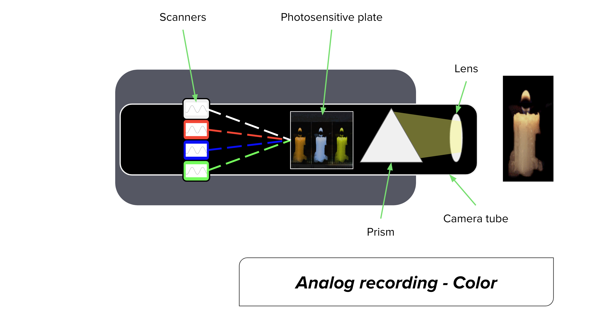

<!--presenter notes

In a color camera, the fundamental recording mechanisms remain largely similar to those of a black-and-white camera. We still have the lens focusing the live scene onto a photosensitive plate and the electron beam scanning this plate to convert light into voltage. However, in a color system, we introduce additional components to capture the full spectrum of colors.

In addition to one photosensitive plate capturing darkness/brightness, color cameras utilize multiple photosensitive plates, each coated with a different filter to capture specific colors. These filters typically correspond to the primary colors: red, green, and blue (RGB).

As the live scene passes through the lens, it is split into its constituent colors by a prism or a set of filters. Each color component is then directed onto its respective photosensitive plate. For example, red light is captured by the plate with the red filter, blue light by the plate with the blue filter, and green light by the plate with the green filter.

Similarly to the black-and-white camera, the electron beams scan each photosensitive plate, converting the varying levels of light intensity into corresponding voltages. However, in this case, we have multiple sets of voltage signals, one for each color channel, and one for light/darkness.

The amplitude of the voltage signals generated by each photosensitive plate corresponds to the saturation of the respective color in the scene. Higher saturation levels result in higher voltage outputs, while lower saturation levels yield lower voltage outputs.

By combining the voltage signals from all the color channels, we obtain a complete representation of the color image. This combined analog signal, encoded within an electromagnetic wave, carries information to recreate the full-color scene during playback or broadcast.

-->

---

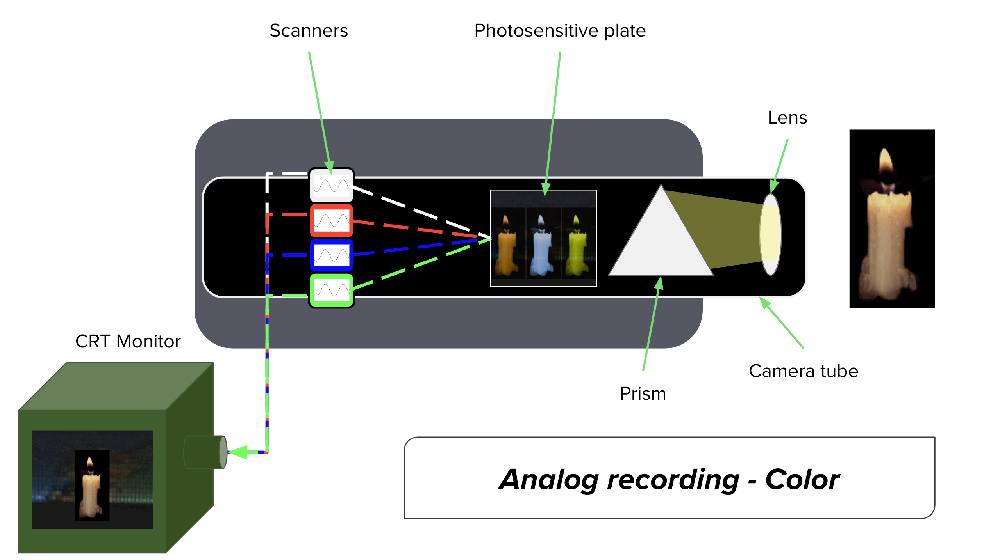

<!--presenter notes

The voltage fluctuations representing both the colors and brightness levels captured by the camera are then transmitted, either through wired connections or broadcast networks, to a display device known as a cathode ray tube, or CRT monitor.

Once received by the CRT monitor, the transmitted voltage signals were interpreted and utilized to reconstruct the original image. The CRT monitor reads this information and employs electron beams within the tube to illuminate phosphor-coated pixels on the screen.

These illuminated pixels combine to form a composite moving image, faithfully recreating the scene that was initially captured by the camera. It's a remarkable process where the intricate interplay of voltage fluctuations translates into a coherent and dynamic visual display, allowing viewers to experience the captured images and scenes in real-time.

-->

---

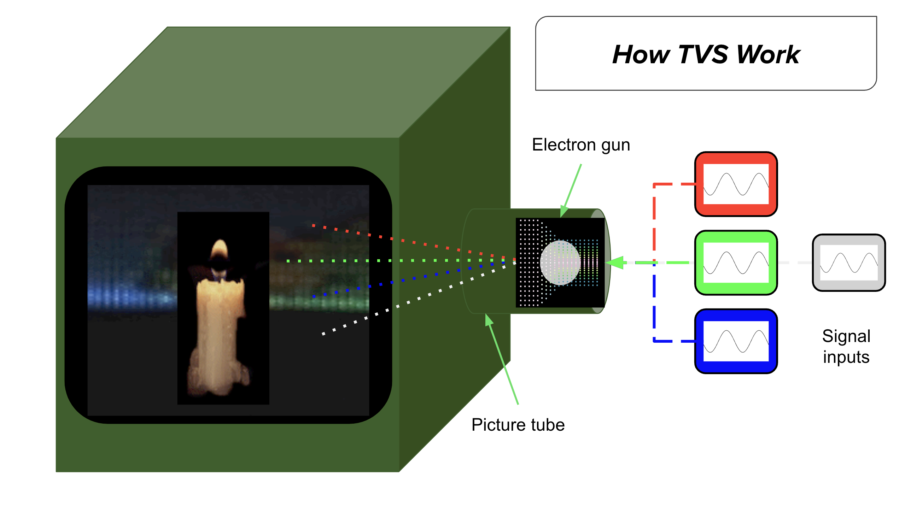

<!--presenter notes

Inside a CRT or television, there's a crucial component known as the picture tube, housing devices called electron guns. These electron guns play a pivotal role in translating the voltage signals received from the camera into a moving image on the screen.

Each electron gun corresponds to a specific aspect of the signal outputs transmitted to the CRT. For instance, there's an electron gun for the red information, another for the blue information, and yet another for the brightness information, and so forth.

As the camera input signals are received, they emit a constant stream of electrons. The density of these electrons at various points corresponds to the peaks and troughs of voltage, containing information about the brightness and hues represented in a scene.

The electron guns within the CRT push and accelerate these electron streams toward the front of the screen in a scanning pattern. This scanning pattern aligns with the format of the transmitted signal, ensuring that each electron beam accurately represents its corresponding aspect of the image. Simultaneously, rapid scanning occurs from left to right and top to bottom of the screen. This rapid scanning, synchronized with the signal inputs, is how TV screens 'trick' us into perceiving a moving image through time on the screen. So how does the scanner know where to start and stop a line of information on a screen?

Gif of electron stream: https://commons.wikimedia.org/wiki/File:Electronbeamshiftingeffect.gif

-->

---

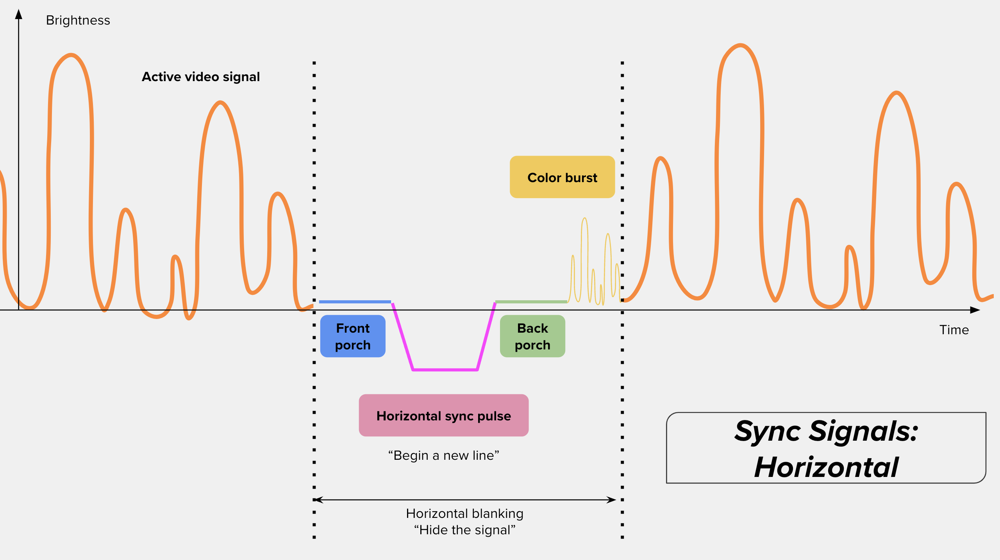

<!--presenter notes

The video signal is encoded with information about the start and stop points of each of the horizontal lines being scanned, as well as information about the first scanline and the last scanline. This encoding allows for the precise synchronization of the scanning process, ensuring that the image is displayed correctly and seamlessly. In this way, not only color and brightness information but also information about frames is encoded and displayed on the screen, creating a cohesive moving image for viewers to observe.

So how exactly does a TV know where to “place” a bit of color or brightness information on a screen? Let's break down how each part of the signal is read and rendered, akin to reading sentences in a book:
Active Video Signal: The orange squiggle line is the active video signal. This is akin to the words on a page. It appears as a series of waves occurring over time on the horizontal axis, with varying heights (voltage) on the Y-axis indicating brightness levels.
Front Porch: As we approach the end of one line of video, the signal flattens and dips, resembling a precipice. This flat part, known as the front porch, serves as a signal that a horizontal blanking period is beginning. It's like a stop sign on the road, instructing the electron beam to briefly pause.
Horizontal Sync Pulse: Following the front porch, we encounter the horizontal sync pulse. This pulse signals the repositioning of the electron beam from the end of one line to the beginning of the next. This repositioning is necessary to ensure the electron beam returns to the left side of the screen before scanning the next line. Blanking during this period prevents unwanted visual artifacts or distortions.
Back Porch: After the sync pulse, we encounter the back porch, indicating that the electron beam is now in position to begin scanning the next line.
Color Burst Signal: Lastly, we have the color burst signal. This signal prepares the new line to synchronize the video signal with the color signals, ensuring accurate color reproduction.

This pattern of video signal, front porch, sync pulse, back porch, and color burst repeats for each and every line of every frame of a video. It's through the careful interpretation of these signals that a TV or display device renders the analog signal into a coherent and visually accurate moving image for viewers to observe.

-->

---

<!--presenter notes

Once we reach the end of all the lines on a single frames-worth of video, we have another set of synchronization signals that work to signify when we’ve reached the end, that we need to blank the signal briefly, and return our electron beam to the top of the screen to start over again.

-->

---

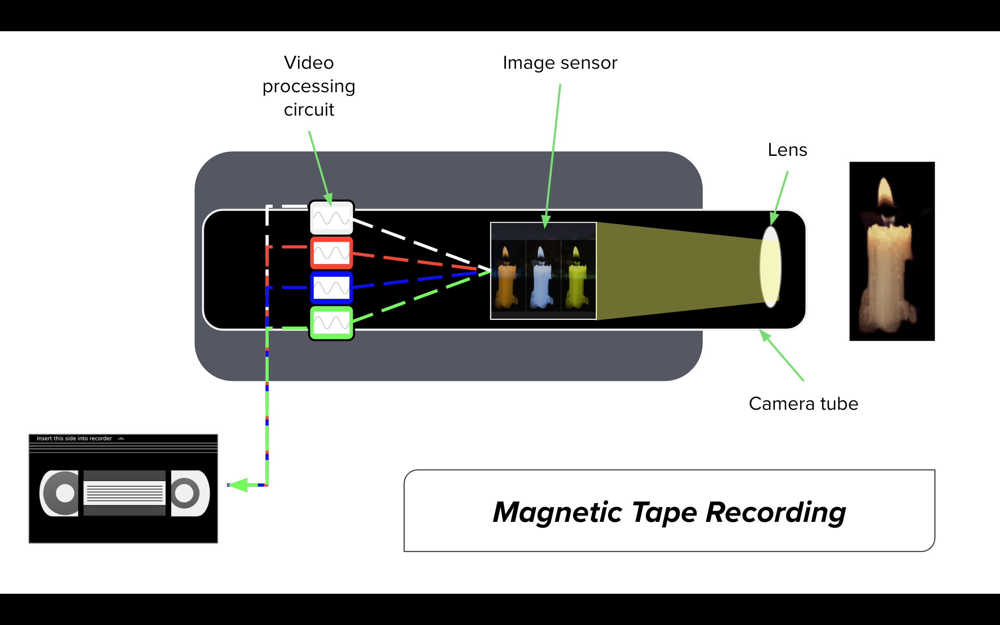

<!--presenter notes

Let's break down how video signals are recorded to tape, using VHS as an example:

Just like with live broadcasting, a handheld VHS recorder captures a live scene using a lens. The lens focuses the image onto an image sensor, typically a charge-coupled device (CCD) containing tiny light-sensitive diodes called photosites. These photosites measure light intensity and color, translating this information into an electrical signal.
Video Processing Circuit: The electrical signal from the image sensor passes through a video processing circuit. This circuit adjusts signal levels, enhances quality, and removes unwanted noise or distortion, ensuring a clean and polished video signal.
Recording Head and Magnetic Tape: The polished video signal is then sent to a recording head. This recording head responds to variations in voltage by producing an electromagnetic current. A magnetic-sensitive tape, housed within a VHS cassette, is passed under the surface of the recording head.
Imprinting Voltage Fluctuations onto Tape: As the tape moves past the recording head, the electromagnetic current from the head imprints variations in voltage onto the tape. This process repositions the magnetic particles bound to the tape's surface, creating a magnetic pattern that represents the encoded video signal.

Overall, the process involves translating the electrical signal representing the live scene into magnetic fluctuations on the tape's surface. This recorded signal can then be played back or broadcasted by passing the tape through a playback device, where the magnetic fluctuations are converted back into electrical signals and ultimately displayed on a screen for viewers to watch.

VHS cassette image from: https://publicdomainvectors.org/en/free-clipart/Video-cassette/40440.html

-->

---

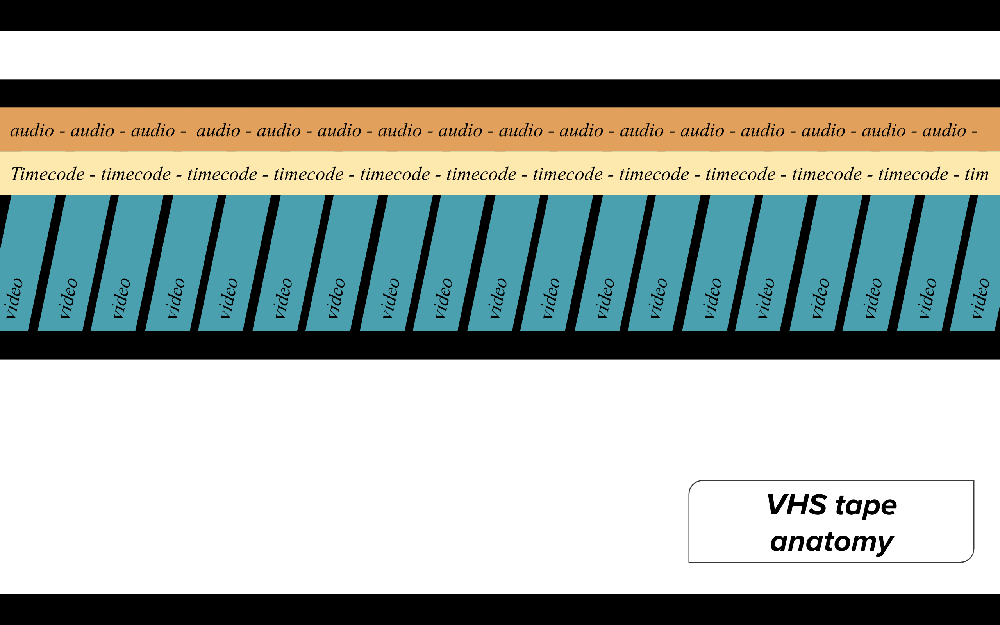

<!--presenter notes

The result of writing the video signal to tape was actually a series of tracks containing different “streams” of information. On a typical VHS tape, the audio is recorded in its own track, while video would be recorded on another. Video information would be recorded in a diagonal fashion, using a technique called "helical scan", which involved moving the tape past the recording head in a diagonal direction. This allowed for longer recording times and the ability to fit more information onto the tape.

In addition to a separate audio and video track, was a third track, known as the timecode track. This track consisted of information that contains timecode signals that represented hours, minutes, seconds, and frames. This timecode track is used by playback devices to know when the beginning of a diagonal line of picture information begins or ends, or when a frame begins or ends.

-->

---

# How to Transfer Analog to Digital (A>D)

---

<table style="width: 100%; border-collapse: collapse; background: transparent; border: none;">
 <tr style="vertical-align: top; border: none;">
 <td style="padding: 10px; text-align: left; border: none;">
 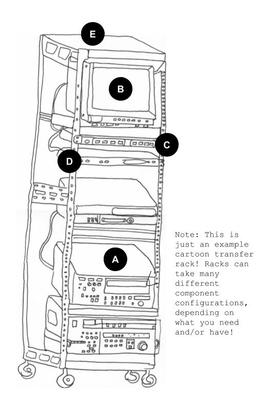
 </td>
 <td style="padding: 10px; text-align: left; border: none;">
 <strong>General transfer station setup</strong>
 <ol type="A">
  <li>Playback deck</li>
  <li>Monitor and scopes</li>
  <li>Time-base corrector</li>
  <li>Analog-to-digital (A to D) converter</li>
  <li>Metal frame or “rack”</li>
 </ol>
 </td>
 </tr>
</table>

<!--

Audio/visual preservation labs or transfer stations as they are sometimes called come in all configurations, shapes and sizes. This drawing I did in 2017 of a transfer rack gives you a general sense of the minimum viable requirements for a transfer station.

A. Playback deck does exactly what its name implies: it plays back tapes.

B. Monitor and scopes: Used to look at and analyze the analog video and audio signals coming from the playback deck.

C. Time-base corrector: A device that ensures the lines that comprise the video signal are in order.

D. Analog-to-digital (A to D) converter: Converts the analog signal from the playback deck into a digital signal.

E. Metal frame that holds everything together

-->

---

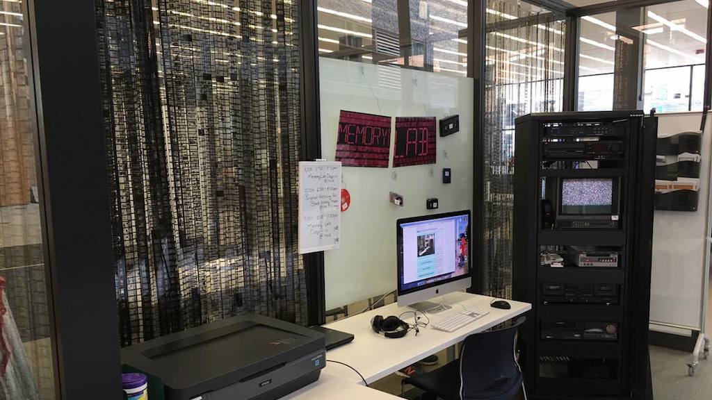

---

<!--presenter notes

We will look specifically at how the DC Public Memory Lab is set up to transfer VHS tapes. This diagram comes directly from their public documentation, and gives us a sense not only of the devices and software used, but also how things are wired to relay the original video signal to a computer in digital format.

Starting from the left, we see that the VHS deck is wired to three components, a CRT monitor, and a time-base corrector, or TBC for short, and an analog-to-digital or A to D converter.

We learned earlier that CRT monitor stands for “Cathode Ray Tube” monitor (it’s also fine to just call it “the monitor” or “the television” because it looks like an old TV).
CRT monitors in transfer lab setups are used to view the original analog image BEFORE the signal goes into other parts of the transfer workflow. The monitor can help you understand whether or not a signal is even coming out of the VHS deck, and is kind of the first “test” for your transfer to pass. If it doesn’t show up on the CRT monitor, that may indicate something is wrong with your playback deck (or your monitor).

-->

---

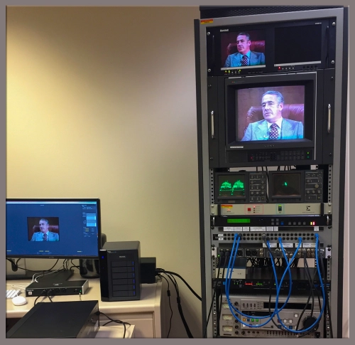

Image from <a href="https://parkslibrarypreservation.wordpress.com/2019/05/01/how-to-build-a-video-preservation-rack-for-in-house-digitization/" target="_blank">How to Build a Video Preservation Rack for In-House Digitization</a>

---

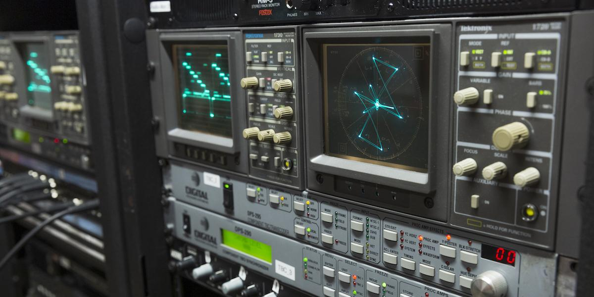

<!--presenter notes

One thing that is not a part of the DC Memory Lab setup that is worth talking about are scopes.

As we run an analog signal through a transfer setup like this, one way to “see” the waveform is to run the signal through various scopes. Scopes can give you an actual visualization of varying voltages, coming through on a waveform, to give us clues whether or not we are capturing it properly.

The scope you see here is known as a vectorscope, that allows us to see chrominance – or color – information. A vectorscope shows us a circular display. The center of the circle corresponds to 0 color, while the rest of the circle represents all possible colors. The lines and dots on the screen represent hues. Hue corresponds to each line’s angle, while saturation is represented by the distance of a dot from the center of the circle. The display also contains information about a target range. So visually if you see the lines or dots exceeding these targets, then that may indicate a color imbalance. The knobs to the right of the vectorscope can be used to make corrective adjustments to the signal. You can either do that during playback capture, or just note this information and correct it post-capture.

-->

---

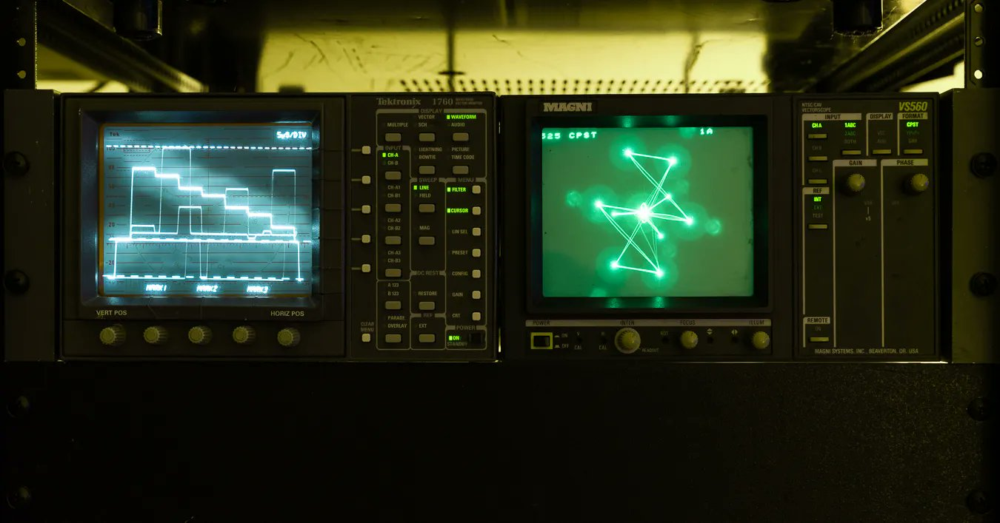

<!--presenter notes

Another common type of scope is known as a waveform monitor, which gives us information luminance, or brightness/darkness levels. It displays the video signal as a graph where the horizontal axis represents time, and the vertical axis represents the brightness levels. The darkest parts of the image are represented at the bottom of the graph, and the brightest parts are at the top. You can use the buttons or knobs to adjust the brightness or darkness by trying to “fit” the waveform in between the scale at the left, so it falls within a target range.

-->

---

## Device
# Time-Based Corrector (TBC)

A **time-based corrector (TBC)** is used to correct errors in the timing of analog video signals caused by physical degradation/warping of the tape or playback equipment. TBCs use a stable reference signal to retime the incoming video signal and stabilizes the synchronization signals, ensuring the image is displayed correctly without distortion.

<!--presenter notes

The VHS deck is wired to a device known as a time-based corrector or TBC. A TBC is used to correct errors in the timing of analog video signals caused by variations in tape speed or aging of playback equipment. The TBC uses a stable reference signal to retime the incoming video signal and stabilizes the synchronization signals, ensuring the image is displayed correctly without distortion. It is a critical component for ensuring high-quality and accurate analog to digital video transfers.

-->

---

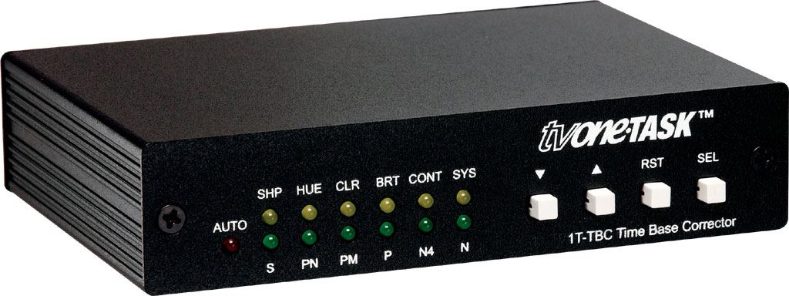

<!--presenter notes

This is what one type of TBC looks like. Very unassuming... yet powerful! TBCs can be purchased as an external device (as they did for the DC Memory Lab) but sometimes can come pre-installed within certain playback decks.

-->

---

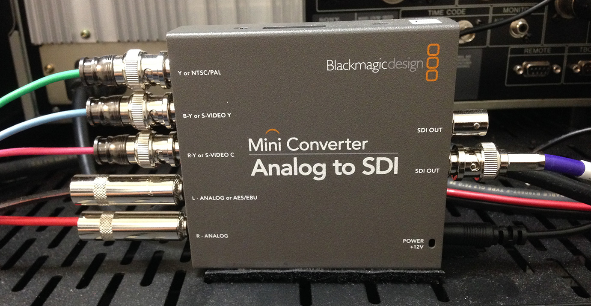

<!--presenter notes

Image credit: Duke University blog post Digitization Details: Thunderbolts, Waveforms & Black Magic: https://blogs.library.duke.edu/bitstreams/2014/06/19/digitization-details-thunderbolts-waveforms-black-magic/

Notice how the VHS playback deck is wired via the time-base corrector to the Analog-to-Digital converter, while the VHS audio signal is routed directly to the A-to-D. We will talk about why this is in a second. But first, let’s talk about what the A-to-D is. The A-to-D does exactly what its name suggests: it converts the analog signal into a digital signal, which can ultimately be read and turned into a digital file on a computer (and as you can see, the next stop after the A to D is a computer).

So why is the VHS playback deck wired to the A-D via the TBC, but the audio is routed separately? This is done to improve the quality of the video signal captured. TBC’s sometimes introduce a slight delay in the video signal while its doing its “correcting”, which can cause the audio and video to become out of sync if they are passed through the TBC together. To avoid this issue, the audio signal can be routed directly to the A to D device, bypassing the TBC. This ensures that the audio and video remain in sync, while still allowing the video signal to be corrected by the TBC.

-->

---

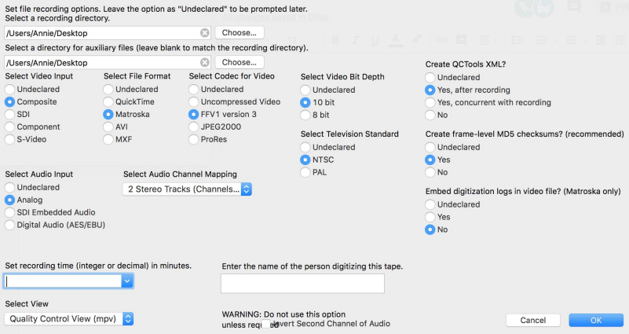

<!--presenter notes

Lastly, let’s talk about the computer, which represents the end of the road for the video signal, but the beginning of everything else in terms of digital preservation workflows.

In the DC Memory Lab setup, the computer comes with a number of different software programs installed.

With any computer that is being used to capture a digital signal and turn it into a digital file, you need to use some sort of capture software. DC Memory Lab uses BlackMagic Media Express. There are many types of software that can be used for a setup. One tool I have used recently is known as vrecord. This is a screen capture of what you see when you open up record. Here, you establish settings to do with which folder you’re placing the final file, the file format, the codec, bit depth, whether to generate frame-level MD5 checksums, metadata XML outputs, and other settings.

Once you click the “OK” button, you would then press play on your VHS or other playback deck, you would first run what’s known as a “pass through” to just test whether or not the signal coming out of the video is looking and sounding ok. Once you’re done checking, you would rewind the tape back to the beginning, press play on the deck, press ok in vrecord, and run the capture.

-->

---

---

# Audio/Visual Preservation Files

For this portion of lecture we will be looking at [Ashley Blewer](https://ashleyblewer.com/)’s audio/visual tutorial site: **[training.ashleyblewer.com](https://training.ashleyblewer.com/)**

This work is licensed under a [Creative Commons Attribution-ShareAlike 4.0 International License](https://creativecommons.org/licenses/by-sa/4.0/) .

<!--presenter notes

Much of what I am about to talk about next is directly derived/remixed from Ashley Blewer’s audio/visual training website (https://training.ashleyblewer.com/). This work is licensed under a Creative Commons Attribution-ShareAlike 4.0 International License which allows me to do this, contingent on me giving credit where credit istdt due.

I highly recommend you check this site out and if you are interested/have the capacity, step through it in its entirety or through one or more of the independent study paths to do with digital or audio/visual preservation. Ashley is a brilliant teacher, and has made tutorials readily available for anyone, free of charge.

-->

---

# Let's unpack this sentence
“A media file is made up of **streams**, wrapped in a **container**, and some of those streams are encoded with a **codec**.”

<!--presenter notes

What does a media file consist of? In Ashley’s tutorial, she explains a video file’s contents “made up of streams, wrapped in a container, and some of those streams are encoded with a codec.” Let’s talk about what she means by streams, containers, and codecs.

-->

---

<!-- Media File Diagram -->

<!-- Main Structure -->

    
Media File
        
Example: MyMovie.mp4

    

    
=

    
Container
        
AKA "wrapper": holds streams

        <ul>
            <li>MP4</li>
            <li>AVI</li>
            <li>MKV</li>
            <li>MOV</li>
            <li>WAV</li>
            <li>FLAC</li>
            <li>MP3</li>
            <li>OGG</li>
        </ul>
    

    
+

    
Encoded Streams
        
AKA Codec: Compresses & decompresses

        <ul>
            <li>Metadata</li>
            <li>Video</li>
            <li>Audio</li>
            <li>Subtitles/Text</li>
            <li>Chapters</li>
        </ul>
    

<!--presenter notes

Media files are complicated things, because they contain much more than just information about video or audio. So, when we refer to a media file, we are actually talking about two things. The first is the container, the thing that holds all of a media file’s components together into one logical package, and the streams, which are basically other files that make up the package: for example, the audio track, the file that lists the chapters (if it's a DVD), title screen, the actual video, and anything else. We will talk about codecs in just a second.

The first “rule” to know is that, in order to determine a media file’s container, is to just look at the file format extension. However, it is not possible to look at a media file and determine, outright, its codec(s), which is sometimes confusing because sometimes the name of a file’s container can match its codecs.

-->

---
Container / aka format / aka wrapper

Streams:

General/metadata

Video

Audio

Subtitles/text

Chapters

Container examples:

MP4

AVI

MKV

MOV

WAV

FLAC

MP3

OGG

<!--presenter notes

The container contains all of the files that make up a single media file, and also establish the appropriate file extension for it. The contents of a container are sometimes referred to as “streams”. Streams can take on the form of distinct files, or metadata. Streams can include the video and audio files, and any metadata to do with things like bitrate, type, resolution, provenance like time of creation, subtitles and chapters. The extent and availability of streams for any particular container is contingent on the parameters of the container. So a container is not just a thing that has stuff in it, containers have rules about what it carries. So for example, if we looked at the MP4 wiki, and scroll down to the data streams section, you’ll see a list of all the various streams the MP4 container type includes. For MP4s, it is video, audio, and subtitles.

The individual streams themselves, in particular, the video and audio streams, and compressed or decompressed using what are known as codecs.

See: https://en.wikipedia.org/wiki/Comparisonofvideocontainerformats

-->

---

Definition: Codec

A codec is a software program or hardware device that compresses or decompresses a media file.

| Device | Codec | Container |
| :-: | :-: | :-: |
| DSLR | H.264 or H.265 | MP4 or MOV |
| Android phone | H.264 or H.265 | 3GP, 3G2 or MP4 |
| iPhone | H.264 or H.265 | MOV |

---

A codec is a software program or hardware device that compresses or decompresses a media file. Codecs are used to make files more manageable, in terms of the amount of storage space they use on servers, the amount of bandwidth required to transmit them over networks, all the while retaining a certain quality that can either be discernable or not, which depends in part on whether the codec applied uses a lossy or lossless compression algorithm.

Streams:

General/metadata

Video ( H.265/HEVC )

Audio ( AAC )

Subtitles/text

Chapters

---

Let’s take a look at one example of a container–an MP4–and the type of codecs it expects to contain. The MP4 the video stream generally will use the H.265 codec. The audio stream uses another audio file-specific codec, known as Advanced Audio Coding or AAC (to see a list of codecs specific to the MP4 container, you can easily see them listed on the MP4 Wiki).

Definition: Lossless compression

A method of reducing the size of a digital file without losing any data or quality.

---

Lossless compression is a method of reducing the size of a digital file without losing any data or quality. This is achieved by identifying and eliminating redundancies and patterns within the data. Some techniques include:
Dictionary-based compression: This technique involves creating a dictionary of frequently used data patterns in the data to be compressed. The dictionary is then used to replace the repeated patterns with shorter codes, resulting in a more efficient representation of the data.
Run-length encoding: This technique is used for data that contains long runs of the same value or repeating patterns. It replaces these runs with a shorter code that represents the value and the length of the run.
Huffman coding: This technique involves assigning shorter codes to more frequently occurring data values, and longer codes to less frequent ones. This results in a more efficient representation of the data.

Definition: Lossy compression

A method of reducing the size of a digital file by discarding some of the original data. This type of compression works by removing information that is deemed less important or perceptually irrelevant, in order to achieve higher levels of compression.

---

Lossy compression is a method of reducing the size of a digital file by discarding some of the original data. This type of compression works by removing information that is deemed less important or perceptually irrelevant, in order to achieve higher levels of compression. The bad part about lossy compression is its impossible to “unsmush” a lossy compressed file: once the information is lost, it is lost forever.

Lossy compression could be appropriate for service copies, while lossless compression or uncompressed files are more appropriate for preservation masters and mezzanine files. Determining what approach to use is contingent on your institution’s specifications.

Lossy compression example: MP3

---

MP3, which stands for “MPEG-1 Audio Layer 3” is a type of lossy codec. It uses what is known as perceptual audio coding compression technology based on imperfections in how the human ear perceives sound. An underlying data algorithm is programmed to discern and effectively filter out what it knows our ears cannot hear like super high-end or low-end frequencies.
(although I personally cannot hear the difference between a lossless and lossy compression audio codec, some engineers I have talked to say that they can!)

Container: Matroska (MKV)

Video codec: FFv1 version 3

Audio codec: FLAC

 [https://nypl.github.io/ami-preservation/pages/ami-specifications.html\#video-group-1](https://nypl.github.io/ami-preservation/pages/ami-specifications.html#video-group-1) 

---

In digital preservation, certain containers and codecs are specified in order to ensure that we are capturing signals optimally, balancing that of storage and budget constraints. The screen capture shows NYPL’s specifications for analog video cassettes. Here, we use the Matroska or MKV container (called a wrapper here). Within our MKV files we use the FFv1 codec for the video stream, and the FLAC codec for the audio stream.

Ffmpeg video codec 1 (ffv1)

Fast seeking in the file

Chapter entries

Full metadata (tags) support

Selectable subtitle/audio/video streams

Modularly expandable

Error resilience

Menus

[https://www.matroska.org/technical/basics.html](https://www.matroska.org/technical/basics.html)

An open-source, lossless video compression format developed by the ffmpeg project.

Free Lossless Audio Codec (FLAC)

An open-source, lossless audio compression format developed by the ffmpeg project.

---

Matroska basics: https://www.matroska.org/technical/basics.html

Matroska is known for being an open and free container. Other formats, such as MP4, are proprietary, meaning that they are owned by MPEG-LA, LLC. Its proprietary nature means that it is not freely implementable by anyone. To use the MP4 format, companies must pay licensing fees to MPEG-LA, and comply with the licensing terms and conditions. Along with video and audio streams, MKV containers can also store chapter, subtitle and other metadata, and are highly suited for streaming over networks.

The FFV1 codec is a lossless video compression format developed by the FFmpeg project, which is a free, open-source collection of multimedia tools and libraries. FFV1 stands for "FFmpeg video codec 1," and it was designed to provide a high level of compression while preserving image quality, making it useful for archiving and preserving video content.

FLAC is open-source lossless audio compression format.

---

The purpose of building up a transfer station or lab is to retrieve an optimal analog signal from the original carrier. However, a lot of things can go wrong, and it’s to be expected that a certain amount of troubleshooting be done for some transfers. I am going to go over just a couple of examples, two examples to do with the playback equipment itself, and one to do with digital rights management.

Azimuth misalignment

---

The azimuth angle refers to the angle at which the tape head is oriented in relation to the tape itself. Proper alignment of the azimuth is essential to ensure optimal capture of a tape and to avoid degradation of the signal quality.

Azimuth misalignment in a tape occurs when the angle of the tape head does not precisely match the angle of the recorded tracks on the tape. If the azimuth angle is not set correctly, the tape head may not fully capture the audio signal, resulting in increased noise, and other issues. Azimuth misalignment can occur due to a variety of factors, including wear and tear on the tape head, improper calibration of the playback equipment, or incorrect handling of the tape. When azimuth misalignment is suspected, the engineer can fix it by either taking a screwdriver and screw or unscrew the head to adjust its angle in relation to the tape. Interestingly enough, if a tape was recorded with a misaligned azimuth to begin with, the engineer may need to adjust the tape head azimuth “incorrectly” in order to capture as much of the magnetic-imprinted signal as possible.

Sticky shed syndrome

---

Sticky shed syndrome happens when the binder that “glues” the magnetic coating of a tape to the plastic, which carries the signal, has a chemical reaction to the moisture in the air. This causes the coating to flake off the tape, leaving behind deposits on the mechanics of the playback machine. Sticky shed can be recognized by a telltale high-pitched “squealing” that occurs during playback. 

Tapes that have sticky shed can be treated by placing them into a special oven. By gently heating the tape at a controlled temperature, it can encourage the substrate to re-glue itself back to the tape. However, tape baking only works enough to get one more good pass, before the binder starts to react again with the moisture in the air.

You can read more about magnetic tape degradation in Richard Hess’ paper “Tape Degradation Factors and Challenges in Predicting Tape Life” (https://www.richardhess.com/tape/history/HESSTapeDegradationARSCJournal39-2.pdf)

---

Tapes get a lot of attention in the world of a/v preservation. However, there are later recording carrier, such as the MiniDisc, that had their own issues to do with proprietary codecs. The image you see here was taken by me 5 years ago when I worked as a resident at the NYPR Archive, which had over 3,000 MD-Rs in its holdings. Sizeable chunks of long-time WNYC reporter’s careers are stored in MD-R format. What you see here is a photograph of an MD-R I pulled out of a box at random, a Hillary Clinton Press Briefing from 13 years ago.

Reporters used MiniDiscs in the early 2000s primarily, for a number of reasons.
MiniDisc dimensions were approximately 2.75” tall x 2.65" wide and 0.18" thick and weighed in at around 0.6 oz. So they were small. Their portability appealed to reporters running around in the field trying to capture sound bytes for newscasts on deadline.
For being so small, MD-Rs could pack in a lot of data. Earlier versions of MD-Rs could store up to 160 megabytes - or 74 minutes - of CD-quality audio: later versions offered up to 80 minutes of audio. And for the most part, the sound was considered as good as CD quality.
Also, MiniDiscs were fast: a reporter could record, erase, rewrite and rename tracks with a few presses of a button. This was preferred over compact cassettes, where you would have to sit and wait for a tape to fast-forward or rewind.

---

Some more advantages:
The magnetic recorded area was sandwiched into a double-shuttered protective plastic cartridge. So, unlike their CD cousins, you didn’t have to worry about accidentally scratching or smudging the disc.
MDs also offered shock resistance. I am sure some of you in this audience at one point or another owned a CD Walkman. You may remember having to hold the Walkman still on a shaky bus ride or in your car in order to prevent the audio signal from “skipping”, which was a huge pain in the neck. MD technology solved this problem by reading the data into a memory buffer at a higher speed than was required before being read out to the digital-to-analog converter.

---

MD-Rs employed “magneto-optical” recording and playback technology. So, how does “magneto-optical” recording and storage technology work? Simply put:
When recording, a laser heats a spot on the recording layer to a specific temperature.
While this is happening, a head in contact with the other side of the disc bathes the heated spot in a magnetic field. The magnetic particle’s orientation corresponds to 0s and 1s in the data.
Once the heat is taken away, the particles are frozen into position.
And that is how you record an audio signal into the MD substrate. To erase an old recording and record something new, simply re-heat and re-bathe the area in a new magnetic field.
During playback the MD machine focuses the laser on the same spot again, but at lower power, and the data is read back by measuring changes in polarization of light reflected from the previously magnetized regions.

---

Sony developed a special perceptual audio codec for MDs called Adaptive Transform Acoustic Coding or ATRAC. ATRAC effectively reduced a 16-bit stereo sample into 292 kbps: a fifth less than of the original data rate with minimal reduction in sound quality. Without ATRAC, an MD-R could store only about 15 minutes of recorded audio.

---

To understand consumer frustration with minidiscs, it’s good to know a little history of the development of MD technology.
In 1992, MD products were released to the consumer market. At this time, there was no way you could transfer ATRAC data from the Walkman to your computer and visa versa. Your only option was to transfer audio in real-time which is a huge pain in the neck, because they take a long time, and you lose all sorts of metadata, like track information.
In 2001, Sony released a the MZ-N1 portable recorder equipped with so-called “NetMD interface” technology. NetMD players came equipped with a USB socket. In conjunction with proprietary music library management software (initially, this was OpenMG Jukebox, which was later superseded by SonicStage), users could transfer ATRAC data from their PC to an MD over a USB connection in faster than real-time.
However, users could not transfer ATRAC data from a NetMD player to their PC. This one-way transfer protocol was deliberately built into NetMD technology to prevent commercial recordings from being freely distributed over networks. However, this also prevented someone like me from being able to transfer my own personal recordings into my own computer.
In response to user frustruation over these restrictions, in 2004, Sony released another update: The Hi-MD player, along with SonicStage 3.4. Both could distinguish between tracks that were personally recorded using the microphone input and those recorded for mass sale and distribution. Users were finally allowed to transfer personally recorded material from their MD player to their computer and convert the ATRAC data into WAV format.

---

NYPR’s archive owns SonicStage 4.3 and a Hi-MD player. Yet, when I first plugged in NYPR’s MD Walkman into my work computer to try my first ATRAC data transfer, I could see the tracks listed, but when I clicked on Import, nothing happened.

I opened up Windows Explorer to see if the player was listed as a drive in the file tree, but nothing appeared, even though when I plugged in the player I would get that little USB connection notification in my toolbar. What I was experiencing here was a so called “audio/data firewall” that prevents me from being able to directly access my MD.

What frustrated me was that I was using all the “right” hardware and software to perform a perfectly legal, innocent MD > PC transfer. Yet, the software and I had no other way of getting in.

# Linux-minidisc project

---

The “linux-minidisc project” was started in 2008 by a few developers who decided that they, and I quote, “...want[ed] to create a [way to perform] simple transfer[s]... for HiMD and NetMD Walkm[e]n which will run under [their] preferred operating systems and [that was] free of any of the annoying ‘features’ of the original software.” They also claim to have started this project as a way to collect and consolidate as much information about MD technology. The image you see above is their logo. To date, over 30 people have contributed code to this project.

Today I will be showing you how netmdpython works. Netmdpython is a collection of Python scripts created by the linux-minidisc project developers that enable users to transmit data directly from an MiniDisc Walkman to their PC over a USB connection.

# lsmd.py
List, count and describe the contents of an MD-R

---

So, the first script I will show you is called lsmd.py, which is a script that allows you to get a directory listing of what’s inside your MD-R. To launch it, I type into the terminal prompt “python, space, lsmd.py”.

Once you press enter, a list will appear right below the command.
Each recorded track appears in sequence and is assigned a track number.
Next to that is the length of the track.
Next to that is information about how the track was recorded: so here, “sp” refers to Standard Play, which means it was recorded at a high quality. Mono indicates it was probably recorded with a microphone through a single channel.
Lastly, each track is listed as either protected or unprotected. What this means is that the script can differentiate between whether or not something was recorded personally using the player’s mic input, rather than something commercially recorded in the studio. Netmdpython can only transfer unprotected tracks and not protected tracks.

Note that this command doesn’t actually upload any audio data. However, it’s an easy way to get a manifest of what’s on your MD-R. I used to check my upload to make sure I got all 63 tracks. You could also export this list into text file and use it to populate fields in a catalog.

---

So, here is lsmd.py in action. Takes just a few seconds.

# upload.py
Transfer ATRAC data to PC. Each track has an *.aea extension.

---

Next, I will show you upload.py. This is the script that actually uploads data off the MD-R over USB onto your computer.

The screenshot here shows the last two tracks - 62 and 63 - that were transferred. Each track takes a few seconds to upload depending on how long it is. You can see in parenthesis the progress each track is making from start to finish. So this is kind of like, a text-based way of monitoring the status of your transfer.

The tracks end up on your computer with an AEA extension. AEA just means ATRAC.

Something to note: when I first launched the upload script, it didn’t complete the transfer. It got through about 50 tracks and then just stopped. So, I unplugged everything and restarted the system, and then, it worked! But, it wasn’t apparent what had happened and I received no error message. And it’s happened to me a few times since, even when I was extra careful to not bother the USB cable during the transfer. So, it’s a little buggy.

---

Here is a little video of me launching upload.py. As you can see, it runs through each track and provides a percent status.

for f in \*.aea; do ffmpeg -i "$f" "$\{f%.aea\}.wav"; done

---

So, that’s basically it for the netmypython scripts. And now, you have a folder full of AEA tracks. What’s great is that the people who developed netmdpython worked together with the people over at ffmpeg to make sure that users of netmdpython could use ffmpeg convert tracks into non-proprietary audio formats. So, what you see above is the ffmpeg command I would use to convert all AEA tracks in a folder into WAV format.

---

Here is the command running.

Only works with 1 type of player

Scripts are experimental

Doesn’t work on Windows OS :(

Python \+ command line \+ Git \+ ... = intimidating

---

So, that’s what netmdpython looks like in action. What’s great about it is it worked for NYPR! However, it is not the perfect solution for a number of reasons.
As I mentioned before, the last MD Walkman was sold in March 2013. These scripts only work with 2 of the dozens of MD players released onto the market, so if you don’t have the right player, you may have to troll eBay. Over time, though, these specific players may become rarer and more expensive.
Also, these scripts only works with certain OS’s and excludes Windows users. Lots and lots of people and organizations use Windows.
These scripts are experimental. Meaning, there’s no guarantee that they will work smoothly, or not break or erase something. One of the linux-minidisc’s disclaimers is to use netmdpython with quote “toy media only”. I obviously went against that and took a risk, with my mentor’s permission of course. But, I must emphasize that this isn’t a widely acceptable archival transfer practice. I personally haven’t found an example of another archive using these scripts, and going at these things alone is a bit daunting.
Implementing netmdpython can be intimidating for users who do not know what Python is, are not used to using and installing libraries from git, or using the command line.
That being said, there is a linux-minidisc project mailing list and an IRC chatroom where you can ask questions.

---

To put things in perspective, we should talk about smartphones. Have you plugged in your smartphone into your computer by USB lately? Ever notice that when you peer into your smartphone using your computer, you see maybe 1 folder with just photos and nothing else? Most of us here today are carrying one of these things in our pockets. My smartphone contains a lot of personal recordings. Voice memos, some containing voice memo interviews with NYPR staff for my NDSR report. And these recordings are mine.

To get my voice memos off my phone, I have to use iTunes to “sync” my phone data to my computer. Without iTunes, I can’t see or interact with them in any other way. iTunes is just another SonicStage. My voice memos hide behind the same audio data firewall protecting my Taylor Swift MP3s.

Reporters at NYPR use voice memos to record from the field. It’s the standard now. But what will happen in 50 years and we start using something else besides an iPhone or an Android? What’s scarier is MDs were a market failure, yet the archive ended up with thousands of MD-Rs. iPhones are ubiquitous, a market success. And one day, we may have to break down the doors of our smartphones or our clouds and demand what’s rightfully ours.

 In-class activity 

 [QC Tools](https://digital-archives.github.io/HISTGA1011/activities/qctools.html) 

QCTools allows archivists, curators, preservationists and other moving image professionals to identify, filter, and assess all manner of video errors and anomalies. The tool is flexible, providing a variety of viewing options, as well the ability to create and export reports (gzip, or .gz files, formatted according to the ffprobe xml standard).

[https://docs.google.com/document/d/1HZbDQkr0mnwTBNMW3fCvaSiUbSbVnKDXlnqDe5NcshM/edit\#](https://docs.google.com/document/d/1HZbDQkr0mnwTBNMW3fCvaSiUbSbVnKDXlnqDe5NcshM/edit#)

