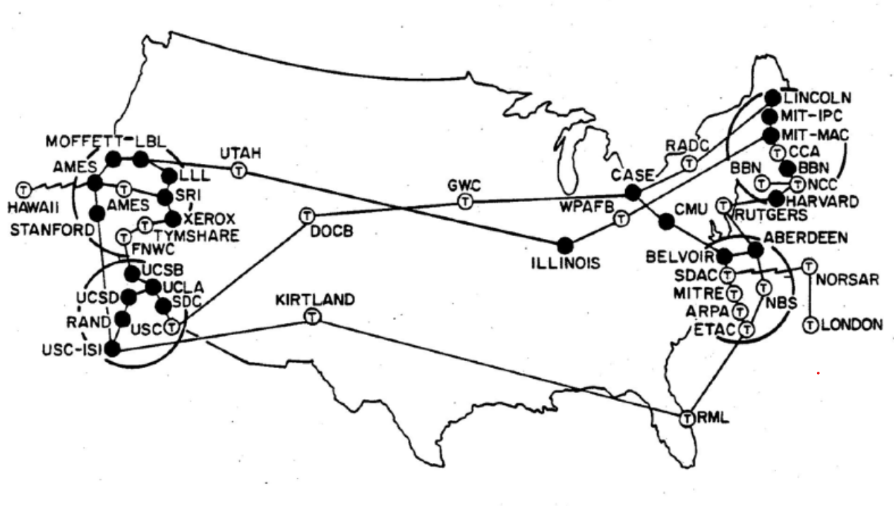
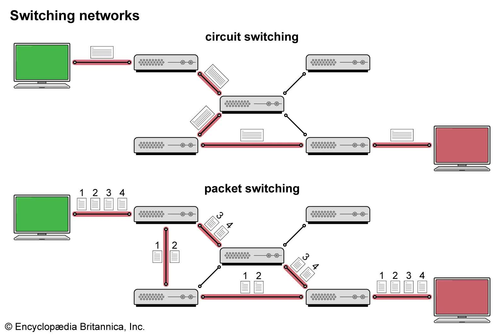
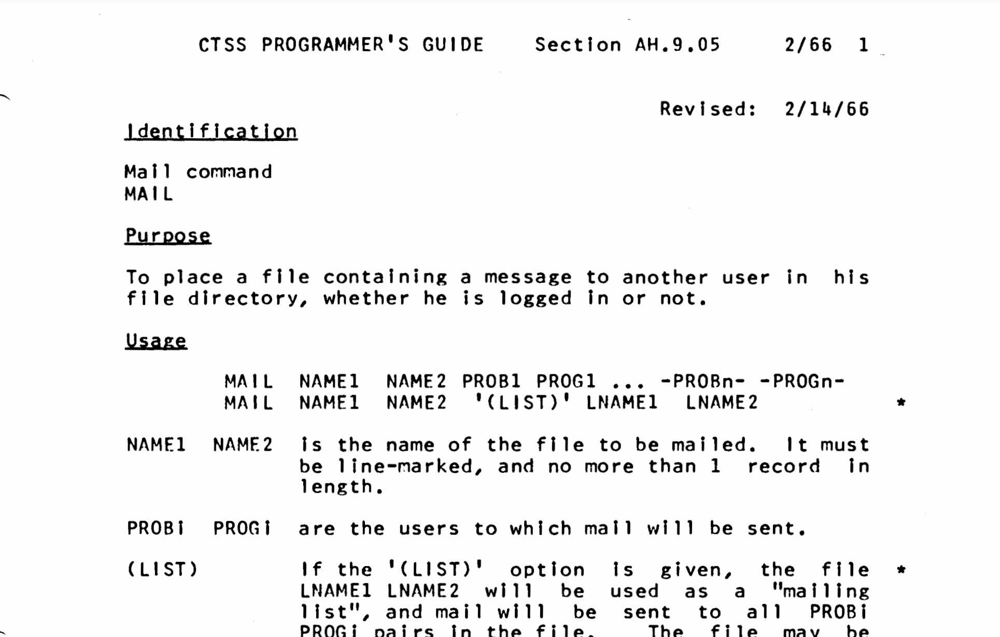
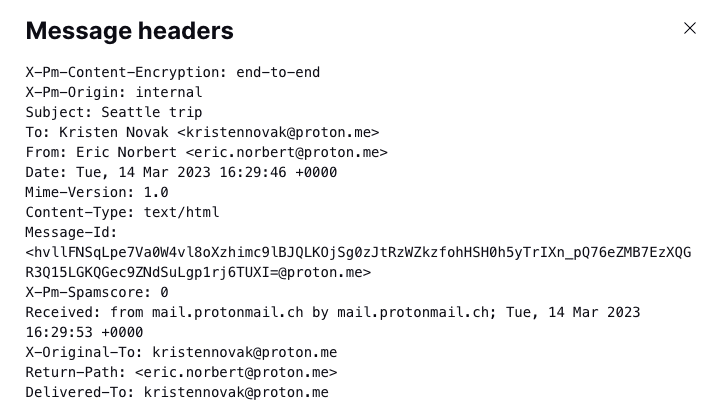
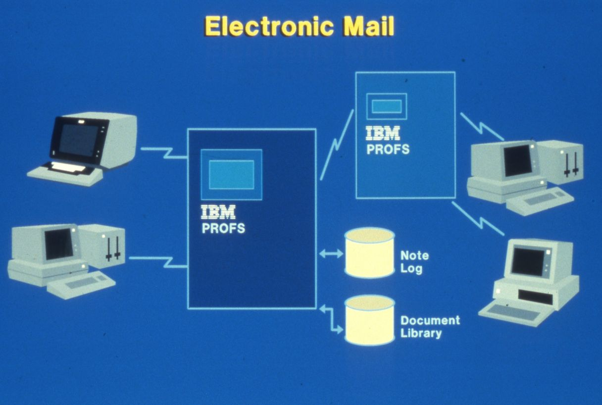
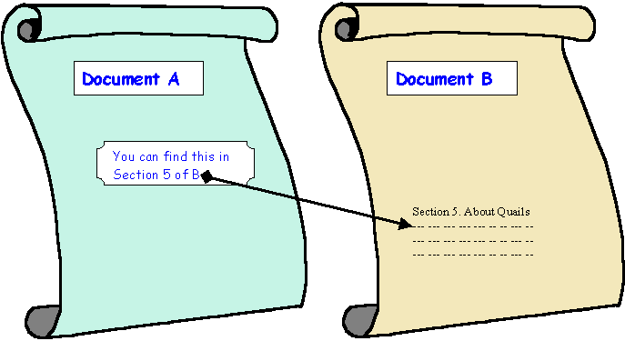
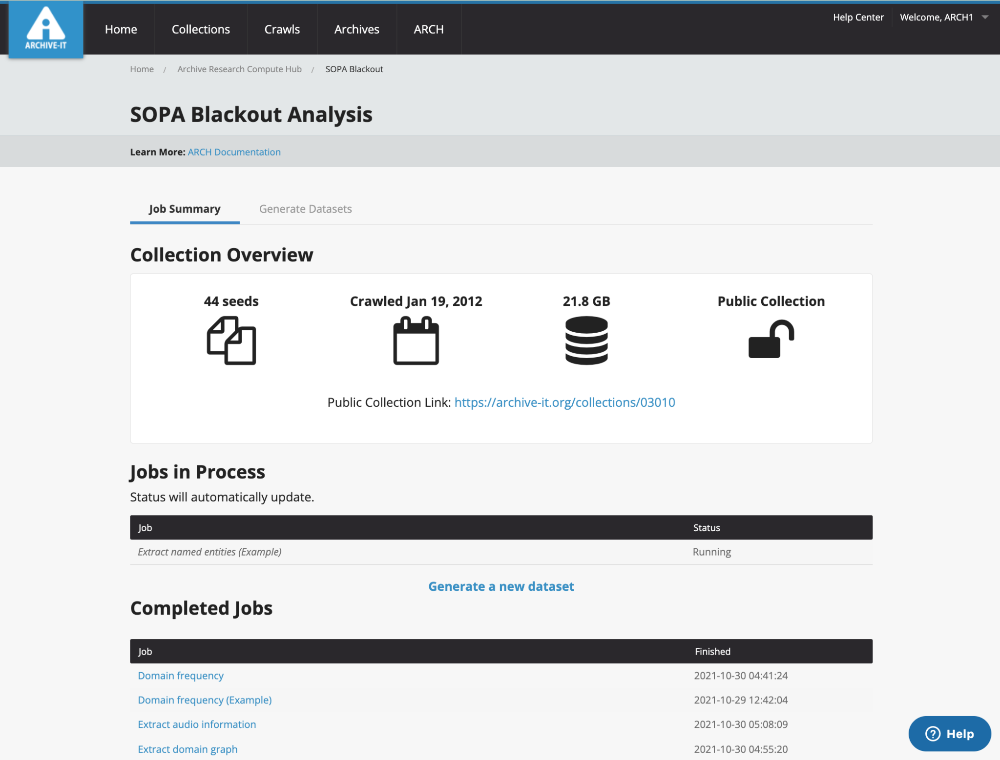

## Week 13 
# Archiving Web-Based Electronic Records

---

# Today
- **Settle in/Reminders/Announcements** (15 min)
- **Discuss Last Week's Activity** (20 min)
- **Lecture: Automation and Scripting** (45 min)
- **Break** (10 min)
- **Start Weekly Activity** (70 min)
- **Wrap up** (10 min)

---

# Announcements

* Final paper due: May 8 (Thursday)
* Next week is Guest Speaker Day (Karly Wildenhaus and Nicole Greenhouse). Please come prepared with questions, and please fill out this form: <a href="https://forms.gle/F3F7AZrRgU2KUXY9A" target="_blank">https://forms.gle/F3F7AZrRgU2KUXY9A</a>
---

# Archiving Web-Based Electronic Records

---



<!--presenter notes

Image source: 
CC BY-SA 4.0
File:Arpanet in the 1970s.png
Created: 4 January 2022

The late 1960s heralded the first networked computers. Advanced Research Projects Agency Network or ARPANET - a precursor to the modern internet - was the first wide-area packet-switched network. Packet-switched networks transmitted data from one node to another in a more efficient manner, and this model is essentially the backbone for how for data communications in computer networks worldwide today work.

In the chart above, you can see a map of ARPANET node map from the early 1970s.

-->

---



<!--presenter notes

Packet switching allows information to be transmitted quickly over networks. In a more traditional set up, you have one payload (e.g. an email message), transmitted over one line. However, if you wanted to transfer 2 messages at the same time, you'd create a traffic jam.

In a packet switching system, you take your payload, and break it up into packages, and number them in order. Once broken up, you can send the pieces of the package through multiple lines, so incase there's a traffic jam on one line, it can be routed or switched to another. Upon delivery, the packages are assembled in order.

-->

---



<!--presenter notes

https://www.multicians.org/thvv/ah-9-05.pdf

See also The History of Electronic Mail
by Tom Van Vleck https://www.multicians.org/thvv/mail-history.html

This document is an excerpt from the CTSS (Compatible Time-Sharing System) Programmer’s Guide, specifically describing the MAIL command—one of the earliest examples of electronic mail functionality.

-->

---



<!--presenter notes

Abhay Bhushan, Ken Pogran, Ray Tomlinson, and Jim White (of SRI) took the first step to standardize email headers in RFC-561, published in September 1973. Their proposal was mild. Every email message should have three fields (FROM, SUBJECT, and DATE) at the start. Additional fields were permitted, one per line, with each line starting with a single word (no spaces) followed by a colon (:). The end of this header section was marked by a single blank line, after which came the contents of the message (Partridge, 2008, p. 9).

See DOI: 10.1108/RMJ-03-2014-0015

Correspondence as a documentary form, its persistent representation, and email management, preservation, and access
Zhang, JaneRecords management journal, 16 Mar 2015, Vol. 25, Issue 1, pages 78-95
-->

---

# Armstrong vs. Executive of the President

<!--presenter notes

See: https://www.jstor.org/stable/40293774 and https://law.justia.com/cases/federal/district-courts/FSupp/821/761/1510466/

In 1989, Scott Armstrong, Executive Director of the National Security Archive, filed a Freedom of Information Act (FOIA) request to ensure that the contents of the White House electronic mail and records system, contained on magnetic backup tapes stored on the IBM PROFS system, would not be destroyed and subject to archival review before disposition. This FOIA led to a lawsuit known as Armstrong versus the Executive Office of the President implicating both the Reagan and Bush White Houses. This lawsuit resulted in the court ordering the transfer of 5,839 backup tapes to the National Archives.

-->

---



<!--presenter notes

White house emails were transmitted using the IBM "PROFS" system. PROFS stands for "Professional Office System".

"In 1984, IBM introduced a line of personal computer workstations that could send and receive email, share documents and control peripheral devices like printers via the PROFS network protocol" (from the IBM Heritage article, "The Networked Office": https://www.ibm.com/history/profs-networked-business)

-->

---


<!--presenter notes

"PROFS became the backbone of IBM’s Federal Services Division, which provided administrative services to the US government in areas ranging from record keeping at the Department of Defense to instrument design for the Apollo program. PROFS Notes even figured prominently in the Iran-Contra affair: Colonel Oliver North deleted a large number of emails connecting him to the scandal in 1982, not realizing they were archived on magnetic tape backups that became evidence in congressional hearings over the next two years."

-->

---

## Timeline
- **January 19, 1989**: At the end of Raegan presidency, Executive Director of the National Security Archive Scott Armstrong filed an Freedom of Information Act (FOIA) request to ensure White House was subject to archival review before disposition.
- DC Judge filed a temporary restraining to prevent record destruction.
- **September 1989**: Government attempted to dismiss the case. Motion denied by Judge Charles R. Richey, which the government appealed.

---

- The White House's policy was to print emails to paper, considering the printed copy the "official record."
- **The Court's Finding (1993):** The policy of relying only on printed versions of email was ruled “arbitrary, capricious, and contrary to federal records laws.”

---

# Question

## What’s missing when email records are preserved only as printed copies, and why did the court find that approach insufficient under federal records laws?

<!--presenter notes

Why? Because email has metadata, attachments, headers, and other contextual info not captured in a printout.

-->

---

# Email Archiving Challenges
- **Scale:** Ubiquitous, voluminous
- **Legal and ethical concerns**
- **Technically complicated**: Different email clients, email formats; but also, the structure of an email can entail entire threads to multiple recipients; emails can have attachments of a variety of file formats

<!--presenter notes

- Scale: One person's inbox can contain 10000+ messages; imagine dealing with an entire organization's email, you may be dealing with millions of records.
- Legal and ethical concerns: Blurred lines between professional and casual correspondence = High risk of revealing personal-identifying or sensitive information
- Technically complex: There are many email clients (Outlook, Gmail, Hotmail, etc.), email file formats (MBOX), and email structures which need to be normalized to attempt to make available something that makes sense and is useful to a researcher

-->

---

## System
# ePADD - 1/3

**ePadd** is an email archiving application developed by Stanford University.

Its features include bulk screening/redaction tool for personally-identifying/sensitive information, and provides a way to make processed email archives searchable, discoverable through a set of structured metadata that can be queried/browsed.

---

## System
# ePADD - 2/3

ePADD incorporates natural language processing and named entity recognition, meaning it can automatically extract persons, corporations, locations, government entities, political parties, universities, diseases, social security and credit card numbers, and other topics/information possibly associated with sensitive information.

---

## System
# ePADD - 3/3

Processing in ePADD occurs in four steps or **modules**:
1. Appraisal
2. Processing
3. Discovery
4. Delivery

<!--presenter notes

Appraisal: Allows for archivists and curators to review the email archive on a local server. Features include:
- Merge duplicate identities (e.g., a person who has two email addresses)
- Apply persistent URL to each message
- The archivist or the researcher can input annotations

Processing: Allows for namely archivists to process, arrange, identify PID using the Lexicon search feature and flag it for further review or apply a restriction, associate metadata with name authorities. Proprietary or rare email formats can be normalized to more standard formats like MBOX or EML.

Discovery: Provides a user interface for researchers and other end-users to search through archive using keyword searching, that goes beyond what a catalog might otherwise provide.

Delivery: Enables an archivist to mediate delivery of requested materials. This might look like a dedicated computer in a reading room.

-->

---

<div class="shapes">
  <div class="triangle"></div>
  <span class="circle"></span>
  <span class="square"></span>
</div>

<div class="activity-title">Email Archive</div>

_Browse an email archive._

<ul class="activity-list">
<li>Open up <a href="https://epadd.stanford.edu/epadd/collections" target="_blank">Stanford email collections</a></li>
<li>Select a collection (e.g. Robert Creeley); read the description and when you are ready, select "Enter ->"
</li>
<li>Click on the "Entities" facet, and then select any of the Entities that appear in the list.</li>
<li>Scroll through an email or two. What do you notice? 

---


<div class="shapes">
  <div class="triangle"></div>
  <span class="circle"></span>
  <span class="square"></span>
</div>

<div class="activity-title">Email Archive</div>

<ul class="activity-list">
<li>Next, locate the <u>finding aid</u> for the collection you selected.</li>
<li>Once you have the finding aid open, locate the emails in the hierarchy (you may need to perform a search for "email" in the collection search to hone in on the series/subseries containing emails.)</li>
<li>Read through the finding aid details regarding the emails (how to access, redactions, access restrictions, etc.)</li>

---

<div class="quote">

“Websites have … become an essential component of cultural memory, and will inevitably be tomorrow’s historical documents. Yet websites are extremely unstable, fragile, and vulnerable to loss. Anyone with an interest in historical documentation should be concerned about the volume of significant content disappearing daily from the cultural record.”

</div>

<div class="author">Howard Besser</div>
<div class="work">Archiving Websites Containing Streaming Media”, 2017</work>

<!--presenter notes

Quote above was written by Howard Besser, Founding Director of the Moving Image Archiving and Preservation (MIAP) program at NYU, who in 2017 wrote an article “Archiving Websites Containing Streaming Media” (https://library.imaging.org/archiving/articles/14/1/art00004).

This quote captures both the importance of web archiving in terms of preserving the cultural record, as well as the various challenges to do with this medium in terms of scale, ephemerality, and dynamism.

-->

---

## Definition
# Web archiving

“The process of collecting portions of the World Wide Web, preserving the collections in an archival format, and then serving the archives for access and use.”

International Internet Preservation Consortium

<!--presenter notes

Web archiving is the process of collecting and preserving web content for future use. It involves capturing websites, social media posts, and other digital content, and preserving them in an organized and accessible format. This is important because the internet is constantly changing, and much of the content on it is ephemeral, meaning it may disappear without notice. By archiving web content, we can ensure that it is preserved for future generations.

-->

---

# Challenges
* Web content is constantly changing
* Websites are complex and layered
* Balancing “big data”, access, and privacy
* Requires certain technical knowledge
* Requires staffing/resources

<!--presenter notes

Web archiving has been characterized as challenging and difficult. This lists just some of the challenges that web archives pose to modern archives:
- Content on the web is constantly changing. Websites are rarely the same day after day, or in the case of a feed, are different second by second.
- On top of that, web content is complex and layered. Rarely with websites, what you see, as an end-user, is just the tip of the iceberg in terms of how the website functions and works.
- The scale at which web archiving must operate can be vast and somewhat daunting. In some cases, archiving the web may involve working with “big data”, for example, downloading the tweets generated for a particular hashtag on Twitter. In cases like this, how do we provide access to this sort of data, while maintaining users’ privacy? How do we go about obtaining permission or consent for hundreds or thousands of accounts?
- Web archiving also requires a certain technical understanding of how the web works.
- Lastly, despite there being tools available to archivists that can automate the archiving process, web archiving still requires a certain level of labor and staff hours to do optimally.

-->

---

# Web foundations

Understanding how to archive and preserve web materials means understanding how the web works.

---

## Definition
# Hypertext Document

A **hypertext document** is a type of electronic document that contains hyperlinks to other documents or resources. A type of hypertext document we are all familiar with is a website.

---



<!--presenter notes

Image Credit:
University of Cape Town, Department of Computer Science. "The Client-Server Model."
Source: MIT Web Programming Course Notes
Direct Image URL: 01_001.gifs

The world wide web aka “the web” is built on the idea of linking hypertext documents together to form a vast network of interconnected information. In this way, hypertext documents are a fundamental and essential concept that underpins the web’s structure and functionality.

A hypertext document is a type of electronic document that contains links to other documents or resources. Hypertext allows the reader to navigate between different sections of a document or to jump to related content on other websites or documents.

-->

---

## Definition
# Hyperlink

A **hyperlink** or just **link** is an _interactive component_ (i.e. text, graphic) of a website that, when clicked, brings the user to another part of the web.

---

## Definition
# Hypertext Markup Language (HTML)

**Hypertext Markup Language (HTML)** is used for creating websites and other types of documents that can be displayed in a web browser.

<!--presenter notes

Websites are constructed using Hypertext Markup Language or HTML. A markup language is a system of annotating a document in a way that is machine-readable and provides instructions on how to display the content.

In the example of the screen, I have demonstrated how a link is coded using HTML. In particular we would use the anchor or <a> tag (anchor refers to any point where users can navigate to a different location). The anchor tag is qualified using the “href” attribute (href stands for for “hypertext reference”). This is followed by an equals sign, and then the URL where we want the user to go embedded in opening and closing quotation marks. This is followed by some text (A place to go), which is what the front-end user sees.

-->

---

What user sees:
Here is <a href=”aplace.go”>a link</a>.

What HTML looks like:
Here is ```<a href="aplace.go">```a link```</a>```.

---

## Definition
# Hypertext Transfer Protocol (HTTP)

**Hypertext Transfer Protocol (HTTP)** is the underlying protocol used on the web to exchange data between web servers and web browsers.

Browsers use HTTP requests-response methods to ask for, receive and render website data.

<!--presenter notes

When you click, tap or otherwise interact with a link, your web browser sends a request to the server for the web page associated with that link. The server then responds with the webpage's HTML code, which your browser uses to render the page and display it on your screen. This request and response between web servers to render website data is guided by hypertext transfer protocol, or HTTP.

-->

---

<div class="browser-window">
  <div class="browser-header">
    <div class="browser-controls">
      <div class="control red"></div>
      <div class="control yellow"></div>
      <div class="control green"></div>
    </div>
    <div class="address-bar">https://thecreativeindependent.com/</div>
  </div>
  <div class="browser-content">
  </div>
</div>

<!--presenter notes

I want to step us in a bit more depth what happens behind the scenes when HTTP requests and responses are mad browsers, using a familiar example you’ve used probably hundreds of times: entering in a URL into a browser address bar, and hitting enter, to look up a website. It’s helpful to know how HTTP works under the hood, because a lot of common tools used by web archivists use HTTP to work.

-->

---

<div class="browser-window">
  <div class="browser-header">
    <div class="browser-controls">
      <div class="control red"></div>
      <div class="control yellow"></div>
      <div class="control green"></div>
    </div>
    <div class="address-bar">https://thecreativeindependent.com/</div>
  </div>
  <div class="browser-content">
    <p>Sending request: "Who is thecreativeindependent.com?"</p>
    <button class="action-button">Send Request</button>
  </div>
</div>

<!-- DNS Server Table -->
<table class="dns-table">
  <tr>
    <th>Domain Name</th>
    <th>IP Address</th>
  </tr>
  <tr>
    <td>thecreativeindependent.com</td>
    <td>192.0.2.123</td>
  </tr>
  <tr>
    <td>nyu.edu</td>
    <td>216.165.47.10</td>
  </tr>
  <tr>
    <td>wikipedia.org</td>
    <td>91.198.174.192</td>
  </tr>
  <tr>
    <td>archive.org</td>
    <td>207.241.224.2</td>
  </tr>
  <tr>
    <td>etc...</td>
    <td>
  </tr>
</table>

---

<div class="browser-window">
  <div class="browser-header">
    <div class="browser-controls">
      <div class="control red"></div>
      <div class="control yellow"></div>
      <div class="control green"></div>
    </div>
    <div class="address-bar">https://thecreativeindependent.com/</div>
  </div>
  <div class="browser-content">
    <p>✅ Found the name! Now connecting to the IP...</p>
  </div>
</div>

<!-- DNS Server Table -->
<table class="dns-table">
  <tr>
    <th>Domain Name</th>
    <th>IP Address</th>
  </tr>
  <tr style="background: #27c93f; font-weight: bold; color: white;">
    <td>thecreativeindependent.com</td>
    <td>192.0.2.123</td>
  </tr>
  <tr>
    <td>nyu.edu</td>
    <td>216.165.47.10</td>
  </tr>
  <tr>
    <td>wikipedia.org</td>
    <td>91.198.174.192</td>
  </tr>
  <tr>
    <td>archive.org</td>
    <td>207.241.224.2</td>
  </tr>
  <tr>
    <td>etc...</td>
    <td>
  </tr>
</table>

<!--presenter notes

If the DNS finds a match, it responds to your browser with the IP address of the URL.

-->

---

## Definition
# Internet Protocol (IP) Address

An **internet protocol (IP) address** is a numerical label assigned to each device that participates in the web.

<!--presenter notes

An Internet Protocol Address or IP address is a unique string of characters that identifies each computer using the Internet Protocol to communicate over a network. Your computer, which is a device connected to the internet, has its own unique IP address. All websites are hosted off of their own computer, so all websites, too, are associated with a unique IP.

The reason why your browser looks up IPs is because computers like to communicate with each other in numbers. So basically it’s transforming the human-readable URL into a sequence of numbers that it uses to look up where a website lives.

-->

---

<!-- Browser Window -->
<div class="browser-window">
  <div class="browser-header">
    <div class="browser-controls">
      <div class="control red"></div>
      <div class="control yellow"></div>
      <div class="control green"></div>
    </div>
    <div class="address-bar">https://thecreativeindependent.com/</div>
  </div>
  <div class="browser-content">
    <p>🔗 Using TCP/IP connection to connect and receive HTML</p>
  </div>
</div>

<!-- DNS Server Table -->
<table class="dns-table">
  <tr>
    <th>Domain Name</th>
    <th>IP Address</th>
  </tr>
  <tr style="background: #27c93f; font-weight: bold; color: white;">
    <td>thecreativeindependent.com</td>
    <td>192.0.2.123</td>
  </tr>
  <tr>
    <td>openai.com</td>
    <td>104.18.25.11</td>
  </tr>
  <tr>
    <td>wikipedia.org</td>
    <td>91.198.174.192</td>
  </tr>
</table>

<!--presenter notes

Once the browser has received the IP address from the DNS server, it uses this address to establish a TCP/IP connection to the server hosting the website.

-->

---

## Definition
# Transmission Control Protocol (TCP)/Internet Protocol (IP) TCP/IP

TCP/IP stands for **Transmission Control Protocol (TCP)/Internet Protocol (IP)**, and is a family of communication protocols used to connect computer systems in a network.

<!--presenter notes

Webpage data is transmitted via Transmission Control Protocol/Internet Protocol or TCP/IP, is a suite of communication protocols that define how data is transmitted over the Internet and other computer networks. It is the most widely used network protocol suite in the world and provides the foundation for the Internet.

TCP/IP consists of two main protocols: TCP and IP.

TCP (Transmission Control Protocol) is a reliable, connection-oriented protocol that provides a way to establish a virtual circuit between two devices over the Internet. TCP ensures that data is transmitted in order, without loss or duplication, and with error detection and correction. TCP also provides flow control and congestion control to prevent network congestion.

IP (Internet Protocol) is a connectionless, best-effort protocol that provides the routing of data packets between devices on a network. IP is responsible for breaking data into packets and addressing them so that they can be routed to their destination.

-->

---

<!-- Browser Window -->
<div class="browser-window">
  <div class="browser-header">
    <div class="browser-controls">
      <div class="control red"></div>
      <div class="control yellow"></div>
      <div class="control green"></div>
    </div>
    <div class="address-bar">https://thecreativeindependent.com/</div>
  </div>
  <div class="browser-content">
    <h2 style="text-align: center; font-size: 2rem;">🌀 The Creative Independent 🌀</h2>
    <p style="text-align: center;">A guide to being a working artist</p>
  </div>
</div>

<!-- DNS Server Table -->
<table class="dns-table">
  <tr>
    <th>Domain Name</th>
    <th>IP Address</th>
  </tr>
  <tr style="background: #27c93f; font-weight: bold; color: white;">
    <td>thecreativeindependent.com</td>
    <td>192.0.2.123</td>
  </tr>
  <tr>
    <td>openai.com</td>
    <td>104.18.25.11</td>
  </tr>
  <tr>
    <td>wikipedia.org</td>
    <td>91.198.174.192</td>
  </tr>
</table>

<!--presenter notes

The server responds to the request by sending back an HTTP response, which includes the webpage content, as well as any additional resources (such as media, images or scripts).

The browser receives the HTTP response and renders the webpage for display to the user.

Note: These are the general steps for when you access a website for the first time. Going forward, your browser will check its local DNS cache to see if it has previously resolved the IP address of the hostname. If it finds a matching entry in the cache, it uses that IP address to connect to the server hosting the website. So, this is what it means to “clear your cache”: your browser basically stores information about websites you have visited to make it so, when you revisit them, they will load quicker. If the hostname is not found in the local cache, the browser sends a DNS query to a DNS server.

Note 2: TCP contains information about what data has or has not been received yet, while HTTP contains specific instructions on how to read and process the data once it's received. TCP manages the data stream, whereas HTTP describes what the data in the stream contains.

-->

---

<div class="shapes">
  <div class="triangle"></div>
  <span class="circle"></span>
  <span class="square"></span>
</div>

<div class="activity-title">Mini Activity - HTTP In Action</div>

_Watch your browser talking to other servers._

<ul class="activity-list">
<li>Open up a website (I will use archive.org)</li>
<li>Open your browser’s inspector; Click on the Inspect “Network” tab</li>
<li>Reload the website and watch the Network tab refresh</li>
<li>Scroll to the top of the list and select the first entry. Note how it used the HTTP “GET” method to render the website.</li>
</ul>

<!--presenter notes

This next activity will show us some of the actions our browsers take when we access a website, and show us a bit more the specific protocols it uses to retrieve or relay information, and ultimately render a website in full.

-->

---


# Web Archiving

---

<!--presenter notes

Next we will cover the tools and techniques employed by people working in web archives to use these technologies to the advantage of developing and collecting websites or domains of interest. One primary technique is known as web crawling.

-->

## Definition 
# Web crawler

A **web crawler** (also sometimes referred to as a “spider” or even just “search engine bot”) is any tool that systematically collects hypertext documents using/leveraging HTTP.

<!--presenter notes

A web crawler is a program or software that systematically scans and indexes websites on the internet. The purpose of a web crawler is to collect information from web pages. Web crawlers are used for a number of different purposes. Famously, they are used by web search engines to index web pages, which makes them quickly searchable by users.

-->

---


<!--presenter notes

How do web crawlers work?

The crawler starts with what known as a “seed URL”, which is basically the starting URL through which the crawler will work its way through. This can be a single URL, or a list, depending on your archiving scope.

Once it is does scanning one page, it will go onto scan the pages of any other related URLs it has found.
The crawler scans each page’s contents, collecting information about text, images, and metadata such as page titles and descriptions, and other related URLs.

Information is worked through and retrieved using HTTP requests and responses, in a similar fashion to how a browser queries and receives information.

The crawler will repeat these steps over and over until it has scanned all seed URLs and their related pages.

-->

---

## Definition
# Web ARChive (WARC) File Format

A digital archival format used to store and preserve web content, such as HTML pages, images, videos, and other digital assets, for long-term access and retrieval. Web \+ Archive = WARC

ISO 28500:2017 ([https://www.iso.org/standard/68004.html](https://www.iso.org/standard/68004.html))

<!--presenter notes

The result: All web archiving crawlers produce a specific type of file called a WARC, which stands for “Web ARChive”.

WARC is a digital archival format that stores web content, such as HTML pages, images, videos, and other digital assets, for long-term access and retrieval. It is governed by the ISO standard 28500:2017.

-->

---

<div class="shapes">
  <div class="triangle"></div>
  <span class="circle"></span>
  <span class="square"></span>
</div>

<div class="activity-title">Mini Activity - Replay WARC - 1/2</div>

_Look at how a WARC file works._

<ul class="activity-list">

<li>Download a sample WARC file: <a href="https://archive.org/details/sample-warc-file" target="_blank">https://archive.org/details/sample-warc-file</a></li>
<li>Click “Show All” on the right-hand side of the page</li>
<li>Download IIPC-COVID-Announcement.warc</li>
<li>Open ReplayWeb.Page: <a href="https://replayweb.page/" target="_blank">https://replayweb.page/</a>
</ul>

---

<div class="shapes">
  <div class="triangle"></div>
  <span class="circle"></span>
  <span class="square"></span>
</div>

<div class="activity-title">Mini Activity - WARC - 2/2</div>

<ul class="activity-list">

<li>Click <b>Choose File</b>; locate and select the WARC just downloaded</li> and click <b>Load</b>
<li>In the drop-down next to to Search, select “HTML”</li>
<li>Click on 5-10 HTML files to browse the web archive</li>

</ul>

---

## Tool
# Archive-It


* Created in 2006
* Subscription-based service
* Backed by Internet Archive (it looks like, but is not the same as the <a href="https://web.archive.org/" target="_blank">Wayback Machine</a>.)
* Widely used

<!--presenter notes

One tool in particular that is used for web archiving is Archive-It. Archive-It was created in 2006, and has become, at least according to a National Digital Stewardship Alliance (NDSA) survey, one of the most widely-used web archiving tools, “...used by approximately 94 percent of libraries and archives with web archiving programs” (Matthew Farrell et al., “Web Archiving in the United States: A 2017 Survey,” National Digital, Stewardship Alliance (October 2018), 20, https://osf.io/ht6ay)

Archive-It is a subscription-based service, where institutions pay an annual fee for the service
It works by performing web crawls to capture websites. The websites are then saved to the Internet Archive’s servers. Archive-It provides a backend interface for a subscribing institution’s library or archival staff to perform data management and creation. Completed crawls are made available through an end-user interface, where users can explore collections of websites. These websites are maintained by the subscriber institution.
Although it was created by the Internet Archive, and uses the Wayback Machine as part of how it presents archives website, it differs from the Wayback Machine in a number of ways.

The Wayback Machine is a public archive of websites run and maintained by Internet Archive staff.
Archive-It, on the other hand, allows subscribers to capture and curate their own web archives relevant to their institution’s goals, mission, or collection development policies.

-->

---



---

<div class="shapes">
  <div class="triangle"></div>
  <span class="circle"></span>
  <span class="square"></span>
</div>

<div class="activity-title">Archive-It Mini Activity
</div>

_Look at a web archive made with Archive-It._

<ul class="activity-list">

<li>Visit <a href="https://archive-it.org/" target="_blank">https://archive-it.org/</a></li>
<li>Under “Explore Collecting Organizations”, open any institution’s instance.
</li>
<li>Click on the <b>Collections tab</b> and explore/click around.
</li>
<li>Click on the <b>Sites tab</b>; Find and click on a site that has more than one capture listed</li>
<li>Take these steps again with another instance.</li>
</ul>

---

# Question  
Compare the two Wayback Machine captures you just explored. Consider the **contextual information** available:  

- Can you determine **why**, **how**, or **how often** these captures were made?
- What clues (or lack thereof) help you understand the capture process?
- What additional information would you like to see to better understand the **context** of these web captures?

---

## Tool
# Webrecorder

* Open source: originally developed by <a href="https://rhizome.org/" target="_blank">Rhizome</a> to capture digital art
* User-driven capture within the comfort of a browser: Result is a WARC file
* Also provides mechanism to "replay" a capture
* Two main tools are <a href="https://ArchiveWeb.page/" target="_blank">https://archiveweb.page/</a> (to capture) and <a href="https://ReplayWeb.page/" target="_blank">https://replayweb.page/</a> (to replay)

<!--presenter notes

The next tool we will cover is Webrecorder, which is a web archiving platform that approaches website captures a bit differently than a standard web crawl.

Webrecorder was developed by the non-profit organization Rhizome as a tool for preserving online cultural heritage and digital art, first deployed in 2016. It has now expanded to include any web-based artifact.

Webrecorder is an open source tool, meaning it is free for anyone to use, and does not require a subscription.
User driven web archiving: the user determines what to/not archive. The actual web content capturing is also driven by the user themselves. The user will use a web browser to “drive” a capture session. This is different from, say, a web crawl, which relies mostly on automation to snake through and find whatever it can. Webrecorder is a more deliberate, manual action performed by a user.
Webrecorder has made available two main tools: ArchiveWeb.Page to capture and archive websites into a WARC file, and then ReplayWeb.page to replay WARC files.

Information about webrecorder was primarily derived from Lorena Ramirez-Lopez and Ilya Kreymer’s presentation here: https://www.youtube.com/watch?v=AP6wucoqJw0

-->

---

<div class="shapes">
  <div class="triangle"></div>
  <span class="circle"></span>
  <span class="square"></span>
</div>

<div class="activity-title">Mini Activity - Record the Web
</div>

_Watch me demo WebRecorder or try yourself._

<ul class="activity-list">

<li>Open and install <a href="https://ArchiveWeb.page/" target="_blank">https://archiveweb.page/</a>; pin to browser.</li>
<li>Open up any website you wish.
</li>
<li>Click in this order: 1.) Extension button, 2.) Create new archive, 3.) Start</li>
<li>Navigate around the site for 10-20 seconds</li>
<li>Stop recording and download the WACZ file</li>

---

## Weekly Activity
# Podcast Archaeology

Start: <a href="https://digital-archives.github.io/HISTGA1011/activities/podcast.html" target="_blank">https://digital-archives.github.io/HISTGA1011/activities/podcast.html</a>

---


_Final questions or reflections?_

mary.kidd@nyu.edu