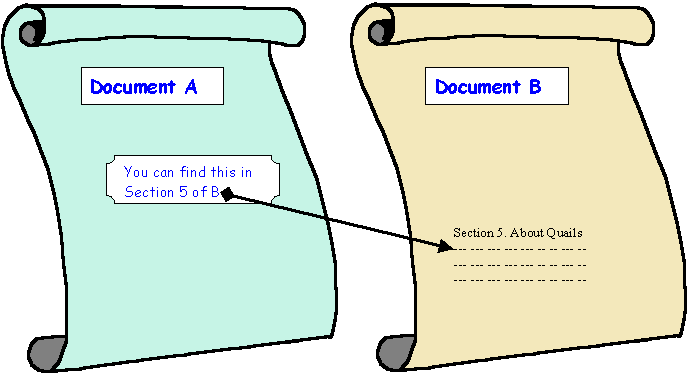

## Week 13 
# Web Archiving

---

# Today
- **Settle in/Reminders/Announcements** (15 min)
- **Discuss Last Week's Activity** (20 min)
- **Lecture: Automation and Scripting** (45 min)
- **Break** (10 min)
- **Start Weekly Activity** (70 min)
- **Wrap up** (10 min)

---

# Announcements

_Feel free to email me with any announcements you would like me to boost (upcoming conferences, webinars, trainings, or other events/topics of interest)._

---

<div class="quote">

“Websites have … become an essential component of cultural memory, and will inevitably be tomorrow’s historical documents. Yet websites are extremely unstable, fragile, and vulnerable to loss. Anyone with an interest in historical documentation should be concerned about the volume of significant content disappearing daily from the cultural record.”

</div>

<div class="author">Howard Besser</div>
<div class="work">Archiving Websites Containing Streaming Media”, 2017</work>

<!--presenter notes

Quote above was written by Howard Besser, Founding Director of the Moving Image Archiving and Preservation (MIAP) program at NYU, who in 2017 wrote an article “Archiving Websites Containing Streaming Media” (https://library.imaging.org/archiving/articles/14/1/art00004).

This quote captures both the importance of web archiving in terms of preserving the cultural record, as well as the various challenges to do with this medium in terms of scale, ephemerality, and dynamism.

-->

---

## Definition
# Web archiving

“The process of collecting portions of the World Wide Web, preserving the collections in an archival format, and then serving the archives for access and use.”

International Internet Preservation Consortium

<!--presenter notes

Web archiving is the process of collecting and preserving web content for future use. It involves capturing websites, social media posts, and other digital content, and preserving them in an organized and accessible format. This is important because the internet is constantly changing, and much of the content on it is ephemeral, meaning it may disappear without notice. By archiving web content, we can ensure that it is preserved for future generations.

-->

---

# Challenges
* Web content is constantly changing
* Websites are complex and layered
* Balancing “big data”, access, and privacy
* Requires certain technical knowledge
* Requires staffing/resources

<!--presenter notes

Web archiving has been characterized as challenging and difficult. This lists just some of the challenges that web archives pose to modern archives:
- Content on the web is constantly changing. Websites are rarely the same day after day, or in the case of a feed, are different second by second.
- On top of that, web content is complex and layered. Rarely with websites, what you see, as an end-user, is just the tip of the iceberg in terms of how the website functions and works.
- The scale at which web archiving must operate can be vast and somewhat daunting. In some cases, archiving the web may involve working with “big data”, for example, downloading the tweets generated for a particular hashtag on Twitter. In cases like this, how do we provide access to this sort of data, while maintaining users’ privacy? How do we go about obtaining permission or consent for hundreds or thousands of accounts?
- Web archiving also requires a certain technical understanding of how the web works.
- Lastly, despite there being tools available to archivists that can automate the archiving process, web archiving still requires a certain level of labor and staff hours to do optimally.

-->

---

# Web foundations

Understanding how to archive and preserve web materials means understanding how the web works.

---

## Definition
# Hypertext Document

A **hypertext document** is a type of electronic document that contains hyperlinks to other documents or resources. A type of hypertext document we are all familiar with is a website.

---



<!--presenter notes

The world wide web aka “the web” is built on the idea of linking hypertext documents together to form a vast network of interconnected information. In this way, hypertext documents are a fundamental and essential concept that underpins the web’s structure and functionality.

A hypertext document is a type of electronic document that contains links to other documents or resources. Hypertext allows the reader to navigate between different sections of a document or to jump to related content on other websites or documents.

-->

---

## Definition
# Hyperlink

A **hyperlink** or just **link** is an _interactive component_ (i.e. text, graphic) of a website that, when clicked, brings the user to another part of the web.

---

## Definition
# Hypertext Markup Language (HTML)

**Hypertext Markup Language (HTML)** is used for creating websites and other types of documents that can be displayed in a web browser.

<!--presenter notes

Websites are constructed using Hypertext Markup Language or HTML. A markup language is a system of annotating a document in a way that is machine-readable and provides instructions on how to display the content.

In the example of the screen, I have demonstrated how a link is coded using HTML. In particular we would use the anchor or <a> tag (anchor refers to any point where users can navigate to a different location). The anchor tag is qualified using the “href” attribute (href stands for for “hypertext reference”). This is followed by an equals sign, and then the URL where we want the user to go embedded in opening and closing quotation marks. This is followed by some text (A place to go), which is what the front-end user sees.

-->

---

What user sees:
Here is <a href=”aplace.go”>a link</a>.

What HTML looks like:
Here is ```<a href="aplace.go">```a link```</a>```.

---

## Definition
# Hypertext Transfer Protocol (HTTP)

**Hypertext Transfer Protocol (HTTP)** is the underlying protocol used on the web to exchange data between web servers and web browsers.

Browsers use HTTP requests-response methods to ask for, receive and render website data.

<!--presenter notes

When you click, tap or otherwise interact with a link, your web browser sends a request to the server for the web page associated with that link. The server then responds with the webpage's HTML code, which your browser uses to render the page and display it on your screen. This request and response between web servers to render website data is guided by hypertext transfer protocol, or HTTP.

-->

---

<div class="browser-window">
  <div class="browser-header">
    <div class="browser-controls">
      <div class="control red"></div>
      <div class="control yellow"></div>
      <div class="control green"></div>
    </div>
    <div class="address-bar">https://thecreativeindependent.com/</div>
  </div>
  <div class="browser-content">
  </div>
</div>

<!--presenter notes

I want to step us in a bit more depth what happens behind the scenes when HTTP requests and responses are mad browsers, using a familiar example you’ve used probably hundreds of times: entering in a URL into a browser address bar, and hitting enter, to look up a website. It’s helpful to know how HTTP works under the hood, because a lot of common tools used by web archivists use HTTP to work.

-->

---

<div class="browser-window">
  <div class="browser-header">
    <div class="browser-controls">
      <div class="control red"></div>
      <div class="control yellow"></div>
      <div class="control green"></div>
    </div>
    <div class="address-bar">https://thecreativeindependent.com/</div>
  </div>
  <div class="browser-content">
    <p>Sending request: "Who is thecreativeindependent.com?"</p>
    <button class="action-button">Send Request</button>
  </div>
</div>

<!-- DNS Server Table -->
<table class="dns-table">
  <tr>
    <th>Domain Name</th>
    <th>IP Address</th>
  </tr>
  <tr>
    <td>thecreativeindependent.com</td>
    <td>192.0.2.123</td>
  </tr>
  <tr>
    <td>nyu.edu</td>
    <td>216.165.47.10</td>
  </tr>
  <tr>
    <td>wikipedia.org</td>
    <td>91.198.174.192</td>
  </tr>
  <tr>
    <td>archive.org</td>
    <td>207.241.224.2</td>
  </tr>
  <tr>
    <td>etc...</td>
    <td>
  </tr>
</table>

---

<div class="browser-window">
  <div class="browser-header">
    <div class="browser-controls">
      <div class="control red"></div>
      <div class="control yellow"></div>
      <div class="control green"></div>
    </div>
    <div class="address-bar">https://thecreativeindependent.com/</div>
  </div>
  <div class="browser-content">
    <p>✅ Found the name! Now connecting to the IP...</p>
  </div>
</div>

<!-- DNS Server Table -->
<table class="dns-table">
  <tr>
    <th>Domain Name</th>
    <th>IP Address</th>
  </tr>
  <tr style="background: #27c93f; font-weight: bold; color: white;">
    <td>thecreativeindependent.com</td>
    <td>192.0.2.123</td>
  </tr>
  <tr>
    <td>nyu.edu</td>
    <td>216.165.47.10</td>
  </tr>
  <tr>
    <td>wikipedia.org</td>
    <td>91.198.174.192</td>
  </tr>
  <tr>
    <td>archive.org</td>
    <td>207.241.224.2</td>
  </tr>
  <tr>
    <td>etc...</td>
    <td>
  </tr>
</table>

<!--presenter notes

If the DNS finds a match, it responds to your browser with the IP address of the URL.

-->

---

## Definition
# Internet Protocol (IP) Address

An **internet protocol (IP) address** is a numerical label assigned to each device that participates in the web.

<!--presenter notes

An Internet Protocol Address or IP address is a unique string of characters that identifies each computer using the Internet Protocol to communicate over a network. Your computer, which is a device connected to the internet, has its own unique IP address. All websites are hosted off of their own computer, so all websites, too, are associated with a unique IP.

The reason why your browser looks up IPs is because computers like to communicate with each other in numbers. So basically it’s transforming the human-readable URL into a sequence of numbers that it uses to look up where a website lives.

-->

---

<!-- Browser Window -->
<div class="browser-window">
  <div class="browser-header">
    <div class="browser-controls">
      <div class="control red"></div>
      <div class="control yellow"></div>
      <div class="control green"></div>
    </div>
    <div class="address-bar">https://thecreativeindependent.com/</div>
  </div>
  <div class="browser-content">
    <p>🔗 Using TCP/IP connection to connect and receive HTML</p>
  </div>
</div>

<!-- DNS Server Table -->
<table class="dns-table">
  <tr>
    <th>Domain Name</th>
    <th>IP Address</th>
  </tr>
  <tr style="background: #27c93f; font-weight: bold; color: white;">
    <td>thecreativeindependent.com</td>
    <td>192.0.2.123</td>
  </tr>
  <tr>
    <td>openai.com</td>
    <td>104.18.25.11</td>
  </tr>
  <tr>
    <td>wikipedia.org</td>
    <td>91.198.174.192</td>
  </tr>
</table>

<!--presenter notes

Once the browser has received the IP address from the DNS server, it uses this address to establish a TCP/IP connection to the server hosting the website.

-->

---

## Definition
# Transmission Control Protocol (TCP)/Internet Protocol (IP) TCP/IP

TCP/IP stands for **Transmission Control Protocol (TCP)/Internet Protocol (IP)**, and is a family of communication protocols used to connect computer systems in a network.

<!--presenter notes

Webpage data is transmitted via Transmission Control Protocol/Internet Protocol or TCP/IP, is a suite of communication protocols that define how data is transmitted over the Internet and other computer networks. It is the most widely used network protocol suite in the world and provides the foundation for the Internet.

TCP/IP consists of two main protocols: TCP and IP.

TCP (Transmission Control Protocol) is a reliable, connection-oriented protocol that provides a way to establish a virtual circuit between two devices over the Internet. TCP ensures that data is transmitted in order, without loss or duplication, and with error detection and correction. TCP also provides flow control and congestion control to prevent network congestion.

IP (Internet Protocol) is a connectionless, best-effort protocol that provides the routing of data packets between devices on a network. IP is responsible for breaking data into packets and addressing them so that they can be routed to their destination.

-->

---

<!-- Browser Window -->
<div class="browser-window">
  <div class="browser-header">
    <div class="browser-controls">
      <div class="control red"></div>
      <div class="control yellow"></div>
      <div class="control green"></div>
    </div>
    <div class="address-bar">https://thecreativeindependent.com/</div>
  </div>
  <div class="browser-content">
    <h2 style="text-align: center; font-size: 2rem;">🌀 The Creative Independent 🌀</h2>
    <p style="text-align: center;">A guide to being a working artist</p>
  </div>
</div>

<!-- DNS Server Table -->
<table class="dns-table">
  <tr>
    <th>Domain Name</th>
    <th>IP Address</th>
  </tr>
  <tr style="background: #27c93f; font-weight: bold; color: white;">
    <td>thecreativeindependent.com</td>
    <td>192.0.2.123</td>
  </tr>
  <tr>
    <td>openai.com</td>
    <td>104.18.25.11</td>
  </tr>
  <tr>
    <td>wikipedia.org</td>
    <td>91.198.174.192</td>
  </tr>
</table>

<!--presenter notes

The server responds to the request by sending back an HTTP response, which includes the webpage content, as well as any additional resources (such as media, images or scripts).

The browser receives the HTTP response and renders the webpage for display to the user.

Note: These are the general steps for when you access a website for the first time. Going forward, your browser will check its local DNS cache to see if it has previously resolved the IP address of the hostname. If it finds a matching entry in the cache, it uses that IP address to connect to the server hosting the website. So, this is what it means to “clear your cache”: your browser basically stores information about websites you have visited to make it so, when you revisit them, they will load quicker. If the hostname is not found in the local cache, the browser sends a DNS query to a DNS server.

Note 2: TCP contains information about what data has or has not been received yet, while HTTP contains specific instructions on how to read and process the data once it's received. TCP manages the data stream, whereas HTTP describes what the data in the stream contains.

-->

---

<div class="shapes">
  <div class="triangle"></div>
  <span class="circle"></span>
  <span class="square"></span>
</div>

<div class="activity-title">Mini Activity - HTTP In Action</div>

_Watch your browser talking to other servers._

<ul class="activity-list">
<li>Open up a website (I will use archive.org)</li>
<li>Open your browser’s inspector; Click on the Inspect “Network” tab</li>
<li>Reload the website and watch the Network tab refresh</li>
<li>Scroll to the top of the list and select the first entry. Note how it used the HTTP “GET” method to render the website.</li>
</ul>

<!--presenter notes

This next activity will show us some of the actions our browsers take when we access a website, and show us a bit more the specific protocols it uses to retrieve or relay information, and ultimately render a website in full.

-->

---


# Web Archiving

---

You’ve learned the basics of how hypertext documents, or websites, are relayed to and from your browser through the web, using various communication and data transmission protocols. Now, let’s look at some of the tools and techniques employed by people working in web archives to use these technologies to the advantage of developing and collecting websites or domains of interest. One primary technique is known as web crawling.

# Definition: 
Web crawler (aka “spider” or “search engine bot”)

A program or software that systematically collects    hypertext documents    using the    Hypertext Transfer Protocol \(HTTP\)   .

---

A web crawler is a program or software that systematically scans and indexes websites on the internet. The purpose of a web crawler is to collect information from web pages. Web crawlers are used for a number of different purposes. Famously, they are used by web search engines to index web pages, which makes them quickly searchable by users.


 _Another external link_ 

_How a web crawler works_

---

How do web crawlers work?
The crawler starts with what known as a “seed URL”, which is basically the starting URL through which the crawler will work its way through. This can be a single URL, or a list, depending on your archiving scope.
Once it is does scanning one page, it will go onto scan the pages of any other related URLs it has found.
The crawler scans each page’s contents, collecting information about text, images, and metadata such as page titles and descriptions, and other related URLs. Information is worked through and retrieved using HTTP requests and responses, in a similar fashion to how a browser queries and receives information.
The crawler will repeat these steps over and over until it has scanned all seed URLs and their related pages.


# Definition: 
Web ARChive (WARC) File Format

A digital archival format used to store and preserve web content, such as HTML pages, images, videos, and other digital assets, for long-term access and retrieval. Web \+ Archive = WARC

ISO 28500:2017 \(   _[https://www.iso.org/standard/68004.html](https://www.iso.org/standard/68004.html)_  \)

---

The result: All web archiving crawlers produce a specific type of file called a WARC, which stands for “Web ARChive”.

WARC is a digital archival format that stores web content, such as HTML pages, images, videos, and other digital assets, for long-term access and retrieval. It is governed by the ISO standard 28500:2017.


* Download a sample WARC file
  * Open   _[https://archive.org/details/sample-warc-file](https://archive.org/details/sample-warc-file)_ 
  * Click “Show All” on the right-hand side of the page
  * Download  IIPC-COVID-Announcement.warc
* Open ReplayWeb.Page:   _[https://replayweb.page/](https://replayweb.page/)_ 
  * Click Choose File
  * Choose the IIPC-COVID-Announcement.warc file you downloaded
  * Click the Load button
  * In the drop-down next to to Search, select “HTML”
  * Click on a few HTML files

_ReplayWeb.Page / WARC Activity_


 _Tool: Archive-It_ 

Created in 2006

Subscription-based service

Backed by Internet Archive

Widely used

_Not_   the Wayback Machine.

---

One tool in particular that is used for web archiving is Archive-It. Archive-It was created in 2006, and has become, at least according to a National Digital Stewardship Alliance (NDSA) survey, one of the most widely-used web archiving tools, “...used by approximately 94 percent of libraries and archives with web archiving programs” (Matthew Farrell et al., “Web Archiving in the United States: A 2017 Survey,” National Digital, Stewardship Alliance (October 2018), 20, https://osf.io/ht6ay)
Archive-It is a subscription-based service, where institutions pay an annual fee for the service
It works by performing web crawls to capture websites. The websites are then saved to the Internet Archive’s servers. Archive-It provides a backend interface for a subscribing institution’s library or archival staff to perform data management and creation. Completed crawls are made available through an end-user interface, where users can explore collections of websites. These websites are maintained by the subscriber institution.
Although it was created by the Internet Archive, and uses the Wayback Machine as part of how it presents archives website, it differs from the Wayback Machine in a number of ways.
The Wayback Machine is a public archive of websites run and maintained by Internet Archive staff.
Archive-It, on the other hand, allows subscribers to capture and curate their own web archives relevant to their institution’s goals, mission, or collection development policies.

 _Archive-It Mini Activity_ 

Visit    _[https://archive-it.org/](https://archive-it.org/)_ 

Under “Explore Collecting Organizations”, open any institution’s instance

Click on the Collections tab and see what’s there

Click on the Sites tab

Open a site that has more than one capture listed

_Question:_  _ Compare 1-2 Wayback captures listed. What sort of contextual information is provided to tell you more about why or how these captures were made? What would you have like to see to provide more context?_


Created in 1996 by the Internet Archive

Open source web crawler

Java-based

Meant for large-scale projects

P  rimarily used on Linux operating system

---

Archive-It provides users with two crawling technologies types: a “Standard” type and the “Brozzler” type. The “Standard” type incorporates the functionalities of two crawler technologies: Heritrix, and Umbra.

Heritrix is an open-source web crawler developed by the Internet Archive that is designed to capture and preserve web content at scale. It is used by many institutions and organizations for web archiving, and it provides advanced customization options for users who want to configure their crawls in detail.

Heritrix is built to be used on a Linux operating system. Although it can be used on Windows and other operating systems, it has not been tested extensively. 


Technology that handles client-side scripts, that otherwise challenge traditional crawling technologies

Mimics how a browser accesses URLS

Also mimics how a human would interact with a website

---

Umbra works in conjunction with Heritrix and increases its ability to capture everything. In particular, it is set up to handle client-side scripts. A client-side script is a script that is executed on the client-side, meaning it runs in a user's web browser rather than on a server. Client-side scripts are typically written in languages such as JavaScript, and they are used to provide interactivity and dynamic functionality to web pages.

Client-side scripts are downloaded along with the HTML, CSS, and other resources that make up a web page, and they are executed by the user's web browser as the page loads or in response to user actions such as button clicks, form submissions, or mouse movements. Common examples of client-side scripts include form validation scripts that check user input for errors before submitting a form, interactive menus or sliders that allow users to adjust settings or navigate through content, and animation or effects that make the page more engaging and dynamic.

“For example, as a user navigates within a Facebook page, content is delivered on demand through JavaScript when the user scrolls to an un-viewed section of their timeline. Displaying content dynamically through client script allows sites to optimize the user experience and reduce the load on their servers. These optimizations, however, make it difficult for Heritrix to discover resources that are necessary for optimal capture and display of archived content.”

“In Archive-It the initial pages of each seed are sent to Umbra by Heritrix, in a separate process that mimics the way a browser would access the seed URLs. This allows client-side scripts to be executed so that previously unavailable URLs can be detected for Heritrix to crawl. Umbra also gives Heritrix some abilities to imitate human interactions with Web sites that were previously not possible, such as executing JavaScript through clicking or hovering the mouse over different Web page elements and scrolling down a page.”

Example given was from Jillian Lohndorf’s article, “Archive-It Crawling Technology” https://support.archive-it.org/hc/en-us/articles/115001081186-Archive-It-Crawling-Technology


Webrecorder

_Web archiving for all\!_

 _Tool: webrecorder/conifer_ 

Open source, developed by Rhizome to capture digital art

“User-driven” capture within the comfort of a browser

Result is a WARC \(stands for   _W_  eb   _ARC_  hive\) file

Also provides mechanism through which to replay captures

Two main tools are   _[https://ArchiveWeb.page/](https://archiveweb.page/)_   \(to capture\) and   _[https://ReplayWeb.page/](https://replayweb.page/)_   \(to replay\)

---

The next tool we will cover is Webrecorder, which is a web archiving platform that approaches website captures a bit differently than a standard web crawl.
Webrecorder was developed by the non-profit organization Rhizome as a tool for preserving online cultural heritage and digital art, first deployed in 2016. It has now expanded to include any web-based artifact.
Webrecorder is an open source tool, meaning it is free for anyone to use, and does not require a subscription.
User driven web archiving: the user determines what to/not archive. The actual web content capturing is also driven by the user themselves. The user will use a web browser to “drive” a capture session. This is different from, say, a web crawl, which relies mostly on automation to snake through and find whatever it can. Webrecorder is a more deliberate, manual action performed by a user.
Webrecorder has made available two main tools: ArchiveWeb.Page to capture and archive websites into a WARC file, and then ReplayWeb.page to replay WARC files.

Information about webrecorder was primarily derived from Lorena Ramirez-Lopez and Ilya Kreymer’s presentation here: https://www.youtube.com/watch?v=AP6wucoqJw0


* _Watch me demo or try yourself_
* Open   _[https://ArchiveWeb.page/](https://archiveweb.page/)_  , install the extension and pin it
* Open up any website you wish \(  _[https://thecreativeindependent.com/](https://thecreativeindependent.com/)_  \)
* Click:
  * The extension button
  * “Create new archive”
  * Start
  * Navigate around the site for 10-20 seconds
  * Autopilot
  * Browse Archive to see what has been captured so far
  * Stop recording
  * Download the WACZ file

_webrecorder_  _ Activity_

 In-class activity 

 _[Podcast Archaeology](https://digital-archives.github.io/HISTGA1011/activities/podcast.html)_ 

